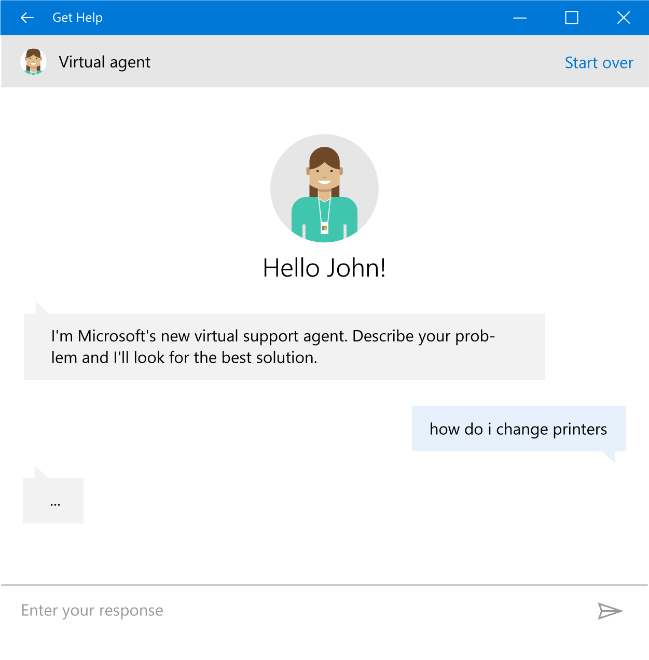
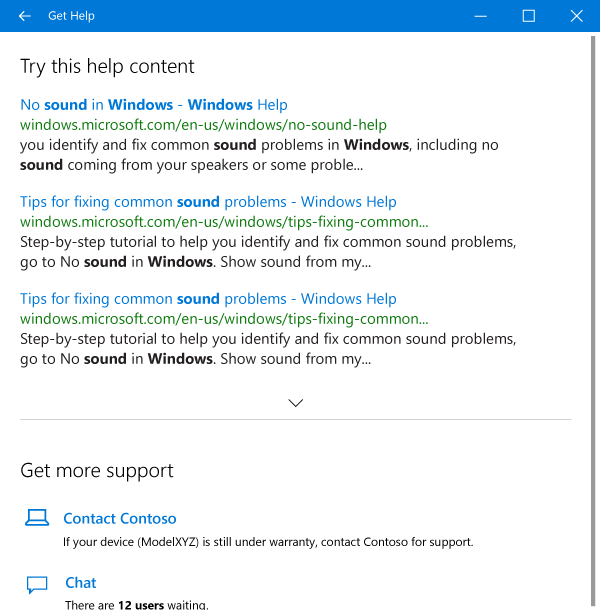

# Customize the Get Help app

The Get Help app empowers customers to self-help with troubleshooters, instant answers, Microsoft support articles, and more, before contacting assisted support.

If you have a support app or support website you would like to direct customers towards, you can use unattend.xml to display your support option within the Get Help app. A link to your support app or website is surfaced wherever options to contact support are shown in the Get Help app. The first item in the list will be the link you provided.

Customers are sent to the Get Help from the Settings app, Cortana, Bing Instant Answers, the Start Menu, and numerous Microsoft web experiences. It is also possible to launch Get Help from your own apps and websites.

## Consumer experience

For consumers, the Get Help app provides a way to ask a question and get recommended solutions or contact assisted support. Depending on the country/region and language of the device, one of two experiences will be shown: Virtual Agent, or Search support.

### Virtual Agent

Microsoft’s Virtual Agent is a support chat bot designed to help with issues related to Windows and other products. This brings a conversational approach to understanding problems and providing the most appropriate solution. If the Virtual Agent is unable to provide a solution, it will direct customers to the options for contacting support; it is also possible to ask for those options at any time. This experience is only available in en-US.

OEM customization provides the top support option in the list — a link to either your support website, or your support app.



### Search support

In markets that do not have the Virtual Agent experience available, customers can utilize search support by entering a question and receiving back recommended support content. Beneath the search results, the options for contacting support will be listed.

OEM customization provides the top support option in the list — a link to either your support website, or your support app.




### Enterprise experience

For Enterprise SKUs, the Get Help app provides a different experience that focuses on getting customers to the right kind of support. The support options listed are shown to all enterprise customers. Availability of support within each option depends upon support agreements with the enterprise.

> [!Note]
> OEM support options are not displayed in the Enterprise experience of the Get Help app.

## Customize support information

To display your OEM support information in the Get Help app, you must provide either a link to the URL of your support website, or to the URI of your support app, in Unattend.xml under `Microsoft-Windows-Shell-Setup-OEMInformation`.

See the [OEMInformation setting](https://docs.microsoft.com/en-us/windows-hardware/customize/desktop/unattend/microsoft-windows-shell-setup-oeminformation) in the Unattended setup reference to learn more about how to add your support information to the Get Help app.

### Link to your support app

Here is an example where a path for `SupportAppURL` is supplied. In this case , the Get Help app will direct customers to the OEM's support app:

```xml
<OEMInformation>
   <SupportProvider>Contoso</SupportProvider>
   <SupportAppURL>ContosoSupport://path/?param=val</SupportAppURL>
</OEMInformation>
```

`SupportAppURL` must be present and contain valid string values, otherwise Get Help won’t pick up your support information. `SupportProvider` is an optional override for the name shown on the link; the default when SupportProvider is not present is SystemManufacturer from SystemInformation (msinfo32.exe).

“ContosoSupport” is a sample protocol name; you can pick your app's own protocol name, if it does not conflict with an existing protocol name in the system.

To register a protocol handler for your app:

* For a Universal app, the protocol handler is specified in the package.appxmanifest file (part of the Visual Studio project), under the `<Extensions>` section. See [Handle URI activation](https://docs.microsoft.com/en-us/windows/uwp/launch-resume/handle-uri-activation) for more details.
* For a Win32 app, the protocol handler is specified in the registry. See [Registering an Application to a URI Scheme](https://msdn.microsoft.com/en-us/library/aa767914(v=vs.85).aspx) for more details.

> [!Note]
> Win32 apps are not supported in Windows 10 in S mode.

### Link to your support website

Here is an example where a URL for `SupportURL` is provided. In this case, the Get Help app will direct customers to the OEM's support webiste.

```xml
<OEMInformation>
   <SupportProvider>Contoso</SupportProvider>
   <SupportURL>https://www.contoso.com/support?param=val</SupportURL>
</OEMInformation>
```

`SupportURL` must be present and contain valid string values, otherwise Get Help won’t pick up your support information. `SupportProvider` is an optional override for the name shown on the link; the default when SupportProvider is not present is SystemManufacturer from SystemInformation (msinfo32.exe).

The Get Help app will launch the specified SupportURL in Microsoft Edge when the OEM support option is chosen.

## Launch Get Help

You can send customers to the Get Help app from your app or website by providing a link to the following URL:

`ms-contact-support://oem/<Manufacturer>`

Where `<Manufacturer>` is an all lowercase, unbroken name such as “contoso” or “fabrikaminc". Generally, this should be the simplest version of your brand name, not the longer formal business name. This information is used to identify where users launched the Get Help app from; it is not used to customize the app directly.