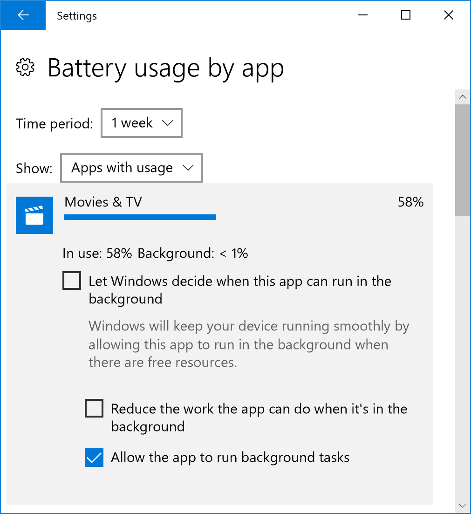

# Customize the Windows performance power slider

The Windows performance power slider enables end customers to quickly and intelligently trade performance of their system for longer battery life. As a customer switches between the four slider modes to trade performance for battery life (or vice versa), Windows power settings are engaged behind the scenes. You are able to customize the default slider mode for both AC and DC, and can also configure the power settings, and PPM options, that are engaged for each slider mode.

Customers can access the slider on their Windows device by clicking or tapping the battery icon in the task bar. The slider appears in the battery flyout.


Customers can choose their power mode by moving the slider to the left and right. Customers can choose to prioritize the remaining battery life on the device, or the performance of apps and services running on the device. The screenshot above shows the slider is in the **Better Performance** slider mode, which is the out-of-box Windows default.

## Slider availability

The Windows power slider is available for AMD and Intel platforms running Windows 10, build 1709 and newer builds of Windows. It is not available on devices with ARM64 processors. The slider will appear on a device only when the **Balanced** power plan, or any plan that is derived from Balanced, is selected. There is not an option for either users or OEMs to remove the slider UX.

Devices that have the High Performance, Power Saver, or any “OEM Recommended” power plans will not be disturbed during the Windows upgrade process. If a user upgrades from a version of Windows that does not support the slider, to a version that does, there will be no change to their  High Performance, Power Saver, or "OEM Recommended" power plan. These users will not see the slider UX, and they can still configure their power plans in the same way they could before upgrading.

Users will see the power slider appear only when they apply the Balanced power plan from the **Settings** app, under **System** > **Power & Sleep** > **Additional power settings**.

> [!Note]
> After the user changes to a Balanced performance plan, there is no way for them to go back to using the High Performance plan from the UI, although it is possible from the cmd line (via powercfg).

### Guidance for High Performance devices

If you ship a device with a High Performance power plan, such as a gaming device, consider applying the same settings that are defined on the High Performance plan to the Balanced power plan. For example, if the timeout value for powering off the HDD or Display is set to X or Y on High Performance, apply those same values on Balanced.

You can also customize power settings for each of the slider modes in your firmware. See [Configure power settings and PPM options](#configure-settings) for more information.

## Set default power slider mode

Customers can choose one of four slider modes:

* **Battery Saver**: Helps conserve power, and prolong battery life, when the system is not connected to a power source. When battery saver is on, some Windows features are disabled, throttled, or behave differently. Screen brightness is also reduced. Battery Saver is only available on DC. To learn more, see [Battery Saver](https://docs.microsoft.com/en-us/windows-hardware/design/component-guidelines/battery-saver).
* **Better Battery**: Delivers longer battery life than the default settings on previous versions of Windows. Available on both AC and DC. In some cases, users will see this mode labeled **Recommended**, rather than **Better Battery**, in their slider UI.
* **Better Performance**: Default slider mode that slightly favors performance over battery life and is appropriate for users who want to tradeoff power for better performance of their apps. Available on both AC and DC.
* **Best Performance**: Favors performance over power and is targeted at users who want to tradeoff power for performance and responsiveness. Available on both AC and DC.

> [!Note]
> [Game mode](https://msdn.microsoft.com/en-us/library/windows/desktop/mt808808(v=vs.85).aspx) operates independently of the Windows performance power slider, and can be engaged in any slider mode.

### To set the default slider mode

You can configure the default slider mode for both AC and DC. If a customer chooses a different slider mode on either AC or DC, their selection will become the new default setting.

> [!Note]
> Battery Saver is not available as a default slider mode.

First, create a provisioning package using [Windows Configuration Designer](https://docs.microsoft.com/en-us/windows/configuration/provisioning-packages/provisioning-install-icd). You will then edit the customizations.xml file contained in the package to include your power settings. Use the XML file as one of the inputs to the Windows Configuration Designer command-line to generate a provisioning package that contains the power settings, then apply the package to the image. For information on how to use the Windows Configuration Designer CLI, see [Use the Windows Configuration Designer command-line interface](https://docs.microsoft.com/en-us/windows/configuration/provisioning-packages/provisioning-command-line).

| Windows Provisioning path                 | Provisioning setting name                            | Values                                               |
|:------------------------------------------|:-----------------------------------------------------|:-----------------------------------------------------|
| `Common\Power\Controls\Settings\{setting name}`                | **DefaultOverlayAcPowerScheme**: Default slider mode for AC <br/> **DefaultOverlayDcPowerScheme**: Default slider mode for DC      | **BetterBatteryLife**: Sets the slider to the Better Battery mode <br/> **MaxPerformance**: Sets the slider to the Best Performance mode                                                                                          |

> [!Note]
> If no default is configured, Better Performance will be the default slider mode for both AC and DC.

### XML Example

Below is an example customizations.xml file that defines default slider modes.

```xml
<?xml version="1.0" encoding="utf-8"?>
<WindowsCustomizatons>
  <PackageConfig xmlns="urn:schemas-Microsoft-com:Windows-ICD-Package-Config.v1.0">
    <ID>{7e5c6cb3-bd16-4c1a-aacb-98c9151d5f20}</ID>  <!-- ID needs to be unique GUID for the package -->
    <Name>CustomOEM.Power.Settings.Control</Name>
    <Version>1.0</Version>
    <OwnerType>OEM</OwnerType>
  </PackageConfig>
  <Settings xmlns="urn:schemas-microsoft-com:windows-provisioning">
    <Customizations>
      <Common>
          <Power>
            <Controls>
              <DefaultOverlayDcPowerScheme>"BetterBatteryLife"</DefaultOverlayDcPowerScheme>
              <DefaultOverlayAcPowerScheme>"MaxPerformance"</DefaultOverlayAcPowerScheme>
           </Controls>
        </Power>
      </Common>
    </Customizations>
  </Settings>
</WindowsCustomizatons>
```

## <a name="configure-settings"></a> Configure power settings and PPM options engaged by the slider

You can use overlays to customize the power settings and PPM options that are engaged for each slider mode. In previous versions of Windows, power settings could only be configured per power scheme, and PPM options could only be configured per power profile. The introduction of overlays enables OEMs to better optimize power settings based on the slider mode selected by the user, as opposed to the power scheme or power profile selected by the device.

To configure PPM and power settings per slider mode, apply them to one of the following overlays:

* **BetterBatteryLifeOverlay**
* **MaxPerformanceOverlay**

The Battery Saver mode inherits the settings configured for the Constrained PPM profile. The Best Performance mode inherits the settings configured for the Balanced (default) profile. Configure these profiles to customize the settings that are engaged in the associated slider modes.

> [!Note]
> Settings such as disk and display timeouts, and other legacy power settings, are not customizable via the performance/power slider. Only settings which can affect perceived performance differences can be customized across slider modes. Each slider mode should be thought of as a “lite” power plan, which only contains settings that impact performance, such as CPU settings (PPM) and power throttling. Other factors which control performance (GPU, thermals etc) are in OEM/SVs control and they can create custom power-settings for those and connect them to the slider via the INF.

### Configure PPM optimization

Optimizing PPM enables the OS to favor either power or performance, depending on user preference (similar to the low power media profile that is applied when a user is watching video in full screen mode). PPM settings should favor battery life for the Battery Saver and Better Battery slider modes, and favor performance for the Better and Best Performance slider modes.

PPM options can be configured for all AMD and Intel platforms using Windows Provisioning Framework. To learn more about the PPM options that you can configure, and how to configure them per power scheme, see Processor power management options.

#### XML Example

Below is an example of a customizations.xml file that uses overlays to define PPM settings for the Better Battery and Best Performance slider modes.

```xml
<Power>
  <Policy>
    <Settings>
       <Processor>
        <SchemePersonality>
        <!-- EPP override for default PPM profile for “Better Battery”  -->
          <Profile SchemeAlias=" BetterBatteryLifeOverlay">
            <Setting ProfileAlias="Default">
              <PerfEnergyPreference>
                <DcValue>60</DcValue>
              </PerfEnergyPreference>
            </Setting>
          </Profile>
          <!--EPP override for default PPM profile for “Best Performance” -->
          <Profile SchemeAlias="MaxPerformanceOverlay">
            <Setting ProfileAlias="Default">
              <PerfEnergyPreference>
                <DcValue>30</DcValue>
              </PerfEnergyPreference>
            </Setting>
          </Profile>
        </SchemePersonality>
      </Processor>
    </Settings>
  </Policy>
</Power>
```

### Configure performance and power settings

To engage your customized power settings only when the slider is in a particular mode, create an **AddPowerSettingDirective** in your INF file that indicates the default values for each overlay. There are **Default** directives that must be included in an **AddPowerSetting** section. A **Default** directive specifies the three overlays that apply to an AC and DC power state each.

Add the following three directives to define settings for the various slider modes:

| Slider mode                 | INF GUID                                | Ppkg SchemeAlias                                              |
|:----------------------------|:----------------------------------------|:--------------------------------------------------------------|
| Better Battery              | {961CC777-2547-4F9D-8174-7D86181b8A7A}  | BetterBatteryLifeOverlay                                      |
| Better Performance          | {381B4222-F694-41F0-9685-FF5BB260DF2E}  | Balanced                                                      |
| Best Performance            | {DED574B5-45A0-4F42-8737-46345C09C238}  | MaxPerformanceOverlay                                         |

See [INF AddPowerSetting Directive](https://docs.microsoft.com/en-us/windows-hardware/drivers/install/inf-addpowersetting-directive) for further instructions.

## Power throttling

Most Windows users have multiple apps running on the operating system at the same time, and often, the apps running in the background consume significant power. Windows leverages modern silicon capabilities to run background work in an energy-efficient manner, significantly enhancing battery life. Power throttling saves up to 11% in CPU power by throttling CPU frequency of applications running in the background. With power throttling, when background work is running, Windows places the CPU in its most efficient operating modes. Learn more about this feature in our blog post: [Introducing power throttling](https://blogs.windows.com/windowsexperience/2017/04/18/introducing-power-throttling/#vySvtofj5CElXX6h.97).

Power throttling does not suspend or close apps and services on the device.

Power throttling is always engaged, unless the slider is set to **Best Performance**. In this case, all applications will be opted out of power throttling. Users can also opt individual apps out of power throttling in the Battery usage UX:



 OEMs do not have an option to disable or change power throttling on any of the Windows slider modes.

> [!Note]
> Power throttling is available for devices using Intel's 6th or 7th generation processors (including those without Intel’s SpeedShift technology) only.

## Query for power slider settings

There are two logs you can utilize to query the performance power slider settings defined on an OS image: Powercfg output, and Event Tracing for Windows (ETW) logs.

### PowerCfg output

Run `“powercfg /qh > output.txt"` from an [elevated command prompt](https://technet.microsoft.com/en-us/library/cc947813(v=ws.10).aspx(d=robot)), then open output.txt in any text editor to view the settings.

### Event tracing for Windows (ETW) logs

Use the inbox WPRUI.exe or WPR.exe to collect an ETW log with the POWER scenario enabled. To collect and analyze the ETW log:

1. Launch an elevated command prompt window
1. Enter the command: `WPR -start power -filemode`
1. Using the power slider UX, move the slider to each of the four modes
1. Go back to the elevated command prompt window and enter the command: `WPR -stop PerfPowerSliderSettings.etl`
1. Open **PerfPowerSliderSettings.etl** in the [Windows Performance Analyzer](https://docs.microsoft.com/en-us/windows-hardware/test/wpt/windows-performance-analyzer) (WPA) tool. WPA comes bundled with the [Windows Assessment and Deployment Kit](http://go.microsoft.com/fwlink/p/?LinkId=526740) (Windows ADK).
1. Click on **Trace**.
1. Click on **System Properties** then **System configuration**.
1. In the new tab that opens, click on **Power Settings**.