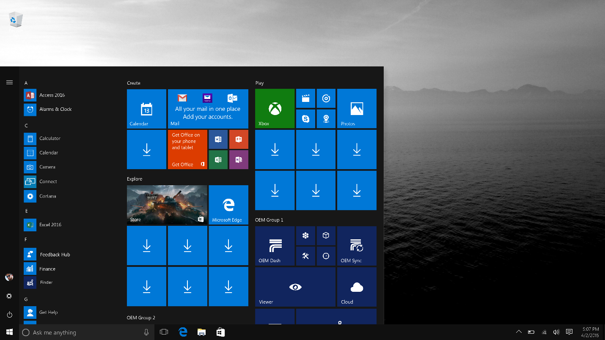

# Customize the Start layout

You can customize the Start layout by creating a `LayoutModification.xml` file, and configuring the settings.

You are able to customize the Start layout by:

* Changing the size of the Start menu
* Adding new apps and weblinks as tiles to the Start menu
* Specifying the size and position of the new tiles
* Specifying Start layouts for each region you support

After customizing the Start layout, use Windows Configuration Designer to add the file to the device image. See [Add the LayoutModification.xml file to the device](https://docs.microsoft.com/en-us/windows/configuration/start-layout-xml-desktop#add-the-layoutmodificationxml-file-to-the-device) for instructions.

## LayoutModification.xml

The XML schema for `LayoutModification.xml` requires the following order for tags directly under the LayoutModificationTemplate node:

1. LayoutOptions
1. RequiredStartGroupsCollection
1. AppendDownloadOfficeTile –OR– AppendOfficeSuite (only one Office option can be used at a time)

Comments are not supported in the `LayoutModification.xml` file.

For an inclusive list of settings you can configure in `LayoutModification.xml`, a full XML example, and instructions on adding the XML file to the device, see [Start layout XML for desktop editions of Windows 10 (Reference)](https://docs.microsoft.com/en-us/windows/configuration/start-layout-xml-desktop)

## Customize the size of the Start menu

We recommend that you set the default Start menu so it is not greater than 40% of the size of the desktop. If it is greater than half the width of the desktop, customers might perceive that the device and Windows are optimized only for touch, and feel less satisfied when they use a mouse and keyboard.

Use `LayoutOptions` in `LayoutModification.xml` to indicate the number of columns, and the number of tiles per row, in the Start menu.

### Specify the number of columns in the Start menu

You have three options for the Start menu size: **small** (one column of tiles), **medium** (2 columns of tiles), or **full screen**. New devices running Windows for desktop will default to a Start menu with two columns of tiles unless boot to tablet mode is enabled. Devices with screens that are under 10" have boot to tablet mode enabled by default. For these devices, users see the **full screen** Start menu on the desktop.

> [!Note]
> We suggest you leave the default values for these features so that Windows can use its own logic to do the right thing for the customer. You can, however, adjust the following OS features if you have a scenario that requires it. For example, if you have a device that is meant mainly for use as a tablet, but is bigger than 10", you can use [SignInMode](https://docs.microsoft.com/en-us/windows-hardware/customize/desktop/unattend/microsoft-windows-shell-setup-signinmode).

Here is how you set the size of the start menu, using LayoutModification.xml.

* To set as small, with one column of tiles:

  ```xml
  <LayoutOptions
     StartTileGroupsColumnCount="1"
     FullScreenStart="false"
  />
  ```

* To set as medium, with two columns of tiles:

  ```xml
  <LayoutOptions
     StartTileGroupsColumnCount="2"
     FullScreenStart="false"
  />

  ```
* To set as full screen (and set the default to one column if the user disables full screen):

  ```xml
  <LayoutOptions
     StartTileGroupsColumnCount="1"
     FullScreenStart="true"
  />
  ```

> [!Important]
> Setting `FullScreenStart` to true requires rebooting the device to take effect.

### Specify the number of tiles per row in the Start menu

You can configure your Start menu to show either 6 or 8 medium tiles per row using `StartTileGroupCellWidth` in LayoutModification.xml.

```XML
<LayoutModificationTemplate
    xmlns="http://schemas.microsoft.com/Start/2014/LayoutModification"
    xmlns:defaultlayout="http://schemas.microsoft.com/Start/2014/FullDefaultLayout"
    xmlns:start="http://schemas.microsoft.com/Start/2014/StartLayout"
    Version="1">
    <LayoutOptions StartTileGroupCellWidth="8" />
</LayoutModificationTemplate>
```

## OEM groups in the Start menu

You can pin tiles in two OEM groups. OEM groups are added at the bottom, right corner of the Start menu. The first, bigger OEM group displays the first two rows by default, with only the titles of the tiles on the third row displaying. The second, smaller OEM group displays only the titles of the top row.

If you have `StartTileGroupCellWidth` set to 6, the OEM groups will be 3 medium tiles wide by 3 high. If you have `StartTileGroupCellWidth` set to 8, the OEM groups will be 4 medium tiles wide. OEM group one is 3 tiles high by 4 wide, and OEM group two is 2 high by 4 wide.

You will not be able to manipulate or otherwise change the Microsoft groups and tiles within them. To determine the overall look of the Start menu, the default layout is applied based on SKU and region, and then the `LayoutModification.xml` or `Unattend.xml` file is processed.

Here is an example that shows where the two OEM groups appear in Start:


In the example above, `StartTileGroupCellWidth` is set to 6, and `StartTileGroupsColumnCount` is set to 2. Subsequently, the Start layout shows 2 columns of tiles, and each row is 6 medium tiles long.

## Customize the size and position of your tiles

The `LayoutModification.xml` file allows four tile size options for each tile you add to your OEM groups. The available tile sizes are:

* Small tile: 1x1
* Medium square tile: 2x2
* Wide tile: 4x2
* Large tile: 4x4

The `Row` and `Column` elements determine the position of the upper, left edge of the tile within the group. The `0,0` position is the first row, first column.

For example, here is a Start layout with the row and column grid overlaid.


<!--- Taking this out for now, as this is not quite accurate and will be changing in RS4.
> [!Note]
> To ensure that customers know that their new Windows-based device comes ready for them to use and enjoy Office, the Windows Start menu retains the **Get Office** tile when you install Office as part of the OS image. The **Get Office** app is aware that Office is installed, and provides additional information and links for Mobile installs and OneDrive. Small tiles for Word, PowerPoint, Excel, and OneNote appear in a medium tile collection next to the **Get Office** app tile in the Microsoft group of the Start menu.
>
> When customers open one of the OEM-installed Office apps like Word, they get a **Try, Buy, or Activate** dialog. They can dismiss the dialog and still use the app for up to 5 days. They can hit **Try** and get a 30-day trial.
--->

## Add tiles that launch apps and weblinks

You can configure each of your tiles to launch:

* A Universal Windows app (using the `start:Tile` tag)
* A Windows 8 or 8.1 app (using the `start:Tile` tag)
* Desktop applications (using the `start:DesktopApplicationTile` tag)
* A weblink that opens in the default browser (using the `start:DesktopApplicationTile` tag)
* A weblink that opens in Edge (using the `start:SecondaryTile` tag)

> [!Note]
> Each tile pinned to the Start menu can launch a single UWP app, Microsoft Store app, desktop app, or weblink. A tile can’t be a group of apps or a folder.

### App tiles

You can add an app tile that will launch a Universal Windows app, or a Windows 8/8.1 app, using `start:Tile` in `LayoutModification.xml`. To specify the app you wish the launch, you must set the `AppUserModelID` attribute of `start:Tile` to the application user model ID (AUMID) associated with the app. The AUMID is case-sensitive.

> [!Important]
> Universal apps or Store apps must be pinned to the Start menu to be pre-installed on the device, otherwise they will be removed on any system that uses that layout. Desktop apps do not have to be pinned to the Start menu to be pre-installed on the device.

The following example shows how to pin the Microsoft Edge Universal Windows app:

```XML
<start:Tile
  AppUserModelID="Microsoft.MicrosoftEdge_8wekyb3d8bbwe!MicrosoftEdge"
  Size="2x2"
  Row="0"
  Column="0"/>
```

You can use the `start:DesktopApplicationTile` tag to pin a Windows desktop application to Start. There are two ways you can specify a Windows desktop application:

* By setting `DesktopApplicationLinkPath` to a path to a shortcut link (.lnk file) to a Windows desktop application.
* By setting the `DesktopApplicationID` to the application's ID, if this is known. If the Windows desktop application doesn't have one, use the shortcut link option.

The following example shows how to pin the Command Prompt desktop application using the .lnk method:

```XML
<start:DesktopApplicationTile
  DesktopApplicationLinkPath="%appdata%\Microsoft\Windows\Start Menu\Programs\System Tools\Command Prompt.lnk"
  Size="2x2"
  Row="0"
  Column="4"/>
````

The following example show how to pin the File Explorer Windows desktop application by specifying the desktop application ID:

```XML
<start:DesktopApplicationTile
  DesktopApplicationID="Microsoft.Windows.Explorer"
  Size="2x2"
  Row="0"
  Column="2"/>
```

### Weblink tiles

You can add a web link tile that will open in the default browser, or you can add a *secondary tile* that will specifically open in Microsoft Edge.
To create a web link tile that will open in the default browser, create a .url file:

1. Right click on Desktop > New > Shortcut
1. Type a URL such as http://www.fabrikam.com
1. Click Next
1. Type a name for the shortcut such as Fabrikam and click Finish. The .url file is saved to your desktop.
1. Add the .url file to the image in the `%ALLUSERSPROFILE%\Microsoft\Windows\Start Menu\Programs\` folder , and then add a `DesktopApplicationTile` element to `LayoutModification.xml`:

   ```XML
   <!-- Web link tile with associated .url file in StartMenu folder -->
   <start:DesktopApplicationTile
          DesktopApplicationID="www.Fabrikam.com"
          Size="2x2"
          Row="0"
          Column="2"/>
   ```

To create a secondary tile (a web link tile that will open in Microsoft Edge), add a `SecondaryTile` element to `LayoutModification.xml` and specify Edge in the `AppUserModelID` attribute.

```XML
<!-- Web link tile that launches in Edge -->
<start:SecondaryTile
  AppUserModelID="Microsoft.MicrosoftEdge_8wekyb3d8bbwe!MicrosoftEdge"
  TileID="MyWeblinkTile"
  Arguments="http://msn.com"
  DisplayName="MySite"
  Square150x150LogoUri="ms-appx:///Assets/MicrosoftEdgeSquare150x150.png"
  Wide310x150LogoUri="ms-appx:///Assets/MicrosoftEdgeWide310x150.png"
  ShowNameOnSquare150x150Logo="true"
  ShowNameOnWide310x150Logo="false"
  BackgroundColor="#FF112233"
  Size="2x2"
  Row="0"
  Column="4"/>
```

> [!Note]
> The actual Edge tile cannot be customized. The icon, text and the page that it launches must remain the default.

The OEM-custom icon and supporting text in the tile must:

* Logically relate to the activity or action the user is expected to take
* Launch the Edge browser
* The icon and supporting text should not imply that it is anything other than Edge (e.g. another browser)
* The page that it goes to must work in Edge
* The page should not promote another browser

```XML
<start:SecondaryTile AppUserModelID="Microsoft.MicrosoftEdge_8wekyb3d8bbwe!MicrosoftEdge"
          TileID="MyWeblinkTile"
          Arguments="http://msn.com"
          DisplayName="MySite"
          Square150x150LogoUri="ms-appx:///Assets/MicrosoftEdgeSquare150x150.png"
          Size="2x2"
          Row="0"
          Column="4"/>
```

### Dynamically delivered apps

Some apps on the Start Menu are downloaded dynamically after the Out of Box Experience (OOBE) completes. If the device is on a metered network, or without network connectivity, app downloads are paused, and the user will see down arrows instead of the app name on the app tiles, as in the following image.



The downloads start or resume after the network connects.

## Add an Office suite or Office download tile to Start

`LayoutModification.xml` supports adding either the in-box pre-installed Office suite to Start (Word, Excel, PowerPoint), or adding a "Download Office" tile to a specific location in Start (the bottom right of the second group). These two options are mutually exclusive; adding both is not supported.

If you want to append the Office Mobile Suite of tiles that point to the office mobile download, add the `<AppendOfficeSuite/>` tag to your `LayoutModification.xml` file.to your `LayoutModification.xml` file. This replaces "Get Office" with the pre-installed Universal apps.

```XML
<LayoutModificationTemplate xmlns="http://schemas.microsoft.com/Start/2014/LayoutModification" xmlns:defaultlayout="http://schemas.microsoft.com/Start/2014/FullDefaultLayout" xmlns:start="http://schemas.microsoft.com/Start/2014/StartLayout" Version="1">
<AppendOfficeSuite/>
</LayoutModificationTemplate>
```

If you want to append the full Office 2016 suite to Start, add the `<AppendOfficeSuite/>` tag and the `<AppendOfficeSuiteChoice Choice="Desktop2016"/>` tag to your `LayoutModification.xml` file.

```XML
 <LayoutModificationTemplate
    xmlns="http://schemas.microsoft.com/Start/2014/LayoutModification"
    xmlns:defaultlayout="http://schemas.microsoft.com/Start/2014/FullDefaultLayout"
    xmlns:start="http://schemas.microsoft.com/Start/2014/StartLayout"
    Version="1">
    <AppendOfficeSuite/>
    <AppendOfficeSuiteChoice Choice="Desktop2016"/>
</LayoutModificationTemplate>
```

If you want to append the "Download Office" tile, add the `<AppendDownloadOfficeTile/>` tag to your `LayoutModification.xml` file. This replaces "Get Office" with the classic desktop app download tile, and supports all OEM scenarios including Activation for Office (AFO) and Preinstall PC (PIPC).

```XML
<LayoutModificationTemplate xmlns=http://schemas.microsoft.com/Start/2014/LayoutModification xmlns:defaultlayout="http://schemas.microsoft.com/Start/2014/FullDefaultLayout" xmlns:start="http://schemas.microsoft.com/Start/2014/StartLayout" Version="1">
<AppendDownloadOfficeTile/>
</LayoutModificationTemplate>
```

## First run tasks

First Run Tasks are background tasks that are active when the user first signs into Windows. First Run Tasks are not available in `LayoutModification.xml`. However, you can still use them by including an Unattend.xml file with [StartTiles](https://docs.microsoft.com/en-us/windows-hardware/customize/desktop/unattend/microsoft-windows-shell-setup-starttiles) tags using the same AppID as in `LayoutModification.xml`.

If the `AppendGroup` tag is present in `LayoutModification.xml`, it will override Unattend.xml for all Start pinning. However, if an Unattend.xml [StartTiles](https://docs.microsoft.com/en-us/windows-hardware/customize/desktop/unattend/microsoft-windows-shell-setup-starttiles) tag exists for the same AppID as in LayoutModification.xml, the FirstRunTask from Unattend.xml will be respected.

For example, include a `LayoutModfication.xml` file specifying an app like this:

```XML
<start:Tile AppUserModelID="Microsoft.MicrosoftEdge_8wekyb3d8bbwe!MicrosoftEdge" Size="2x2" Row="0" Column="0"/>
```

Also include an Unattend.xml file specifying the same AppID like this:

```XML
<SquareOrDesktopTile5>
    <AppId>Microsoft.MicrosoftEdge_8wekyb3d8bbwe!MicrosoftEdge</AppId>
    <FirstRunTask>BackgroundTasks_Notifications.Services.MessagingBackgroundTask</FirstRunTask>
</SquareOrDesktopTile5>
```

## Create Start layouts for each region you support

You can use the `Region` parameter of the `RequiredStartGroups` tag in your `LayoutModification.xml` file to specify Start layouts per region. To learn more, see [RequiredStartGroups tag](https://docs.microsoft.com/en-us/windows/configuration/start-layout-xml-desktop#requiredstartgroups) in the Start Layout XML Reference.

Alternately, you can use multivariant capabilities in Windows provisioning to create different Start layouts per region. To learn more, see [Use Windows Provisioning multivariant support](https://docs.microsoft.com/en-us/windows/configuration/start-layout-xml-desktop#use-windows-provisioning-multivariant-support) in the Start Layout XML Reference.

## Related topics

* [Start layout XML for desktop editions of Windows (Reference)](https://docs.microsoft.com/en-us/windows/configuration/start-layout-xml-desktop)
* [Add the LayoutModification.xml file to the device](https://docs.microsoft.com/en-us/windows/configuration/start-layout-xml-desktop#add-the-layoutmodificationxml-file-to-the-device)
* [StartTiles Unattend setting](unattend/microsoft-windows-shell-setup-starttiles.md)