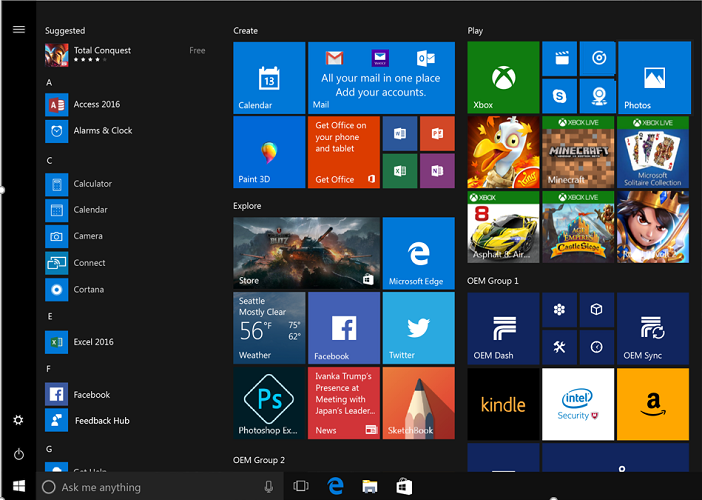
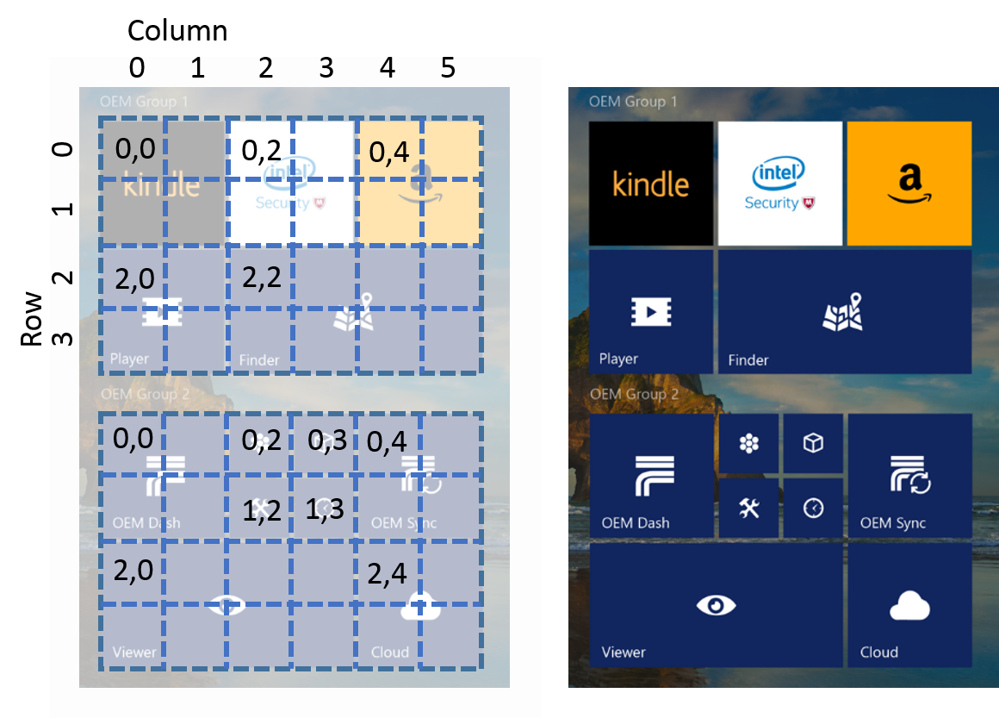
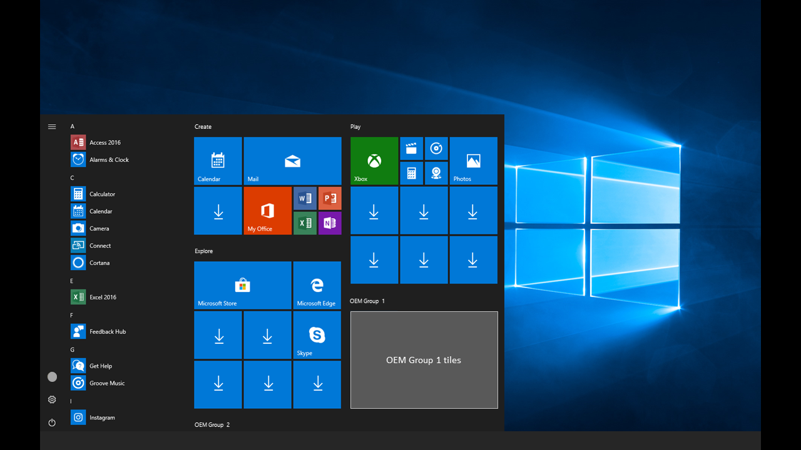

# Customize the Start layout

You can customize the Start layout by creating a `LayoutModification.xml` file and configuring the settings. To determine the overall look of the Start layout, the default layout is applied based on SKU and region, and then the `LayoutModification.xml` or `Unattend.xml` file is processed.

You can customize the following aspects of the Start layout:

* The size, including the number of columns and number of tiles per row
* The tiles in both OEM Groups; including the size, position, and the app or weblink associated with each tile
* The display layout for the Microsoft Office suite of tiles
* Create Start layouts for each region you support

After customizing the Start layout, use Windows Configuration Designer to add the file to the device image. See [Add the LayoutModification.xml file to the device](https://docs.microsoft.com/en-us/windows/configuration/start-layout-xml-desktop#add-the-layoutmodificationxml-file-to-the-device) for instructions.

## LayoutModification.xml

The XML schema for `LayoutModification.xml` requires the following order for tags directly under the LayoutModificationTemplate node:

1. LayoutOptions
1. RequiredStartGroupsCollection
1. AppendDownloadOfficeTile –OR– AppendOfficeSuite (only one Office option can be used at a time)

Comments are not supported in the `LayoutModification.xml` file.

For an inclusive list of settings you can configure in `LayoutModification.xml`, a full XML example, and instructions on adding the XML file to the device, see [Start layout XML for desktop editions of Windows 10 (Reference)](https://docs.microsoft.com/en-us/windows/configuration/start-layout-xml-desktop)

## Customize the size of the Start layout

We recommend that you set the default Start layout so it is not greater than 40% of the size of the desktop. If it is greater than half the width of the desktop, customers might perceive that the device and Windows are optimized only for touch, and feel less satisfied when they use a mouse and keyboard.

Use `LayoutOptions` in `LayoutModification.xml` to indicate the number of columns, and the number of tiles per row, in the Start layout.

### Specify the number of columns in the Start layout

You have three options for the Start layout size: **small** (one column of tiles), **medium** (2 columns of tiles), or **full screen**. New devices running Windows for desktop will default to a Start layout with two columns of tiles unless boot to tablet mode is enabled. Devices with screens that are under 10" have boot to tablet mode enabled by default. For these devices, users see the **full screen** Start layout on the desktop.

> [!Note]
> We suggest you leave the default values for these features so that Windows can use its own logic to do the right thing for the customer. You can, however, adjust the following OS features if you have a scenario that requires it. For example, if you have a device that is meant mainly for use as a tablet, but is bigger than 10", you can use [SignInMode](https://docs.microsoft.com/en-us/windows-hardware/customize/desktop/unattend/microsoft-windows-shell-setup-signinmode).

Here is how you set the size of the start layout, using LayoutModification.xml.

* To set as small, with one column of tiles:

  ```xml
  <LayoutOptions
     StartTileGroupsColumnCount="1"
     FullScreenStart="false"
  />
  ```

* To set as medium, with two columns of tiles:

  ```xml
  <LayoutOptions
     StartTileGroupsColumnCount="2"
     FullScreenStart="false"
  />

  ```
* To set as full screen (and set the default to one column if the user disables full screen):

  ```xml
  <LayoutOptions
     StartTileGroupsColumnCount="1"
     FullScreenStart="true"
  />
  ```

> [!Important]
> Setting `FullScreenStart` to true requires rebooting the device to take effect.

### Specify the number of tiles per row in the Start layout

You can configure your Start layout to show either 6 or 8 medium tiles per row using `StartTileGroupCellWidth` in `LayoutModification.xml`.

We recommend you configure this setting to optimize the Start layout for the size of your device's screen. If this setting is not configured in `LayoutModification.xml`, Windows will use its own logic to set the number of tiles per row.

```XML
<LayoutModificationTemplate
    xmlns="http://schemas.microsoft.com/Start/2014/LayoutModification"
    xmlns:defaultlayout="http://schemas.microsoft.com/Start/2014/FullDefaultLayout"
    xmlns:start="http://schemas.microsoft.com/Start/2014/StartLayout"
    Version="1">
    <LayoutOptions StartTileGroupCellWidth="8" />
</LayoutModificationTemplate>
```

The number of tiles you select will be divided evenly between the two columns in the Start layout. For example, if you choose to show 6 medium tiles per row, each columns will contain 3 tiles.

## Customize OEM Groups in the Start layout

You can pin tiles in two OEM groups. The two OEM groups are added at the bottom, right corner of the Start layout. The first, bigger OEM group displays the first two rows of tiles by default, with only the titles of the tiles on the third row displaying. The second, smaller OEM group displays only the titles of the top row.

If you have `StartTileGroupCellWidth` set to 6, the OEM groups will be 3 medium tiles wide by 3 high. If you have `StartTileGroupCellWidth` set to 8, the OEM groups will be 4 medium tiles wide (group one is 3 tiles high by 4 wide, and group two is 2 high by 4 wide).

Here is an example that shows where the two OEM groups appear in Start:



In the example above, `StartTileGroupCellWidth` is set to 6, and `StartTileGroupsColumnCount` is set to 2. Subsequently, the Start layout shows 2 columns of tiles, and each row is 6 medium tiles long.

### Customize the size and position of tiles in the OEM Groups

The `LayoutModification.xml` file allows four tile size options for each tile you add to your OEM groups. The available tile sizes are:

* Small tile: 1x1
* Medium square tile: 2x2
* Wide tile: 4x2
* Large tile: 4x4

The `Row` and `Column` elements determine the position of the upper, left edge of the tile within the group. The `0,0` position is the first row, first column.

For example, here is a Start layout with the row and column grid overlaid.



### Add tiles that launch apps and weblinks

You can configure each of your tiles to launch:

* A Universal Windows app (using the `start:Tile` tag)
* A Windows 8 or 8.1 app (using the `start:Tile` tag)
* A desktop application (using the `start:DesktopApplicationTile` tag)
* A weblink that opens in the default browser (using the `start:DesktopApplicationTile` tag)
* A weblink that opens in Edge (using the `start:SecondaryTile` tag)

> [!Note]
> Each tile pinned to the Start layout can launch a single UWP app, Microsoft Store app, desktop app, or weblink. A tile can’t be a group of apps or a folder.

#### App tiles

You can add an app tile that will launch a Universal Windows app, or a Windows 8/8.1 app, using `start:Tile` in `LayoutModification.xml`. To specify the app you wish the launch, you must set the `AppUserModelID` attribute of `start:Tile` to the application user model ID (AUMID) associated with the app. The AUMID is case-sensitive.

> [!Important]
> In Windows 10, version 1803, all apps must either be pinned to the Start layout, and/or pre-installed using the new region parameter in DISM, otherwise they will be removed on any system that uses that layout. See [Preinstall apps using DISM](https://docs.microsoft.com/en-us/windows-hardware/manufacture/desktop/preinstall-apps-using-dism) for guidance on using the new parameter.

The following example shows how to pin the Microsoft Edge Universal Windows app:

```XML
<start:Tile
  AppUserModelID="Microsoft.MicrosoftEdge_8wekyb3d8bbwe!MicrosoftEdge"
  Size="2x2"
  Row="0"
  Column="0"/>
```

You can use the `start:DesktopApplicationTile` tag to pin a Windows desktop application to Start. There are two ways you can specify a Windows desktop application:

* By setting `DesktopApplicationLinkPath` to a path to a shortcut link (.lnk file) to a Windows desktop application.
* By setting the `DesktopApplicationID` to the application's ID, if this is known. If the Windows desktop application doesn't have one, use the shortcut link option.

The following example shows how to pin the Command Prompt desktop application using the .lnk method:

```XML
<start:DesktopApplicationTile
  DesktopApplicationLinkPath="%appdata%\Microsoft\Windows\Start Menu\Programs\System Tools\Command Prompt.lnk"
  Size="2x2"
  Row="0"
  Column="4"/>
````

The following example show how to pin the File Explorer Windows desktop application by specifying the desktop application ID:

```XML
<start:DesktopApplicationTile
  DesktopApplicationID="Microsoft.Windows.Explorer"
  Size="2x2"
  Row="0"
  Column="2"/>
```

#### Weblink tiles

You can add a web link tile that will open in the default browser, or you can add a *secondary tile* that will specifically open in Microsoft Edge.
To create a web link tile that will open in the default browser, create a .url file:

1. Right click on Desktop > New > Shortcut
1. Type a URL such as http://www.fabrikam.com
1. Click Next
1. Type a name for the shortcut such as Fabrikam and click Finish. The .url file is saved to your desktop.
1. Add the .url file to the image in the `%ALLUSERSPROFILE%\Microsoft\Windows\Start Menu\Programs\` folder , and then add a `DesktopApplicationTile` element to `LayoutModification.xml`:

   ```XML
   <!-- Web link tile with associated .url file in StartMenu folder -->
   <start:DesktopApplicationTile
          DesktopApplicationID="www.Fabrikam.com"
          Size="2x2"
          Row="0"
          Column="2"/>
   ```

To create a secondary tile (a web link tile that will open in Microsoft Edge), add a `SecondaryTile` element to `LayoutModification.xml` and specify Edge in the `AppUserModelID` attribute.

```XML
<!-- Web link tile that launches in Edge -->
<start:SecondaryTile
  AppUserModelID="Microsoft.MicrosoftEdge_8wekyb3d8bbwe!MicrosoftEdge"
  TileID="MyWeblinkTile"
  Arguments="http://msn.com"
  DisplayName="MySite"
  Square150x150LogoUri="ms-appx:///Assets/MicrosoftEdgeSquare150x150.png"
  Wide310x150LogoUri="ms-appx:///Assets/MicrosoftEdgeWide310x150.png"
  ShowNameOnSquare150x150Logo="true"
  ShowNameOnWide310x150Logo="false"
  BackgroundColor="#FF112233"
  Size="2x2"
  Row="0"
  Column="4"/>
```

> [!Note]
> The Edge tile itself cannot be customized. The icon, text and the page that it launches must remain the default.

The OEM-custom icon and supporting text in the tile must:

* Logically relate to the activity or action the user is expected to take
* Launch the Edge browser
* The icon and supporting text should not imply that it is anything other than Edge (e.g. another browser)
* The page that it goes to must work in Edge
* The page should not promote another browser

```XML
<start:SecondaryTile AppUserModelID="Microsoft.MicrosoftEdge_8wekyb3d8bbwe!MicrosoftEdge"
          TileID="MyWeblinkTile"
          Arguments="http://msn.com"
          DisplayName="MySite"
          Square150x150LogoUri="ms-appx:///Assets/MicrosoftEdgeSquare150x150.png"
          Size="2x2"
          Row="0"
          Column="4"/>
```

## Customize the Office suite of tiles

The Microsoft Office suite of tiles is the first group of tiles in the Start layout. There are a few different options available to customize this suite of tiles.

* If you've pre-installed Office Desktop Bridge to the device, use the `AppendOfficeSuite` and `AppendOfficeSuiteChoice` tags in `LayoutModification.xml`.
* If you've pre-installed Office Mobile to the device, use only the `AppendOfficeSuite` tag in `LayoutModification.xml`.
* If you have not pre-installed Office to the device, you can use the `AppendDownloadOfficeTile` tag in `LayoutModification.xml` to add a **Download Office** tile to the suite.

> [!Note]
> The version of Office you indicate in `LayoutModification.xml` must match the version of Office that's pre-installed to the device.

### Office Desktop Bridge

We recommend pre-installing Office Desktop Bridge on all devices where the screen is 10.1 inches or larger. Office Desktop Bridge is included in the OEM Pre-installation Kit (OPK). After pre-installing Office Desktop Bridge, each Office app appears as a tile in the Office suite of tiles.

In Windows 10, version 1803, add the following two tags to `LayoutModification.xml`:

* `<AppendOfficeSuite/>`
* `<AppendOfficeSuiteChoice Choice="DesktopBridgeSubscription"/>`

For example:

```XML
 <LayoutModificationTemplate
    xmlns="http://schemas.microsoft.com/Start/2014/LayoutModification"
    xmlns:defaultlayout="http://schemas.microsoft.com/Start/2014/FullDefaultLayout"
    xmlns:start="http://schemas.microsoft.com/Start/2014/StartLayout"
    Version="1">
    <AppendOfficeSuite/>
    <AppendOfficeSuiteChoice Choice="DesktopBridgeSubscription"/>
</LayoutModificationTemplate>
```

This will set the heading of the Office suite of tiles to **Office 365**, to highlight the Office 365 apps you've made available on the device. For example:


> [!Note]
> Tile sizes and positions may vary based on the device SKU, region, and the size of the Start layout.

For older versions of Windows, and for devices shipping with Activation for Office (AFO) Perpetual, add the following two tags to `LayoutModification.xml`:

* `<AppendOfficeSuite/>`
* `<AppendOfficeSuiteChoice Choice="DesktopBridge"/>`

This will set the heading to **Create**. For example:



We advise using these tags when AFO Perpetual (Office 2016) is pre-installed to provide the best user experience for your customers. The new Office block of tiles is labeled **Office 365**, which is not the same as Office 2016, and could be confusing to users.

### Office Mobile

We recommend pre-installing Office Mobile apps on all devices where the screen size is smaller than 10.1 inches.

After you've pre-installed Office Mobile apps to the device, use only the `AppendOfficeSuite` tag in `LayoutModification.xml` to configure the Start layout. For example:

```XML
 <LayoutModificationTemplate
    xmlns="http://schemas.microsoft.com/Start/2014/LayoutModification"
    xmlns:defaultlayout="http://schemas.microsoft.com/Start/2014/FullDefaultLayout"
    xmlns:start="http://schemas.microsoft.com/Start/2014/StartLayout"
    Version="1">
    <AppendOfficeSuite/>
</LayoutModificationTemplate>
```

The Office mobile apps will appear as tiles in the Start layout under the heading **Create**.

### Download Office

If you have not pre-installed Office to the device, you can append the **Download Office** tile to Start. This replaces the **My Office** tile that appears in the middle of the second row with the classic desktop app download tile, and supports all OEM scenarios including Activation for Office (AFO) and Pre-install PC (PIPC).

To append the **Download Office** tile, add the `<AppendDownloadOfficeTile/>` tag in your `LayoutModification.xml` file. For example:

```XML
<LayoutModificationTemplate
   xmlns="http://schemas.microsoft.com/Start/2014/LayoutModification"
   xmlns:defaultlayout="http://schemas.microsoft.com/Start/2014/FullDefaultLayout"
   xmlns:start="http://schemas.microsoft.com/Start/2014/StartLayout"
   Version="1">
<AppendDownloadOfficeTile/>
</LayoutModificationTemplate>
```

## Create Start layouts for each region you support

You can use the `Region` parameter of the `RequiredStartGroups` tag in your `LayoutModification.xml` file to specify Start layouts per region. To learn more, see [RequiredStartGroups tag](https://docs.microsoft.com/en-us/windows/configuration/start-layout-xml-desktop#requiredstartgroups) in the Start Layout XML Reference.

Alternately, you can use multivariant capabilities in Windows provisioning to create different Start layouts per region. To learn more, see [Use Windows Provisioning multivariant support](https://docs.microsoft.com/en-us/windows/configuration/start-layout-xml-desktop#use-windows-provisioning-multivariant-support) in the Start Layout XML Reference.

## First run tasks

First Run Tasks are background tasks that are active when the user first signs into Windows. First Run Tasks are not available in `LayoutModification.xml`. However, you can still use them by including an Unattend.xml file with [StartTiles](https://docs.microsoft.com/en-us/windows-hardware/customize/desktop/unattend/microsoft-windows-shell-setup-starttiles) tags using the same AppID as in `LayoutModification.xml`.

If the `AppendGroup` tag is present in `LayoutModification.xml`, it will override Unattend.xml for all Start pinning. However, if an Unattend.xml [StartTiles](https://docs.microsoft.com/en-us/windows-hardware/customize/desktop/unattend/microsoft-windows-shell-setup-starttiles) tag exists for the same AppID as in LayoutModification.xml, the FirstRunTask from Unattend.xml will be respected.

For example, include a `LayoutModfication.xml` file specifying an app like this:

```XML
<start:Tile AppUserModelID="Microsoft.MicrosoftEdge_8wekyb3d8bbwe!MicrosoftEdge" Size="2x2" Row="0" Column="0"/>
```

Also include an Unattend.xml file specifying the same AppID like this:

```XML
<SquareOrDesktopTile5>
    <AppId>Microsoft.MicrosoftEdge_8wekyb3d8bbwe!MicrosoftEdge</AppId>
    <FirstRunTask>BackgroundTasks_Notifications.Services.MessagingBackgroundTask</FirstRunTask>
</SquareOrDesktopTile5>
```

## Dynamically delivered apps

Some apps on the Start layout are downloaded dynamically after the Out of Box Experience (OOBE) completes. If the device is on a metered network, or without network connectivity, app downloads are paused, and the user will see down arrows instead of the app name on the app tiles, as in the following image.


The downloads start or resume after the network connects.

## Related topics

* [Start layout XML for desktop editions of Windows (Reference)](https://docs.microsoft.com/en-us/windows/configuration/start-layout-xml-desktop)
* [Add the LayoutModification.xml file to the device](https://docs.microsoft.com/en-us/windows/configuration/start-layout-xml-desktop#add-the-layoutmodificationxml-file-to-the-device)
* [StartTiles Unattend setting](unattend/microsoft-windows-shell-setup-starttiles.md)