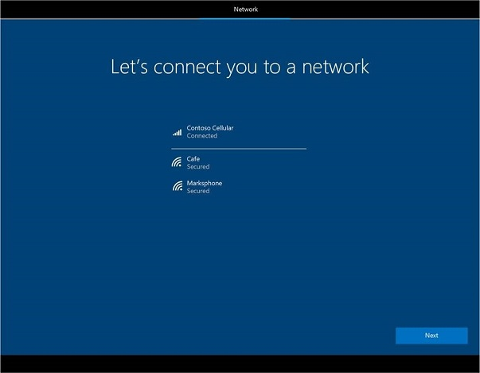
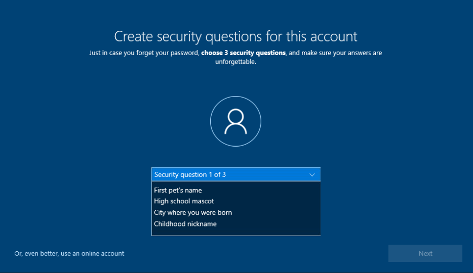
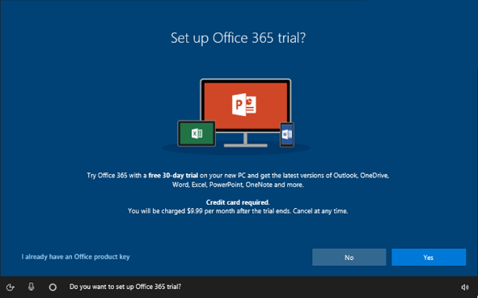
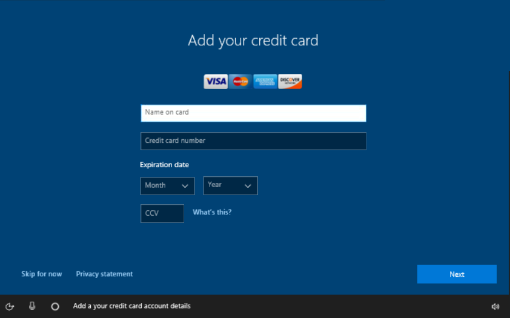
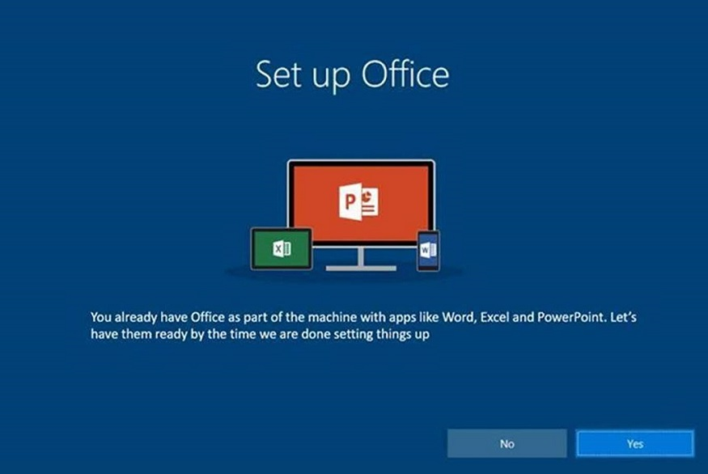

# OOBE screen details

This topic describes some of the screens users will see as they progress through OOBE. Although the screens described here are not customizable, the information is provided to give insight to the user's experience, and what the user can expect, as they work through OOBE.

The following screens are described below:

* [Cloud service pages](#cloud-service-pages)
* [Connect users to the network](#connect-users-to-the-network)
* [Create security questions for this account](#create-security-questions-for-this-account) (new in Windows 10, version 1803)
* [Set up Office](#set-up-office)

## Cloud service pages

Some pages displayed during OOBE are delivered via cloud service, as opposed to being delivered as part of a Windows release. Cloud service pages can be rolled out to users, or groups of users, at any time. Page content can also be modified or adapted based on user input. Using cloud service for OOBE pages enables Microsoft to offer targeted, relevant content to users quickly, rather than waiting for the next Windows release.

When testing OOBE, keep in mind that you may not see cloud service pages during the flow.

## Connect users to the network

During the OOBE flow, the customer will see the **Let’s connect you to a network** screen. This screen appears just prior to the EULA screen during OOBE. **Let’s connect you to a network** shows any connection options available to the user, including in-range Wi-Fi and Cellular data networks.

### Connect to Cellular and/or Wi-Fi networks

If the device is LTE-enabled and an active SIM card is inserted, Windows will connect to the Cellular data network automatically. This enables the user to go through OOBE and successfully setup their device if a local Wi-Fi connection is not available. The user will see they are Connected to the Cellular data network when they reach the **Let’s connect you to a network** screen in OOBE. Available Wi-Fi connections will also be shown on the screen, and the user can choose to connect to Wi-Fi if desired.

If the device is LTE-enabled, but no SIM card is present, Cellular data will appear as a connection option along with any available Wi-Fi networks. The user must insert a SIM card before they can connect to the Cellular network.

A user can choose to connect to both a Wi-Fi and Cellular network at the same time. In this case, Wi-Fi will be used throughout OOBE and no data traffic is transmitted via the Cellular network (metered connection). Windows will always use the Wi-Fi connection if it is available. Cellular will only be used if the user is out of range of their Wi-Fi network, or chooses to disconnect from Wi-Fi.

Windows has logic in place to protect the user from draining their data during OOBE if they are on a metered connection (either metered Cellular or metered Wi-Fi). For example, if a user is on a metered network, only critical updates (for example, critical driver updates and zero-day patch (ZDP) Windows updates) are allowed on the device.

For more information on the cellular settings for Windows 10 users, see [Cellular settings in Windows 10](https://support.microsoft.com/en-us/help/10739/windows-10-cellular-settings).

### Download critical updates after connecting

Immediately after the user connects to a network, critical driver updates, and Windows ZDP updates, will begin downloading to the device. Only critical updates that are required for the device to function, such as security fixes, will download during this time. As such, the user can't opt out of downloading them. Windows will alert the user that the device is checking for, and applying, the updates:

The time required to download the updates depends on the size of the download and the user's network conditions. Their device may restart automatically during the download.

If a newer version of Windows has become available since the device was shipped, the user will be asked if they would like to download this non-critical Windows Update at the end of OOBE. For more information, see [Windows updates during OOBE](windows-updates-during-oobe.md).

## Create security questions for this account

During the OOBE flow, users are prompted to either create or sign in with a local account, or a Microsoft account (MSA). In Windows 10, version 1803, Windows introduces password recovery security questions to accompany the local account registration process in OOBE. If a user is unable to remember the password required to login to the local account, they can instead correctly answer their 3 security questions, and Windows will allow them to reset the password and login to the device.

This is a change from previous versions of Windows, where a user was only able to create a password hint to accompany their local account. Previously, if a user couldn’t remember their local account password based on the hint, they were required to contact Microsoft support for a device reset.

The **Create security questions for this account** screen will appear after the user creates a local account (name and password) for the device during OOBE.

The list of security questions the user can choose from is generated by Microsoft.

Users can create and update the security questions associated with their local account after OOBE, from the **Settings** app.

The option to create security questions from the **Settings** app is also available to users who upgrade to Windows 10, version 1803 from a previous version of Windows, and to any new local account created for a device running Windows 10, version 1803.

## Set up Office

Users will see the **Set up Office** screens in OOBE if they are connected to a network, and have provided their Microsoft account (MSA) information. Content on the page will vary depending on the user’s account type, and the version of Office pre-installed to the device. The **Set up Office** screens, including the **payment information** screen, are cloud service pages.

### Office 365 subscribers

If Office 365 (Office Desktop Bridge) is pre-installed to the device, and the user's MSA is already associated with an Office 365 subscription, they will see the following **Set up Office 365** screen:

The screen reminds the user of their existing subscription, and asks if they would like to have their Office apps ready by the time OOBE is complete.

### Office 365 free trial

If Office 365 (Office Desktop Bridge) is pre-installed to the device, and the user's MSA is eligible for a free trial, they will see the following **Set up Office 365 trial** screen:

The user can choose to begin the trial by clicking **Yes**, or can opt-out of the trial by clicking **No**.

#### Add credit card information

In Windows 10, version 1803, if a user opts-in to the free trial, they are prompted to enter the credit card to charge when the free trial expires.

If a user is eligible for a free trial of Office 365, and they already have a credit card on file for their Microsoft account, they will not be prompted to **Add your credit card** during OOBE. Instead, they will be asked to confirm that the credit card on file should be charged when the free trial expires.

Collecting this payment information during OOBE enables customers to seamlessly auto-renew Office 365 after the free trial, with no disruption to their service. The credit card will be saved to the user’s MSA, so it can be used for future purchases.

A credit card is now required to start a free trial of Office 365. If the user does not provide their payment information during OOBE, they will not be able to start a free trial at that time. The customer can start a free trial of Office 365 later but will still be required to enter their payment information.

### Office 2016

If Office 2016 (Activation For Office (AFO) Perpetual) is pre-installed to the device, users will see the following **Set up Office** screen:

The screen informs the user that Office 2016 is included with their device, and asks if they would like to have their Office apps ready by the time OOBE is complete.
