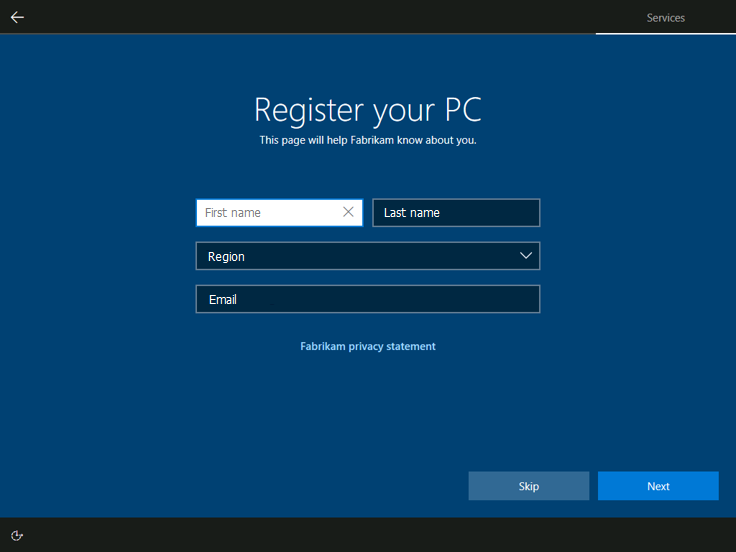
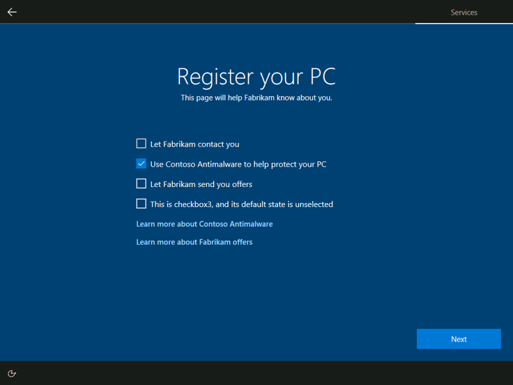

# Configure OOBE.xml

To include your registration pages in OOBE, you must configure the appropriate settings of your OOBE.xml file.

A minimum amount of information is required for the registration pages to display. You must provide a page `title`, a page `subtitle`, the `customerinfo` element, at least one additional checkbox **or** one link, and a public key for public/private key encryption.

The following table shows the Oobe.xml elements that correspond to customizable fields on the OEM registration pages:

| Element | Setting | Description | Value |
| ------- | ------ | ----------- | ----- |
| <**oem**> |  |  |  |
|  | \<registration> | Optional. Additional details are below. |
| <**registration**> | | | |
| | \<title> | Required if registration element is used. Text to title the registration pages. | String of up to 25 characters. |
| | \<subtitle> | Required if registration element is used. Text to describe the registration pages. |
| <**customerinfo**> | | | |
| | \<label> | Text to label the top checkbox on registration page two. Required to display the customer information fields on registration page one. Required to display registration pages in OOBE. | String of up to 250 characters. We strongly recommend that you use no more than 100 characters because this length of text will fit on one line. |
| | \<defaultvalue> | Value to set the customerinfo checkbox to selected or not selected. | True or False. True means the check box default condition is selected. False means the check box default condition isn't selected. Default is False. |
| <**checkbox1**> | | | |
| | \<label> | Text to label the second checkbox on registration page two. Required for checkbox1 to appear on registration page two. | String of up to 250 characters. We strongly recommend that you use no more than 100 characters because this length of text will fit on one line. |
| | \<defaultvalue> | Value to set checkbox1 as selected or not selected. | True or False. True means the check box default condition is selected. False means the check box default condition isn't selected. Default is False. |
| \<**checkbox2**> | | | |
| | \<label> | Text to label the third checkbox on registration page two. Required for checkbox2 to appear on registration page two. | String of up to 250 characters. We strongly recommend that you use no more than 100 characters because this length of text will fit on one line. |
| | \<defaultvalue> | Value to set checkbox2 as selected or not selected. | True or False. True means the check box default condition is selected. False means the check box default condition isn't selected. Default is False. |
| <**checkbox3**> | | | |
| | \<label> | Text to label the fourth checkbox on registration page two. Required for checkbox3 to appear on registration page two. | String of up to 250 characters. We strongly recommend that you use no more than 100 characters because this length of text will fit on one line. |
| | \<defaultvalue> | Value to set checkbox3 as selected or not selected. | True or False. True means the check box default condition is selected. False means the check box default condition isn't selected. Default is False. |
| <**link1**> | | | |
| | \<label> | Label for the link on registration page one. Required for link1 to appear on registration page one, underneath the four customer information fields. | String of up to 100 characters.|
| | \<link> | File must be named linkfile1.html. OOBE searches for these files under the %systemroot%\System32\Oobe\Info folder. OOBE searches for files under the appropriate locale and language specific subfolders of Oobe\Info. Use the [HTML sample](design-registration-pages.md#full-html-example) we provide as a baseline when designing your HTML pages. | linkfile1.html |
| <**link2**> | | | |
| | \<label> | Label for the top link on registration page two. Required for link2 to appear on registration page two. | String of up to 100 characters.|
| | \<link> | File must be named linkfile2.html. OOBE searches for these files under the %systemroot%\System32\Oobe\Info folder. OOBE searches for files under the appropriate locale and language specific subfolders of Oobe\Info. Use the [HTML sample](design-registration-pages.md#full-html-example) we provide as a baseline when designing your HTML pages. | linkfile2.html |
| <**link3**> | | | |
| | \<label> | Label for the second link on registration page two. Required for link3 to appear on registration page two. | String of up to 100 characters.|
| | \<link> | File must be named linkfile3.html. OOBE searches for these files under the %systemroot%\System32\Oobe\Info folder. OOBE searches for files under the appropriate locale and language specific subfolders of Oobe\Info. Use the [HTML sample](design-registration-pages.md#full-html-example) we provide as a baseline when designing your HTML pages. | linkfile3.html |
| <**hideSkip**> | | Optional. Controls whether or not the Skip button is displayed to the user on registration page one. | True or False. True means the skip button is not visible to the user. False means the skip button is displayed as an option to the user. Default is False, resulting in the skip button being visible. |

>[!Note]
> If you only include one `link` element in your Oobe.xml file, it will appear on registration page one underneath the customer information fields, regardless of which `link` element was used. Similarly, if you only include two `link` elements in your Oobe.xml file, the first will appear on registration page one, and the second will appear as the top link on registration page two.
>
> For example, if you omit `link1` and `link2` from Oobe.xml, and only include `link3`, `link3` will appear underneath the customer information fields on registration page one. If you omit only `link1`, `link2` will appear on registration page one, and `link3` will appear as the top link on registration page two.

For more information on these settings, and the others you can configure, please see [Oobe.xml Settings](https://docs.microsoft.com/en-us/windows-hardware/manufacture/desktop/oobexml-settings).

## XML example

```xml
<oobe>
    <oem>
      <registration>
          <title>Register your PC</title>
          <subtitle>This page will help Fabrikam know about you.</subtitle>
          <customerinfo>
              <label>Let Fabrikam contact you</label>
          </customerinfo>
          <checkbox1>
              <label>Use Contoso Antimalware to help protect your PC</label>
              <defaultvalue>true</defaultvalue>
          </checkbox1>
          <checkbox2>
              <label>Let Fabrikam send you offers</label>
          </checkbox2>
          <checkbox3>
              <label>This is checkbox3, and its default state is unselected</label>
          </checkbox3>
          <link1>
              <label>Fabrikam privacy statement</label>
          </link1>
          <link2>
              <label>Learn more about Contoso Antimalware</label>
          </link2>
          <link3>
              <label>Learn more about Fabrikam offers</label>
          </link3>
          <hideSkip>false</hideSkip>
      </registration>
    </oem>
</oobe>
```

Here are the OEM registration pages that will appear as a result of the XML example above:




