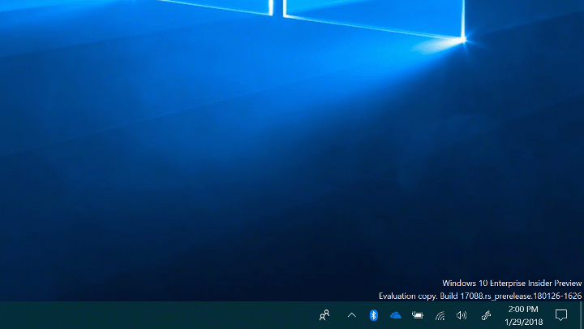
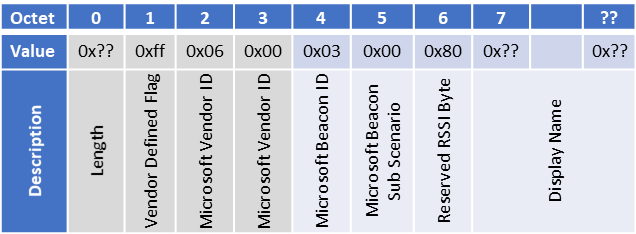
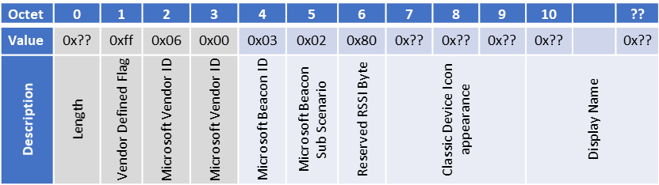
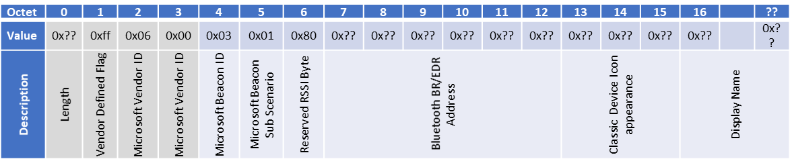

# Bluetooth Swift Pair

Introduced in Windows 10, version 1803, Swift Pair is the newest way to pair your Bluetooth peripherals to Windows 10 PCs. This topic describes the feature, requirements about how peripherals can support Swift Pair, frequently asked questions about how this quick and convenient feature works.

As the next evolution of pairing, users no longer need to navigate the Settings App and find their peripheral to pair. Windows can now do this for them by popping a notification when a new peripheral is nearby and ready. The steps to use and benefit from this feature are simple:

1. Put the Bluetooth peripheral in pairing mode
2. When the peripheral is close by, Windows will show a notification to the user
3. Selecting “Connect” starts pairing the peripheral
4. When the peripheral is no longer in pairing mode or is no longer nearby, Windows will remove the notification from the Action Center

If at any time, a user wishes to turn Swift Pair on or off, they can do so in the “Bluetooth & other devices” page. Enterprises will also be able to control this feature through the [Bluetooth\AllowPromptedProximalConnections](https://docs.microsoft.com/en-us/windows/client-management/mdm/policy-csp-bluetooth) in the Policy CSP and with any existing Mobile Device Management solution.

## Building a Swift Pair peripheral

There are two sets of requirements to ensure your peripheral works with Swift Pair. 
- The peripheral’s behavior
- The structure and values in a Microsoft defined vendor advertisement section.
-  
These are the set of requirements:

## Peripheral Behavior (Required)

Discovery of Swift Pair peripherals happens over the Bluetooth Low Energy (LE) protocol and **requires the use of LE advertisements**. Windows uses this advertisement to identify a peripheral as Swift Pair capable. This advertisement must contain **one of the Microsoft defined vendor sections** (shown in Fig 2-4) **to the advertisement while in pairing mode**. 

In order for Windows to identify a peripheral shortly after it enters pairing mode, **peripherals should beacon for Swift Pair at a faster cadence than normal for quick discovery**. The faster a peripheral advertises; the less time Windows needs to listen. This helps with Bluetooth & Wi-Fi coexistence on the same radio. After a short period of time, the peripheral can fall back to a lower but consistent advertising cadence.

- For quickest discovery: Beacon consistently every 30 ms for >= 30 seconds then fall back to a normal cadence.
- For normal cadence: Beacon consistently every 100 ms or 152.5 ms during a Swift Pair session
To keep this experience predictable for our users, the user should not have to try to pair to a peripheral that is no longer available. **Remove the vendor section >30 seconds before exiting pairing mode**. 
If the peripheral is out of available pairings, **remove the one with the longest time since last connect first**. 

## Peripheral info on the Swift Pair notification
Users should easily identify the peripheral they are trying to pair to. Peripherals should define **either a defined class of device (CoD) or the peripheral name**, which must be **included in the same advertisement** as the Swift Pair payload. Windows does not active scan due to both power and privacy concerns. As a result Swift Pair **peripheral information cannot be stored in a scan response**.

**For LE only peripherals** (Fig 2), the Bluetooth SIG **LE appearance section can be parsed to define a class of device**. Windows will parse this section if included in the same advertisement as Swift Pair and map it to the correct icon to show on the notification. **For dual mode peripherals, the class of device is already covered in the Swift Pair payloads** (Fig 3,4). This is the [3 byte Major/Minor value defined by the Bluetooth SIG](https://www.bluetooth.com/specifications/assigned-numbers/baseband).

If a CoD is detected, the displayed icon is the same as the icon shown in Settings.

If a CoD isn’t detected, Windows defaults to the Bluetooth logo to show on the notification.

To show a name, **it is recommended to use a Bluetooth friendly name section**, but if that is not possible there is **an _optional_ method in the Swift Pair payload** to use the **“Display Name”** field. This field is uncapped in size, but **Microsoft does not localize this string and must work in all markets**. As such, brands, trademarks, or model numbers are recommended to fulfill region market requirements.

If a name is detected, “New [Peripheral Name] found” is shown.

If a name isn’t detected, a generic string is shown as defined by the class of device Ex: “New Bluetooth mouse found”, “New Bluetooth headphones found”, “New Bluetooth headset found”

## Spec Features needed for Swift Pair
**If a peripheral is beaconing for Swift Pair without any explicit user action, support LE Privacy**. Users should not be trackable due to the personal nature of these devices. **If LE Privacy is supported, the peripheral should suspend rotating the Bluetooth LE Address during the Swift Pair session**. The rotated address would be received as a new device request by Windows and would show two notifications for a single peripheral.

**If a dual mode peripheral wishes to pair over both BR/EDR and LE, the peripheral must support secure connections for both protocols**. Windows pairs over LE first and derives the BR/EDR keys using secure connections. Pairing to both LE and BR/EDR with Swift pair without the use of secure connections is not supported.

## Recommended
For a good first-time experience, enter **pairing mode the first time the peripheral is powered up**.
**Do not beacon for Swift Pair indefinitely**. Windows tracks peripherals trying to Swift Pair and will only show one notification per session. 

Dual mode peripherals can **save payload space if they pair over both Bluetooth LE and BR/EDR with Secure Connections**.

## Payload Structures
Bluetooth LE is required, other BR/EDR peripherals can benefit from Swift Pair. There are three  payloads which will trigger Swift Pair; one for solely Bluetooth LE peripherals, and two for dual mode peripherals. The dual mode payloads help address whether the peripheral pairs over both Bluetooth LE and BR/EDR using secure connections or is leveraging this Bluetooth LE advertisement to pair over only BR/EDR.

## Section Header
- This is a Bluetooth SIG defined vendor section
- The header consists of the Length, Vendor defined flag, and Microsoft Vendor ID 0x0006

## Payload Content
Microsoft Beacon ID & Sub Scenario 

- The Microsoft Beacon ID helps identify that the advertisement is for this experience and will detail how the peripheral will pair, each unique ID has a unique payload.

Reserved RSSI Byte 
-   Reserve this byte and set it to 0x80. This will help maintain forwards and backwards compatibility. 

Display Name 
- This variable size field can allow payload constrained peripherals to display the name of the peripheral on the notification. This name will not be localized and will need to work for all markets.
- This is field is NOT required and is only a fallback mechanism if a peripheral maker would like to leverage it.

## Classic BR/EDR Pairings
For BR/EDR peripheral icon appearance 
- It is the same as the Major and Minor Class of Device(CoD) mapping provided by the Bluetooth SIG

BR/EDR Address
- If a peripheral will pair over BR/EDR only, the BR/EDR address in **little endian** format must be included in the main advertising packet 
- Supporting Secure Connections and pairing over both Bluetooth LE and BR/EDR removes this requirement

