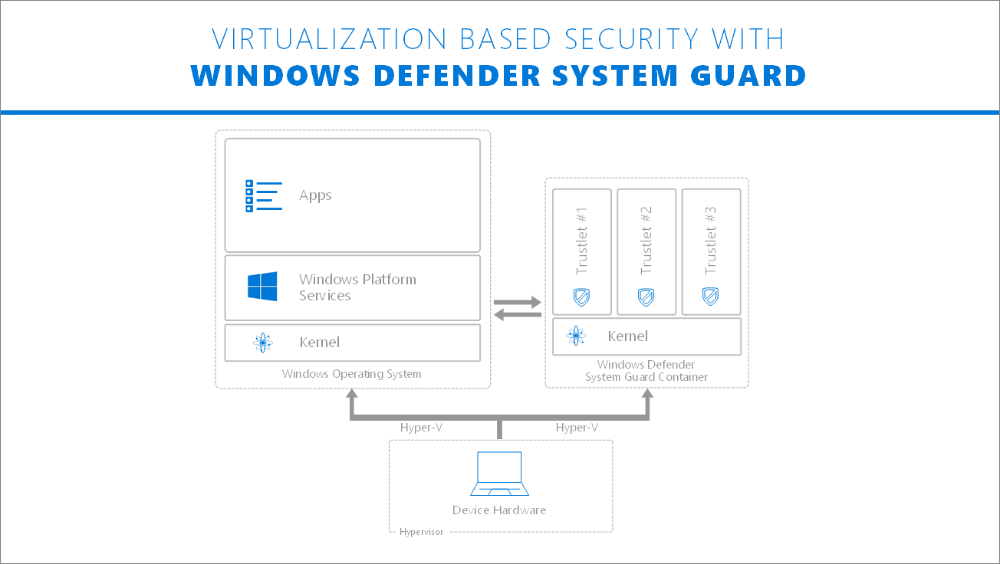

# Windows Defender System Guard: Making a leap forward in platform security with Memory integrity in Core isolation 

The escalating sophistication of cyberattacks is marked by the increased use of kernel-level exploits that attempt to run malware with the highest privileges and evade security solutions and software sandboxes. 
For example, kernel exploits famously gave the WannaCry and Petya ransomware a remote code execution capability, resulting in wide scale global outbreaks, the likes of which have not been seen in many years. 
Windows 10 remained resilient to these attacks, but Microsoft is constantly evolving protections to stay ahead of threat actors. 

Since the initial release of Windows 10 (1507), enterprise customers have had the option to enable virtualization-based security ([VBS](https://docs.microsoft.com/windows-hardware/design/device-experiences/oem-vbs)) and Memory Integrity (Hypervisor protected code integrity or HVCI) to [increase platform threat resistance](https://cloudblogs.microsoft.com/microsoftsecure/2017/06/16/analysis-of-the-shadow-brokers-release-and-mitigation-with-windows-10-virtualization-based-security/). 
In Windows 10 Creators Update (1709) we consolidated these system integrity features in [Windows Defender System Guard](https://cloudblogs.microsoft.com/microsoftsecure/2017/10/23/hardening-the-system-and-maintaining-integrity-with-windows-defender-system-guard/). 
Memory Integrity used to be under Windows Defender Device Guard, and some tools to test Memory Integrity still remain there.

Memory Integrity will be available and turned on by default in clean installs of the Windows 10 operating system; for older systems, customers will have the ability to opt in via our Windows Defender Security Center UI. 
This enhancement will ensure that the kernel process that verifies code integrity runs in a secure runtime environment provided by VBS. 
This will allow Windows 10 to protect the widest possible range of diverse users and scenarios.

In addition, with Memory integrity protection, kernel memory pages are only made executable after passing code integrity checks inside the secure runtime environment, and executable pages themselves are never writable. 
This is an enhancement to intrusion prevention capabilities in [Windows Defender Exploit Guard](https://cloudblogs.microsoft.com/microsoftsecure/2017/10/23/windows-defender-exploit-guard-reduce-the-attack-surface-against-next-generation-malware/).  



## Application compatibility

As a result of these enhancements, in a future version of Windows 10, all kernel mode code must be signed by Microsoft. 
Some applications may be incompatible with Memory integrity protection. 

While hypervisor-protected code integrity compliance has been a requirement for all drivers since Windows 10 Anniversary Update (1607), some drivers may still not be compatible. 
This may cause devices or software to malfunction. 
Such issues may occur after Memory integrity protection has been turned on or during the enablement process itself. 
If you’re an application developer and want to validate if your drivers and software packages are compliant with memory integrity, you can follow the steps below.

Some example of application incompatible areas Microsoft has seen in testing are in the following areas:

- Anti-Cheat solutions with Gaming 
- 3rd Party Input Methods
- 3rd Party Banking Password Protection

We worked hard to mitigate impacted experiences, so if an incompatibility exists for a boot-critical driver, Memory integrity protection will be silently turned off. 
If you encounter incompatibilities with other apps, Microsoft advises that you check for updates for the specific app and version encountering the issue before turning off Memory integrity protection. 

## How to build compatible drivers

Since memory pages and sections can never be writable and executable, the first step is to ensure a clear separation of data and code and not to attempt to directly modify code pages.

- Opt-in to NX by default
- Use NX APIs/flags for memory allocation - NonPagedPoolNx
- Don’t use sections that are both writable and executable
- Don’t attempt to directly modify executable system memory
- Don’t use dynamic code in kernel  
- Don’t load data files as executable
- Section Alignment must be a multiple of 0x1000 (PAGE_SIZE). E.g. DRIVER_ALIGNMENT=0x1000

## How to verify driver compatibility with HVCI

There are four steps to verify driver compatibility:

1. Use Driver Verifier (see section below) with the new Code Integrity compatibility checks enabled
2. Test the driver on a system with virtualization-based isolation of Code Integrity enabled.
3. Run the [HyperVisor Code Integrity Readiness Test](https://blogs.msdn.microsoft.com/windows_hardware_certification/2015/05/22/driver-compatibility-with-device-guard-in-windows-10/#test) in the Windows HLK.
4. Use the [Device Guard Readiness Tool](https://blogs.msdn.microsoft.com/windows_hardware_certification/2015/05/22/driver-compatibility-with-device-guard-in-windows-10/#tool).

## Driver Verifier compatibility checks

Driver Verifier has a new Code Integrity option flag (0x02000000) to enable extra checks that validate compliance with this feature. 
To enable this from the command line, use the following command:

```console
verifier.exe /flags 0x02000000 /driver <driver.sys>
```

To choose this option if using the verifier GUI, choose **Create custom settings (for code developers)**, choose **Next**, and then choose **Code integrity checks**.

## HLK testing (Desktop and Server)

A new HLK test, the HyperVisor Code Integrity Readiness Test, needs to pass for HVCI drivers (Memory Integrity) to be approved for Microsoft signing. 
HVCI-compatible drivers are required for both Desktop and Server SKUs. 
The HLK test is a basic test written to make sure that HVCI-compatible drivers are correctly loaded and run by the OS.

Although simply passing the HLK test is sufficient for a Microsoft signature for the driver, we strongly recommend thorough functional testing with Device Guard enabled. 
For example, there might be incorrectly-coded memory allocation violating NX protections causing failures that won't be caught by the test. 
The driver author should thoroughly test the driver while keeping Device Guard enabled.

During driver development and during HLK testing, Device Guard should be disabled, as Device Guard might prevent the driver from loading.

## FAQs

**What about existing drivers?  Do I need to re-build these drivers to get them to work with Windows 10?**

It depends. Many drivers will already be compatible. If using standard settings with the old versions of the WDK and Visual Studio, a known issue is that the INIT section is marked as RWX. In Windows 10, however, the W will automatically be stripped, so if this is the only issue then the driver will be compatible.

**How do I verify that Virtualization Based Protection of Code Integrity is enabled?** 
The simplest mechanism is to run the System Information app (msinfo32). Look for the following line: “Device Guard Security Services Running”. It should report: “Hypervisor enforced Code Integrity”. There is also a WMI interface for checking using management tools.

**Can I verify that Virtualization Based Protection of Code Integrity is enabled programmatically from kernel in order to alter driver behavior?**

Yes, you can use [NtQuerySystemInformation](https://msdn.microsoft.com/library/windows/desktop/ms724509(v=vs.85).aspx). 
The SYSTEM_CODEINTEGRITY_INFORMATION structure has a new 0x400 value exposed, indicating that virtualization based protection of Code Integrity is on.

**How do I fix compatibility issues?**
In addition to double checking that there are no W+X pages and the driver sections are aligned correctly as mentioned above, the most likely issue will be improper memory allocation. Information about the Code Analysis warnings related to memory allocation issued is available on MSDN on the following page:  
[Code Analysis for Drivers Warnings](https://msdn.microsoft.com/library/windows/hardware/ff550572(v=vs.85).aspx).

The following MSDN links show some examples of commonly-used APIs that cause executable memory to be allocated, along with some example fixes:

- [C30029](https://docs.microsoft.com/windows-hardware/drivers/devtest/30029-memory-allocating-function-requests-executable-memory)
- [C30030](https://docs.microsoft.com/windows-hardware/drivers/devtest/30030-parameter-indicates-executable-memory) 
- [C30031](https://docs.microsoft.com/windows-hardware/drivers/devtest/30031-pool-n-optin-called-before-entry-function)
- [C30032](https://docs.microsoft.com/windows-hardware/drivers/devtest/30032-forcing-request-of-executable-memory)
- [C30033](https://docs.microsoft.com/windows-hardware/drivers/devtest/30033-executable-allocation-detected-with-pool-nx-optin)
- [C30034](https://docs.microsoft.com/windows-hardware/drivers/devtest/30034-passing-flag-value-to-allocating-function)
- [C30035](https://docs.microsoft.com/windows-hardware/drivers/devtest/30035-function-call-must-be-made-inside-init-function)

Use the following table to interpret the output to determine what driver code changes are needed to resolve the different types of HVCI incompatibilities.

| Warning | Resolution |
|---------|------------|
|Execute Pool Type         |  The caller specified an executable pool type. Calling a memory allocating function that requests executable memory.
Be sure that all pool types contain a non executable NX flag.  |
|Execute Page Protection         |  The caller specified an executable page protection.
Specify a "no execute" page protection mask.  |
|Execute Page Mapping         |  The caller specified an executable memory descriptor list (MDL) mapping.
Make sure that the mask that is used contains MdlMappingNoExecute. For more information, see [MmGetSystemAddressForMdlSafe](https://docs.microsoft.com/windows-hardware/drivers/kernel/mm-bad-pointer).  |
|Execute-Write Section         |  The image contains an executable and writable section.  |
|Section Alignment Failures         |  The image contains a section that is not page aligned.
Section Alignment must be a multiple of 0x1000 (PAGE_SIZE). E.g. DRIVER_ALIGNMENT=0x1000  |
|Unsupported Relocs         |  In Windows 10 version 1507 through version 1607, because of the use of Address Space Layout Randomization (ASLR) an issue can arise with address alignment and memory relocation. The operating system needs to relocate the address from where the linker set its default base address to the actual location that ASLR assigned. This relocation cannot straddle a page boundary. For example, consider a 64-bit address value that starts at offset 0x3FFC in a page. It’s address value overlaps over to the next page at offset 0x0003. This type of overlapping relocs is not supported prior to Windows 10 version 1703. </br>
This situation can occur when a global struct type variable initializer has a misaligned pointer to another global, laid out in such a way that the linker cannot move the variable to avoid the straddling relocation. The linker will attempt to move the variable, but there are situations where it may not be able to do so, for example with large misaligned structs or large arrays of misaligned structs. Where appropriate, modules should be assembled using the [/Gy (COMDAT)](https://docs.microsoft.com/en-us/cpp/build/reference/gy-enable-function-level-linking) option to allow the linker to align module code as much as possible. |
|Unsupported Relocs Code not copied here due to formatting issue.	         |  There are other situations involving the use of assembler code, where this issue can also occur.  |
|IAT in Executable Section         |  The import address table (IAT), should not be an executable section of memory. </br>
This issue occurs when the IAT, is located in a Read and Execute (RX) only section of memory. This means that the OS will not be able to write to the IAT to set the correct addresses for where the referenced DLL. </br>
One way that this can occur is when using the /MERGE (Combine Sections) option in code linking. For example if .rdata (Read-only initialized data) is merged with .text data (Executable code), it is possible that the IAT may end up in an executable section of memory.|

**Which APIs are potentially affected?**   

The following list of APIs that are not reserved for system use may be impacted:


Give us feedback, log bugs, and help us make Windows 10 even more secure by [emailing our team](mailto:dgext@microsoft.com).

- [ExAllocatePool](https://docs.microsoft.com/en-us/windows-hardware/drivers/ddi/content/wdm/nf-wdm-exallocatepool)
- [ExAllocatePoolWithQuota](https://docs.microsoft.com/en-us/windows-hardware/drivers/ddi/content/wdm/nf-wdm-exallocatepoolwithquota)
- [ExAllocatePoolWithQuotaTag](https://docs.microsoft.com/en-us/windows-hardware/drivers/ddi/content/wdm/nf-wdm-exallocatepoolwithquotatag)
- [ExAllocatePoolWithTag](https://docs.microsoft.com/en-us/windows-hardware/drivers/ddi/content/wdm/nf-wdm-exallocatepoolwithtag)
- [ExAllocatePoolWithTagPriority](https://docs.microsoft.com/en-us/windows-hardware/drivers/ddi/content/wdm/nf-wdm-exallocatepoolwithtagpriority)
- [ExInitializeNPagedLookasideList](https://docs.microsoft.com/en-us/windows-hardware/drivers/ddi/content/wdm/nf-wdm-exinitializenpagedlookasidelist)
- [ExInitializeLookasideListEx](https://docs.microsoft.com/en-us/windows-hardware/drivers/ddi/content/wdm/nf-wdm-exinitializelookasidelistex)
- [MmAllocateContiguousMemory](https://docs.microsoft.com/en-us/windows-hardware/drivers/ddi/content/wdm/nf-wdm-mmallocatecontiguousmemory)
- [MmAllocateContiguousMemorySpecifyCache](https://docs.microsoft.com/en-us/windows-hardware/drivers/ddi/content/wdm/nf-wdm-mmallocatecontiguousmemoryspecifycache)
- [MmAllocateContiguousMemorySpecifyCacheNode](https://docs.microsoft.com/en-us/windows-hardware/drivers/ddi/content/wdm/nf-wdm-mmallocatecontiguousmemoryspecifycachenode)
- [MmAllocateContiguousNodeMemory](https://docs.microsoft.com/en-us/windows-hardware/drivers/ddi/content/wdm/nf-wdm-mmallocatecontiguousnodememory
- [MmMapIoSpace](https://docs.microsoft.com/en-us/windows-hardware/drivers/ddi/content/wdm/nf-wdm-mmmapiospace)
- [MmMapLockedPages](https://docs.microsoft.com/en-us/windows-hardware/drivers/ddi/content/wdm/nf-wdm-mmmaplockedpages)
- [MmMapLockedPagesSpecifyCache](https://docs.microsoft.com/en-us/windows-hardware/drivers/ddi/content/wdm/nf-wdm-mmmaplockedpagesspecifycache)
- [MmProtectMdlSystemAddress](https://docs.microsoft.com/en-us/windows-hardware/drivers/ddi/content/wdm/nf-wdm-mmprotectmdlsystemaddress)
- [ZwAllocateVirtualMemory](https://msdn.microsoft.com/en-us/library/windows/hardware/ff566416(v=vs.85).aspx)
- [ZwCreateSection](https://docs.microsoft.com/en-us/windows-hardware/drivers/ddi/content/wdm/nf-wdm-zwcreatesection)
- [ZwMapViewOfSection](https://docs.microsoft.com/en-us/windows-hardware/drivers/ddi/content/wdm/nf-wdm-zwmapviewofsection)
- [NtCreateSection]()
- [NtMapViewOfSection]()
- [StorPortGetDataInBufferSystemAddress](https://docs.microsoft.com/en-us/windows-hardware/drivers/ddi/content/storport/nf-storport-storportgetdatainbuffersystemaddress)
- [StorPortGetSystemAddress](https://docs.microsoft.com/en-us/windows-hardware/drivers/ddi/content/storport/nf-storport-storportgetsystemaddress)
- [DxgkCbMapMemory](https://docs.microsoft.com/en-us/windows-hardware/drivers/ddi/content/dispmprt/nc-dispmprt-dxgkcb_map_memory)
- [IMiniportDMus::NewStream](https://docs.microsoft.com/en-us/windows-hardware/drivers/ddi/content/dmusicks/nf-dmusicks-iminiportdmus-newstream)
- [FltAllocatePoolAlignedWithTag](https://docs.microsoft.com/en-us/windows-hardware/drivers/ddi/content/fltkernel/nf-fltkernel-fltallocatepoolalignedwithtag)
- [FltAllocateContext](https://docs.microsoft.com/en-us/windows-hardware/drivers/ddi/content/fltkernel/nf-fltkernel-fltallocatecontext)
- [hangerClassAllocatePool](https://docs.microsoft.com/en-us/windows-hardware/drivers/ddi/content/mcd/nf-mcd-changerclassallocatepool)
- [IMiniportMidi::NewStream](https://docs.microsoft.com/en-us/windows-hardware/drivers/ddi/content/portcls/nf-portcls-iminiportmidi-newstream)
- [IMiniportWaveCyclic::NewStream]()
- [IPortWavePci::NewMasterDmaChannel]()
- [IMiniportWavePci::NewStream]()
- [PcNewDmaChannel]()
- [PcNewResourceList]()
- [PcNewResourceSublist]()
- [VideoPortAllocatePool]()
- [ClfsCreateMarshallingArea]()
- [WdfLookasideListCreate]()
- [WdfMemoryCreate]()
- [WdfDeviceAllocAndQueryProperty]()
- [WdfDeviceAllocAndQueryPropertyEx]()
- [WdfFdoInitAllocAndQueryProperty]()
- [WdfFdoInitAllocAndQueryPropertyEx]()
- [WdfIoTargetAllocAndQueryTargetProperty]()
- [WdfRegistryQueryMemory]()
- [NdisAllocateMemory]()


