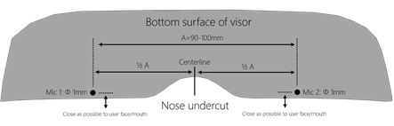
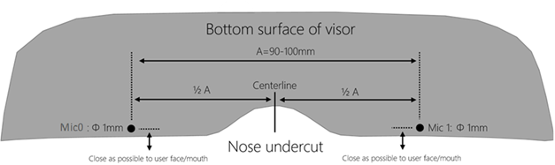

# Speech Platform: Input Device Hardware Guidelines


**Microsoft Corporation Technical Documentation License Agreement (Standard)**
**READ THIS!** THIS IS A LEGAL AGREEMENT BETWEEN MICROSOFT CORPORATION ("MICROSOFT") AND THE RECIPIENT OF THESE MATERIALS, WHETHER AN INDIVIDUAL OR AN ENTITY ("YOU"). IF YOU HAVE ACCESSED THIS AGREEMENT IN THE PROCESS OF DOWNLOADING MATERIALS ("MATERIALS") FROM A MICROSOFT WEB SITE, BY CLICKING "I ACCEPT", DOWNLOADING, USING OR PROVIDING FEEDBACK ON THE MATERIALS, YOU AGREE TO THESE TERMS. IF THIS AGREEMENT IS ATTACHED TO MATERIALS, BY ACCESSING, USING OR PROVIDING FEEDBACK ON THE ATTACHED MATERIALS, YOU AGREE TO THESE TERMS.
1. For good and valuable consideration, the receipt and sufficiency of which are acknowledged, You and Microsoft agree as follows:
(a) If You are an authorized representative of the corporation or other entity designated below ("**Company**"), and such Company has executed a Microsoft Corporation Non-Disclosure Agreement that is not limited to a specific subject matter or event ("**Microsoft NDA**"), You represent that You have authority to act on behalf of Company and agree that the Confidential Information, as defined in the Microsoft NDA, is subject to the terms and conditions of the Microsoft NDA and that Company will treat the Confidential Information accordingly;
(b) If You are an individual, and have executed a Microsoft NDA, You agree that the Confidential Information, as defined in the Microsoft NDA, is subject to the terms and conditions of the Microsoft NDA and that You will treat the Confidential Information accordingly; or
(c)If a Microsoft NDA has not been executed, You (if You are an individual), or Company (if You are an authorized representative of Company), as applicable, agrees: (a) to refrain from disclosing or distributing the Confidential Information to any third party for five (5) years from the date of disclosure of the Confidential Information by Microsoft to Company/You; (b) to refrain from reproducing or summarizing the Confidential Information; and (c) to take reasonable security precautions, at least as great as the precautions it takes to protect its own confidential information, but no less than reasonable care, to keep confidential the Confidential Information. You/Company, however, may disclose Confidential Information in accordance with a judicial or other governmental order, provided You/Company either (i) gives Microsoft reasonable notice prior to such disclosure and to allow Microsoft a reasonable opportunity to seek a protective order or equivalent, or (ii) obtains written assurance from the applicable judicial or governmental entity that it will afford the Confidential Information the highest level of protection afforded under applicable law or regulation. Confidential Information shall not include any information, however designated, that: (i) is or subsequently becomes publicly available without Your/Company’s breach of any obligation owed to Microsoft; (ii) became known to You/Company prior to Microsoft’s disclosure of such information to You/Company pursuant to the terms of this Agreement; (iii) became known to You/Company from a source other than Microsoft other than by the breach of an obligation of confidentiality owed to Microsoft; or (iv) is independently developed by You/Company. For purposes of this paragraph, "Confidential Information" means nonpublic information that Microsoft designates as being confidential or which, under the circumstances surrounding disclosure ought to be treated as confidential by Recipient. "Confidential Information" includes, without limitation, information in tangible or intangible form relating to and/or including released or unreleased Microsoft software or hardware products, the marketing or promotion of any Microsoft product, Microsoft's business policies or practices, and information received from others that Microsoft is obligated to treat as confidential.
2. You may review these Materials only (a) as a reference to assist You in planning and designing Your product, service or technology ("Product") to interface with a Microsoft Product as described in these Materials; and (b) to provide feedback on these Materials to Microsoft. All other rights are retained by Microsoft; this agreement does not give You rights under any Microsoft patents. You may not (i) duplicate any part of these Materials, (ii) remove this agreement or any notices from these Materials, or (iii) give any part of these Materials, or assign or otherwise provide Your rights under this agreement, to anyone else.
3. These Materials may contain preliminary information or inaccuracies, and may not correctly represent any associated Microsoft Product as commercially released. All Materials are provided entirely "AS IS." To the extent permitted by law, MICROSOFT MAKES NO WARRANTY OF ANY KIND, DISCLAIMS ALL EXPRESS, IMPLIED AND STATUTORY WARRANTIES, AND ASSUMES NO LIABILITY TO YOU FOR ANY DAMAGES OF ANY TYPE IN CONNECTION WITH THESE MATERIALS OR ANY INTELLECTUAL PROPERTY IN THEM.
4. If You are an entity and (a) merge into another entity or (b) a controlling ownership interest in You changes, Your right to use these Materials automatically terminates and You must destroy them.
5. You have no obligation to give Microsoft any suggestions, comments or other feedback ("Feedback") relating to these Materials. However, any Feedback you voluntarily provide may be used in Microsoft Products and related specifications or other documentation (collectively, "Microsoft Offerings") which in turn may be relied upon by other third parties to develop their own Products. Accordingly, if You do give Microsoft Feedback on any version of these Materials or the Microsoft Offerings to which they apply, You agree: (a) Microsoft may freely use, reproduce, license, distribute, and otherwise commercialize Your Feedback in any Microsoft Offering; (b) You also grant third parties, without charge, only those patent rights necessary to enable other Products to use or interface with any specific parts of a Microsoft Product that incorporate Your Feedback; and (c) You will not give Microsoft any Feedback (i) that You have reason to believe is subject to any patent, copyright or other intellectual property claim or right of any third party; or (ii) subject to license terms which seek to require any Microsoft Offering incorporating or derived from such Feedback, or other Microsoft intellectual property, to be licensed to or otherwise shared with any third party.
6. Microsoft has no obligation to maintain confidentiality of any Microsoft Offering, but otherwise the confidentiality of Your Feedback, including Your identity as the source of such Feedback, is governed by Your NDA.
7. This agreement is governed by the laws of the State of Washington. Any dispute involving it must be brought in the federal or state superior courts located in King County, Washington, and You waive any defenses allowing the dispute to be litigated elsewhere. If there is litigation, the losing party must pay the other party’s reasonable attorneys’ fees, costs and other expenses. If any part of this agreement is unenforceable, it will be considered modified to the extent necessary to make it enforceable, and the remainder shall continue in effect. This agreement is the entire agreement between You and Microsoft concerning these Materials; it may be changed only by a written document signed by both You and Microsoft.


## Section 0 | DISCLAIMER

**Disclaimer: This document is provided “as-is”. Information and views expressed in this document, including URL and other Internet website references, may change without notice. Some information relates to pre-released products which may be substantially modified before commercially released. Microsoft makes no warranties, express or implied, with respect to the information provided here. You bear the risk of using it.**

Some examples depicted herein are provided for illustration only and are fictitious. No real association or connection is intended or should be inferred.

All recommendations and criteria within this document are approximate guidelines only, and not guarantees of speech recognition performance for all devices under real-world conditions. Speech recognition is a complex machine learning process, imperfect by nature. It is not guaranteed that Cortana and Speech Recognition will work well for your device, even if all premium recommendations are met. 

### Definitions

For a comprehensive list of relevant terms, [reference (ITU-p.10)](https://www.itu.int/rec/T-REC-P.10-200607-I/en)

| **TITLE**               | **DEFINITION**                                                                                                                                                                                                               |
|-------------------------|------------------------------------------------------------------------------------------------------------------------------------------------------------------------------------------------------------------------------|
| **ADC**                 | Analog to Digital Converter (or A/D)                                                                                                                                                                                         |
| **AEC**                 | Acoustic Echo Canceller                                                                                                                                                                                                      |
| **AGC**                 | Automatic Gain Control                                                                                                                                                                                                       |
| **BPF**                 | Band Pass Filtering                                                                                                                                                                                                          |
| **Capture (or Send)**   | The input (near-end) speech signal                                                                                                                                                                                           |
| **dB SPL**              | Decibel sound pressure level =  where *p*<sub>ref</sub> = 20 micropascal. 1 Pa corresponds to 94 dBSPL                                                         |
| **dBFS (or dBov)**      | Decibel full scale =  where *S**r**e**f* =  the RMS of a full scale digital sine wave. <br>The signal level of a digital signal relative to its overload or maximum level is given by dBov. This is also commonly referred to as dBFS (Full Scale).  <br>For example, a rectangular function with only the positive or negative maximum number has a level of 0 dBov; For a maximum scale digital sine signal the peak level is 0 dBov and RMS is -3.01 dBov. (ITU-T G.100.1).         |
| **DI**                  | Directivity Index (For more information, see [Directivity Index](speechplatformdevicesrecommendations.md#directivity-index) in Speech Platform: Input Device Recommendations)                                                                                                                                                                       |
| **DRC**                 | Dynamic Range Compression                                                                                                                                                                                                    |
| **DSP**                 | Digital Signal Processing                                                                                                                                                                                                    |
| **DUT**                 | Device Under Test                                                                                                                                                                                                            |
| **DRP**                 | Drum Reference Point. A point located at the end of the ear canal, corresponding to the eardrum position. Also the point at which the ear simulator used with a head and torso simulator (HATS) measures the sound pressure. |
| **ERP**                 | Ear Reference Point                                                                                                                                                                                                          |
| **FIR**                 | Finite Impulse Response                                                                                                                                                                                                      |
| **HATS**                | Head and Torso Simulator - described in ITU-T Recommendation P.58 \[15\]                                                                                                                                                     |
| **HMD**                 | Head Mounted Device – includes Windows Mixed Reality and Headsets                                                                                                                                                            |
| **IHV**                 | Independent Hardware Vendor                                                                                                                                                                                                  |
| **IIR**                 | Infinite Impulse Response                                                                                                                                                                                                    |
| **LRP**                 | Listener Reference Point. A generic term representing the location at which the acoustic output from the receiver is to be determined or specified.                                                                          |
| **MRP**                 | Mouth Reference Point is a point 25mm in front of the lip plane of the artificial mouth. This is a point where the speech level is calibrated before measurements for normal, loud and quiet speech                          |
| **NG**                  | Ambient Noise Gain  (For more information, see [ Ambient Noise Gain](speechplatformdevicesrecommendations.md#ambient-noise-gain)                                                                                                                                                           |
| **NGA**                 | A-Weighted Ambient Noise Gain  (For more information, see [A-Weighted Ambient Noise Gain](speechplatformdevicesrecommendations.md#a-weighted-ambient-noise-gain) in Speech Platform: Input Device Recommendations)                                                                                                                                                                                    |
| **Narrowband**          | Speech signal with a nominal pass-band of 300-3400 Hz (ITU-p.10 N-3)                                                                                                                                                         |
| **Render (or Receive)** | The output (far-end) speech and/or other rendered audio signal                                                                                                                                                               |
| **SLR**                 | Send Loudness Rating                                                                                                                                                                                                         |
| **TCLw**                | Terminal Coupling Loss (weighted)                                                                                                                                                                                            |
| **THD+N**               | Total Harmonic Distortion including Noise =  <br> *where the "—" is accomplished via notch filtering*                                                                                                                 |
| **Wide-band**           | Speech signal with a nominal pass-band of 100-7000 Hz (ITU-p.10 W-3)                           |
| **f**<sub>**0**</sub>    | Fundamental frequency                                                                                                                                                                                                        |

## Section 1 | PURPOSE

The Speech Platform powers all of the speech experiences in Windows 10 such as Cortana and Dictation.

This document provides engineering recommendations in order to guide the design of speech input devices to meet the system performance criteria specified in the [Speech Platform: Input Device Recommendations](speechplatformdevicesrecommendations.md) specification.

Engineering recommendations provided account for the following subsystems:

1.  Device Audio Hardware (i.e. Electroacoustics)

2.  Custom (i.e. non-Microsoft) Speech Enhancement Algorithms

The scope of engineering recommendations are limited to a common set of typical user scenarios that are evaluated in the [Speech Platform: Input Device Recommendations](speechplatformdevicesrecommendations.md) specification. As some devices may have unique product use cases or scenarios, device manufacturers may elect to apply these engineering recommendations to them.

Good component selection, acoustic design, and mechanical integration is important to capture the best possible audio to give a good experience rather than relying on the speech enhancement pipeline. Passing the engineering recommendations does not necessarily guarantee passing system performance criteria (i.e. Speech Accuracy and Voice Activation/KWS), but strongly increases the likelihood of doing so.

Passing the Send and Receive test criteria in [Skype for Business Audio Specification](http://technet.microsoft.com/en-us/office/dn788953) gives an indication of good design. There can be differences in Echo path test results. Skype specification aims for good perceived quality for human talker on both sides of a voice call while Speech Platform might need a different tuning tradeoff between echo attenuation and speech double talk for speech recognition to be effective.

### Performance Levels

Functional guidelines are split into two levels – Standard and Premium. This distinction is made to acknowledge that there are a range of devices targeting speech functionality, spanning price targets and operational envelopes. Microsoft recommends that all devices target Premium guidelines when specified.

>[!NOTE]
>A device must meet Premium recommendations in all categories in order to be considered a Premium device. The Premium and Standard categories are not part of a Logo program – rather informed best practices and guidelines.

**Premium**

Recommended for devices using the default Windows 10 speech enhancement, in order to maximize capability in meeting system experience requirements and optimizing performance with the speech enhancement pipeline.

**Standard**

Basic functional guidelines recommended in order to work well in ambient conditions and near field distances.


## Section 2 | DEVICE AUDIO HARDWARE RECOMMENDATIONS

Recommendations in this section describe electro-acoustic and hardware-related properties of the device essential to support a high quality speech experience, ***prior to speech enhancement algorithms***.

These guidelines include:

-   Microphone Array Geometry and Selection

-   Microphone Component and Integration Performance

-   Echo Path Performance

-   Device Noise Immunity

These performance parameters are provided to guide devices towards:

1.  Working within the operational boundaries of the Microsoft speech enhancement pipeline (for those devices not using their own speech enhancement pipeline)

2.  Working within the operational boundaries of Microsoft’s speech recognition applications such as Cortana

3.  Having similar characteristics to other speech input devices intended for use with speech recognition applications

Many device audio hardware tests herein can be analyzed from .wav file captures using the toolchain. The test files must be captured in **RAW** mode, i.e. with no pre-processing, using the scripts from the toolchain for this section. See Test Setup Recommendations for more details on generating these captures.

Careful mechanical integration of the microphone is important and is a common source of failure.

The microphones must be integrated to ensure a good acoustic seal between the microphone and the device chassis and if appropriate, along the microphone porting tube. It is also important to minimize the acoustic noise and vibration between the system and the microphone. Two typical solutions are to use a rubber boot or a gasket.

The acoustic seal should be verified to be robust across production tolerances and product lifecycle concerns (e.g. environmental reliability scenarios over time).

In general, follow these guidelines for placing the microphone array:

1.  As far as possible from noise sources such as loudspeakers, fans, keyboards, hard drives, and user’s hands.

2.  As close as possible to the speaker’s mouth.

To enable the acoustic echo canceller to work well the device speakers should be placed at a maximum distance from the microphones, or place directivity nulls towards loudspeakers.

>[!NOTE] 
>Meeting the HW recommendations does not *assure* end-to-end system performance, but is strongly encouraged based on best practices and measurements of ecosystem devices that do provide a good speech experience. It may be possible to pass hardware guidelines but not pass the [Speech Platform: Input Device Recommendations](speechplatformdevicesrecommendations.md) due to limitations of signal processing algorithms or non-optimal tuning. It may also be possible to pass the [Speech Platform: Input Device Recommendations](speechplatformdevicesrecommendations.md), yet not meet the guidelines provided in this document.

### Microphone Array Guidelines for Near and Far Field Devices

Microphone arrays enable the speech enhancement pipeline to remove localized noise. The following array geometries are recommended for devices using the in-box Microsoft speech enhancement pipeline.

The Microsoft speech pipeline is also capable of working with custom array types specified in the microphone array descriptor. For a guide on creating microphone array geometry descriptors, see Appendix A.

<table  >
  <tr>
    <th >Application</th>
    <th >Recommended Solution(s)</th>
    <th >Guidelines</th>
  </tr>
 <tr>
    <td >Near-Field Device</td>
    <td>Linear 2-Element<br><br>X = 45-170mm</td>
    <td></td>
  </tr>  
<tr>
    <td  rowspan="2">Far-Field Device</td>
    <td >Linear 4-Element (Symmetrical) <br><br> X &gt; 60mm    </td>
    <td ></td>
  </tr>
  <tr>
    <td >Linear 4-Element (Assymetrical) </td>
    <td ></td>
  </tr>
  <tr>
    <td >Rotatable Device</td>
    <td>L-Shaped     </td>
    <td></td>
  </tr>
  <tr>
    <td >360° Pickup </td>
    <td >Circular 8-Element  <br>X &gt; 50mm   </td>
    <td > </td>
  </tr>
</table>


### Microphone Array Guidelines for HMDs

Microphone arrays enable the speech enhancement pipeline to remove localized noise. The following array geometries are recommended for devices using the in-box Microsoft speech enhancement pipeline.

The Microsoft speech pipeline is also capable of working with custom array types specified in the microphone array descriptor. For a guide on creating microphone array geometry descriptors, see Appendix C.

| **Application** | **Solution(s)**  | **Guidelines**                                           |
|-----------------|------------------|----------------------------------------------------------|
| VR/AR           | Linear 2-Element |  |

For headsets, a boom mic or placement of a microphone as close to MRP as possible is recommended.

### Microphone Array Guidelines for Lid-Closed Scenarios

For laptop or similar form-factor devices that wish to provide support for speech during closed lid, some additional considerations for mic integration are necessary:

1.  Ensure when lid is closed, that microphones are not occluded. Preferentially, microphones may be integrated along the top (or side edges) of the screen bezel, or front edge of the base of the device. Microphones porting will need to be designed to avoid inadvertently attenuating sound from potential user locations when lid is closed (even while not occluded).

2.  Ensure when lid is closed, that speakers are not occluded in such a way as to either:

    1.  Significantly attenuate speaker output (for a poor listening experience)

    2.  Introduce non-linearities, affecting echo canceller performance due to structural vibration or compression while lid is closed

### HW-1 Mic Level

Speech must be provided to the Microsoft in-box pipeline at a sufficient digital FS level in order to achieve satisfactory performance. Clipping (resulting in loss of information) during input stages must be avoided to optimize performance.

| Recommendation       | **Standard**              | **Premium**               |
|----------------------|---------------------------|---------------------------|
| **HW-1: Mic Level** | ≥ -46 dBFS, no overload\* | ≥ -36 dBFS, no overload\* |

\**Peak levels may be higher than 0dBFS in 32-bit (float) input devices; however, ensure that no destructive clipping/overload occurs in prior gain stages.*

**Test Setup:**

The following test setup using toolchain components shall be used to evaluate a device against the guideline above:

<table  >
  <tr>
     <th> </th>
    <th >HMD</th>
    <th >All Other Devices</th>
  </tr>
  <tr>
     <td>Device Position*</td>
    <td >HMD Test Position  </td>
    <td >Near Field 0.8m Test Position</td>
  </tr>
  <tr>
     <td> Playback Stimulus Level </td>
    <td > 89 dBA @ MRP </td>
    <td >62 dBA @ DUT Position    </td>
  </tr>
  <tr>
     <td>Playback Stimulus   </td>
    <td colspan="2">Channel 1 of LevelCalibration.wav, via Mouth  </td>
  </tr>
  <tr>
     <td>Mic Array Input Level </td>
    <td colspan="2"> 0 dB      </td>
  </tr>
  <tr>
     <td>Capture Mode   </td>
    <td colspan="2">RAW (i.e. per RawRecordings.cmd)    </td>
  </tr>
</table>


\**Per test setup diagrams in  [Speech Platform: Input Device Test Setup](speechplatformdevicestestsetup.md)*

**Test Procedure:**

1.  Prepare the test setup per the table above according to the category of device under test

2.  Ensure the default mic gain is set (via application “ApplyDefaultMicGain.exe” from the toolchain)

3.  Play back the stimulus file at the prescribed level

4.  Initiate a continuous 30s recording of the stimulus file in RAW mode:

    ```syntax
    AudioToolbox.exe -Dur 30 -MicRaw Mic.wav
    ```

1.  In a DAW or another analysis tool, compute the un-weighted RMS of each channel of the .wav file separately and evaluate against the guideline above.

### HW-2 Mic SNR

Microphone components inherently produce internal self-noise, and effectively independent of SPL. The equivalent input noise represents the lowest point of the microphone's dynamic range, and is particularly important for good beam-forming performance. Use of a high quality microphone will minimize the microphone internal noise.

| **Recommendation** | **Standard**    | **Premium**     |
|--------------------|-----------------|-----------------|
| **HW-2: Mic SNR**  | ≥ 63 dB nominal | ≥ 65 dB nominal |

Additionally, when integrating a microphone in a device, self-noise may increase due to noise from other sources in the device, which may be from acoustic, vibration or electrical paths (e.g. fans, hard disks, power supplies).

The microphone component SNR can be determined from the component specification sheet (measured using a 1kHz sine @ 94 dBSPL at the microphone position, and subtracting the A-weighted level self-noise). It is recommended to also measure SNR in the same manner as the component specification after device integration to ensure minimal degradation in SNR performance.

### HW-3 Mic Matching

Matching of microphone sensitivity across all microphones in the array is necessary to ensure proper Beamformer performance, and should be tested after device integration. MEMS microphones have low manufacturing tolerances, and are recommended for best microphone-to-microphone matching characteristics.

| **Recommendation**     | **Standard** | **Premium** |
|------------------------|--------------|-------------|
| **HW-3: Mic Matching** | +/- 3 dB     | +/- 1 dB    |

**Test Setup and Procedure:**

1.  Execute and evaluate each microphone channel level individually per guidelines in **HW-1: Mic Level**

2.  Compute the matching (Max Level – Min Level) across all microphones and evaluate against the above recommendation.

### HW-4 Input Sample Rate

The sample rate of the capture signal is the primary factor in determining the effective bandwidth of the speech signal. The speech platform uses 16 kHz acoustic models in the speech recognizer, with 300 Hz being the effective lower end of the speech recognizer. However, 200 Hz is the recommended low frequency acoustical limit for devices also targeting voice communications.

| **Recommendation**          | **Standard**        |
|-----------------------------|---------------------|
| **HW-4: Input Sample Rate** | Sample Rate ≥ 16kHz |

Filtering can also alter the effective bandwidth of the device; such as an analog FIR lowpass filter in the ADC, a digital band pass filter at a later stage in the pipeline, or even attenuation due to the response of the microphone element or electrical system. These factors should be considered during design.

The speech platform utilizes 8 kHz acoustic models only to provide support for legacy Bluetooth audio devices.

### HW-5 Mic Magnitude vs. Frequency Response

Ensuring that the input frequency response(s) fit within a tolerance helps to reduce variance between microphones in an array, and reduce variance between devices. This leads to the following outcomes:

1.  Less variability in data used to train speech acoustic models due to convergence in response across devices

2.  More consistent beam-forming performance in the speech enhancement pipeline

3.  Less energy from low frequency, lower SNR regions less noise in signal and lower likelihood of saturation due to low frequency noise

4.  More natural sounding voice for perceptual applications

**Recommendation: HW-5 Mic Magnitude vs. Frequency Response**

Meet the below response masks using 12<sup>th</sup> Octave Analysis (ideal target is “flat” with HP filter below 200Hz):


|                | **Premium**      | |**Standard**     ||
|----------------|------------------|------------------|------------------|------------------|
| Frequency (Hz) | Upper Limit (dB) | Lower Limit (dB) | Upper Limit (dB) | Lower Limit (dB) |
| 200            | 3                | -6               | 6                | -9               |
| 300            | 3                | -3               | 6                | -6               |
| 5000           | 3                | -3               | 6                | -6               |
| 6300           | 3                | -3               | 6                | -6               |
| 7000           | 3                | -3               | 6                |                  |

All microphones must fit within the mask concurrently. The mask is floating – absolute gain is not a factor.

>[!NOTE]
>  The Premium and Standard masks apply to all device tiers under HW-4 Input Sample Rate, e.g. a device can have Standard bandwidth (narrow-band) and a Premium magnitude response within that band.

**Test Setup:**

The following test setup using toolchain components shall be used to evaluate a device against the guideline above:

<table  >
  <tr>
     <th></th>
     <th>HMD</th>
     <th>All Other Devices</th>
  </tr>
  <tr>
     <td>Device Position*</td>
     <td>HMD Test Position  </td>
     <td>Near Field 0.8m Test Position</td>
  </tr>
  <tr>
     <td> Playback Stimulus Level </td>
     <td> 89 dBA @ MRP </td>
     <td>62 dBA @ DUT Position    </td>
  </tr>
  <tr>
     <td>Playback Stimulus   </td>
    <td  colspan="2">Chirp from Channel 1 of TalkerAndAmbient.wav only, via Mouth  </td>
  </tr>
  <tr>
     <td>Mic Array Input Level </td>
    <td  colspan="2"> Default Mic Gain        </td>
  </tr>
  <tr>
     <td>Capture Mode   </td>
    <td  colspan="2">RAW (i.e. per RawRecordings.cmd)    </td>
  </tr>
</table>

\**Per test setup diagrams in [Speech Platform: Input Device Test Setup](speechplatformdevicestestsetup.md)*

**Test Procedure:**

1.  Prepare the test setup per the table above according to the category of device under test

2.  Ensure the default mic gain is set (via application “ApplyDefaultMicGain.exe” from the toolchain)

3.  Play back the stimulus file at the prescribed level

4.  Initiate a continuous 30s recording of the stimulus file in RAW mode, ensuring that the frequency sweep present in the initial 10s of the file is captured:

     ```syntax
    AudioToolbox.exe -Dur 30 -MicRaw Mic.wav
    ```

1.  To compute magnitude response:

    1.  Compute the 12<sup>th</sup> octave spectrum of the recording (FFT res. 16384, Hann Window, 75% overlap)

    2.  Compute the 12<sup>th</sup> octave spectrum of the reference (FFT res. 16384, Hann Window, 75% overlap)

    3.  Compute magnitude response by subtracting the reference from the recorded spectrum.

### HW-6 Mic Phase Matching

The microphone phase response matching limit is important to ensure that the temporal relationship between signals received via microphone elements in an array is consistent with the physical geometry of the microphone elements in the array (with “zero matching” being the ideal target).

This is important for beam-former and sound source localizer processing in the Microsoft speech enhancement pipeline, which use the relative delay between speech signals from each microphone channel in order to:

1. Estimate the direction of localized sound

2. Suppress noises that do not come from the listening direction

| **Recommendation**           | **Standard**        | **Premium**        |
|------------------------------|---------------------|--------------------|
| **HW-6: Mic Phase Matching** | ± 10°, 300Hz – 4kHz | ± 5°, 200Hz – 7kHz |

The component phase response matching can be determined from the component specification sheet.

### HW-7 Mic Distortion

Meeting the microphone distortion recommendations can ensure that:

1.  Captured speech is relatively undistorted before entering the speech recognizer

2.  Non-linearities present in the echo path are minimized for good echo cancellation performance

The distortion is recommended to be measured using SDNR, although THD targets are also given. The SDNR test method can be found in IEEE 269-2010 Annex L or in the Skype for Business Audio Test Specification:

**Recommendation: HW-7 Microphone Distortion**

|  3<sup>rd</sup> Octave Frequency Band(s), Hz | **Premium** |              |**Standard**|      |
|----------------------------------------------|-------------|--------------|------|-----------|
|                                              | THD         | SDNR (dB)    | THD  | SDNR (dB) |
| 250 - 4000                                   | 2.5%        | &gt;=32     | 3.2% | &gt;=30  |
| 5000                                         | 4.0%        | &gt;=28     | 4.0% | &gt;=28  |

### HW-8 Loudspeaker Distortion

Minimizing loudspeaker distortion is critical to ensure that non-linearities in the echo path do not impair echo cancellation performance.

>[!NOTE]
>This section only applies to devices with built-in loudspeakers.

The distortion is recommended to be measured using SDNR with device volume @ equivalent setting for 70 dBA @ 0.8m using Echo.wav from the toolchain, or 76 dBA for mono HMDs and 70 dBA for stereo HMDs. THD targets are also given. The SDNR test method can be found in IEEE 269-2010 Annex L or in the Skype for Business Audio Test Specification:

**Recommendation: HW-8 Loudspeaker Distortion**

|  3<sup>rd</sup> Octave Frequency Band(s), Hz | **Premium** | |**Standard** ||
|----------------------------------------------|-------------|--------------|-------|-----------|
|                                              | THD         | SDNR (dB)    | THD   | SDNR (dB) |
| 315 - 500                                    | 6.3%        | &gt;= 24     | N/A   | N/A       |
| 630                                          | 5.0%        | &gt;= 26     | 10.0% | &gt;= 20  |
| 800                                          | 5.0%        | &gt;= 26     | 8.0%  | &gt;= 22  |
| 1000 - 5000                                  | 5.0%        | &gt;= 26     | 6.3%  | &gt;= 24  |

### HW-9 Echo Coupling

>[!NOTE]
>This section only applies to devices with built-in loudspeakers.

Minimizing echo coupling of hardware is necessary to ensure optimal performance of an echo canceller. Echo paths can exist in a device through acoustic, vibrational, or (less commonly) electrical means. Efforts to maximize distance from loudspeaker(s) to microphone(s) and vibration dampening of components are effective strategies in improving performance.

| **Recommendation**      | **Standard**                      |
|-------------------------|-----------------------------------|
| **HW-9: Echo Coupling** | &gt;30 dB for HMDs  <br> &gt;-10 dB for All Other Devices  |

**Test Setup:**


<table  >
  <tr>
     <th></th>
     <th>HMD</th>
     <th>All Other Devices</th>
  </tr>
  <tr>
     <td>Device Position*</td>
     <td>HMD Test Position  </td>
     <td>Near Field 0.8m Test Position</td>
  </tr>
  <tr>
     <td> Playback Stimulus Level </td>
     <td>76 dBA @ LRP (if mono) <br>70 dBA @ LRP (if stereo)  </td>
     <td>70 dBA @ 0.8m   </td>
  </tr>
  <tr>
     <td>Playback Stimulus   </td>
    <td  colspan="2">Echo.wav from Toolchain, via device speakers</td>
  </tr>
  <tr>
     <td>Mic Array Input Level </td>
    <td  colspan="2"> Default Mic Gain   </td>
  </tr>
  <tr>
     <td>Capture Mode   </td>
    <td  colspan="2">RAW (i.e. per RawRecordings.cmd)    </td>
  </tr>
</table>

\**Per test setup diagrams in [Speech Platform: Input Device Test Setup](speechplatformdevicestestsetup.md)*

**Test Procedure:**

The method is described by ITU-T G.122 Annex B.4, measured using the above test positions and normalizing to the nominal mic level, i.e.:

TCLw = TCLw<sub>measured</sub> + (\[HW-1 Mic Level\] - \[Nominal Mic Level\])

TCLw = TCLw<sub>measured</sub> + (\[HW-1 Mic Level\] + 26\])

### HW-10 Clock Drift

Rendered and captured audio signals from a device must be both sampled accurately, and time-stamped accurately to ensure a faithful reproduction of the audio signal and robust echo cancellation.

Accurate sampling at the ADC and DAC are necessary, and all captured channels must be synchronized (t<sub>0</sub> sample aligned). This includes all ADCs initialized at the exact same point in time, as well as any buffers being aligned and free of data. This is critical for beamforming and sound source localizer performance, which relies on sub-sample alignment to estimate the location of a sound source(s).

Drift is defined as the absolute clock drift with reference to the ground truth clock. However, the drift as seen by the echo canceller is actually the relative drift between capture (input) and render (output) paths:

|Drif*t*<sub>capture</sub>−*D**r**i**f**t*<sub>render</sub>|

Devices with built in capture and render paths can negate this relative drift by deriving both capture and render clocks from the same master clock source. In this way, even in the presence of absolute drift in the master clock, the relative drift between the capture and render clocks is 0%.


| **Recommendation**     | **Standard**        |
|------------------------|---------------------|
| **HW-10: Clock Drift** | &lt; 1ms per Minute |

### HW-11 Clock Jitter

Similar to [HW-10 Clock Drift](#hw-10-clock-drift), ensuring low jitter is necessary to achieve sufficient performance with beamforming, sound source localization, and echo cancellation algorithms.

We define jitter as the absolute range of observed samples (or reported timestamps) about the nominal sample (or timestamp).


For example, in the case of a normal distribution of samples **t**<sub>**i**</sub> about the nominal sample **μ**, the absolute jitter **T** is defined as the following


| **Recommendation**      | **Standard** |
|-------------------------|--------------|
| **HW-11: Clock Jitter** | &lt; ± 1ms   |

### HW-12 Earpiece Frequency Response for WMR

Earpiece frequency response does not directly impact speech input performance, but instead impacts user perception of speech and audio quality - especially for devices where speech is a primary input/control method.

For Windows Mixed Reality devices, meeting the following guideline is strongly recommended to ensure that the overall user experience is adequate:

| **Recommendation**                     | **Non-Occluding Speakers** | **Occluding Speakers**   |
|----------------------------------------|----------------------------|--------------------------|
| **HW-12: Earpiece Frequency Response** | &lt; ± 6 dB, 315-10000Hz   | &lt; ± 6 dB, 100-10000Hz |

**Test Setup:**

The following test setup using toolchain components shall be used to evaluate a device against the guideline above:

|                         | **HMD (Windows Mixed Reality device)**                           |
|-------------------------|------------------------------------------------------------------|
| Device Position\*       | HMD Test Position                                                |
| Playback Stimulus Level | 70 dBA @ HATS Ear DRP (Diffuse Field Equalization)               |
| Playback Stimulus       | EchoCalibration.wav from Toolchain, via device earpiece speakers |

\**Per test setup diagrams in  [Speech Platform: Input Device Test Setup](speechplatformdevicestestsetup.md)*

**Test Procedure:**

1.  Prepare the test setup per the table above according to the category of device under test

2.  Play back the stimulus file at the prescribed level

3.  Initiate a continuous 30s recording of the stimulus file via HATS ear (R channel only)

4.  To compute magnitude response:

    1.  Compute the 12<sup>th</sup> octave spectrum of the recording (FFT res. 16384, Hann Window, 75% overlap)

    2.  Compute the 12<sup>th</sup> octave spectrum of the reference (FFT res. 16384, Hann Window, 75% overlap)

    3.  Compute magnitude response by subtracting the reference from the recorded spectrum.

5.  Repeat for the second channel (HATS L ear/channel).

### HW-13 Earpiece Crosstalk for WMR

Earpiece crosstalk does not directly impact speech input performance, but instead impacts user perception of speech and audio quality - especially for devices where speech is a primary input/control method.

For Windows Mixed Reality devices, meeting the following guideline is strongly recommended to ensure that the overall user experience is adequate:

| **Recommendation**                           | **Standard**            |
|----------------------------------------------|-------------------------|
| **HW-13: Earpiece Crosstalk (Each Channel)** | &lt; -35 dB, 50-10000Hz |

**Test Setup:**

The following test setup using toolchain components shall be used to evaluate a device against the guideline above:

|                         | **HMD (Windows Mixed Reality device)**                           |
|-------------------------|------------------------------------------------------------------|
| Device Position\*       | HMD Test Position                                                |
| Playback Stimulus Level | 70 dBA @ HATS Ear DRP (Diffuse Field Equalization)               |
| Playback Stimulus       | EchoCalibration.wav from Toolchain, via device earpiece speakers |

\**Per test setup diagrams in  [Speech Platform: Input Device Test Setup](speechplatformdevicestestsetup.md)*

**Test Procedure:**

1.  Prepare the test setup per the table above according to the category of device under test

2.  Play back the stimulus file at the prescribed level via R channel only (mute L channel)

3.  Initiate a continuous 30s recording of the stimulus file via HATS ear (L channel only)

4.  Compute level, dBSPL(A), of acquired recording between 100-12000 Hz

5.  Compute crosstalk by subtracting measured level of L ear from 70 dBA level played back in R ear:

    > Crosstalk (dB) = -(70 – Measured Level in L Ear)

6.  Repeat for the second channel (HATS R ear/channel).

### HW-14 Earpiece Level for WMR

Earpiece level does not directly impact speech input performance, but instead impacts user perception of speech and audio quality - especially for devices where speech is a primary input/control method.

For Windows Mixed Reality devices, meeting the following guideline is strongly recommended to ensure that the overall user experience is adequate:

| **Recommendation**                       | **Standard**     |
|------------------------------------------|------------------|
| **HW-14: Earpiece Level (each channel)** | &gt; 70 dBSPL(A) |

**Test Setup:**

The following test setup using toolchain components shall be used to evaluate a device against the guideline above:

|                         | **HMD (Windows Mixed Reality device)**                           |
|-------------------------|------------------------------------------------------------------|
| Device Position\*       | HMD Test Position                                                |
| Playback Stimulus Level | Any device volume control setting to achieve requirement         |
| Playback Stimulus       | EchoCalibration.wav from Toolchain, via device earpiece speakers |

\**Per test setup diagrams in  [Speech Platform: Input Device Test Setup](speechplatformdevicestestsetup.md)*

**Test Procedure:**

1.  Prepare the test setup per the table above according to the category of device under test

2.  Play back the stimulus file at an arbitrary volume level

3.  Initiate a continuous 30s recording of the stimulus file via HATS ear (R channel only)

4.  Compute RMS level of the recording. Ensure that the device can achieve the requirement at any volume level available.

5.  Repeat for the second channel (HATS L ear/channel).

Note that all WMR devices must be stereo.

### HW-15 Earpiece Idle Noise for WMR

Earpiece idle noise does not directly impact speech input performance, but instead impacts user perception of speech and audio quality - especially for devices where speech is a primary input/control method.

For Windows Mixed Reality devices, meeting the following guideline is strongly recommended to ensure that the overall user experience is adequate:

| **Recommendation**             | **Standard**     | **Premium** |
|--------------------------------|------------------|-------------|
| **HW-15: Earpiece Idle Noise** | &lt; 32 dBSPL(A) |             |

**Test Setup:**

The following test setup using toolchain components shall be used to evaluate a device against the guideline above:

|                         | **HMD (Windows Mixed Reality device)**                                                                           |
|-------------------------|------------------------------------------------------------------------------------------------------------------|
| Device Position\*       | HMD Test Position                                                                                                |
| Playback Stimulus Level | Device volume level at setting where EchoCalibration measures 70 dBA <br>@ HATS Ear DRP (Diffuse Field Equalization) |
| Playback Stimulus       | None                                                                                                             |

\**Per test setup diagrams in  [Speech Platform: Input Device Test Setup](speechplatformdevicestestsetup.md)*

**Test Procedure:**

1.  Prepare the test setup per the table above according to the category of device under test

2.  Play back the stimulus file at the prescribed level to ensure the device volume level is set to 70 +/- 1 dBSPL(A).

3.  Initiate a continuous 30s recording of idle channel noise file via HATS ears

4.  Compute the A-weighted RMS level of the idle noise, expressed as dBSPL(A), 20-20000Hz (both channels).

## Section 3 | DEVICE AUDIO ALGORITHM PERFORMANCE RECOMMENDATIONS

Recommendations in this section describe parameters of ***pre-processed speech signals*** ***prior to consumption by speech applications*** (i.e. Cortana or dictation) necessary to support a high quality speech experience.

The guidelines provided in this section do not apply to devices that use the in-box Microsoft speech enhancement pipeline, as those recommendations are covered in the previous section.

These guidelines include:

-   Parametric performance of Echo Cancellation/Suppression Algorithms

-   Parametric performance of any Noise Enhancement Algorithms

-   Additional speech signal parameters including target level and SNR

These guidelines ensure that devices with OEM pre-processing:

1.  Will work within the operational boundaries of Microsoft’s speech recognition applications such as Cortana

2.  Have similar characteristics to other speech input devices intended for use with speech recognition applications

Most device audio hardware tests herein can be analyzed from .wav file captures using the toolchain. The test files must be captured in **SPEECH** mode, i.e. with pre-processing, using the scripts from the toolchain. See Test Setup Recommendations for more details on generating these captures.

### DSP-1 Mic Level

Speech must be provided to the speech recognizer at a sufficient digital FS level in order to achieve satisfactory performance. Clipping (resulting in loss of information) during input or pre-processing stages must be avoided to optimize performance.

| Recommendation        | **Standard**                     | **Premium**                      |
|-----------------------|----------------------------------|----------------------------------|
| **DSP-1: Mic Level** | \[-36, -16\] dBFS, no overload\* | \[-32, -20\] dBFS, no overload\* |

\**Peak levels may be higher than 0dBFS in 32-bit recordings; however, ensure that no clipping/overload occurs in prior gain stages*

**Test Setup:**

The following test setup using toolchain components shall be used to evaluate a device against the guideline above:


<table  >
  <tr>
     <th></th>
     <th>HMD</th>
     <th>All Other Devices</th>
  </tr>
  <tr>
     <td>Device Position*</td>
     <td>HMD Test Position  </td>
     <td>Near Field 0.8m Test Position</td>
  </tr>
  <tr>
     <td> Playback Stimulus Level </td>
     <td>89 dBA @ MRP    </td>
    <td    >62 dBA @ DUT Position    </td>
  </tr>
  <tr>
     <td>Playback Stimulus   </td>
    <td  colspan="2">Channel 1 of LevelCalibration.wav, via Mouth</td>
  </tr>
  <tr>
     <td>Mic Array Input Level </td>
    <td  colspan="2"> 0 dB    </td>
  </tr>
  <tr>
     <td>Capture Mode   </td>
    <td  colspan="2">SPEECH (i.e. per SpeechRecordings.cmd)    </td>
  </tr>
</table>

\**Per test setup diagrams in  [Speech Platform: Input Device Test Setup](speechplatformdevicestestsetup.md)*

**Test Procedure:**

1.  Prepare the test setup per the table above according to the category of device under test

2.  Ensure the default mic gain is set (via application “ApplyDefaultMicGain.exe” from the toolchain)

3.  Play back the stimulus file at the prescribed level

4.  Initiate a continuous 30s recording of the stimulus file in SPEECH mode:

    ```syntax
    AudioToolbox.exe -Dur 30 -MicRaw Mic.wav
    ```

5.  In a DAW or another analysis tool, compute the un-weighted RMS of each channel of the .wav file separately and evaluate against the guideline above


### DSP-2 Echo Coupling

Echo performance is critical to function under music or content playback scenarios.

| **Recommendation**      | **Standard**                     | **Premium**                      |
|-------------------------|----------------------------------|----------------------------------|
| **HW-9: Echo Coupling** | &gt; 52 dB for HMDs              
                                    
  &gt; 46 dB for All Other Devices  | &gt; 55 dB for HMDs              
                                     
   &gt; 52 dB for All Other Devices  |

**Test Setup:**

<table  >
  <tr>
     <th></th>
     <th>HMD</th>
     <th>All Other Devices</th>
  </tr>
  <tr>
     <td>Device Position*</td>
     <td>HMD Test Position  </td>
     <td>Near Field 0.8m Test Position</td>
  </tr>
  <tr>
     <td> Playback Stimulus Level </td>
     <td>76 dBA @ LRP (if mono) <br><br> 70 dBA @ LRP (if stereo)  </td>
     <td> 70 dBA @ 0.8m     </td>
  </tr>
  <tr>
     <td>Playback Stimulus   </td>
    <td  colspan="2">Echo.wav from Toolchain, via device speakers</td>
  </tr>
  <tr>
     <td>Mic Array Input Level </td>
    <td  colspan="2">Default Mic Gain      </td>
  </tr>
  <tr>
     <td>Capture Mode   </td>
    <td  colspan="2">SPEECH (i.e. per SpeechRecordings.cmd)    </td>
  </tr>
</table>


\**Per test setup diagrams in  [Speech Platform: Input Device Test Setup](speechplatformdevicestestsetup.md)*

**Test Procedure:**

The method is described by ITU-T G.122 Annex B.4, measured using the above test positions and normalizing to the nominal mic level, i.e.:

TCLw = TCLw<sub>measured</sub> + (\[HW-1 Mic Level\] + \[Nominal Mic Level\])

TCLw = TCLw<sub>measured</sub> + (\[HW-1 Mic Level\] - 26\])

### DSP-3 Speech to Noise Ratio during Background Noise

In order for speech recognition services to process data adequately, a minimum SpNR is recommended for pre-processed speech.

In general, the following recommendations hold with the caveat that other system non-linearities may impact performance.

| **Recommendation**        | **Standard** | **Premium** |
|---------------------------|--------------|-------------|
| **HW-9: SpNR during BGN** | ≥ 15 dB      | ≥ 20 dB     |

**Test Setup:**
<table  >
  <tr>
     <th></th>
     <th>HMD</th>
     <th>All Other Devices</th>
  </tr>
  <tr>
     <td>Device Position*</td>
     <td>HMD Test Position  </td>
     <td>Near Field 0.8m Test Position</td>
  </tr>
  <tr>
     <td> Talker Stimulus Level </td>
     <td>89 dBA @ MRP    </td>
     <td> 62 dBA @ DUT Position        </td>
  </tr>
  <tr>
     <td> Noise Stimulus Level </td>
     <td>70 dBA @ LRP   </td>
     <td> 57 dBA @ DUT Position    </td>
  </tr>
  <tr>
     <td>Playback Stimulus   </td>
    <td  colspan="2">TalkerAndAmbient.wav from Toolchain, all channels, via Mouth and BGN System</td>
  </tr>
  <tr>
     <td>Mic Array Input Level </td>
    <td  colspan="2">Default Mic Gain       </td>
  </tr>
  <tr>
     <td>Capture Mode   </td>
    <td  colspan="2">SPEECH (i.e. per SpeechRecordings.cmd)    </td>
  </tr>
</table>
\**Per test setup diagrams in  [Speech Platform: Input Device Test Setup](speechplatformdevicestestsetup.md)*

**Test Procedure:**

1.  Prepare the test setup per the table above according to the category of device under test

2.  Ensure the default mic gain is set (via application “ApplyDefaultMicGain.exe” from the toolchain)

3.  Play back the stimulus file at the prescribed level

4.  Initiate a recording of the full stimulus file in SPEECH mode:

     ```syntax
    AudioToolbox.exe -Dur 30 -MicRaw Mic.wav
    ```

1.  In a DAW or another analysis tool, compute the un-weighted RMS of the speech portions of the .wav file. Compute an A-weighted RMS of the noise only portion of the file (i.e. after the frequency sweep but prior to the first utterance). Compute S+N/N ratio as an estimate for SNR during BGN and evaluate against the above recommendation.

## Appendix A | MIC ARRAY GEOMETRY

This section describes the process in which one can develop a suitable microphone array geometry descriptor with a worked example. The content in this section is based off of the MSDN literature located here:

[Microphone Array Geometry Property](http://msdn.microsoft.com/en-us/library/windows/hardware/ff537516.aspx)

[Microphone Array Geometry Descriptor Format](https://msdn.microsoft.com/en-us/library/windows/hardware/ff537515.aspx)

[KSPROPERTY\_AUDIO\_MIC\_ARRAY\_GEOMETRY](https://msdn.microsoft.com/en-us/library/windows/hardware/ff537289.aspx)

[KSAUDIO\_MIC\_ARRAY\_GEOMETRY](https://msdn.microsoft.com/en-us/library/windows/hardware/ff537087.aspx) structure

[KSAUDIO\_MICROPHONE\_COORDINATES](https://msdn.microsoft.com/en-us/library/windows/hardware/ff537086.aspx) structure

Note that good mic array design is a function of many parameters other than just the number of mics, and is highly dependent on the device integration and usage. For design considerations and implementation guidelines (and many other very informative best practices), refer to Microphone Array Support in Windows <http://msdn.microsoft.com/en-us/library/windows/hardware/dn613960.aspx>.

The mic array descriptor is used to parameterize beamformer and sound source localizer behavior in the Microsoft, and 3<sup>rd</sup> party, speech enhancement pipelines. The audio driver must implement the [KSPROPERTY\_AUDIO\_MIC\_ARRAY\_GEOMETRY](https://msdn.microsoft.com/en-us/library/windows/hardware/ff537289.aspx) property. Then, the System.Devices.MicrophoneArray.Geometry property can be accessed via the Windows.Devices.Enumeration API. The USB audio driver will support this property for USB microphone arrays that have the appropriate fields set in the USB descriptor.

The Driver Configuration Verification tool can be used for verification on the device (OEMVerification tool provided in the toolchain).<span id="OLE_LINK3" class="anchor"></span>

### Example Application: Laptop with Front Facing, 2-Channel Mic Array

In this example, a laptop has two channels that are on the screen, near the top bezel and facing (ported) forwards:

<embed src="../images/spd-recommend-046.png" alt="laptop" width="387" height="360">

**Details:**

1.  Mic0 is the leftmost microphone when facing the device and appears as Channel 1 in a multi-channel waveform. Note that this is applicable for this example and not necessarily required for all products.

2.  Mic1 is the rightmost microphone when facing the device.

3.  The microphones are separated by 90 mm physically on the device.

4.  The desired “virtual microphone” is located at the camera position in this example (desired virtual microphone locations are at the discretion of IHVs). The virtual microphone is the origin around which beamforming and signal processing are defined. A general guideline would suggest placing this in the middle of the microphone array.

5.  The microphone module is omni-directional, however when integrated and ported in this device, its polar response is closer to a sub-cardioid microphone type:

| **Value Name**                       | **Polar Response** | **Value for Geometry Descriptor** |
|--------------------------------------|--------------------|-----------------------------------|
| KSMICARRAY\_MICTYPE\_OMNIDIRECTIONAL | Omni directional   | 0                                 |
| KSMICARRAY\_MICTYPE\_SUBCARDIOID     | Sub cardioid       | 1                                 |
| KSMICARRAY\_MICTYPE\_CARDIOID        | Cardioid           | 2                                 |
| KSMICARRAY\_MICTYPE\_SUPERCARDIOID   | Super cardioid     | 3                                 |
| KSMICARRAY\_MICTYPE\_HYPERCARDIOID   | Hyper cardioid     | 4                                 |
| KSMICARRAY\_MICTYPE\_8SHAPED         | 8-shaped           | 5                                 |
| KSMICARRAY\_MICTYPE\_VENDORDEFINED   | 0x0F               | 0x0F                              |

1.  The microphones are all ported parallel to the x-axis (i.e. not pointing left or right, nor pointing up nor down). The coordinate system is illustrated below, where X points directly towards the user:

    


**Relevant Information for Geometry Descriptor:**

The KSAUDIO\_MICROPHONE\_COORDINATES structure would appear as follows:

|                 | **Mic Type** | **x**   | **y**   | **z**   | **Elevation Angle** | **Direction Angle** |
|-----------------|--------------|---------|---------|---------|---------------------|---------------------|
| **Member Name** | usType       | wXCoord | xYCoord | wZCoord | wVerticalAngle      | wHorizontalAngle    |
| **Mic0**        | 1            | 0       | -45     | 0       | 0                   | 0                   |
| **Mic1**        | 1            | 0       | 45      | 0       | 0                   | 0                   |

-   The coordinates for Mic0 and Mic1 are relative to the virtual microphone, i.e. \[0,0,0\]. Therefore, the coordinates of these channels define where the origin, or virtual microphone would appear on the device.

-   Mic0 is 45mm to the left of the desired Y-Origin (Y = -45), and Mic1 is 45mm to the right of the desired Y-Origin (Y = 45). Their porting is also located at the same point along the x-axis, which is coincidental with the desired virtual microphone location (therefore X = 0 for both Mic0 and Mic1).

-   The microphones are both pointing forwards to the user (parallel to x-axis, perpendicular to y and z axes). Therefore, vertical and horizontal angles are both zero (like the virtual microphone). Note that the values used for angle are expressed in 1/10000<sup>th</sup> of a radian, e.g. +45 degrees = 0.7854 rad \*10000 = 7854.

When running the test toolchain, one should then see the following output in OEMVerificationOutput.txt:


The KSAUDIO\_MIC\_ARRAY\_GEOMETRY structure would appear as follows:

| Field                            | **Member Name**       | **Example Description**           | **Example Value** |
|----------------------------------|-----------------------|-----------------------------------|-------------------|
| **Version**                      | usVersion             | Version \# of our Array           | 0x0100            |
| **Array Type**                   | usMicArrayType        | Linear Array                      | 0                 |
| **Array Vertical Angle Start**   | wVerticalAngleBegin   | -70°                              | -12217            |
| **Array Vertical Angle End**     | wVerticalAngleEnd     | +70°                              | 12217             |
| **Array Horizontal Angle Start** | wHorizontalAngleBeing | -70°                              | -12217            |
| **Array Horizontal Angle End**   | wHorizontalAngleEnd   | +70°                              | 12217             |
| **Low Frequency**                | usFrequencyBandLo     | Effective lowest frequency in Hz  | 100               |
| **High Frequency**               | usFrequencyBandHi     | Effective highest frequency in Hz | 8000              |

### Example Application: Smart Speaker with Circular Array

For circular arrays, the following implementation is recommended:

-   Mic Array type should be planar or 3D

-   Array Horizontal Angle Start should be less than -165° and Horizontal Angle End &gt; 165°

-   Omni microphones are recommended for Microphone Type (circular only) even if not omni mics

The KSAUDIO\_MIC\_ARRAY\_GEOMETRY structure would appear as follows:

| Field                            | **Member Name**       | **Example Description**           | **Example Value** |
|----------------------------------|-----------------------|-----------------------------------|-------------------|
| **Version**                      | usVersion             | Version \# of our Array           | 0x0100            |
| **Array Type**                   | usMicArrayType        | Planar Array                      | 0                 |
| **Array Vertical Angle Start**   | wVerticalAngleBegin   | -70°                              | -12217            |
| **Array Vertical Angle End**     | wVerticalAngleEnd     | +70°                              | 12217             |
| **Array Horizontal Angle Start** | wHorizontalAngleBeing | -180°                             | -31415            |
| **Array Horizontal Angle End**   | wHorizontalAngleEnd   | +180°                             | 31415             |
| **Low Frequency**                | usFrequencyBandLo     | Effective lowest frequency in Hz  | 100               |
| **High Frequency**               | usFrequencyBandHi     | Effective highest frequency in Hz | 8000              |

If the microphones in our example are:

-   “top-ported”

-   Form a circle with diameter of 80mm

-   Are evenly spaced

The following values would be used in the KSAUDIO\_MICROPHONE\_COORDINATES structure:

|                 | **Mic Type** | **x**   | **y**   | **z**   | **Elevation Angle** | **Direction Angle** |
|-----------------|--------------|---------|---------|---------|---------------------|---------------------|
| **Member Name** | usType       | wXCoord | xYCoord | wZCoord | wVerticalAngle      | wHorizontalAngle    |
| **Mic0**        | 0            | 40      | 0       | 0       | 15708               | 0                   |
| **Mic1**        | 0            | 28      | 28      | 0       | 15708               | 0                   |
| **Mic2**        | 0            | 0       | 40      | 0       | 15708               | 0                   |
| **Mic3**        | 0            | -28     | 28      | 0       | 15708               | 0                   |
| **Mic4**        | 0            | -40     | 0       | 0       | 15708               | 0                   |
| **Mic5**        | 0            | -28     | -28     | 0       | 15708               | 0                   |
| **Mic6**        | 0            | 0       | -40     | 0       | 15708               | 0                   |
| **Mic7**        | 0            | 28      | -28     | 0       | 15708               | 0                   |

### Example Application: HMD for Windows Mixed Reality

For HMDs, such as those designed for Windows Mixed Reality, the origin is positioned at MRP of HATS with the device placed in a typical wearing position.

Using the following example below:



-   Assume microphones are omnidirectional, but due to being integrated in the Mixed Reality device, appear to be more subcardioid and pointing downwards:

    -   usType = 1 (subcardioid)

    -   wVerticalAngle = -15708 (see coordinate system in laptop example)

-   If A = 100mm, y = ± 50mm for the geometry descriptor

-   If the plane for the 2-mic array is 30mm above MRP, z = 30

-   If the plane for the 2-mic array is in-line with MRP, x = 0

|                 | **Mic Type** | **x**   | **y**   | **z**   | **Elevation Angle** | **Direction Angle** |
|-----------------|--------------|---------|---------|---------|---------------------|---------------------|
| **Member Name** | usType       | wXCoord | xYCoord | wZCoord | wVerticalAngle      | wHorizontalAngle    |
| **Mic0**        | 1            | 0       | -50     | 30      | -15708              | 0                   |
| **Mic1**        | 1            | 0       | 50      | 30      | -15708              | 0                   |

## Appendix B | WINDOWS MIXED REALITY GUIDELINES

This section describes the mechanical design and architecture requirements when building devices intended to support Windows Mixed Reality.

### Input Design Mechanical Guidelines

Microphone subsystem requirements for optimal voice command accuracy:

| Metric                           | Target                                                      | Details                                                                                                                                        |
|----------------------------------|-------------------------------------------------------------|------------------------------------------------------------------------------------------------------------------------------------------------|
| Mic Array Distance from user MRP | &lt; 5cm                                                    | Place on lower edge of visor, near but not inside nose undercut                                                                                |
| Mic Porting                      | Tolerant to dust and ingress under expected use.            
                                                               
  Minimize tube length from port to microphone.                | No micro-perforations or similar acoustically impactful attempts to beautify the mic holes                                                     
                                                                                                                                                   
   Recommend ≥1mm diameter hole if single hole used, or if multiple holes, efforts to reduce dust and ingress taken by increasing spread/\# holes  |
| Equivalent Input Noise           | ≤ 31 dBSPL(A)                                               | Measure peripheral input noise from mic in device (anechoic chamber)                                                                           |
| Mic Array Geometry               | 2 mics, linearly spaced 90-100mm on the bottom of the visor | Array geometry must be exposed to the OS through the descriptors of the USB 2.0 audio device                                                   |

### Output Design Mechanical Guidelines

Speakers (also called Receivers)/Headphones subsystem requirements for mixed reality aural immersion:


<table >
  <tr>
    <th >Metric</th>
    <th >Target</th>
    <th >Details</th>
  </tr>
  <tr>
    <td  rowspan="2">Stereo Headphones</td>
    <td >Integrated</td>
    <td >Design options: On-ear or over-ear <em>but not in-ear</em><br><br>Design options: flip or slide aside to allow external headset      </td>
  </tr>
  <tr>
    <td >Detachable</td>                                                           |
    <td >Detach/attach reliability is a concern</td>
  </tr>
  <tr>
    <td  rowspan="3">Stereo Speakers<br>(also called “receivers”) </td>
    <td >Integrated, Occluding </td>
    <td >Design option: sliding to move back and forth to position over user ear. <br><br>Speaker (Receiver) exit port must be directed down towards ears      </td>
  </tr>
  <tr>
    <td >Integrated, Non-Occluding (“Open-Air”)</td>
    <td > Porting and directionality should be directed towards, and as close as possible, to wearer’s ears</td>
  </tr>
  <tr>
    <td >Detachable</td>
    <td >Detach/attach reliability is a concern</td>
  </tr>
</table>
                                              |

### Windows Mixed Reality USB Requirements

A basic, fundamental requirement for all Windows Mixed Reality devices that tether to a Windows Mixed Reality compliant PC is Windows audio class driver compatibility. To enable a seamless connection and a faster, simpler out of box experience, the audio device integrated in the HMD must be USB Audio 2.0 or USB Audio 3.0 spec compliant. Custom audio solutions requiring custom, 3<sup>rd</sup> party audio drivers are not acceptable.

The required, integrated USB Audio device consolidates PC host connectivity and allows the OS to easily discover and associate the HMD’s audio solution with the HMD displays through standardized USB Audio descriptors. This in turn allows the OS to route Windows Mixed Reality application and Shell audio to and from the correct (HMD) audio endpoints when the HMD is worn/in use and when it is not.

After headphone and mic functionality has been integrated into the HMD device design, Windows Mixed Reality requirements allows the addition of an optional 3.5mm TRRS or TRS audio jack for external headset connectivity.

This optional audio jack does not replace the need to integrate mics and speakers or headphones. Those requirements must be met first. If the device then adds the optional audio jack, the manufacturer must meet the below design requirements for the jack to function well with Windows Mixed Reality OS when the user decides to leverage an external headset instead of the integrated solution:

1.  Use USB Audio 2.0 IC with jack detection capabilities

2.  Add jack detection circuitry to the audio schematics of the HMD audio subsystem based on application engineering guidance from USB Audio 2.0 IC IHV

3.  Use appropriate USB Audio “HMD” Terminal Types as described in Universal Serial Bus Device Class Definition for Terminal Types:

    1.  The terminal type of the audio render endpoint should be 0x0303, this will report this audio endpoint to the OS as KSNODETYPE\_HEAD\_MOUNTED\_DISPLAY\_AUDIO for render.

    2.  The terminal type of the capture endpoint should be 0x205, this will report this audio endpoint to the OS as KSNODETYPE\_MICROPHONE\_ARRAY for capture.

Following these requirements allows the Windows USB Audio 2.0 class driver to expose the state of the audio jack to the user and to Windows Mixed Reality audio stream management policies and will help Windows pick the right audio endpoints when the user puts on the HMD.

Discoverability Design Materials

USB Audio 2.0 specs: <http://www.usb.org/developers/docs/devclass_docs/>

Available USB Audio 2.0 solutions with Jack Detect support:

-   RealTek ALC4101

-   RealTek ALC4040-CG

-   C-Media CM6533

-   Cirrus Logic CS46L41

Windows Mixed Reality Microphone array USB descriptor documentation:

<https://msdn.microsoft.com/windows/hardware/drivers/audio/microphone-array-geometry-descriptor-format>

All Windows Mixed Reality devices are required to use the in-box pipeline, therefore 3<sup>rd</sup> party audio processing is not required and prohibited; must be turned off or otherwise disabled.

[1] A device must meet Premium recommendations in all categories in order to be considered a Premium device. The Premium and Standard categories are not part of a Logo program – rather informed best practices and guidelines

[2] The Premium and Standard masks apply to all device tiers under HW-4 Input Sample Rate, e.g. a device can have Standard bandwidth (narrow-band) and a Premium magnitude response within that band.

[3] Only applies to devices with built-in loudspeakers

[4] Only applies to devices with built-in loudspeakers
