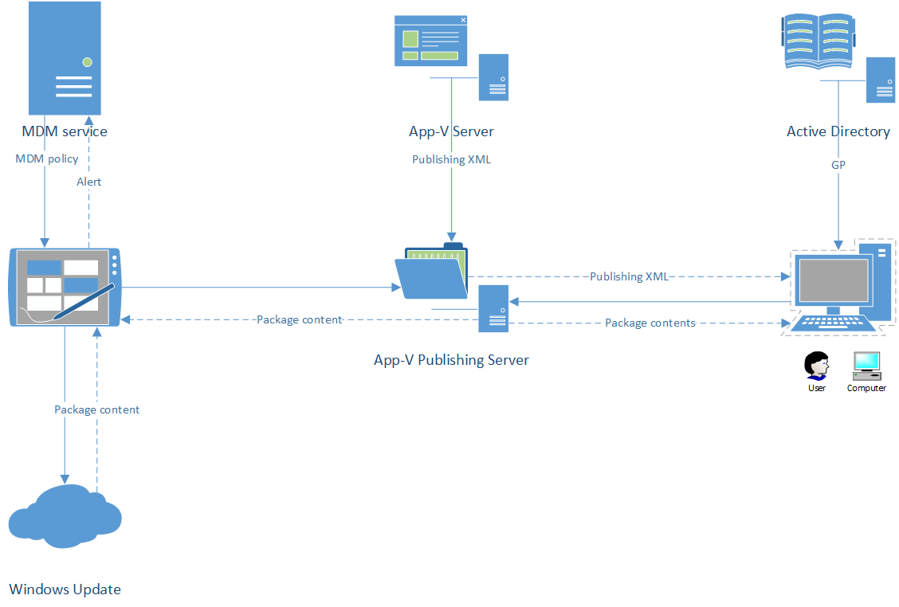

# App-V app deployment and configuration via MDM

## Executive Summary

<p>App-V Apps have typically been configured, deployed and managed through on-premise group policies via SCCM or App-V server.  In Windows 10 Creators Update App-V apps can be configured, deployed and managed through MDM matching their on-premise counterparts.</p>

## Architectural Overview

<p>MDM service will replace SCCM and App-V Server for cloud and hybrid based deployments.  All capabilities such as App-V enablement, configuration, and publishing can be completed using MDM.</p>

> [!WARNING]
> These are preliminary architecture diagrams and examples.  Actual schemas may vary upon release.



<p align="center"><b>Fig 1.</b> App-V deployment with Enterprise MDM Server</p>

### Node structure for the EnterpriseAppVManagement CSP

<p>(./User/Vendor/MSFT/EnterpriseAppVManagement) contains the following sub-nodes</p>

<p><b>AppVPackageManagement</b> - Primarily read-only App-V package inventory data for MDM servers to query current packages.</p>

- EnterpriseAppVManagement
  - **AppVPackageManagement**
    - [EnterpriseID]
	  - [PackageFamilyName]
	    - [PackageFullName]
		  - Name
		  - Version
		  - Publisher
		  - InstallLocation
		  - InstallDate
		  - Users
		  - AppVPackageID
		  - AppVVersionId
		  - AppVPackageUri
  - AppVPublishing
  - AppVDynamicPolicy

<p>App-V attributes added. Otherwise identical to the App management CSP on MDM</p>

<p><b>AppVPublishing</b> - An exec action node, which contains the AppV publishing configuration for a given MDM device (applied globally to all users for that device) or a specific MDM user.</p>

- EnterpriseAppVManagement
  - AppVPackageManagement
  - **AppVPublishing**
    - LastSync
	  - LastError
	  - LastErrorDescription
	  - SyncStatusDescription
	  - SyncProgress
	- Sync
	  - PublishXML
  - AppVDynamicPolicy

<p><b>AppVDynamicPolicy</b> - A read/write node, which contains the AppV dynamic configuration for a given MDM device (applied globally to all users for that device) or a specific MDM user.</p>

- EnterpriseAppVManagement
  - AppVPackageManagement
  - AppVPublishing
  - **AppVDynamicPolicy**
    - [ConfigurationId]
	  - Policy

<p><b>Dynamic Policy examples are documented here: </b><a href="https://technet.microsoft.com/en-us/itpro/windows/manage/appv-application-publishing-and-client-interaction#bkmk-dynamic-config">Dynamic configuration processing</a></p>

<p><b>Sync command</b> (<a href=" https://msdn.microsoft.com/enus/library/mt739986.aspx">App-V Sync protocol reference</a>): The examples in the scenarios section below demonstrate how the publishing document should be crafted to successfully publish packages, dynamic policies and connection groups.</p>

## Scenarios addressed in App-V MDM functionality

<p>All App-V group policies will be reflected by having a corresponding CSP that can be set via the PolicyManager CSP.  The CSPs match all on-premise App-V configuration capabilities.</p>

### SyncML Examples

<p>The following SyncML examples address specific App-V client scenarios.</p>

#### Enable App-V Client

<p>This is a basic operation to enable App-V on the device.</p>

``` syntax
<Replace>
	<CmdID>$CmdID$</CmdID>
	<Item>
		<Meta>
			<Format>chr</Format>
			<Type>text/plain</Type>
		</Meta>
		<Target>
			<LocURI>./Device/Vendor/MSFT/Policy/Config/AppVirtualization/AllowAppvClient</LocURI>
		</Target>
		<Data>&lt;enabled/&gt;</Data>
	</Item>
</Replace>
```

#### Configure App-V Client

<p>This is a basic operation to allow package scripts to run during package operations (publish, running, and unpublish).  Allowing package scripts will assist in package deployments (add, publishing of App-V apps).</p>

``` syntax
<Replace> 
	<CmdID>$CmdID$</CmdID> 
	<Item> 
		<Meta> 
			<Format>chr</Format> 
			<Type>text/plain</Type> 
		</Meta> 
		<Target> 
			<LocURI>./Device/Vendor/MSFT/Policy/Config/AppVirtualization/AllowPackageScripts</LocURI> 
		</Target> 
		<Data>&lt;enabled/&gt;</Data> 
	</Item> 
</Replace> 
```

<p>Complete list of App-V policies can be found here: <a href="https://msdn.microsoft.com/en-us/windows/hardware/commercialize/customize/mdm/policy-configuration-service-provider">Policy CSP</a></p>

#### SyncML with package published for a device (global to all users for that device)

<p>The following SyncML documents a basic example on publishing a package globally on an MDM enrolled device for all device users:</p>

``` syntax
<Replace>
	<CmdID>$CmdID$</CmdID>
	<Item>
		<Target>
			<LocURI>./Device/Vendor/MSFT/EnterpriseAppVManagement/AppVPublishing/Sync</LocURI>
		</Target>
		<Meta>
			<Format xmlns="syncml:metinf">node</Format>
		</Meta>
	</Item>
</Replace>
<Exec>
	<CmdID>$CmdID$</CmdID>
	<Item>
		<Target>
			<LocURI>./Device/Vendor/MSFT/EnterpriseAppVManagement/AppVPublishing/Sync/PublishXM L</LocURI>
		</Target>
		<Meta>
			<Format xmlns="syncml:metinf">xml</Format>
			<Type xmlns="syncml:metinf">text/plain</Type>
		</Meta>
		<Data>
			<Publishing Protocol="2.0">
				<Packages>
					<Package PackageUrl="http://appv51server/appvdir/ServerPackages/Win10X64/7ZipRS2/7ZipRS2_X64_Win10_3. appv" VersionId="fd6b51c7-959e-4d04-ac36-a8244a5693d0" PackageId="565d8479-394d-439c-824d0e09b7ee732c"/>
				</Packages>
				<NoGroup>
					<Package PackageId="565d8479-394d-439c-824d0e09b7ee732c"/>
				</NoGroup> 
			</Publishing>
		</Data>
	</Item>
</Exec> 
```

<p>*PackageUrl can be a UNC or HTTP/HTTPS endpoint.</p>

#### SyncML with package (with dynamic configuration policy) published for a device (global to all users on that device)

<p>The following SyncML documents a basic example on publishing a package globally with a policy which adds two shortcuts for the package, on an MDM enrolled device:</p>

``` syntax
<Replace>
	<CmdID>$CmdID$</CmdID>
	<Item>
		<Target>
			<LocURI>./Device/Vendor/MSFT/EnterpriseAppVManagement/AppVDynamicPolicy/38/Policy</ LocURI>
		</Target>
		<Meta>
			<Format xmlns="syncml:metinf">xml</Format>
			<Type xmlns="syncml:metinf">text/plain</Type>
		</Meta>
		<Data>
			<DeploymentConfiguration PackageId="57650ac1-1731-4b4c-899ca25548374dab" DisplayName="Skype_RS2Win10_X64" xmlns="http://schemas.microsoft.com/appv/2010/deploymentconfiguration">
				<MachineConfiguration></MachineConfiguration>
				<UserConfiguration>
					<Subsystems>
						<Shortcuts Enabled="true">
							<Extensions>
								<Extension Category="AppV.Shortcut">
									<Shortcut>
										<File>[{ThisPCDesktopFolder}]\Skype_FromMDM.lnk</File>
										<Target>[{ProgramFilesX86}]\Skype\Phone\Skype.exe</Target>
										<Icon>[{Windows}]\Installer\{FC965A47-4839-40CA-B61818F486F042C6}\SkypeIcon.exe.0.ico</Icon>
										<Arguments/>
										<WorkingDirectory>[{ProgramFilesX86}]\Skype\</WorkingDirectory> 
										<AppUserModelId>Skype.Desktop.Application</AppUserModelId>
										<Description>Launch Skype</Description>
										<ShowCommand>1</ShowCommand>
										<ApplicationId>[{ProgramFilesX86}]\Skype\Phone\Skype.exe</ApplicationId>
									</Shortcut>
								</Extension>
								<Extension Category="AppV.Shortcut">
									<Shortcut>
										<File>[{Common Desktop}]\Skype_FromMDMAlso.lnk</File>
										<Target>[{ProgramFilesX86}]\Skype\Phone\Skype.exe</Target>
										<Icon>[{Windows}]\Installer\{FC965A47-4839-40CA-B61818F486F042C6}\SkypeIcon.exe.0.ico</Icon>
										<Arguments/>
										<WorkingDirectory>[{ProgramFilesX86}]\Skype\</WorkingDirectory>
										<AppUserModelId>Skype.Desktop.Application</AppUserModelId>
										<Description>Launch Skype</Description>
										<ShowCommand>1</ShowCommand>
										<ApplicationId>[{ProgramFilesX86}]\Skype\Phone\Skype.exe</ApplicationId>
									</Shortcut>
								</Extension>
							</Extensions>
						</Shortcuts>
					</Subsystems>
				</UserConfiguration>
			</DeploymentConfiguration>
		</Data>
	</Item>
</Replace>
<Replace>
	<CmdID>$CmdID$</CmdID>
	<Item>
		<Target>
			<LocURI>./Device/Vendor/MSFT/EnterpriseAppVManagement/AppVPublishing/Sync</LocURI>
		</Target>
		<Meta>
			<Format xmlns="syncml:metinf">node</Format>
		</Meta>
	</Item>
</Replace>
<Exec>
	<CmdID>$CmdID$</CmdID>
	<Item>
		<Target>
			<LocURI>./Device/Vendor/MSFT/EnterpriseAppVManagement/AppVPublishing/Sync/PublishXM L</LocURI>
		</Target>
		<Meta>
			<Format xmlns="syncml:metinf">xml</Format>
			<Type xmlns="syncml:metinf">text/plain</Type>
		</Meta>
		<Data>
			<Publishing Protocol="2.0">
				<Packages>
					<Package PackageUrl="http://appv51server/appvdir/ServerPackages/Win10X64/Skype_RS2Win10_X64/Skype_RS 2Win10_X64_2.appv" VersionId="05fcf098-c949-4ea4-9aee-757abd33e0e4" PackageId="57650ac11731-4b4c-899c-a25548374dab">
						<DeploymentConfiguration ConfigurationId="38" Path="38" Timestamp="2012-08-27T16:14:30.87" /></Package>
				</Packages>
				<NoGroup>
					<Package PackageId="57650ac1-1731-4b4c-899ca25548374dab"/>
				</NoGroup>
			</Publishing>
		</Data>
	</Item>
</Exec>
```

<p>*PackageUrl can be a UNC or HTTP/HTTPS endpoint.</p>

#### SyncML with package (using user config deployment) published for a specific user

<p>The following SyncML documents publishing a package for a specific MDM user:</p>

``` syntax
<Replace>
	<CmdID>$CmdID$</CmdID>
	<Item>
		<Target>
			<LocURI>./User/Vendor/MSFT/EnterpriseAppVManagement/AppVPublishing/Sync</LocURI>
		</Target>
		<Meta>
			<Format xmlns="syncml:metinf">node</Format>
		</Meta>
	</Item>
</Replace>
<Exec>
	<CmdID>$CmdID$</CmdID>
	<Item>
		<Target>
			<LocURI>./User/Vendor/MSFT/EnterpriseAppVManagement/AppVPublishing/Sync/PublishXML< /LocURI>
		</Target>
		<Meta>
			<Format xmlns="syncml:metinf">xml</Format>
			<Type xmlns="syncml:metinf">text/plain</Type>
		</Meta>
		<Data>
			<Publishing Protocol="2.0">
				<Packages>
					<Package PackageUrl="http://appv51server/appvdir/ServerPackages/Win10X64/AdobeReaderRS2/AdbRdrDCRS2_ x64_Win10_6.appv" VersionId="c68b054c-ff5f-45a6-9b41-788f2194e3c1" PackageId="e9a51aaf-5d9a48df-96e2-3372a278bca4"></Package>
				</Packages>
				<NoGroup>
					<Package PackageId="e9a51aaf-5d9a-48df-96e23372a278bca4"/>
				</NoGroup>
			</Publishing>
		</Data>
	</Item>
</Exec> 
```	

#### SyncML for publishing mixed-mode connection group containing global and user-published packages

<p>The following SyncML documents how to publish a connection group and grouping applications and plugins together.</p>

> [!NOTE]
> The user connection group has the user only package as optional in this example, which implies users without the optional package can continue to launch the global package within the same connection group.

``` syntax
<Replace>
	<CmdID>$CmdID$</CmdID>
	<Item>
		<Target>
			<LocURI>./Device/Vendor/MSFT/EnterpriseAppVManagement/AppVPublishing/Sync</LocURI>
		</Target>
		<Meta>
			<Format xmlns="syncml:metinf">node</Format>
		</Meta>
	</Item>
</Replace>
<Exec>
	<CmdID>$CmdID$</CmdID>
	<Item>
		<Target>
			<LocURI>./Device/Vendor/MSFT/EnterpriseAppVManagement/AppVPublishing/Sync/PublishXM L</LocURI>
		</Target>
		<Meta>
			<Format xmlns="syncml:metinf">xml</Format>
			<Type xmlns="syncml:metinf">text/plain</Type>
		</Meta>
		<Data>
			<Publishing Protocol="2.0">
				<Packages>
					<Package PackageUrl="http://appv51server/appvdir/ServerPackages/Win10X64/Skype_RS2Win10_X64/Skype_RS 2Win10_X64_2.appv" VersionId="05fcf098-c949-4ea4-9aee-757abd33e0e4" PackageId="57650ac11731-4b4c-899c-a25548374dab"></Package>
				</Packages>
			</Publishing>
		</Data>
	</Item>
</Exec>
<Replace>
	<CmdID>$CmdID$</CmdID>
	<Item>
		<Target>
			<LocURI>./User/Vendor/MSFT/EnterpriseAppVManagement/AppVPublishing/Sync</LocURI>
		</Target>
		<Meta>
			<Format xmlns="syncml:metinf">node</Format>
		</Meta>
	</Item>
</Replace>
	<Exec>
	<CmdID>$CmdID$</CmdID>
	<Item>
		<Target>
			<LocURI>./User/Vendor/MSFT/EnterpriseAppVManagement/AppVPublishing/Sync/PublishXML< /LocURI>
		</Target>
		<Meta>
			<Format xmlns="syncml:metinf">xml</Format>
			<Type xmlns="syncml:metinf">text/plain</Type>
		</Meta>
		<Data>
			<Publishing Protocol="2.0">
				<Packages> 
					<Package PackageUrl="http://appv51server/appvdir/ServerPackages/Win10X64/AdobeReaderRS2/AdbRdrDCRS2_ x64_Win10_6.appv" VersionId="c68b054c-ff5f-45a6-9b41-788f2194e3c1" PackageId="e9a51aaf-5d9a48df-96e2-3372a278bca4"></Package>
					<Package PackageUrl="http://appv51server/appvdir/ServerPackages/Win10X64/7ZipRS2/7ZipRS2_X64_Win10_3. appv" VersionId="fd6b51c7-959e-4d04-ac36-a8244a5693d0" PackageId="565d8479-394d-439c-824d0e09b7ee732c"></Package>
				</Packages>
				<NoGroup>
					<Package PackageId="565d8479-394d-439c-824d0e09b7ee732c"/>
				</NoGroup>
				<Groups>
					<Group GroupId="98d5cebd-165f-403b-a426-7a1f6ae9c399" VersionId="AE76602B-5613-4BAD-9EE5-1728FA55B699" Priority="46" Name="Try7">
						<Package PackageId="57650ac1-1731-4b4c-899ca25548374dab" VersionId="05fcf098-c949-4ea4-9aee-757abd33e0e4" VersionOptional="false" PackageOptional="false"/>
						<Package PackageId="e9a51aaf-5d9a-48df-96e23372a278bca4" VersionOptional="true" PackageOptional="true"/>
					</Group>
				</Groups>
			</Publishing>
		</Data>
	</Item>
</Exec> 
```

#### Unpublish example SyncML for all global packages

<p>The following SyncML demonstrates unpublishing all global packages on the device, by sending an empty package and connection group list in the SyncML.</p>

``` syntax
<Replace>
	<CmdID>$CmdID$</CmdID>
	<Item>
		<Target>
			<LocURI>./Device/Vendor/MSFT/EnterpriseAppVManagement/AppVPublishing/Sync</LocURI>
		</Target>
		<Meta>
			<Format xmlns="syncml:metinf">node</Format>
		</Meta>
	</Item>
</Replace>
<Exec>
	<CmdID>$CmdID$</CmdID>
	<Item>
		<Target>
			<LocURI>./Device/Vendor/MSFT/EnterpriseAppVManagement/AppVPublishing/Sync/PublishXML</LocURI>
		</Target>
		<Meta>
			<Format xmlns="syncml:metinf">xml</Format>
			<Type xmlns="syncml:metinf">text/plain</Type>
		</Meta>
		<Data>
			<Publishing Protocol="2.0">
				<Packages></Packages>
				<NoGroup></NoGroup>
			</Publishing>
		</Data>
	</Item>
</Exec>
```

#### Query packages on a device

<p>The following two SyncML commands return all global, and user-published packages on the device.</p>

``` syntax
<Get>
	<CmdID>$CmdID$</CmdID>
	<Item>
		<Target>
			<LocURI>./Device/Vendor/MSFT/EnterpriseAppVManagement/AppVPackageManagement?list=StructData</LocURI>
		</Target>
	</Item>
</Get>
```

``` syntax
<Get>
	<CmdID>$CmdID$</CmdID>
	<Item>
		<Target>
			<LocURI>./User/Vendor/MSFT/EnterpriseAppVManagement/AppVPackageManagement?list=StructData</LocURI>
		</Target>
	</Item>
</Get> 
```