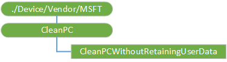

# CleanPC CSP

> [!WARNING]
> Some information relates to prereleased product, which may be substantially modified before it's commercially released. Microsoft makes no warranties, express or implied, with respect to the information provided here.

The CleanPC configuration service provider (CSP) allows removal of user-installed and pre-installed applications, with the option to persist user data. This CSP was added in Windows 10, version 1703.

The following diagram shows the CleanPC configuration service provider in tree format.

**CleanPC**  

Root node for the CleanPC configuration service provider.

**CleanPCWithoutRetainingUserData**  

A CleanPC operation without any retention of user data. ResetPrepareSession needs to be called with the Reset option.  

Data type is string.

Supported operations are Get and Execute.

