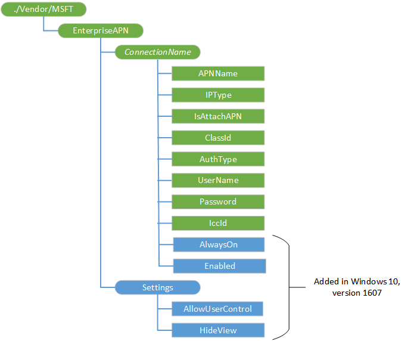

# EnterpriseAPN CSP

The EnterpriseAPN configuration service provider (CSP) is used by the enterprise to provision an APN for the Internet.

> **Note** The EnterpriseAPN configuration service provider (CSP) is not supported in Windows 10 for desktop editions (Home, Pro, Enterprise, and Education), versions 1511 and 1607.

The following image shows the EnterpriseAPN configuration service provider in tree format.

**EnterpriseAPN**  
The root node for the EnterpriseAPN configuration service provider.

**EnterpriseAPN/*ConnectionName***  
Name of the connection as seen by Windows Connection Manager.

Supported operations are Add, Get, Delete, and Replace.

**EnterpriseAPN/*ConnectionName*/APNName**  
Enterprise APN name.

Supported operations are Add, Get, Delete, and Replace.

**EnterpriseAPN/*ConnectionName*/IPType**  
This value can be one of the following:

-   IPv4 - only IPV4 connection type
-   IPv6 - only IPv6 connection type
-   IPv4v6 (default)- IPv4 and IPv6 concurrently.
-   IPv4v6xlat - IPv6 with IPv4 provided by 46xlat

Supported operations are Add, Get, Delete, and Replace.

**EnterpriseAPN/*ConnectionName*/IsAttachAPN**  
Boolean value that indicates whether this APN should be requested as part of an LTE Attach. Default value is false.

Supported operations are Add, Get, Delete, and Replace.

**EnterpriseAPN/*ConnectionName*/ClassId**  
GUID that defines the APN class to the modem. This is the same as the OEMConnectionId in CM\_CellularEntries CSP. Normally this setting is not present. It is only required when IsAttachAPN is true and the attach APN is not only used as the Internet APN.

Supported operations are Add, Get, Delete, and Replace.

**EnterpriseAPN/*ConnectionName*/AuthType**  
Authentication type. This value can be one of the following:

-   None (default)
-   Auto
-   PAP
-   CHAP
-   MSCHAPv2

Supported operations are Add, Get, Delete, and Replace.

**EnterpriseAPN/*ConnectionName*/UserName**  
User name for use with PAP, CHAP, or MSCHAPv2 authentication.

Supported operations are Add, Get, Delete, and Replace.

**EnterpriseAPN/*ConnectionName*/Password**  
Password corresponding to the username.

Supported operations are Add, Get, Delete, and Replace.

**EnterpriseAPN/*ConnectionName*/IccId**  
Integrated Circuit Card ID (ICCID) associated with the cellular connection profile. If this node is not present, the connection is created on a single-slot device using the ICCID of the UICC and on a dual-slot device using the ICCID of the UICC that is active for data.

Supported operations are Add, Get, Delete, and Replace.

**EnterpriseAPN/*ConnectionName*/AlwaysOn**  
Added in Windows 10, version 1607. Boolean value that specifies whether the CM will automatically attempt to connect to the APN when a connection is available.

The default value is true.

Supported operations are Add, Get, Delete, and Replace.

**EnterpriseAPN/*ConnectionName*/Enabled**  
Added in Windows 10, version 1607. Boolean that specifies whether the connection is enabled.

The default value is true.

Supported operations are Add, Get, Delete, and Replace.

**EnterpriseAPN/Settings**  
Added in Windows 10, version 1607. Node that contains global settings.

**EnterpriseAPN/Settings/AllowUserControl**  
Added in Windows 10, version 1607. Boolean value that specifies whether the cellular UX will allow users to connect with other APNs other than the Enterprise APN.

The default value is false.

Supported operations are Get and Replace.

**EnterpriseAPN/Settings/HideView**  
Added in Windows 10, version 1607. Boolean that specifies whether the cellular UX will allow the user to view enterprise APNs. Only applicable if AllowUserControl is true.

The default value is false.

Supported operations are Get and Replace.

## Related topics

[Configuration service provider reference](configuration-service-provider-reference.md)

 

 

