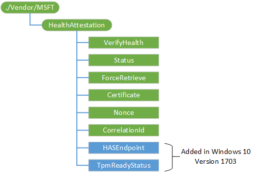

# HealthAttestation CSP


The HealthAttestation configuration service provider enables enterprise IT managers to assess the health of managed devices and take enterprise policy actions.

The following is a list of functions performed by the HealthAttestation CSP:

-   Collects data that is used in verifying a devices health states
-   Forwards the data to the Device HealthAttestation Service
-   Provisions the Health Attestation Certificate that it receives from the service
-   Upon request, forwards the Health Attestation Certificate (received from the service) and related runtime information to the MDM Server for verification

## Terms

**TPM (Trusted Platform Module)**
<p style="margin-left: 20px">TPM is a specialized hardware-protected logic that performs a series of security-related operations, including providing hardware-protected storage, and  hardware-protected crypto operation, including signing an encryption. </p>

**DHA (Device HealthAttestation) feature**
<p style="margin-left: 20px">The Device HealthAttestation (DHA) feature enables enterprise IT administrators to monitor the security posture of managed devices remotely by using hardware (TPM) protected and attested data via a tamper-resistant and tamper-evident communication channel.</p>

**DHA-Enabled device (Device HealthAttestation enabled device)**
<p style="margin-left: 20px">A Device HealthAttestation enabled (DHA-Enabled) device is a computing device (phone, desktop, laptop, tablet, server) that runs Windows 10 and supports TPM version 1.2 or 2.0.</p>

**DHA-Session (Device HealthAttestation session)**
<p style="margin-left: 20px">The Device HealthAttestation session (DHA-Session) describes the end-to-end communication flow that is performed in one device health attestation session.</p>

   

<p style="margin-left: 20px">The following list of transactions are performed in one DHA-Session:</p>
<ul>
<li>DHA-CSP and DHA-Service communication flow</li>
<li>DHA-CSP forwards device boot data (DHA-BootData) to DHA-Service</li>
<li>DHA-Service replies with an encrypted data blob (DHA-EncBlob)</li>
<li>DHA-CSP and MDM-Server communication flow </li>
<li>MDM-Server sends a device health verification request to DHA-CSP</li>
<li>DHA-CSP replies with a payload called DHA-Data that includes an encrypted (DHA-EncBlob) and a signed (DHA-SignedBlob) data blob </li>
<li>MDM-Server and DHA-Service communication flow</li>
<li>MDM-Server posts data it receives from devices to DHA-Service</li>
<li>DHA-Service reviews the data it receives, and replies with a device health report (DHA-Report)</li>
</ul>

**DHA session data (Device HealthAttestation session data)**
<p style="margin-left: 20px">The following list of data is produced or consumed in one DHA-Transaction:</p>
<ul>
<li>DHA-BootData: the device boot data (TCG logs, PCR values, device/TPM certificate, boot and TPM counters) that are required for validating device boot health.</li>
<li>DHA-EncBlob: an encrypted summary report that DHA-Service issues to a device after reviewing the DHA-BootData it receives from devices</li>
<li>DHA-SignedBlob: it is a signed snapshot of the current state of a device’s runtime that is captured by DHA-CSP at device health attestation time</li>
<li>DHA-Data: an XML formatted data blob that devices forward for device health validation to DHA-Service via MDM-Server. DHA-Data has 2 parts:
<ul> 
<li>DHA-EncBlob: the bob that the device receives from DHA-Services</li>
<li>DHA-SignedBlob: a current snapshot of the current security state of the device that is generated by DHA-CSP</li>
</ul>
</li>
<li>DHA-Report: the reports that are issued by DHA-Service to MDM-Server</li>
<li>Nonce: a crypto protected number that is generated by MDM-Server, which protects the DHA-Session from man-in-the-middle type attacks </li>
</ul>

**DHA-Enabled MDM (Device HealthAttestation enabled device management solution)**
<p style="margin-left: 20px">Device HealthAttestation enabled (DHA-Enabled) device management solution is a device management tool that is integrated with the DHA feature.</p>
<p style="margin-left: 20px">DHA-Enabled device management solutions enable enterprise IT managers to raise the security protection bar for their managed devices based on hardware (TPM) protected data that can be trusted even if a device is exploited by advance security threats - running a malicious (jailbroken) operating system.</p>
<p style="margin-left: 20px">The following list of operations are performed by DHA-Enabled-MDM:</p>
<ul>
<li>Enables the DHA feature on a DHA-Enabled device</li>
<li>Issues device health attestation requests to enrolled/managed devices</li>
<li>Collects device health attestation data (DHA-Data), and sends it to Device Health Attestation Service (DHA-Service) for verification</li>
<li>Gets the device health report (DHA-Report) from DHA-Service, which triggers compliance action</li>
</ul>

**DHA-CSP (Device HealthAttestation Configuration Service Provider)**
<p style="margin-left: 20px">The Device HealthAttestation Configuration Service Provider (DHA-CSP) uses a device’s TPM and firmware to measure critical security properties of the device’s BIOS and Windows boot, such that even on a system infected with kernel level malware or a rootkit, these properties cannot be spoofed.</p>
<p style="margin-left: 20px">The following list of operations are performed by DHA-CSP:</p>
<ul>
<li>Collects device boot data (DHA-BootData) from a managed device</li>
<li>Forwards DHA-BootData to Device Health Attestation Service (DHA-Service)</li>
<li>Receives an encrypted blob (DHA-EncBlob) from DHA-Service, and stores it in a local cache on the device</li>
<li>Receives attestation requests (DHA-Requests) from a DHA-Enabled MDM, and replies with Device Health Attestation data (DHA-Data)</li>
</ul>

**DHA-Service (Device HealthAttestation Service)**
<p style="margin-left: 20px">Device HealthAttestation Service (DHA-Service) validates the data it receives from DHA-CSP and issues a highly trusted hardware (TPM) protected report (DHA-Report) to DHA-Enabled device management solutions through a tamper resistant and tamper evident communication channel.</p>


<p style="margin-left: 20px">DHA-Service is available in 2 flavors: “DHA-Cloud” and “DHA-Server2016”. DHA-Service supports a variety of implementation scenarios including cloud, on premises, air-gapped, and hybrid scenarios.</p>
<p style="margin-left: 20px">The following list of operations are performed by DHA-Service:</p>
<ul>
<li>Receives device boot data (DHA-BootData) from a DHA-Enabled device</li>
<li>Forwards DHA-BootData to Device Health Attestation Service (DHA-Service) </li>
<li>Receives an encrypted blob (DHA-EncBlob) from DHA-Service, and stores it in a local cache on the device</li>
<li>Receives attestation requests (DHA-Requests) from a DHA-Enabled-MDM, and replies with a device health report (DHA-Report)</li>
</ul>


## HealthAttestation CSP diagram and node descriptions

The following diagram shows the HealthAttestation configuration service provider in tree format.  



<a href="" id="--vendor-msft"></a>**./Vendor/MSFT**  
<p style="margin-left: 20px">The root node for the HealthAttestation configuration service provider.</p>

<a href="" id="verifyhealth"></a>**VerifyHealth** (Required)  
<p style="margin-left: 20px">Notifies the device to prepare a health certificate verification request.</p>

<p style="margin-left: 20px">The supported operation is Execute.</p>

<a href="" id="status"></a>**Status** (Required)  
<p style="margin-left: 20px">Provides the current status of the health request.</p>

<p style="margin-left: 20px">Value type is integer, range is 0-3. The supported operation is Get.</p>

<p style="margin-left: 20px">The following list shows the supported values:</p>

-   0 - (HEALTHATTESTATION\_CERT\_RETRI_UNINITIALIZED): DHA-CSP is preparing a request to get a new DHA-EncBlob from DHA-Service
-   1 - (HEALTHATTESTATION\_CERT\_RETRI_REQUESTED): DHA-CSP is waiting for the DHA-Service to respond back, and issue a DHA-EncBlob to the device
-   2 - (HEALTHATTESTATION\_CERT\_RETRIEVAL_FAILED): A valid health certificate could not be retrieved from the server for reasons other than discussed in the below error codes
-   3 - (HEALTHATTESTATION\_CERT\_RETRI_COMPLETE): DHA-Data Health data is ready for pick up

<a href="" id="forceretrieve"></a>**ForceRetrieve** (Optional)  
<p style="margin-left: 20px">Instructs the client to initiate a new request to DHA-Service, and get a new DHA-EncBlob (a summary of the boot state that is issued by DHA-Service). This option should be used if the MDM server enforces a certificate freshness policy, which needs to force a device to get a fresh encrypted blob from DHA-Service.</p>

<p style="margin-left: 20px">Boolean value. The supported operation is Replace.</p>

<a href="" id="certificate"></a>**Certificate** (Required)  
<p style="margin-left: 20px">Instructs the Health CSP to forward DHA-Data to the MDM server.</p>

<p style="margin-left: 20px">Value type is b64.The supported operation is Get.</p>

<a href="" id="nonce"></a>**Nonce** (Required)  
<p style="margin-left: 20px">enables MDMs to protect the health attestation communications from man-in-the-middle type (MITM) attacks with a cryptographic nonce that is generated by the MDM Server.</p>

<p style="margin-left: 20px">The nonce is in hex format, with a minimum size of 8 bytes, and a maximum size of 32 bytes.</p>

<p style="margin-left: 20px">The supported operations are Get and Replace.</p>

<a href="" id="correlationid"></a>**CorrelationId** (Required)  
<p style="margin-left: 20px">Identifies a unique attestation session. CorrelationId is used to correlate DHA-Service logs with the MDM server events and Client event logs for debug and troubleshooting.</p>

<p style="margin-left: 20px">Value type is integer, the minimum value is - 2,147,483,648 and the maximun value is 2,147,483,647. The supported operation is Get.</p>

<a href="" id="hasendpoint"></a>**HASEndpoint** (Optional)
<p style="margin-left: 20px">Identifies the fully qualified domain name (FDQN) of the DHA-Service that is assigned to perform attestation. If an FDQN is not assigned, DHA-Cloud (Microsoft owned and operated cloud service) will be used as the default attestation service.</p>

<p style="margin-left: 20px">Value type is string. The supported operations are Get and Replace. The default value is has.spserv.microsoft.com.</p>

<a href="tpmreadystatus" id=""></a>**TpmReadyStatus** (Required)
<p style="margin-left: 20px">Returns a bitmask of information describing the state of TPM.</p>
<p style="margin-left: 20px">Value type is integer. The supported operation is Get.</p>

## **DHA-CSP integration steps**


The following list of validation and development tasks are required for integrating the Microsoft Device Health Attestation feature with a Windows Mobile device management solution (MDM):


1.  [Verify HTTPS access](#verify-access)
2.  [Instruct client to prepare DHA-data for verification](#prepare-health-data)
3.  [Take action based on the clients response](#take-action-client-response)
4.  [Instruct the client to forward DHA-data for verification](#forward-health-attestation)
5.  [Post DHA-data to DHA-service](#foward-data-to-has)
6.  [Receive response DHA-service](#receive-has-response)
7.  [Take appropriate policy action based on evaluation results](#take-policy-action)

Each step is described in detail in the following sections of this topic.

## <a href="" id="verify-access"></a>**Step 1: Verify HTTPS access**


Validate that both the MDM server and the device (MDM client) can access has.spserv.microsoft.com using the TCP protocol over port 443 (HTTPS).

You can use OpenSSL to validate access to DHA-Service. Here is a sample OpenSSL command and the response that was generated by DHA-Service:

``` syntax
PS C:\openssl> ./openssl.exe s_client -connect has.spserv.microsoft.com:443
CONNECTED(000001A8)
---
Certificate chain
 0 s:/CN=*.spserv.microsoft.com
   i:/C=US/ST=Washington/L=Redmond/O=Microsoft Corporation/OU=Microsoft IT/CN=Microsoft IT SSL SHA2
 1 s:/C=US/ST=Washington/L=Redmond/O=Microsoft Corporation/OU=Microsoft IT/CN=Microsoft IT SSL SHA2
   i:/C=IE/O=Baltimore/OU=CyberTrust/CN=Baltimore CyberTrust Root
---
Server certificate
-----BEGIN CERTIFICATE-----
MIIGOTCCBCGgAwIBAgITWgAA1KJb40tpukQoewABAADUojANBgkqhkiG9w0BAQsFA4ICAQCJaKewFQuqQwR5fkAr9kZOmtq5fk03p82eHWLaftXlc4RDvVFp4a2ciSjZL8f3f+XWPVdUj9DAi3bCSddlrcNOPRXNepFC1OEmKtE9jM0r7M8qnqFkIfbNrVNUtPxHoraQeMIgbk0SHEOlShY2GXETVBqZdDZ5Rmk4rA+3ggoeV8hNzm2dfNp0iGSrZzawbLzWU1D2Tped1k5IV63yb+cU/TmM ……………………………………………………………………………………………………………………………………
………………………………………………………………………………………………………………………………………………………………………………………………………………………………
……………2RXXwogn1UM8TZduCEjz+b05mAkvytugzzaI4wXkCP4OgNyy8gul2z5Gj/51pCTN
-----END CERTIFICATE-----
subject=/CN=*.spserv.microsoft.com
issuer=/C=US/ST=Washington/L=Redmond/O=Microsoft Corporation/OU=Microsoft IT/CN=Microsoft IT SSL SHA2
---
No client certificate CA names sent
Peer signing digest: SHA1
Server Temp Key: ECDH, P-384, 384 bits
---
SSL handshake has read 3681 bytes and written 561 bytes
New, TLSv1/SSLv3, Cipher is ECDHE-RSA-AES256-SHA384
Server public key is 2048 bit
Secure Renegotiation IS supported
Compression: NONE
Expansion: NONE
No ALPN negotiated
SSL-Session:
    Protocol: TLSv1.2
    Cipher: ECDHE-RSA-AES256-SHA384
    Session-ID: B22300009621370F84A4A3A7D9FC40D584E047C090604E5226083A02ED239C93
    Session-ID-ctx: 
    Master-Key: 9E3F6BE5B3D3B55C070470CA2B62EF59CC1D5ED9187EF5B3D1BBF4C101EE90BEB04F34FFD748A13C92A387104B8D1DE7
    Key-Arg: None
    PSK identity: None
    PSK identity hint: None
    SRP username: None
    Start Time: 1432078420
    Timeout: 300 (sec)
    Verify return code: 20 (unable to get local issuer certificate)
```

## <a href="" id="prepare-health-data"></a>**Step 2: Instruct client to prepare health data for verification**


After access is verified, issue a SyncML call to start collection of the DHA-Data.

The following example shows a sample call that triggers collection and verification of health attestation data from a managed device.

``` syntax
<?xml version="1.0" encoding="UTF-8"?>
<SyncML xmlns="SYNCML:SYNCML1.2">
   <SyncHdr>
      <VerDTD>1.2</VerDTD>
      <VerProto>DM/1.2</VerProto>
      <SessionID>22</SessionID>
      <MsgID>1</MsgID>
      <Target>
         <LocURI>urn:uuid:05869F53-9265-5404-95DD-3BE6F34873A3</LocURI>
      </Target>
      <Source>
         <LocURI>https://manage.contoso.com/DeviceGateway/WindowsPhone10.ashx</LocURI>
      </Source>
   </SyncHdr>
   <SyncBody>
      <Status>
         <CmdID>1</CmdID>
         <MsgRef>1</MsgRef>
         <CmdRef>0</CmdRef>
         <Cmd>SyncHdr</Cmd>
         <Data>212</Data>
      </Status>
      <Replace>
         <CmdID>3</CmdID>
         <Item>
            <Target>
               <LocURI>./Vendor/MSFT/HealthAttestation/Nonce</LocURI>
            </Target>
            <Data>4D534E4F4E434532</Data>
         </Item>
      </Replace>
      <Exec>
         <CmdID>4</CmdID>
         <Item>
            <Target>
               <LocURI>./Vendor/MSFT/HealthAttestation/VerifyHealth</LocURI>
            </Target>
         </Item>
      </Exec>
      <Get>
         <CmdID>5</CmdID>
         <Item>
            <Target>
               <LocURI>./Vendor/MSFT/HealthAttestation/Status</LocURI>
            </Target>
         </Item>
      </Get>
      <Final />
   </SyncBody>
</SyncML>
```

## <a href="" id="take-action-client-response"></a>**Step 3: Take action based on the clients response**


After the client receives the health attestation request, it will send a response. The following list describes the responses, along with a recommended action to take.

-   If the response to any of the nodes that are called is "Failed", take appropriate corrective action, and then resubmit the request.
-   If the response is HEALTHATTESTATION\_CERT_RETRI_REQUESTED (1) or HEALTHATTESTATION\_CERT_RETRI_UNINITIALIZED (0) wait for an alert.
-   If the response is HEALTHATTESTATION\_CERT_RETRI_COMPLETE (3) then proceed to the next section.

Here is a sample alert that is issued by DHA_CSP:

``` syntax
<SyncML xmlns="SYNCML:SYNCML1.2">
    <SyncHdr>
        <VerDTD>1.2</VerDTD>
        <VerProto>DM/1.2</VerProto>
        <SessionID>23</SessionID>
        <MsgID>1</MsgID>
        <Target>
            <LocURI>https://manage.contoso.com/DeviceGateway/WindowsPhone10.ashx</LocURI>
        </Target>
        <Source>
            <LocURI>urn:uuid:05869F53-9265-5404-95DD-3BE6F34873A3</LocURI>
            <LocName>dummy</LocName>
        </Source>
        <Cred>
            <Meta>
                <Format xmlns="syncml:metinf">b64</Format>
                <Type xmlns="syncml:metinf">syncml:auth-md5</Type>
            </Meta>
            <Data>EVEkoFZcVgPM+ESnu9IC0g==</Data>
        </Cred>
    </SyncHdr>
    <SyncBody>
        <Alert>
            <CmdID>2</CmdID>
            <Data>1201</Data>
        </Alert>
        <Alert>
            <CmdID>3</CmdID>
            <Data>1224</Data>
            <Item>
                <Meta>
                    <Type xmlns="syncml:metinf">com.microsoft/MDM/LoginStatus</Type>
                </Meta>
                <Data>user</Data>
            </Item>
        </Alert>
        <Alert>
            <CmdID>4</CmdID>
            <Data>1226</Data>
            <Item>
                <Source>
                    <LocURI>./Vendor/MSFT/HealthAttestation/VerifyHealth</LocURI>
                </Source>
                <Meta>
                    <Type xmlns="syncml:metinf">com.microsoft.mdm:HealthAttestation.Result</Type>
                    <Format xmlns="syncml:metinf">int</Format>
                </Meta>
                <Data>3</Data>
            </Item>
        </Alert>
        <Replace>
            <CmdID>5</CmdID>
            <Item>
                <Source>
                    <LocURI>./DevInfo/DevId</LocURI>
                </Source>
                <Data>urn:uuid:05869F53-9265-5404-95DD-3BE6F34873A3</Data>
            </Item>
            <Item>
                <Source>
                    <LocURI>./DevInfo/Man</LocURI>
                </Source>
                <Data>NOKIA</Data>
            </Item>
            <Item>
                <Source>
                    <LocURI>./DevInfo/Mod</LocURI>
                </Source>
                <Data>id313</Data>
            </Item>
            <Item>
                <Source>
                    <LocURI>./DevInfo/DmV</LocURI>
                </Source>
                <Data>1.3</Data>
            </Item>
            <Item>
                <Source>
                    <LocURI>./DevInfo/Lang</LocURI>
                </Source>
                <Data>en-US</Data>
            </Item>
        </Replace>
        <Final/>
    </SyncBody>
</SyncML>
```

## <a href="" id="forward-health-attestation"></a>**Step 4: Instruct the client to forward health attestation data for verification**


Create a call to the **Certificate** and **CorrelationId** nodes, and pick up an encrypted payload that includes a health certificate and related data from the device.

Here is an example:

``` syntax
<?xml version="1.0" encoding="utf-8"?>
<SyncML xmlns="SYNCML:SYNCML1.2">
    <SyncHdr>
        <VerDTD>1.2</VerDTD>
        <VerProto>DM/1.2</VerProto>
        <SessionID>23</SessionID>
        <MsgID>1</MsgID>
        <Target>
            <LocURI>urn:uuid:05869F53-9265-5404-95DD-3BE6F34873A3</LocURI>
        </Target>
        <Source>
            <LocURI>https://manage.contoso.com/DeviceGateway/WindowsPhone10.ashx</LocURI>
        </Source>
    </SyncHdr>
    <SyncBody>
        <Status>
            <CmdID>1</CmdID>
            <MsgRef>1</MsgRef>
            <CmdRef>0</CmdRef>
            <Cmd>SyncHdr</Cmd>
            <Data>212</Data>
        </Status>
        <Get>
            <CmdID>2</CmdID>
            <Item>
                <Target>
                    <LocURI>./Vendor/MSFT/HealthAttestation/Certificate</LocURI>
                </Target>
            </Item>
        </Get>
	 <Get>
            <CmdID>3</CmdID>
            <Item>
                <Target>
                    <LocURI>./Vendor/MSFT/HealthAttestation/CorrelationId </LocURI>
                </Target>
            </Item>
          </Get>
        <Final />
    </SyncBody>
</SyncML>
```

## <a href="" id="foward-data-to-has"></a>**Step 5: Forward health attestation data to DHA-service**


In response to the request that was sent in the previous step, the MDM client forwards an XML formatted blob (response from ./Vendor/MSFT/HealthAttestation/Certificate node) and a call identifier called CorrelationId (response  to ./Vendor/MSFT/HealthAttestation/CorrelationId node).

When the MDM-Server receives the above data, it must: 
- Log the CallIdentifier it receives from the device (for future troubleshooting/reference), correlated to the call.
- Decode the XML formatted data blob it receives from the device
- Append the nonce that was generated by MDM service (add the nonce that was forwarded to the device) to the XML structure that was forwarded by the device in following format:

   ``` syntax
   <?xml version='1.0' encoding='utf-8' ?>
   <HealthCertificateValidationRequest ProtocolVersion='1' xmlns='http://schemas.microsoft.com/windows/security/healthcertificate/validation/request/v1'>
       <Nonce>[INT]</Nonce>
       <Claims> [base64 blob, eg ‘ABc123+/…==’] </Claims>
       <HealthCertificateBlob> [base64 blob, eg ‘ABc123+/...==’]
       </HealthCertificateBlob>
   </HealthCertificateValidationRequest>
   ```
- Forward (HTTP Post) the XML data struct (including the nonce that was appended in the previous step) to the DHA-Cloud https://has.spserv.microsoft.com/HealthAttestation/ValidateHealthCertificate/v3 or The assigned DHA-Service https://FAQN/HealthAttestation/ValidateHealthCertificate/v3.

## <a href="" id="receive-has-response"></a>**Step 6: Receive response from the DHA-service**

When the Microsoft Device Health Attestation Service receives a request for verification, it performs the following steps:
- Decrypts the encrypted data it receives.
- Validates the data it has received 
- Creates a report, and shares the evaluation results to the MDM server via SSL in XML format 

## <a href="" id="take-policy-action"></a>**Step 7: Take appropriate policy action based on evaluation results**


After the MDM server receives the verified data, the information can be used to make policy decisions by evaluating the data. Some possible actions would be:

-   Allow the device access.
-   Allow the device to access the resources, but flag the device for further investigation.
-   Prevent a device from accessing resources.

The following list of data points are verified by the DHA-Service in DHA-Report version 3:

- Issued 
- AIKPresent
- ResetCount
- RestartCount
- DEPPolicy
- BitlockerStatus
- BootManagerRevListVersion
- CodeIntegrityRevListVersion
- SecureBootEnabled
- BootDebuggingEnabled
- OSKernelDebuggingEnabled
- CodeIntegrityEnabled
- TestSigningEnabled
- SafeMode
- WinPE 
- ELAMDriverLoaded
- VSMEnabled
- PCRHashAlgorithmID
- BootAppSVN
- BootManagerSVN
- TpmVersion
- PCR0
- SBCPHash
- CIPolicy
- BootRevListInfo
- OSRevListInfo

Each of these are described in further detail in the following sections, along with the recommended actions to take.

<a href="" id="aikpresent"></a>**AIKPresent**  
When an Attestation Identity Key (AIK) is present on a device, it indicates that the device has an endorsement key (EK) certificate. It can be trusted more than a device that doesn’t have an EK certificate.

If AIKPresent = True (1), then allow access.

If AIKPresent = False (0), then take one of the following actions that align with your enterprise policies:

-   Disallow all access
-   Disallow access to HBI assets
-   Allow conditional access based on other data points that are present at evaluation time. For example, other attributes on the health certificate, or a devices past activities and trust history.
-   Take one of the previous actions and additionally place the device in a watch list to monitor the device more closely for potential risks.

<a href="" id="deppolicy"></a>**DEPPolicy**  
A device can be trusted more if the DEP Policy is enabled on the device.

Data Execution Prevention (DEP) Policy defines is a set of hardware and software technologies that perform additional checks on memory to help prevent malicious code from running on a system. Secure boot allows a limited list on x86/amd64 and on ARM NTOS locks it to on.

DEPPolicy can be disabled or enabled by using the following commands in WMI or a PowerShell script:

-   To disable DEP, type **bcdedit.exe /set {current} nx AlwaysOff**
-   To enable DEP, type **bcdedit.exe /set {current} nx AlwaysOn**

If DEPPolicy = 1 (On), then allow access.

If DEPPolicy = 0 (Off), then take one of the following actions that align with your enterprise policies:

-   Disallow all access
-   Disallow access to HBI assets
-   Allow conditional access based on other data points that are present at evaluation time. For example, other attributes on the health certificate, or a devices past activities and trust history.
-   Take one of the previous actions and additionally place the device in a watch list to monitor the device more closely for potential risks.

<a href="" id="bitlockerstatus"></a>**BitlockerStatus**  
When Bitlocker is on, the device is able to protect data that is stored on the drive from unauthorized access, when the system is turned off or goes to hibernation.

Windows BitLocker Drive Encryption, encrypts all data stored on the Windows operating system volume. BitLocker uses the TPM to help protect the Windows operating system and user data and helps to ensure that a computer is not tampered with, even if it is left unattended, lost, or stolen.

If the computer is equipped with a compatible TPM, BitLocker uses the TPM to lock the encryption keys that protect the data. As a result, the keys cannot be accessed until the TPM has verified the state of the computer.

If BitLockerStatus = 1 (On), then allow access.

If BitLockerStatus = 0 (Off), then take one of the following actions that align with your enterprise policies:

-   Disallow all access
-   Disallow access to HBI assets
-   Allow conditional access based on other data points that are present at evaluation time. For example, other attributes on the health certificate, or a devices past activities and trust history.
-   Take one of the previous actions and additionally place the device in a watch list to monitor the device more closely for potential risks.

<a href="" id="securebootenabled"></a>**SecureBootEnabled**  
When Secure Boot is enabled, the system is forced to boot to a factory trusted state. Also, when Secure Boot is enabled, the core components used to boot the machine must have correct cryptographic signatures that are trusted by the organization that manufactured the device. The UEFI firmware verifies this before it lets the machine start. If any files have been tampered with, breaking their signature, the system will not boot.

If SecureBootEnabled = 1 (True), then allow access.

If SecurebootEnabled = 0 (False), then take one of the following actions that align with your enterprise policies:

-   Disallow all access
-   Disallow access to HBI assets
-   Allow conditional access based on other data points that are present at evaluation time. For example, other attributes on the health certificate, or a devices past activities and trust history.
-   Take one of the previous actions and additionally place the device in a watch list to monitor the device more closely for potential risks.

<a href="" id="codeintegrityenabled"></a>**CodeIntegrityEnabled**  
When code integrity is enabled, code execution is restricted to integrity verified code.

Code integrity is a feature that validates the integrity of a driver or system file each time it is loaded into memory. Code integrity detects whether an unsigned driver or system file is being loaded into the kernel, or whether a system file has been modified by malicious software that is being run by a user account with administrator privileges.

On x64-based versions of the operating system, kernel-mode drivers must be digitally signed.

If CodeIntegrityEnabled = 1 (True), then allow access.

If CodeIntegrityEnabled = 0 (False), then take one of the following actions that align with your enterprise policies:

-   Disallow all access
-   Disallow access to HBI assets
-   Allow conditional access based on other data points that are present at evaluation time. For example, other attributes on the health certificate, or a devices past activities and trust history.
-   Take one of the previous actions and additionally place the device in a watch list to monitor the device more closely for potential risks.

<a href="" id="safemode"></a>**SafeMode**  
Safe mode is a troubleshooting option for Windows that starts your computer in a limited state. Only the basic files and drivers necessary to run Windows are started.

If SafeMode = 0 (False), then allow access.

If SafeMode = 1 (True), then take one of the following actions that align with your enterprise policies:

-   Disallow all access
-   Disallow access to HBI assets
-   Trigger a corrective action, such as informing the technical support team to contact the owner investigate the issue.

<a href="" id="winpe"></a>**WinPE**  
Windows pre-installation Environment (Windows PE) is a minimal operating system with limited services that is used to prepare a computer for Windows installation, to copy disk images from a network file server, and to initiate Windows Setup.

If WinPE = 0 (False), then allow access.

If WinPE = 1 (True), then limit access to remote resources that are required for Windows OS installation.

<a href="" id="elamdriverloaded"></a>**ELAMDriverLoaded**  
Early launch anti-malware (ELAM) provides protection for the computers in your network when they start up and before third-party drivers initialize.

In the current release, this attribute only monitors/reports if a Microsoft 1st party ELAM  (Windows Defender) was loaded during initial boot.

If a device is expected to use a 3rd party antivirus program, ignore the reported state.

If a device is expected to use Windows Defender and ELAMDriverLoaded = 1 (True), then allow access.

If a device is expected to use Windows Defender and ELAMDriverLoaded = 0 (False), then take one of the following actions that align with your enterprise policies, also accounting for whether it is a desktop or mobile device:

-   Disallow all access
-   Disallow access to HBI assets
-   Trigger a corrective action, such as informing the technical support team to contact the owner investigate the issue.

<a href="" id="vsmenabled"></a>**VSMEnabled**  
Virtual Secure Mode (VSM) is a container that protects high value assets from a compromised kernel. VSM requires about 1GB of memory – it has just enough capability to run the LSA service that is used for all authentication brokering.

VSM can be enabled by using the following command in WMI or a PowerShell script:

**Bcdedit.exe /set {current} vsmlaunchtype auto**

If ELAMDriverLoaded = 1 (True), then allow access.

If ELAMDriverLoaded = 0 (False), then take one of the following actions that align with your enterprise policies:

-   Disallow all access
-   Disallow access to HBI assets
-   Trigger a corrective action, such as informing the technical support team to contact the owner investigate the issue.

**BootDebuggingEnabled**
Boot debug enabled points to a device that is used in development & testing. Devices that are used for test and development typically are less secure: the device may run unstable code, or be configured with fewer security restrictions that is required for testing and development.

Boot debugging can be disabled or enabled by using the following commands in WMI or a PowerShell script:

-   To disable boot debugging, type **bcdedit.exe /set {current} bootdebug off**
-   To enable boot debugging, type **bcdedit.exe /set {current} bootdebug on**

If BootdebuggingEnabled = 0 (False), then allow access.

If BootDebuggingEnabled = 1 (True), then take one of the following actions that align with your enterprise policies:

-   Disallow all access
-   Disallow access to HBI assets
-   Place the device in a watch list to monitor the device more closely for potential risks.
-   Trigger a corrective action, such as enabling VSM using WMI or a Powershell script.

**OSKernelDebuggingEnabled**
OSKernelDebuggingEnabled points to a device that is used in development & testing. Devices that are used for test and development typically are less secure: they may run unstable code, or be configured with fewer security restrictions required for testing and development.

If OSKernelDebuggingEnabled = 0 (False), then allow access.

If OSKernelDebuggingEnabled = 1 (True), then take one of the following actions that align with your enterprise policies:

-   Disallow all access
-   Disallow access to HBI assets
-   Place the device in a watch list to monitor the device more closely for potential risks.
-   Trigger a corrective action, such as such as informing the technical support team to contact the owner investigate the issue.

**TestSigningEnabled**
When test signing is enabled, the device does not enforce signature validation during boot, and allows the unsigned drivers (such as unsigned UEFI modules) to load during boot.

Test signing can be disabled or enabled by using the following commands in WMI or a PowerShell script:

-   To disable boot debugging, type **bcdedit.exe /set {current} testsigning off**
-   To enable boot debugging, type **bcdedit.exe /set {current} testsigning on**

If TestSigningEnabled = 0 (False), then allow access.

If TestSigningEnabled = 1 (True), then take one of the following actions that align with your enterprise policies:

-   Disallow all access
-   Disallow access to HBI and MBI assets
-   Place the device in a watch list to monitor the device more closely for potential risks.
-   Trigger a corrective action, such as enabling test signing using WMI or a Powershell script.

**BootManagerRevListVersion**
This attribute indicates the version of the Boot Manager that is running on the device, to allow you to track and manage the security of the boot sequence/environment.

If BootManagerRevListVersion = \[CurrentVersion\], then allow access.

If BootManagerRevListVersion != \[CurrentVersion\], then take one of the following actions that align with your enterprise policies:

-   Disallow all access
-   Disallow access to HBI and MBI assets
-   Place the device in a watch list to monitor the device more closely for potential risks.
-   Trigger a corrective action, such as such as informing the technical support team to contact the owner investigate the issue.

**CodeIntegrityRevListVersion**
This attribute indicates the version of the code that is performing integrity checks during the boot sequence. Using this attribute can help you detect if the device is running the latest version of the code that performs integrity checks, or if it is exposed to security risks (revoked) and enforce an appropriate policy action.

If CodeIntegrityRevListVersion = \[CurrentVersion\], then allow access.

If CodeIntegrityRevListVersion != \[CurrentVersion\], then take one of the following actions that align with your enterprise policies:

-   Disallow all access
-   Disallow access to HBI and MBI assets
-   Place the device in a watch list to monitor the device more closely for potential risks.
-   Trigger a corrective action, such as such as informing the technical support team to contact the owner investigate the issue.

**PCRHashAlgorithmID**

This attribute is an informational attribute that identifies the HASH algorithm that was used by TPM; no compliance action required.

**BootAppSVN**

This attribute identifies the security version number of the Boot Application that was loaded during initial boot on the attested device

If reported BootAppSVN equals an accepted value, then allow access.

 If reported BootAppSVN does not equal an accepted value, then take one of the following actions that align with your enterprise policies:
- Disallow all access
- Direct the device to an enterprise honeypot, to further monitor the device's activities.

**BootManagerSVN**

This attribute identifies the security version number of the Boot Manager that was loaded during initial boot on the attested device.

If reported BootManagerSVN equals an accepted value, then allow access.

If reported BootManagerSVN does not equal an accepted value, then take one of the following actions that align with your enterprise policies:
- Disallow all access
- irect the device to an enterprise honeypot, to further monitor the device's activities.

**TPMVersion**

This attribute identifies the version of the TPM that is running on the attested device.

If reported TPMVersion equals an accepted value, then allow access.

If reported TPMVersion does not equal an accepted value, then take one of the following actions that align with your enterprise policies:
- Disallow all access
- Direct the device to an enterprise honeypot, to further monitor the device's activities.

**PCR0**
The measurement that is captured in PCR\[0\] typically represents a consistent view of the Host Platform between boot cycles. It contains a measurement of components that are provided by the host platform manufacturer.

Enterprise managers can create a whitelist of trusted PCR\[0\] values, compare the PCR\[0\] value of the managed devices (the value that is verified and reported by HAS) with the whitelist, and then make a trust decision based on the result of the comparison.

If your enterprise does not have a whitelist of accepted PCR\[0\] values, then take no action.

If PCR\[0\] equals an accepted whitelisted value, then allow access.

If PCR\[0\] does not equal any accepted whitelisted value, then take one of the following actions that align with your enterprise policies:

-   Disallow all access
-   Direct the device to an enterprise honeypot, to further monitor the device's activities.

**CIPolicy**

This attribute indicates the Code Integrity policy that is controlling the security of the boot environment.

If CIPolicy is not present, or is an accepted (whitelisted) value, then allow access.

If CIPolicy is present and is not a whitelisted value, then take one of the following actions that align with your enterprise policies:
- Disallow all access
- Place the device in a watch list to monitor the device more closely for potential risks.

**SBCPHash**

SBCPHash is the finger print of the Custom Secure Boot Configuration Policy (SBCP) that was loaded during boot.

If a device is using the default policy (that is embedded in bootmgr) no value is reported in DHA-report.

If a device is using the "Custom" policy, the fingerprint of the custom policy that was loaded during boot will be measured and added to the DHA-report.

If SBCPHash is not present, or is an accepted (whitelisted) value, then allow access.

If SBCPHash is present in DHA-Report, and is not a whitelisted value, then take one of the following actions that align with your enterprise policies:
- Disallow all access
- Place the device in a watch list to monitor the device more closely for potential risks.

**BootRevListInfo**

This attribute identifies the Boot Revision List that was loaded during initial boot on the attested device.

If reported BootRevListInfo version equals an accepted value, then allow access.

If reported BootRevListInfo version does not equal an accepted value, then take one of the following actions that align with your enterprise policies:
- Disallow all access
- Direct the device to an enterprise honeypot, to further monitor the device's activities.

**OSRevListInfo**

This attribute identifies the Operating System Revision List that was loaded during initial boot on the attested device.

If reported OSRevListInfo version equals an accepted value, then allow access.

If reported OSRevListInfo version does not equal an accepted value, then take one of the following actions that align with your enterprise policies:
- Disallow all access
- Direct the device to an enterprise honeypot, to further monitor the device's activities.


## **Additional Examples**


The following are additional code examples to assist you in integrating Health Attestation into your enterprise


## **Device HealthAttestation CSP error codes**

<table>
    <colgroup>
        <col width="10%" />
        <col width="45%" />
        <col width="45%" />
    </colgroup>
	<tr>
		<th>Error code</th>
		<th>Error name</th>
		<th>Description</th>
	</tr>
	<tr>
		<td style="vertical-align:top">0</td>
		<td style="vertical-align:top">HEALTHATTESTATION_CERT_RETRIEVAL_UNINITIALIZED</td>
		<td style="vertical-align:top">This is the initial state for devices that have never participated in a DHA-Session. </td>
    </tr>
 	<tr>
		<td style="vertical-align:top">1</td>
		<td style="vertical-align:top">HEALTHATTESTATION_CERT_RETRIEVAL_REQUESTED</td>
		<td style="vertical-align:top">This state signifies that MDM client’s Exec call on the node VerifyHealth has been triggered and now the OS is trying to retrieve DHA-EncBlob from DHA-Server.</td>
    </tr>
	<tr>
		<td style="vertical-align:top">2</td>
		<td style="vertical-align:top">HEALTHATTESTATION_CERT_RETRIEVAL_FAILED</td>
		<td style="vertical-align:top">This state signifies that the device failed to retrieve DHA-EncBlob from DHA-Server.</td>
    </tr>
	<tr>
		<td style="vertical-align:top">3</td>
		<td style="vertical-align:top">HEALTHATTESTATION_CERT_RETRIEVAL_COMPLETE</td>
		<td style="vertical-align:top">This state signifies that the device failed to retrieve DHA-EncBlob from DHA-Server.</td>
    </tr>
	<tr>
		<td style="vertical-align:top">4</td>
		<td style="vertical-align:top">HEALTHATTESTATION_CERT_RETRIEVAL_PCR_FAIL</td>
		<td style="vertical-align:top">Deprecated in Windows 10, version 1607.</td>
    </tr>
	<tr>
		<td style="vertical-align:top">5</td>
		<td style="vertical-align:top">HEALTHATTESTATION_CERT_RETRIEVAL_GETQUOTE_FAIL</td>
		<td style="vertical-align:top">DHA-CSP failed to get a claim quote.</td>
    </tr>
	<tr>
		<td style="vertical-align:top">6</td>
		<td style="vertical-align:top">HEALTHATTESTATION_CERT_RETRIEVAL_DEVICE_NOT_READY</td>
		<td style="vertical-align:top">DHA-CSP failed in opening a handle to Microsoft Platform Crypto Provider.</td>
    </tr>
	<tr>
		<td style="vertical-align:top">7</td>
		<td style="vertical-align:top">HEALTHATTESTATION_CERT_RETRIEVAL_WINDOWS_AIK_FAIL</td>
		<td style="vertical-align:top">DHA-CSP failed in retrieving Windows AIK</td>
    </tr>
	<tr>
		<td style="vertical-align:top">8</td>
		<td style="vertical-align:top">HEALTHATTESTATION_CERT_RETRIEVAL_FROM_WEB_FAIL</td>
		<td style="vertical-align:top">Deprecated in Windows 10, version 1607.</td>
    </tr>
	<tr>
		<td style="vertical-align:top">9</td>
		<td style="vertical-align:top">HEALTHATTESTATION_CERT_RETRIEVAL_INVALID_TPM_VERSION</td>
		<td style="vertical-align:top">Invalid TPM version (TPM version is not 1.2 or 2.0)</td>
    </tr>
	<tr>
		<td style="vertical-align:top">10</td>
		<td style="vertical-align:top">HEALTHATTESTATION_CERT_RETRIEVAL_GETNONCE_FAIL</td>
		<td style="vertical-align:top">Nonce was not found in the registry.</td>
    </tr>
	<tr>
		<td style="vertical-align:top">11</td>
		<td style="vertical-align:top">HEALTHATTESTATION_CERT_RETRIEVAL_GETCORRELATIONID_FAIL</td>
		<td style="vertical-align:top">Correlation ID was not found in the registry.</td>
    </tr>
	<tr>
		<td style="vertical-align:top">12</td>
		<td style="vertical-align:top">HEALTHATTESTATION_CERT_RETRIEVAL_GETCERT_FAIL</td>
		<td style="vertical-align:top">Deprecated in Windows 10, version 1607.</td>
    </tr>
	<tr>
		<td style="vertical-align:top">13</td>
		<td style="vertical-align:top">HEALTHATTESTATION_CERT_RETRIEVAL_GETCLAIM_FAIL</td>
		<td style="vertical-align:top">Deprecated in Windows 10, version 1607.</td>
    </tr>
	<tr>
		<td style="vertical-align:top">14</td>
		<td style="vertical-align:top">HEALTHATTESTATION_CERT_RETRIEVAL_ENCODING_FAIL</td>
		<td style="vertical-align:top">Failure in Encoding functions. (Extremely unlikely scenario)</td>
    </tr>
	<tr>
		<td style="vertical-align:top">15</td>
		<td style="vertical-align:top">HEALTHATTESTATION_CERT_RETRIEVAL_ENDPOINTOVERRIDE_FAIL</td>
		<td style="vertical-align:top">Deprecated in Windows 10, version 1607.</td>
    </tr>
	<tr>
		<td style="vertical-align:top">16</td>
		<td style="vertical-align:top">HEALTHATTESTATION_CERT_RETRIEVAL_FAILED_LOAD_XML</td>
		<td style="vertical-align:top">DHA-CSP failed to load the payload it received from DHA-Service </td>
    </tr>
	<tr>
		<td style="vertical-align:top">17</td>
		<td style="vertical-align:top">HEALTHATTESTATION_CERT_RETRIEVAL_FAILED_CORRUPT_XML</td>
		<td style="vertical-align:top">DHA-CSP received a corrupted response from DHA-Service.</td>
    </tr>
	<tr>
		<td style="vertical-align:top">18</td>
		<td style="vertical-align:top">HEALTHATTESTATION_CERT_RETRIEVAL_FAILED_EMPTY_XML</td>
		<td style="vertical-align:top">DHA-CSP received an empty response from DHA-Service.</td>
    </tr>
	<tr>
		<td style="vertical-align:top">19</td>
		<td style="vertical-align:top">HEALTHATTESTATION_CERT_RETRIEVAL_FAILED_DECRYPT_AES_EK</td>
		<td style="vertical-align:top">DHA-CSP failed in decrypting the AES key from the EK challenge.</td>
    </tr>
	<tr>
		<td style="vertical-align:top">20</td>
		<td style="vertical-align:top">HEALTHATTESTATION_CERT_RETRIEVAL_FAILED_DECRYPT_CERT_AES_EK</td>
		<td style="vertical-align:top">DHA-CSP failed in decrypting the health cert with the AES key.</td>
    </tr>
	<tr>
		<td style="vertical-align:top">21</td>
		<td style="vertical-align:top">HEALTHATTESTATION_CERT_RETRIEVAL_FAILED_EXPORT_AIKPUB</td>
		<td style="vertical-align:top">DHA-CSP failed in exporting the AIK Public Key.</td>
    </tr>
	<tr>
		<td style="vertical-align:top">22</td>
		<td style="vertical-align:top">HEALTHATTESTATION_CERT_RETRIEVAL_FAILED_CREATE_CLAIMAUTHORITYONLY</td>
		<td style="vertical-align:top">DHA-CSP failed in trying to create a claim with AIK attestation data.</td>
    </tr>
	<tr>
		<td style="vertical-align:top">23</td>
		<td style="vertical-align:top">HEALTHATTESTATION_CERT_RETRIEVAL_FAILED_APPEND_AIKPUB</td>
		<td style="vertical-align:top">DHA-CSP failed in appending the AIK Pub to the request blob.</td>
    </tr>
	<tr>
		<td style="vertical-align:top">24</td>
		<td style="vertical-align:top">HEALTHATTESTATION_CERT_RETRIEVAL_FAILED_APPEND_AIKCERT</td>
		<td style="vertical-align:top">DHA-CSP failed in appending the AIK Cert to the request blob.</td>
    </tr>
	<tr>
		<td style="vertical-align:top">25</td>
		<td style="vertical-align:top">HEALTHATTESTATION_CERT_RETRIEVAL_FAILED_INIT_HTTPHANDLE</td>
		<td style="vertical-align:top">DHA-CSP failed to obtain a Session handle.</td>
    </tr>
	<tr>
		<td style="vertical-align:top">26</td>
		<td style="vertical-align:top">HEALTHATTESTATION_CERT_RETRIEVAL_FAILED_GETTARGET_HTTPHANDLE</td>
		<td style="vertical-align:top">DHA-CSP failed to connect to the DHA-Service.</td>
    </tr>
	<tr>
		<td style="vertical-align:top">27</td>
		<td style="vertical-align:top">HEALTHATTESTATION_CERT_RETRIEVAL_FAILED_CREATE_HTTPHANDLE</td>
		<td style="vertical-align:top">DHA-CSP failed to create a HTTP request handle.</td>
    </tr>
	<tr>
		<td style="vertical-align:top">28</td>
		<td style="vertical-align:top">HEALTHATTESTATION_CERT_RETRIEVAL_FAILED_SET_INTERNETOPTION</td>
		<td style="vertical-align:top">DHA-CSP failed to set options.</td>
    </tr>
	<tr>
		<td style="vertical-align:top">29</td>
		<td style="vertical-align:top">HEALTHATTESTATION_CERT_RETRIEVAL_FAILED_ADD_REQUESTHEADERS</td>
		<td style="vertical-align:top">DHA-CSP failed to add request headers.</td>
    </tr>
	<tr>
		<td style="vertical-align:top">30</td>
		<td style="vertical-align:top">HEALTHATTESTATION_CERT_RETRIEVAL_FAILED_SEND_REQUEST</td>
		<td style="vertical-align:top">DHA-CSP failed to send the HTTP request.</td>
    </tr>
	<tr>
		<td style="vertical-align:top">31</td>
		<td style="vertical-align:top">HEALTHATTESTATION_CERT_RETRIEVAL_FAILED_RECEIVE_RESPONSE</td>
		<td style="vertical-align:top">DHA-CSP failed to receive a response from the DHA-Service.</td>
    </tr>
	<tr>
		<td style="vertical-align:top">32</td>
		<td style="vertical-align:top">HEALTHATTESTATION_CERT_RETRIEVAL_FAILED_QUERY_HEADERS</td>
		<td style="vertical-align:top">DHA-CSP failed to query headers when trying to get HTTP status code.</td>
    </tr>
	<tr>
		<td style="vertical-align:top">33</td>
		<td style="vertical-align:top">HEALTHATTESTATION_CERT_RETRIEVAL_FAILED_EMPTY_RESPONSE</td>
		<td style="vertical-align:top">DHA-CSP received an empty response from DHA-Service even though HTTP status was OK.</td>
    </tr>
	<tr>
		<td style="vertical-align:top">34</td>
		<td style="vertical-align:top">HEALTHATTESTATION_CERT_RETRIEVAL_FAILED_MISSING_RESPONSE</td>
		<td style="vertical-align:top">DHA-CSP received an empty response along with a HTTP error code from DHA-Service.</td>
    </tr>
	<tr>
		<td style="vertical-align:top">35</td>
		<td style="vertical-align:top">HEALTHATTESTATION_CERT_RETRIEVAL_FAILED_IMPERSONATE_USER</td>
		<td style="vertical-align:top">DHA-CSP failed to impersonate user.</td>
    </tr>
	<tr>
		<td style="vertical-align:top">36</td>
		<td style="vertical-align:top">HEALTHATTESTATION_CERT_RETRIEVAL_FAILED_ACQUIRE_PDCNETWORKACTIVATOR</td>
		<td style="vertical-align:top">DHA-CSP failed to acquire the PDC activators that are needed for network communication when the device is in Connected standby mode.</td>
    </tr>
	<tr>
		<td style="vertical-align:top">0xFFFF</td>
		<td style="vertical-align:top">HEALTHATTESTATION_CERT_RETRIEVAL_FAILED_UNKNOWN</td>
		<td style="vertical-align:top">DHA-CSP failed due to an unknown reason, this error is highly unlikely to occur.</td>
    </tr>
	<tr>
		<td style="vertical-align:top">400</td>
		<td style="vertical-align:top">Bad_Request_From_Client</td>
		<td style="vertical-align:top">DHA-CSP has received a bad (malformed) attestation request.</td>
    </tr>
	<tr>
		<td style="vertical-align:top">404</td>
		<td style="vertical-align:top">Endpoint_Not_Reachable</td>
		<td style="vertical-align:top">DHA-Service is not reachable by DHA-CSP</td>
    </tr>
    
</table>

## Related topics


[Configuration service provider reference](configuration-service-provider-reference.md)


