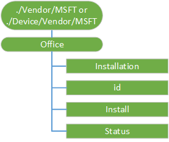

# Office CSP

> [!WARNING]
> Some information relates to prereleased product, which may be substantially modified before it's commercially released. Microsoft makes no warranties, express or implied, with respect to the information provided here.

The Office configuration service provider (CSP) enables a Microsoft Office client to be installed on a device via the Office Deployment Tool. For more information, see [Configuration options for the Office Deployment Tool](https://technet.microsoft.com/en-us/library/jj219426.aspx). 
This CSP was added in Windows 10, version 1703.

The following diagram shows the Office configuration service provider in tree format.

**Office**

The root node for the Office configuration service provider.

**Installation**  

Specifies the options for the Microsoft Office installation.

The supported operations are Add, Delete, Get, and Replace.

**id**  

Specifies a unique identifier that represents the ID of the Microsoft Office product to install. 

The supported operations are Add, Delete, Get, and Replace.

**Install**  

Installs office by using the XML data specified in the configuration.xml file. 

The supported operations are Get and Execute.

**Status**  

The Microsoft Office installation status. 

The only supported operation is Get.

