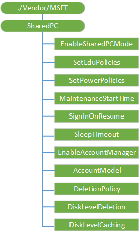

# SharedPC CSP

The SharedPC configuration service provider is used to configure settings for Shared PC usage.

The following diagram shows the SharedPC configuration service provider management objects in tree format as used by Open Mobile Alliance Device Management (OMA DM), OMA Client Provisioning, and Enterprise DM.

**./Vendor/MSFT/SharedPC**  
The root node for the SharedPC configuration service provider.

The supported operation is Get.

**EnableSharedPCMode**  
A boolean value that specifies whether Shared PC mode is enabled.

The supported operations are Get and Replace.

Setting this value to True triggers the action to configure a device to Shared PC mode.

The default value is False.

**SetEduPolicies**  
Optional. A boolean value that specifies that the policies defined for an education environment should be set when configuring SharedPC mode.

>  **Note**  If used, this value needs to be set before the action on the **EnableSharedPCMode** node is taken.

 

The supported operations are Get and Replace.

The default value is True.

**SetPowerPolicies**  
Optional. A boolean value that specifies that the power policies should be set when configuring SharedPC mode.

>  **Note**  If used, this value needs to be set before the action on the **EnableSharedPCMode** node is taken.

 

The supported operations are Get and Replace.

The default value is True.

**MaintenanceStartTime**  
Optional. An integer value that specifies the daily start time of maintenance hour. Given in minutes from midnight. The range is 0-1440.

>  **Note**  If used, this value needs to be set before the action on the **EnableSharedPCMode** node is taken.

 

The supported operations are Get and Replace.

The default value is 0 (12 AM).

**SignInOnResume**  
Optional. A boolean value that, when set to True, requires sign in whenever the device wakes up from sleep mode.

>  **Note**  If used, this value needs to be set before the action on the **EnableSharedPCMode** node is taken.

 

The supported operations are Get and Replace.

The default value is True.

**SleepTimeout**  
Optional. An integer value that specifies the time in seconds that a device sits at the Logon screen before signing the user out. Setting this value to 0 prevents the sleep timeout from occurring.

>  **Note**  If used, this value needs to be set before the action on the **EnableSharedPCMode** node is taken.

 

The supported operations are Get and Replace.

The default value is 3600 (1 hour).

**EnableAccountManager**  
A boolean that enables the account manager for shared PC mode.

>  **Note**  If used, this value needs to be set before the action on the **EnableSharedPCMode** node is taken.

 

The supported operations are Get and Replace.

The default value is True.

**AccountModel**  
Configures which type of accounts are allowed to use the PC.

>  **Note**  If used, this value needs to be set before the action on the **EnableSharedPCMode** node is taken.

 

The supported operations are Get and Replace.

The following list shows the supported values:

-   0 (default) - Only guest accounts are allowed.
-   1 - Only domain-joined accounts are enabled.
-   2 - Domain-joined and guest accounts are allowed.

**DeletionPolicy**  
Configures when accounts are deleted.

>  **Note**  If used, this value needs to be set before the action on the **EnableSharedPCMode** node is taken.

 

The supported operations are Get and Replace.

The following list shows the supported values:

-   0 - Delete immediately.
-   1 (default) - Delete at disk space threshold.

**DiskLevelDeletion**  
Sets the percentage of disk space remaining on a PC before cached accounts will be deleted to free disk space. Accounts that have been inactive the longest will be deleted first.

>  **Note**  If used, this value needs to be set before the action on the **EnableSharedPCMode** node is taken.

 

The default value is 25.

For example, if the **DiskLevelCaching** number is set to 50 and the **DiskLevelDeletion** number is set to 25 (both default values). Accounts will be cached while the free disk space is above 25%. When the free disk space is less than 25% (the deletion number) during a maintenance period, accounts will be deleted (oldest last used first) until the free disk space is above 50% (the caching number). Accounts will be deleted immediately at sign off of an account if free space is under the deletion threshold and disk space is very low, regardless whether the PC is actively in use or not.

The supported operations are Get and Replace.

**DiskLevelCaching**  
Sets the percentage of available disk space a PC should have before it stops deleting cached accounts.

>  **Note**  If used, this value needs to be set before the action on the **EnableSharedPCMode** node is taken.

 

The default value is 50.

For example, if the **DiskLevelCaching** number is set to 50 and the **DiskLevelDeletion** number is set to 25 (both default values). Accounts will be cached while the free disk space is above 25%. When the free disk space is less than 25% (the deletion number) during a maintenance period, accounts will be deleted (oldest last used first) until the free disk space is above 50% (the caching number). Accounts will be deleted immediately at sign off of an account if free space is under the deletion threshold and disk space is very low, regardless whether the PC is actively in use or not.

## Related topics

[Configuration service provider reference](configuration-service-provider-reference.md)

 

 

