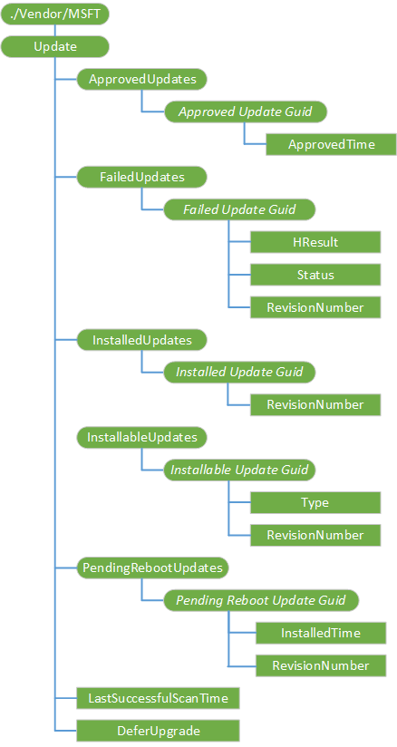

# Update CSP


The Update configuration service provider enables IT administrators to manage and control the rollout of new updates.

The following diagram shows the Update configuration service provider in tree format.



<a href="" id="update"></a>**Update**  
The root node.

Supported operation is Get.

<a href="" id="approvedupdates"></a>**ApprovedUpdates**  
Node for update approvals and EULA acceptance on behalf of the end-user.

> **Note** When the RequireUpdateApproval policy is set, the MDM uses the ApprovedUpdates list to pass the approved GUIDs. These GUIDs should be a subset of the InstallableUpdates list.

The MDM must first present the EULA to IT and have them accept it before the update is approved. Failure to do this is a breach of legal or contractual obligations. The EULAs can be obtained from the update metadata and have their own EULA ID. It's possible for multiple updates to share the same EULA. It is only necessary to approve the EULA once per EULA ID, not one per update.

The update approval list enables IT to approve individual updates and update classifications. Auto-approval by update classifications allows IT to automatically approve Definition Updates (i.e., updates to the virus and spyware definitions on devices) and Security Updates (i.e., product-specific updates for security-related vulnerability). The update approval list does not support the uninstallation of updates by revoking approval of already installed updates. Updates are approved based on UpdateID, and an UpdateID only needs to be approved once. An update UpdateID and RevisionNumber are part of the UpdateIdentity type. An UpdateID can be associated to several UpdateIdentity GUIDs due to changes to the RevisionNumber setting. MDM services must synchronize the UpdateIdentity of an UpdateID based on the latest RevisionNumber to get the latest metadata for an update. However, update approval is based on UpdateID.

> **Note**  For the Windows 10 build, the client may need to reboot after additional updates are added.

 

Supported operations are Get and Add.

<a href="" id="approvedupdates-approved-update-guid"></a>**ApprovedUpdates/****_Approved Update Guid_**  
Specifies the update GUID.

To auto-approve a class of updates, you can specify the [Update Classifications](http://go.microsoft.com/fwlink/p/?LinkId=526723) GUIDs. We strongly recommend to always specify the DefinitionsUpdates classification (E0789628-CE08-4437-BE74-2495B842F43B), which are used for anti-malware signatures. There are released periodically (several times a day). Some businesses may also want to auto-approve security updates to get them deployed quickly.

Supported operations are Get and Add.

Sample syncml:

```
<LocURI>./Vendor/MSFT/Update/ApprovedUpdates/%7ba317dafe-baf4-453f-b232-a7075efae36e%7d</LocURI>
```

<a href="" id="approvedupdates-approved-update-guid-approvedtime"></a>**ApprovedUpdates/*Approved Update Guid*/ApprovedTime**  
Specifies the time the update gets approved.

Supported operations are Get and Add.

<a href="" id="failedupdates"></a>**FailedUpdates**  
Specifies the approved updates that failed to install on a device.

Supported operation is Get.

<a href="" id="failedupdates-failed-update-guid"></a>**FailedUpdates/****_Failed Update Guid_**  
Update identifier field of the UpdateIdentity GUID that represent an update that failed to download or install.

Supported operation is Get.

<a href="" id="failedupdates-failed-update-guid-hresult"></a>**FailedUpdates/*Failed Update Guid*/HResult**  
The update failure error code.

Supported operation is Get.

<a href="" id="failedupdates-failed-update-guid-status"></a>**FailedUpdates/*Failed Update Guid*/Status**  
Specifies the failed update status (for example, download, install).

Supported operation is Get.

<a href="" id="failedupdates-failed-update-guid-revisionnumber"></a>**FailedUpdates/*Failed Update Guid*/RevisionNumber**  
The revision number for the update that must be passed in server to server sync to get the metadata for the update.

Supported operation is Get.

<a href="" id="installedupdates"></a>**InstalledUpdates**  
The updates that are installed on the device.

Supported operation is Get.

<a href="" id="installedupdates-installed-update-guid"></a>**InstalledUpdates/****_Installed Update Guid_**  
UpdateIDs that represent the updates installed on a device.

Supported operation is Get.

<a href="" id="installedupdates-installed-update-guid-revisionnumber"></a>**InstalledUpdates/*Installed Update Guid*/RevisionNumber**  
The revision number for the update that must be passed in server to server sync to get the metadata for the update.

Supported operation is Get.

<a href="" id="installableupdates"></a>**InstallableUpdates**  
The updates that are applicable and not yet installed on the device. This includes updates that are not yet approved.

Supported operation is Get.

<a href="" id="installableupdates-installable-update-guid"></a>**InstallableUpdates/****_Installable Update Guid_**  
Update identifiers that represent the updates applicable and not installed on a device.

Supported operation is Get.

<a href="" id="installableupdates-installable-update-guid-type"></a>**InstallableUpdates/*Installable Update Guid*/Type**  
The UpdateClassification value of the update. Valid values are:

-   0 - None
-   1 - Security
-   2 = Critical

Supported operation is Get.

<a href="" id="installableupdates-installable-update-guid-revisionnumber"></a>**InstallableUpdates/*Installable Update Guid*/RevisionNumber**  
The revision number for the update that must be passed in server to server sync to get the metadata for the update.

Supported operation is Get.

<a href="" id="pendingrebootupdates"></a>**PendingRebootUpdates**  
The updates that require a reboot to complete the update session.

Supported operation is Get.

<a href="" id="pendingrebootupdates-pending-reboot-update-guid"></a>**PendingRebootUpdates/****_Pending Reboot Update Guid_**  
Update identifiers for the pending reboot state.

Supported operation is Get.

<a href="" id="pendingrebootupdates-pending-reboot-update-guid-installedtime"></a>**PendingRebootUpdates/*Pending Reboot Update Guid*/InstalledTime**  
The time the update is installed.

Supported operation is Get.

<a href="" id="pendingrebootupdates-pending-reboot-update-guid-revisionnumber"></a>**PendingRebootUpdates/*Pending Reboot Update Guid*/RevisionNumber**  
The revision number for the update that must be passed in server to server sync to get the metadata for the update.

Supported operation is Get.

<a href="" id="lastsuccessfulscantime"></a>**LastSuccessfulScanTime**  
The last successful scan time.

Supported operation is Get.

<a href="" id="deferupgrade"></a>**DeferUpgrade**  
Upgrades deferred until the next period.

Supported operation is Get.

## Related topics


[Configuration service provider reference](configuration-service-provider-reference.md)

 

 


