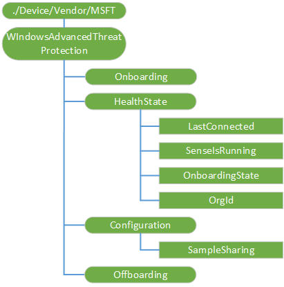

# WindowsAdvancedThreatProtection CSP


The Windows Defender Advanced Threat Protection (WDATP) configuration service provider (CSP) allows IT Admins to onboard, determine configuration and health status, and offboard endpoints for WDATP.

The following diagram shows the WDATP configuration service provider in tree format as used by the Open Mobile Alliance (OMA) Device Management (DM).



The following list describes the characteristics and parameters.

<a href="" id="--device-vendor-msft-windowsadvancedthreatprotection"></a>**./Device/Vendor/MSFT/WindowsAdvancedThreatProtection**  
The root node for the Windows Defender Advanced Threat Protection configuration service provider.

Supported operation is Get.

<a href="" id="onboarding"></a>**Onboarding**  
Sets Windows Defender Advanced Threat Protection Onboarding blob and initiates onboarding to Windows Defender Advanced Threat Protection.

The data type is a string.

Supported operations are Get and Replace.

<a href="" id="healthstate"></a>**HealthState**  
Node that represents the Windows Defender Advanced Threat Protection health state.

<a href="" id="healthstate-lastconnected"></a>**HealthState/LastConnected**  
Contains the timestamp of the last successful connection.

Supported operation is Get.

<a href="" id="healthstate-senseisrunning"></a>**HealthState/SenseIsRunning**  
Boolean value that identifies the Windows Defender Advanced Threat Protection Sense running state.

The default value is false.

Supported operation is Get.

<a href="" id="healthstate-onboardingstate"></a>**HealthState/OnboardingState**  
Represents the onboarding state.

Supported operation is Get.

The following list shows the supported values:

-   0 (default) – Not onboarded.
-   1 – Onboarded

<a href="" id="healthstate-orgid"></a>**HealthState/OrgId**  
String that represents the OrgID.

Supported operation is Get.

<a href="" id="configuration"></a>**Configuration**  
Represents Windows Defender Advanced Threat Protection configuration.

<a href="" id="configuration-samplesharing"></a>**Configuration/SampleSharing**  
Returns or sets the Windows Defender Advanced Threat Protection Sample Sharing configuration parameter: 0 - none, 1 - All

The following list shows the supported values:

-   0 – None
-   1 (default)– All

Supported operations are Get and Replace.

<a href="" id="offboarding"></a>**Offboarding**  
Sets the Windows Defender Advanced Threat Protection Offboarding blob and initiates offboarding to Windows Defender Advanced Threat Protection.

The data type is a string.

Supported operations are Get and Replace.

## Examples


``` syntax
<SyncML xmlns="SYNCML:SYNCML1.2">
  <SyncBody>
    <Get>
      <CmdID>11</CmdID>
      <Item>
        <Target>
          <LocURI>
            ./Device/Vendor/MSFT/WindowsAdvancedThreatProtection/Onboarding
          </LocURI>
        </Target>
      </Item>
    </Get>
    <Get>
      <CmdID>1</CmdID>
      <Item>
        <Target>
          <LocURI>
            ./Device/Vendor/MSFT/WindowsAdvancedThreatProtection/HealthState/LastConnected
          </LocURI>
        </Target>
      </Item>
    </Get>
        <Get>
      <CmdID>2</CmdID>
      <Item>
        <Target>
          <LocURI>
            ./Device/Vendor/MSFT/WindowsAdvancedThreatProtection/HealthState/OnBoardingState
          </LocURI>
        </Target>
      </Item>
    </Get>
            <Get>
      <CmdID>3</CmdID>
      <Item>
        <Target>
          <LocURI>
            ./Device/Vendor/MSFT/WindowsAdvancedThreatProtection/HealthState/SenseIsRunning
          </LocURI>
        </Target>
      </Item>
    </Get>
            <Get>
      <CmdID>4</CmdID>
      <Item>
        <Target>
          <LocURI>
            ./Device/Vendor/MSFT/WindowsAdvancedThreatProtection/HealthState/OrgId
          </LocURI>
        </Target>
      </Item>
    </Get>

            <Get>
      <CmdID>5</CmdID>
      <Item>
        <Target>
          <LocURI>
            ./Device/Vendor/MSFT/WindowsAdvancedThreatProtection/Configuration/SampleSharing
          </LocURI>
        </Target>
      </Item>
    </Get>
    <Get>
      <CmdID>99</CmdID>
      <Item>
        <Target>
          <LocURI>
            ./Device/Vendor/MSFT/WindowsAdvancedThreatProtection/Offboarding
          </LocURI>
        </Target>
      </Item>
    </Get>
    <Final/> 
  </SyncBody>
</SyncML>
```

## Related topics


[Configuration service provider reference](configuration-service-provider-reference.md)

 

 


