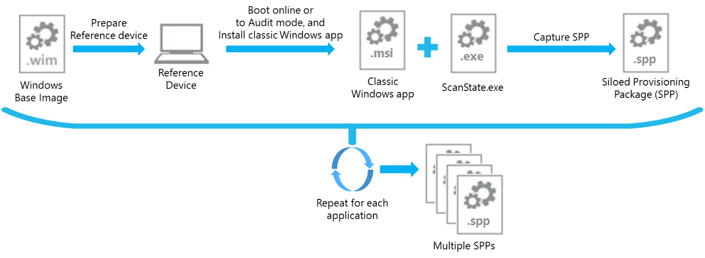
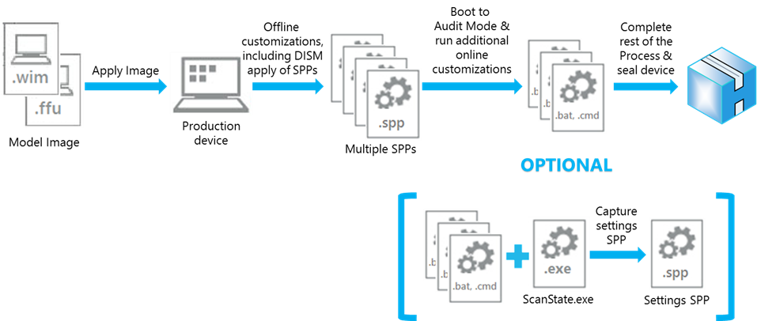
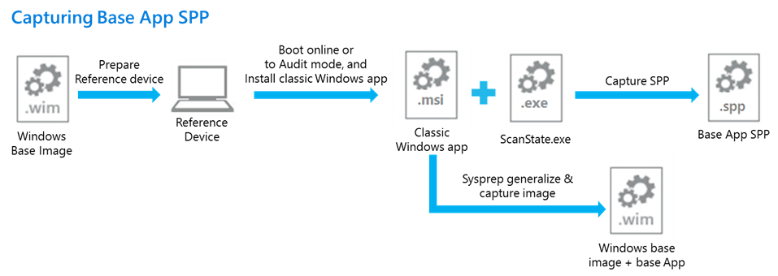
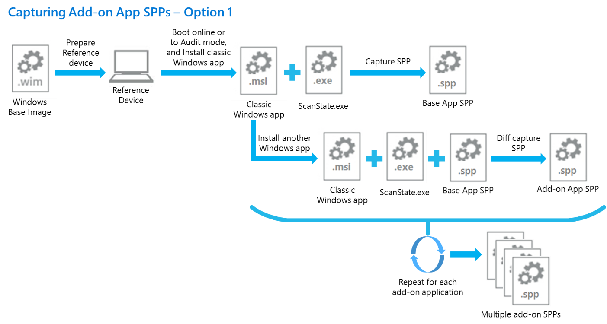
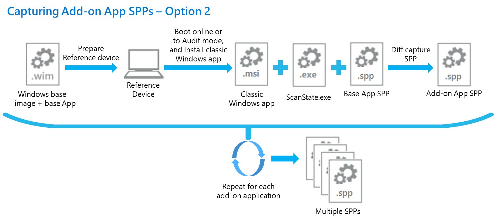
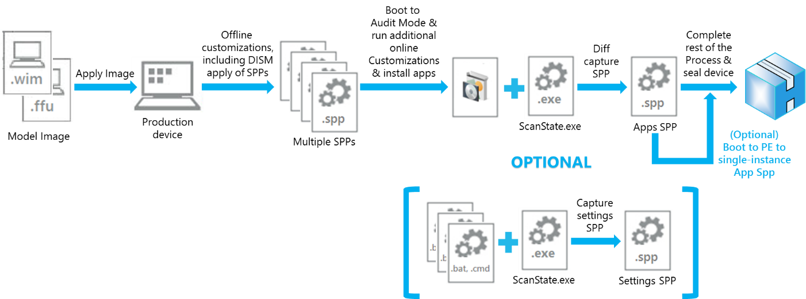

# Siloed provisioning packages

Siloed provisioning packages are a new type of provisioning package that is available for Windows 10, version 1607. Where traditional provisioning packages can capture all classic Windows applications and settings that are installed with a Windows image, a siloed provisioning package can capture classic Windows applications individually, drivers plus applications, settings, or capture add-ons for provisioning packages that were captured previously. This provides more flexibility for the manufacturing process and helps reduce the time required to build Windows-based computers in the factory.

## Performance comparison

The following table shows a comparison between using the Office installer vs using siloed provisioning packages in a typical factory floor process.  When using the siloed provisioning packages to install Office, the base Office en-us package, along with the add-on Office fr-fr and Office de-de packages are captured using the User State Migration Tool (USMT) ScanState.exe utility as a one-time process in the imaging lab.
The data in the following table was derived from a sample run on a VM with Windows 10, version 1607 desktop image.  The actual time savings at the factory floor will vary based on the number and size of applications being installed and the hardware spec of physical devices.  The time savings can be calculated by:

(time to Sysprep & boot to Audit mode + time to install applications + time to capture applications in a PPKG + _<optional_> time to single-instance the PPKG) – (time to apply SPPs + time to Sysprep & boot to Audit mode)

| Phase/Task | Factory process using Office installer | Factory process using siloed provisioning packages |
|------------|----------------------------------------|----------------------------------------------------|
| Apply image to the device | 4 min.                  | 4 min.                                             |
| Install language packs – fr-fr & de-de | 20 min.    | 20 min.                                            |
| Run BCDBoot.exe | negligible                        | negligible                                         |
| Run DISM to apply siloed Office en-us base, Office fr-fr, and Office de-de packages | N/A | 3 min.       |
| Run Sysprep & boot to Audit mode |10 min.           | 19 min.                                            |
| Install Office 2016 en-us, fr-fr, & de-de | 12 min. | N/A                                                |
| Run ScanState to capture Office into provisioning package (for PBR) | 10 min. | N/A                      |
| (Optional – for low disk space) Single-instancing Office files captured in the provisioning package | 7 min. | N/A |
| **Total**  | **56-63 min.**                         | **46 min.**                                        |
| **Overall application install time** |              | **45-65% faster**                                  |
| **Overall E2E deployment time** |                   | **18-30% faster**                                  |

## Capturing a siloed provisioning package

USMT ScanState.exe is enhanced to capture an individual classic Windows application and will only capture components from the Windows namespace. A configuration file can be specified to narrow down the components to be captured when capturing an individual classic Windows application. A default configuration file for this purpose is provided in Windows ADK, which can be found in the following folder when USMT is installed:

*<%Windows ADK install root%>*\User State Migration Tool\\*<arch*>\Config_AppsOnly.xml

This configuration file can be customized to capture more or fewer components in the siloed provisioning package. This configuration file is useful in an imaging lab, when you just want to capture the app files and the settings for an individual Win32 app, without other non-relevant settings. 

Note: It is recommended to always start with a clean Windows installation and only install one application to capture a siloed provisioning package. This practice prevents any potentially unwanted settings from being included in the package. 

The following example captures a siloed provisioning package of a single classic Windows application installed on a reference device:

```syntax
ScanState.exe /apps:-sysdrive /o /v:13 /config:Config_AppsOnly.xml /ppkg e:\repository\office16_base.spp
```

The following table explains some of the parameters.

<table border="1" cellspacing="0" cellpadding="0">
    <tbody>
        <tr>
            <td width="96" valign="top">
                <p>
                    Parameter
                </p>
            </td>
            <td width="528" valign="top">
                <p>
                    Description
                </p>
            </td>
        </tr>
        <tr>
            <td width="96" valign="top">
                <p>
                    -sysdrive (or +sysdrive)
                </p>
            </td>
            <td width="528" valign="top">
                <p>
                    Tells ScanState to ignore all the folders outside the Windows namespace. For example, if there is a folder c:\Folder, that folder will be
                    captured when running with /apps (or /apps:+sysdrive) but it will not be captured when running with /apps:-sysdrive.
                    <br/>
                    Typically you use +sysdrive if you want to capture the entire state of the machine into a single siloed provisioning package; use -sysdrive
                    if you want to capture a single application (or a small group of applications).
                </p>
                <p>
                    The Windows namespace is the set of folders created by a Windows installation, typically:
                </p>
                <ul>
                    <li>
                        %systemdrive%\Users
                    </li>
                    <li>
                        %systemdrive%\ProgramData
                    </li>
                    <li>
                        %systemdrive%\Program Files
                    </li>
                    <li>
                        %systemdrive%\Program Files (x86)
                    </li>
                    <li>
                        %systemdrive%\Windows
                    </li>
                    <li>
                        %systemdrive%\Inetpub
                    </li>
                </ul>
            </td>
        </tr>
        <tr>
            <td width="96" valign="top">
                <p>
                    /o
                </p>
            </td>
            <td width="528" valign="top">
                <p>
                    Overwrites any existing data in the store. If not specified, ScanState will fail if the store already contains data.
                </p>
            </td>
        </tr>
        <tr>
            <td width="96" valign="top">
                <p>
                    /v:13
                </p>
            </td>
            <td width="528" valign="top">
                <p>
                    Produces a MigLog.xml file that indicates what gets captured.
                </p>
            </td>
        </tr>
    </tbody>
</table>

A /diff switch can be used with the /apps command option to capture application add-on components relative to parent applications already captured in siloed provisioning packages. For example:

```syntax
ScanState.exe /apps:-sysdrive /o /v:13 /config:Config_AppsOnly.xml /diff:e:\repository\office16_base.spp /ppkg e:\repository\office16_fr-fr.spp
```

Another configuration file provided in Windows ADK can be used to capture only system settings in a siloed provisioning package without capturing any application payloads.  This configuration file is useful for capturing only system settings as the last step in the factory floor process, so the package can be placed in the recovery folder on the device.  During system recovery, PBR will process the siloed provisioning package in the recovery folder to restore the system settings captured in the package.  

The default configuration file can be found in the following folder when USMT is installed.  This configuration file is also customizable.

*<%Windows ADK install root%>*\User State Migration Tool\\*<arch*>\Config_SettingsOnly.xml

The following example captures a siloed provisioning package of only system settings on a device:

```syntax
ScanState.exe /apps:-appfiles /o /v:13 /config:Config_SettingsOnly.xml /ppkg %systemdrive\Recovery\Customizations\systemsettings.spp
```

For example, suppose that on the factory floor, all deployment tasks for a device are done and no Win32 apps have been installed. ScanState can capture just the system settings that have not been captured in any app .spp files by using Config_SettingsOnly.xml. The siloed provisioning package can be placed in the recovery folder to recover these settings during PBR.

There is also a third default configuration file:

*<%Windows ADK install root%>*\User State Migration Tool\\*<arch*>\Config_AppsAndSettingsOnly.xml

This configuration file is also customizable and intended to capture last-minute installed Win32 apps and system settings in an .spp or .ppkg and put it in the recovery folder for PBR usage. 

For example, suppose that after a device is booted into Audit mode on the factory floor, a few more Win32 apps are installed and need to be captured. In this case, there are two options:

- Capture the additional apps and their relevant settings in one .spp using the /diff switch and Config_AppsOnly.xml. Then capture the system settings in a separate .spp using the Config_SettingsOnly.xml with the ScanState command.
- Capture the additional apps and the system settings into one SPP using the /diff switch and Config_AppsAndSettings.xml.

Another example for using the Config_AppsAndSettingsOnly.xml file is where you want to capture all apps and settings into one .spp file, either in the imaging lab or on the factory floor. 

## Applying a siloed provisioning package

DISM is also improved to support applying siloed provisioning packages to a Windows image that has been applied on a device.  A new DISM provider, which is only available in Windows ADK, supports siloed provisioning packages.  For Windows 10, version 1607, the only supported functionality is to apply siloed provisioning packages. 

The functionality for applying siloed provisioning packages using DISM is limited to support the following scenarios:

- The DISM SiloedPackageProvider is not included in the Windows image, nor is it included in Windows PE, version 1607.  The Windows ADK version of DISM must be installed on the servicing host, and then launch DISM.exe from the Windows ADK installed location.  On a host that is not supported by Windows ADK installer, such as Windows PE, the required binaries can be copied to the host using the CopyDandI.cmd script in *<%Windows ADK install root%>\Deployment Tools*.
- DISM only supports applying siloed provisioning packages to a Windows image that has been applied at the root of a disk volume on a device, e.g. “C:\”.  It does not support applying siloed provisioning packages to a Windows image that is mounted for offline servicing.  The typical scenario is booting the device to Windows PE, and running the Windows ADK version of DISM in Windows PE to apply siloed provisioning packages after the Windows image has been applied to the device.
- The DISM command to apply siloed provisioning packages to a Windows image (DISM Apply-SiloedPackage) can be run only once.  All of the siloed provisioning packages to be applied to the Windows image must be specified in the right order in a single command operation. The order of the installation will be preserved, so the packages can be restored in the same order during PBR.
- If additional siloed provisioning packages need to be applied to a Windows desktop image that has already gone through the entire deployment process with using DISM to apply a set of siloed provisioning packages, the image can be Sysprep generalized and captured as a new model image.  DISM can then be run again to apply more siloed provisioning packages when this new model image is deployed onto other devices.
- Siloed provisioning packages must be applied to the same architecture that they were captured on. It is not supported to capture an x86 app in an .spp and apply it to an x64 platform. 
- Siloed provisioning packages can be applied to other editions of Windows. For example, an application captured on Windows 10 Enterprise can be applied to Windows 10 Pro.
- Windows 10, Version 1607, does not support applying siloed provisioning packages on a generalized image that is set to boot into Audit mode. If booting into Audit mode is required, use Unattend.xml to reseal to Audit mode.

The following example runs DISM in Windows PE to apply siloed provisioning packages for Office en-us, fr-fr, and de-de to the applied Windows image on a device:

```syntax
C:\ADKTools\DISM.exe /Apply-SiloedPackage /ImagePath:C:\ /PackagePath:e:\repository\office16_base.spp /PackagePath:e:\repository\office16_fr-fr.spp /PackagePath:e:\repository\office16_de-de.spp
```

For syntax, see [DISM Image Management Command-Line Options](dism-image-management-command-line-options-s14.md), or run ``` DISM.exe /Apply-SiloedPackage /? ``` from the target location of CopyDandI.cmd. 

All of the siloed provisioning packages applied by DISM will be placed in %systemdrive%\Recovery\Customizations folder.  

When DISM applies siloed provisioning packages to the OS image that has been applied as Compact OS on a device, by default the packages will be applied with application files single-instanced (using WIMBoot v1 style) to save the disk space on the device.  On a device without a Compact OS image, DISM /Apply-CustomDataImage command can be run while the device is booted into Windows PE to single-instance the applied siloed provisioning packages. For example:

```syntax
DISM.exe /Apply-CustomDataImage /ImagePath:C:\ /CustomDataImage:C:\Recovery\Customizations\myApp.spp /SingleInstance 
```

The /Apply-SiloedPackage command can also work with .ppkg files, and you can apply siloed provisioning packages in addition to a traditional provisioning package. 

## Push-button reset

When using ScanState to capture traditional provisioning packages, only one package with all the applications and system settings can be placed in %systemdrive%\Recovery\Customizations folder.  During push-button reset (PBR), the single provisioning package is processed to restore the applications and system settings.

Beginning with Windows 10, version 1607, applications can be captured in multiple siloed provisioning packages and system settings can also be captured in a separate siloed provisioning package. As a result, PBR is enhanced to allow multiple siloed provisioning packages to be applied, in the preserved order in which they were applied using Dism /Apply-Siloed Package. The packages can then be queued and processed in the right order during PBR to restore the applications and system settings captured in these packages. If the packages were applied using single-instancing, it will be honored when PBR restores them to the device. 

Single-instancing can occur automatically if Compact OS is used, or manually. 

- If you use WinPE, then applying an image as Compact OS, then apply SPPs to it, Windows automatically single-instances the contents of the package. To learn more, see [Lab 10: Add desktop applications and settings with siloed provisioning packages (SPPs)](add-desktop-apps-wth-spps-sxs.md)
- If you create provisioning packages in audit mode, you can choose to single-instance the contents by using the DISM /Apply-CustomDataImage /SingleInstance command. To learn more, see  [Lab 9: Make changes from Windows (audit mode)](prepare-a-snapshot-of-the-pc-generalize-and-capture-windows-images-blue-sxs.md).

## Copy script

To get the siloed provisioning package functionality on a host platform such as Windows PE, which is not supported by the Windows ADK installer, tool binaries required by ScanState.exe and DISM.exe must be copied from multiple folders under the Windows ADK install location on another supported host.  To ease the copy process, a script is provided in the Windows ADK, which can be found in the following folder when Deployment Tools category is installed:

*<%Windows ADK install root%>*\Deployment Tools\CopyDandI.cmd

For example, to copy the necessary tools for amd64 architecture to a folder on a removable drive E:\:

```syntax
CopyDandI.cmd amd64 D:\ADKTools
```
Before you use the tool, you'll need to copy the ADK tools again to a non-removable drive on the destination device. Copying the file to a non-removable location avoids an error associated with installing DISM from removable drives.

```syntax
xcopy D:\ADKTools\ W:\ADKTools\ /s
```

You'll then have to install the tools:
```syntax
W:\ADKTools\amd64\WimMountAdkSetupAmd64.exe /Install /q
```

And then run the tools from that location:
```syntax
W:\ADKTools\amd64\DISM.exe /Apply-SiloedPackage /ImagePath:C:\ /PackagePath:e:\repository\office16_base.spp /PackagePath:e:\repository\office16_fr-fr.spp /PackagePath:e:\repository\office16_de-de.spp
```

For the full walkthrough, see [Lab 10: Add desktop applications and settings with siloed provisioning packages (SPPs)](add-desktop-apps-wth-spps-sxs.md)

## Scenarios for using siloed provisioning packages

This section covers scenarios for capturing and applying siloed provisioning packages. 

### Capturing and applying independent applications

A Microsoft partner can capture siloed provisioning packages of individual classic Windows applications while in the imaging lab, and then install any combination of siloed provisioning packages in a customized order at factory floor.  For example, a partner could capture siloed provisioning packages for Office 2016, Adobe Acrobat Reader, and AVG Protection, and install Office 2016 and AVG Protection packages on a specific device model at factory floor.



1.	Clean install Windows 10, version 1607 on a reference device.
2.	At the desktop, install Office 2016.
3.	Run ScanState.exe to capture Office 2016 siloed provisioning package.
4.	Wipe and clean install the reference device
5.	Repeat steps 2-4 for Adobe Acrobat Reader and AVG Protection.

Alternatively, the siloed provisioning packages can be captured using a VM instead of a physical device:

1.	Create a VM and boot it online using a Windows 10, version 1607 VHD/VHDX image.
2.	Create a checkpoint of the clean OS installation on the VM.
3.	At the desktop, install Office 2016.
4.	Run ScanState.exe to capture Office 2016 siloed provisioning package.
5.	Revert the VM to the checkpoint.
6.	At the desktop, install Adobe Acrobat Reader.
7.	Run ScanState.exe to capture Adobe Acrobat Reader siloed provisioning package.
8.	Repeat step 5-7 to capture AVG Protection siloed provisioning package.



1.	On the target device, boot to Windows PE, and apply the Window 10, version 1607 desktop image.
2.	While in Windows PE, run DISM /Apply-SiloedPackage command with Office 2016 and AVG Protection packages to apply the application files in the packages onto the applied desktop image.
3.	Complete the rest of the offline customization tasks.
4.	Go through first boot and run through specialize to get to Audit mode.
5.	Complete the online customization/configuration tasks.
6.	(Optional) While in Audit mode, run ScanState to capture only the system settings into siloed provisioning package and place it in the recovery folder.
7.	Complete the rest of the factory floor tasks and shutdown/seal the product.

### Capturing and applying applications with dependencies 

A Microsoft partner can use the diff capture support to generate supplemental (or add-on) siloed provisioning packages that are relevant to a previously captured parent siloed provisioning package.  The siloed provisioning packages can then be installed on devices at factory floor, with parent package first followed by combinations of supplemental packages in the customized order. For example:

- You could capture AVG Protection base siloed provisioning package, and then diff capture AVG Protection patch (MSP) siloed provisioning packages using the base package as the parent.  At the factory floor, the AVG Protection base package and a selection of patch packages, specified in the desired order, can then be installed on a specific model device.
- Or, you could capture Office 2016 en-us as the base siloed provisioning package, and then diff capture other languages of Office 2016 siloed provisioning packages using the base package.  At factory floor, the Office 2016 base package, and a selective of language packages specified in any order, can then be installed on a specific model device.







1.	Clean install Window 10, version 1607 on a reference device.
2.	At the desktop, install Office 2016 en-us.
3.	Sysprep generalize and capture the OS image from the reference device.
4.	Run ScanState.exe to capture Office 2016 en-us base siloed provisioning package.
5.	Install Office 2016 fr-fr.
6.	Run ScanState.exe to diff capture Office 2016 fr-fr siloed provisioning package using Office 2016 base package.
7.	Either continue using the diff switch with the already captured base and language packages to capture another Office 2016 language siloed provisioning package:
    1. Install Office 2016 de-de.
    2. Run ScanState.exe to diff capture Office 2016 de-de siloed provisioning package using Office 2016 base package and fr-fr package.
8. Or wipe and start clean again on the reference device to diff capture another Office 2016 language siloed provisioning package:
    1. Wipe and clean install the reference device using the OS image captured in step 3.
    2. At the desktop, install Office 2016 de-de.
    3. Run ScanState.exe to diff capture Office 2016 de-de siloed provisioning package using Office 2016 base package captured in step 4.
9. Repeat either step 7 or 8 to capture the rest of the Office 2016 language siloed provisioning packages.

Alternatively, the siloed provisioning packages can be captured using VM instead of a physical device.  When using a VM:

1.	Create a VM and boot it online using a Window 10, version 1607 VHD/VHDX image.
2.	At the desktop, install Office 2016 en-us.
3.	Create a checkpoint (also known as a snapshot) of the OS installation with Office 2016 en-us on the VM.
4.	Run ScanState.exe to capture Office 2016 en-us base siloed provisioning package.
5.	Install Office 2016 fr-fr.
6.	Run ScanState.exe to diff capture Office 2016 fr-fr siloed provisioning package, using the Office 2016 base package as a reference.
7.	Either continue using diff switch with the already captured base and language packages to capture another Office 2016 language siloed provisioning package:
    1. Install Office 2016 de-de.
    2. Run ScanState.exe to diff capture Office 2016 de-de siloed provisioning package, using the Office 2016 base package and fr-fr package.
8.	Or restart the VM to diff capture another Office 2016 language siloed provisioning package:
    1. Revert the VM to the checkpoint generated in step 3.
    2. At the desktop, install Office 2016 de-de.
    3. Run ScanState.exe to diff capture Office 2016 de-de siloed provisioning package using the Office 2016 base package captured in step 4.
9.	Repeat either step 7 or 8 to capture the rest of the Office 2016 language siloed provisioning packages.

Siloed provisioning packages can also capture applications with dependencies. For example, to capture multiple apps that depend on .NET Framework:

1.	Create a VM and boot it online using a Window 10, version 1607 VHD/VHDX image.
2.	Install .NET Framework. 
3.	Create a checkpoint of the of the OS installation with .NET Framework.
4.	Capture a base .spp, for example, DotNet.spp.
5.	Install App1, capture it as App1.spp, using /diff:DotNet.spp.
6.	Revert the VM to the checkpoint created in Step 3.
7.	Install App2, capture it as App2.spp, using /diff:DotNet.spp.

To preserve the dependency, apply the packages in this order:

- DotNet.spp, App1.spp, App2.spp

-or-

- DotNet.spp, App2.spp, App1.spp

The important point is DotNet.spp must be applied first. 

### Capturing and applying applications for BTO model

In the BTO model, the last minute customizations at the factory floor could include installing classic Windows applications on top of what were already installed in the base model image.  If there are any classic Windows applications that were not captured in a siloed provisioning packages in the imaging lab, the factory floor process will then include the tasks shown in the following diagram.



1.	On the target device, boot to Windows PE, and apply Window 10, version 1607 desktop image.
2.	While in Windows PE, run DISM /Apply-SiloedPackage command specifying all the siloed provisioning packages to apply the application files in the packages onto the applied desktop image.
3.	Complete the rest of the offline customization tasks.
4.	Go through first boot and run through specialize to get to Audit mode.
5.	Online install of classic Windows applications in Audit mode.
6.	Complete the online customization/configuration tasks.
7.	Run ScanState.exe to diff capture the applications installed in step 5 into a single siloed provisioning package, using the siloed provisioning packages for the applications already installed in the base model image as a reference.
8.	(Optional) Run ScanState to capture only the system settings into siloed provisioning package and place it in the recovery folder.
9.	(Optional) Boot the device to Windows PE, and run the DISM command to single-instance the application files in the siloed provisioning package captured in step 7.
10.	Complete the rest of the factory floor tasks and shutdown/seal the product.

**Preferred process guidelines for BTO model**: As described in the preceding steps, the diff capture support provides flexibility to allow installing a classic Windows applications at the factory floor as last minute customizations. However, the diff capture operation may take some time to complete, depending on the number and the size of the siloed provisioning packages it needs to diff against. There is also overhead cost for the other steps in the process. Therefore, the preferred guideline for installing a classic Windows application in the BTO model is to incur the onetime cost of capturing the siloed provisioning packages for these applications in the imaging lab. Then they can be applied at the factory floor as needed for the last-minute customizations.   
