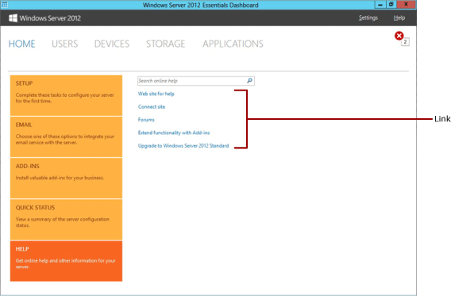

# Add Tasks and Links to Dashboard Home Page - Windows Server Essentials


Add tasks to the **SETUP**, **ADD-INS**, **QUICK STATUS** task lists, and add links to the Community Links section in the home page of the Dashboard by placing an XML file named OEMHomePageContent.home file or an embedded resource file named OEMHomePageContent.dll in %ProgramFiles%\\Windows Server\\Bin\\Addins\\Home. If the XML file is being installed on the server without a resource file, it must be named OEMHomePageContent.home. If an assembly is being used to install both an XML file and a resource file, it must be named OEMHomePageContent.dll and it must be Authenticode signed. The embedded resource file can be used to localize the text in the tasks and links that you add. The .home file contains the XML definitions of the tasks and links.

## <span id="Define_the_tasks_and_links"></span><span id="define_the_tasks_and_links"></span><span id="DEFINE_THE_TASKS_AND_LINKS"></span>Define the tasks and links


Use a text editor, such as Notepad to create the .home file, or if you are also creating an embedded resource file you can use Visual Studio 2010 or higher to define the files. The following procedure shows how to use Visual Studio to create the files.

**To define the tasks and links**

1.  Open Visual Studio as an administrator by right-clicking the program in the Start menu and selecting **Run as administrator**.

2.  Click **File** &gt; **New** &gt; **Project**.

3.  In the **Templates** pane, click **Class Library**, type **OEMHomePageContent** in the **Name** box, and then click **OK**.

4.  Delete the Class1.cs file.

5.  Right-click the new project, click **Add**, and then click **New Item**.

6.  In the **Templates** pane, click **XML File**, type **OEMHomePageContent.home** in the **Name** box, and then click **Add**.

    **Note**  
    If the XML file is being installed without a resource file, it must be named OEMHomePageContent.home. If it is included in an assembly, it can be given any name as long as it has a .home extension.

     

7.  Add the following XML code to the OEMHomePageContent.home file:

    ``` syntax
    <Tasks version="2.0" xmlns="http://schemas.microsoft.com/WindowsServerSolutions/2010/01/Dashboard>
       <SetupMyServerTasks>
          <Task name="MyTask"
             description="MyTaskDescription"
             id="GUID">
                  <Action 
                  name="MyAction1Name" 
                  image="IconForAction1"
                  type="TaskType"
                  exelocation="ActionExeLocation" />
                  <Action 
                  name="MyAction2Name" 
                  image="IconForAction2"
                  type="TaskType"
                  exelocation="ActionExeLocation" />
                   …
           </Task>
                   …
        </SetupMyServerTasks>
    <MailServiceTasks>
         <!-- Same schema as in "SetupMyServerTasks" but the tasks are shown in "Connect to Email Service" category. -->
    </MailServiceTasks>
    <LineOfBusinessTasks>
         <!-- Same schema as in "SetupMyServerTasks" but the tasks are shown in "Add-ins" category. -->
      
    <GetQuickStatusTasks>
          <Task name="MyQuickStatusTask1"
             description="MyQuickStatusTask1Desc   "
             id="GUID"
             assembly="AssemblyName of quick status query implementation"
             class="ClassName of quick status query implementation"         
             replaceid="GUID"/>
               <!--  Same schema as Actions in "SetupMyServerTasks" --> 
             </Task>
    </GetQuickStatusTasks>
       <Links>
          <Link
             ID="GUID"
             Title="Displayed text of the link"
             Description="A very short description"
             ShellExecPath="Path to the application or URL"/>
       </Links>
    </Tasks>
    ```

    Where:

    <table>
    <colgroup>
    <col width="50%" />
    <col width="50%" />
    </colgroup>
    <thead>
    <tr class="header">
    <th align="left">Attribute</th>
    <th align="left">Description</th>
    </tr>
    </thead>
    <tbody>
    <tr class="odd">
    <td align="left"><p>Name (Task)</p></td>
    <td align="left"><p>The name that is displayed for the task in the list. If you create an embedded resource file, the value of this attribute is the string resource.</p></td>
    </tr>
    <tr class="even">
    <td align="left"><p>description (Task)</p></td>
    <td align="left"><p>The description of the task. If you create an embedded resource file, the value of this attribute is the string resource.</p></td>
    </tr>
    <tr class="odd">
    <td align="left"><p>id (Task)</p></td>
    <td align="left"><p>The identifier of the task. This identifier must be a GUID. You create a new GUID for an <strong>exe</strong> task, but for a <strong>global</strong> task, you use the GUID that you created when you defined the task for the task pane of the sub-tab. For more information about creating a GUID, see [Create Guid (guidgen.exe)](http://go.microsoft.com/fwlink/?LinkId=116098).</p></td>
    </tr>
    <tr class="even">
    <td align="left"><p>image</p></td>
    <td align="left"><p>This field will be ignored.</p></td>
    </tr>
    <tr class="odd">
    <td align="left"><p>Name (Action)</p></td>
    <td align="left"><p>Displays the name of the task.</p></td>
    </tr>
    <tr class="even">
    <td align="left"><p>Type (Action)</p></td>
    <td align="left"><p>Describes the type of task. The task can one of the following:- <strong>global</strong> task, <strong>exe</strong>, or a url task. A <strong>global</strong> task is the same global task that you created when defining the tasks for the task pane in the sub-tab. For more information about creating a global task that can be used in both the tasks pane of the sub-tab and the Getting Started Tasks or Common Tasks lists of the home page, see &quot;Creating the support classes&quot; in &quot;How to: Create a Sub-Tab&quot; of the [Windows Server Solutions SDK](http://go.microsoft.com/fwlink/p/?linkid=248648). An <strong>exe</strong> task can be used to run applications from the Getting Started Tasks or Common Tasks lists.</p></td>
    </tr>
    <tr class="odd">
    <td align="left"><p>exelocation</p></td>
    <td align="left"><p>The path to the application that is associated with the task. This attribute is only used for <strong>exe</strong> tasks.</p></td>
    </tr>
    <tr class="even">
    <td align="left"><p>replaceid</p></td>
    <td align="left"><p>The identifier of the task that is replaced with this task.</p></td>
    </tr>
    <tr class="odd">
    <td align="left"><p>assembly</p></td>
    <td align="left"><p>The AssemblyName of the assembly which provides the class to implement quick status query. The assembly needs to be located in Program files\ windows server\bin\.</p></td>
    </tr>
    <tr class="even">
    <td align="left"><p>class</p></td>
    <td align="left"><p>The name of the class implements quick status query. The class needs to implement <strong>ITaskStatusQuery</strong> interface.</p></td>
    </tr>
    <tr class="odd">
    <td align="left"><p>Title (link)</p></td>
    <td align="left"><p>The text that is displayed for the link. If you create an embedded resource file, the value of this attribute is the string resource.</p></td>
    </tr>
    <tr class="even">
    <td align="left"><p>Description (link)</p></td>
    <td align="left"><p>The description of the link destination. If you create an embedded resource file, the value of this attribute is the string resource.</p></td>
    </tr>
    <tr class="odd">
    <td align="left"><p>ShellExecPath</p></td>
    <td align="left"><p>The path to the application or the URL.</p>
    <div class="alert">
    <strong>Note</strong>  
    <p>Environment variables are supported in the ShellExecPath attribute.</p>
    </div>
    <div>
     
    </div></td>
    </tr>
    </tbody>
    </table>

     

    The following code example shows how to define a link to an application:

    ``` syntax
    <Links>
       <Link Title="Calc" Description="Launches Calc" ShellExecPath="%windir%\system32\calc.exe" />
    </Links>
    ```

    The following code example shows how to define a link to a Web page:

    ``` syntax
    <Links>
       <Link Title="Browser" Description="Open browser" ShellExecPath="http://www.adventureworks.com/" />
    </Links>
    ```

8.  Change the attribute values to represent your task or link.

9.  In **Solution Explorer**, right-click **OEMHomePageContent.home**, and then click **Properties**.  In the **Properties** pane, under **Build Action**, select **Embedded Resource**.

10. Save the OEMHomePageContent.home file.

For more information about how to implement a quick status query, see the documents and samples in the [Windows Server Solutions SDK](http://go.microsoft.com/fwlink/p/?linkid=248648).



### <span id="Change_the_status_of_a_SETUP_ADD-INS_task"></span><span id="change_the_status_of_a_setup_add-ins_task"></span><span id="CHANGE_THE_STATUS_OF_A_SETUP_ADD-INS_TASK"></span>Change the status of a SETUP/ADD-INS task

The tasks that are listed in SETUP and ADD-INS can be toggled from states of completed (configured for Add-ins) and not completed (not configured for Add-ins).

When you define the application that is associated with your new task, use the SetTaskStatus method of the Microsoft.WindowsServerSolutions.Administration.ObjectModel.TaskStatusHelper namespace (included, but not documented in the Windows Server Solutions SDK) to change the status of the task. For example, you could change the check mark from grey to green by calling the SetTaskStatus method with the TaskStatus.Complete enumeration value (SetTaskStatus(id, TaskStatus.Complete), where **id** is the identifier of the task). The enumeration values that can be used are TaskStatus.Complete, TaskStatus.Incomplete, or TaskStatus.Hidden.

### <span id="Replace_tasks"></span><span id="replace_tasks"></span><span id="REPLACE_TASKS"></span>Replace tasks

You can replace the tasks that are pre-defined in the Getting Started Tasks or the Common Tasks lists by adding the GUID for the task to the replaceid attribute of the task definition. The following table lists the tasks and the corresponding identifiers that can be replaced in the Dashboard:

<table>
<colgroup>
<col width="50%" />
<col width="50%" />
</colgroup>
<thead>
<tr class="header">
<th align="left">Task name</th>
<th align="left">Identifier</th>
</tr>
</thead>
<tbody>
<tr class="odd">
<td align="left"><p>Get updates for other Microsoft products</p></td>
<td align="left"><p>8412D35A-13EE-4112-AE0B-F7DBC83EA83D</p></td>
</tr>
<tr class="even">
<td align="left"><p>Set up Server Backup</p></td>
<td align="left"><p>F68B3F3F-19DE-499D-9ACB-4BB41B8FF420</p></td>
</tr>
<tr class="odd">
<td align="left"><p>Set up Anywhere Access</p></td>
<td align="left"><p>8991302D-676A-4A7C-B244-D1E08AE0EFEA</p></td>
</tr>
<tr class="even">
<td align="left"><p>Setup email alert notification</p></td>
<td align="left"><p>DE6F2B36-F19C-4FAF-998B-9772300E3530</p></td>
</tr>
<tr class="odd">
<td align="left"><p>Add a user accounts</p></td>
<td align="left"><p>6D5B5D5F-2EC7-4B1F-9580-4DB084B278B1</p></td>
</tr>
<tr class="even">
<td align="left"><p>Add server folders</p></td>
<td align="left"><p>03F1F438-D94E-439B-A9F7-0C817C37D625</p></td>
</tr>
<tr class="odd">
<td align="left"><p>Anywhere Access - Quick Status</p></td>
<td align="left"><p>6093B462-1F04-4212-8804-9BC823070FAD</p></td>
</tr>
<tr class="even">
<td align="left"><p>Server Backup - Quick Status</p></td>
<td align="left"><p>156947D8-21DC-45FE-A9A8-2F80AE304191</p></td>
</tr>
<tr class="odd">
<td align="left"><p>Server Folders - Quick Status</p></td>
<td align="left"><p>C657E8AB-AC1F-4AA1-8E80-5AF6BB27C314</p></td>
</tr>
<tr class="even">
<td align="left"><p>Active user accounts - Quick Status</p></td>
<td align="left"><p>68BCB125-CE8F-467F-B65B-56AD45A614B5</p></td>
</tr>
<tr class="odd">
<td align="left"><p>Email alert notification - Quick Status</p></td>
<td align="left"><p>75AB06E7-A679-4D62-A5EC-65362FE4F9DB</p></td>
</tr>
<tr class="even">
<td align="left"><p>Computers - Quick Status</p></td>
<td align="left"><p>7966A974-D52D-4F5D-B37F-05C1B73CEEF3</p></td>
</tr>
</tbody>
</table>

 

### <span id="_Optional__Create_the_resource_file"></span><span id="_optional__create_the_resource_file"></span><span id="_OPTIONAL__CREATE_THE_RESOURCE_FILE"></span>(Optional) Create the resource file

To localize the text in the tasks that you add to Getting Started Tasks, Common Tasks, and Community Links you must create an assembly that contains the .home file and a .home.resx file that defines the text strings.

**To create the resource file**

1.  Right-click the project that you created for your tasks, click **Add**, and then click **New Item**.

2.  In the **Templates** pane, click **Resources File**, type **OEMHomePageContent.home.resx** in the **Name** box, and then click **Add**.

    **Note**  
    The resource file can be given any name as long as it has a .home.resx extension.

     

3.  For each task or link that you add, you must add strings and values to the OEMHomePageContent.home.resx file that match the Task and Link elements that are defined in the OEMHomePageContent.home file. The following code example shows an example of a Tasks.xml file that is structured for the resource file:

    ``` syntax
    <Tasks version="2.0" xmlns="http://schemas.microsoft.com/WindowsServerSolutions/2010/01/Dashboard>
       <SetupMyServerTasks>
          <Task name="MyTask"
             description="MyDescription"
             id="GUID">
             <Action
             name="MyActionname"
             image="IconForAction"
             type="TaskType"
             exelocation="ActionExeLocation" />
          </Task>
       </SetupMyServerTasks>
    </Tasks>
    ```

    **Note**  
    Identifiers in attributes that are used for localization cannot contain spaces.

     

4.  Add the MyTask, MyTaskDescription, MyActionName, and IconForAction resource names to the .resx file with the appropriate values.

5.  Save the OEMHomePageContent.home.resx file, and then build the solution.

### <span id="BKMK_SignAssembly"></span><span id="bkmk_signassembly"></span><span id="BKMK_SIGNASSEMBLY"></span>Sign the assembly with an Authenticode signature

to be used in the operating system, the assembly must be signed with Authenticode. For more information about signing the assembly, see [Signing and Checking Code with Authenticode](http://msdn.microsoft.com/library/ms537364(VS.85).aspx#SignCode).

### <span id="Install_the_task_files"></span><span id="install_the_task_files"></span><span id="INSTALL_THE_TASK_FILES"></span>Install the task files

After you create the .home and .home.resx files, you must install them on the server.

**To install the task files**

1.  Ensure that your solution builds without errors.

2.  If you did not create an embedded resource file, copy the OEMHomePageContent.home file to **%ProgramFiles%\\Windows Server\\Bin\\Addins\\Home** on the server. If you created an embedded resource file, copy the OEMHomePageContent.dll file to **%ProgramFiles%\\Windows Server\\Bin\\Addins\\Home** on the server.

## <span id="related_topics"></span>Related topics


[Windows Deployment Tools Technical Reference](http://go.microsoft.com/fwlink/?LinkId=214548)

[Preparing the Image for Deployment - Windows Server Essentials](preparing-the-image-for-deployment---windows-server-essentials.md)

[Testing the Customer Experience - Windows Server Essentials](testing-the-customer-experience---windows-server-essentials.md)

 

 

[Send comments about this topic to Microsoft](mailto:wsddocfb@microsoft.com?subject=Documentation%20feedback%20%5Bp_wse_adk\p_wse_adk%5D:%20Add%20Tasks%20and%20Links%20to%20Dashboard%20Home%20Page%20-%20Windows%20Server%20Essentials%20%20RELEASE:%20%284/11/2016%29&body=%0A%0APRIVACY%20STATEMENT%0A%0AWe%20use%20your%20feedback%20to%20improve%20the%20documentation.%20We%20don't%20use%20your%20email%20address%20for%20any%20other%20purpose,%20and%20we'll%20remove%20your%20email%20address%20from%20our%20system%20after%20the%20issue%20that%20you're%20reporting%20is%20fixed.%20While%20we're%20working%20to%20fix%20this%20issue,%20we%20might%20send%20you%20an%20email%20message%20to%20ask%20for%20more%20info.%20Later,%20we%20might%20also%20send%20you%20an%20email%20message%20to%20let%20you%20know%20that%20we've%20addressed%20your%20feedback.%0A%0AFor%20more%20info%20about%20Microsoft's%20privacy%20policy,%20see%20http://privacy.microsoft.com/default.aspx. "Send comments about this topic to Microsoft")


