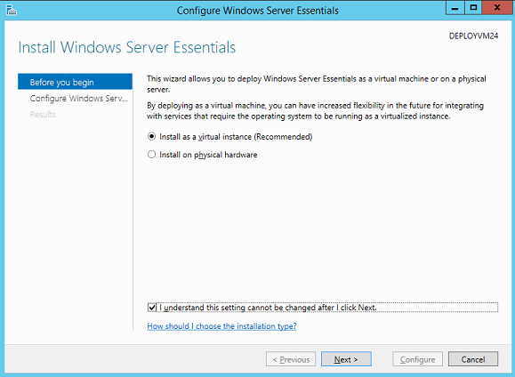
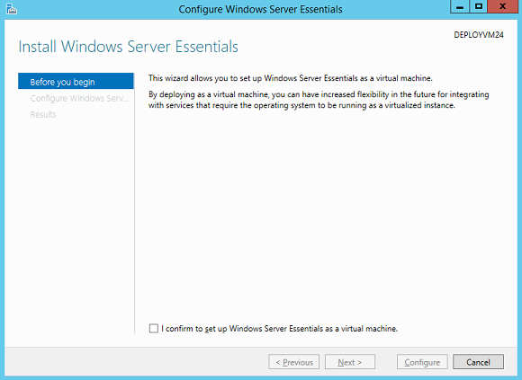

# Customize Deployment - Windows Server Essentials


Windows Server 2016 Technical Preview Essentials offers the partner an option to provide a virtualized deployment for Windows Server Essentials. By virtualizing the instance, customers can enjoy more flexibility.

After OEM has done the appropriate configuration, which will be described in detail in the later sections, the end user can choose to deploy Windows Server Essentials as a virtualized instance, or perform a physical deployment.

**Note**  
This approach applies to Windows Server 2016 Technical Preview Essentials and Windows Server 2012 R2 Essentials, as well as Windows Server 2012 R2 Standard and Windows Server 2012 R2 Datacenter with the Windows Server Essentials Experience role.

 

The user will have one of two installation variations depending on the variable: `AllowDeployOnHost`, from the OEM configuration file (discussed later in this section):

-   The end user can choose to install Windows Server Essentials as a virtual instance or on physical hardware:

    

-   The end user can deploy to virtualized instances only:

    

In either case, if end user chooses a virtualized deployment, the Windows Server Essentials host will have the Hyper-V role installed, and will be able to run VMs. The wizard creates a customized VM based on end user’s settings. To reduce the footprint on the host, you can remove Windows Server Essentials roles, other VM-hosting roles, and any other unnecessary roles. If the user chooses to do a physical deployment, the configuration wizard installs and configures the Windows Server Essentials Experience role on the physical box.

## <span id="BKMK_VM"></span><span id="bkmk_vm"></span>To prepare a virtualized deployment


Your hardware must support virtualization and it must be turned on.

You’ll need to prepare a customized image that contains the images for Windows Server Essentials Host and Windows Server Essentials Guest. To do this, perform the following steps:

-   Prepare the virtual machine image.

-   Prepare the virtual machine host.

**Prepare the virtual machine image**

1.  Put the installation media you get from Microsoft onto your technician PC. For example, insert the DVD or mount the ISO file.

2.  Copy all content from the media to a local folder, for example, C:\\essentials-image\\.

3.  Mount the Windows source image file:

    ``` syntax
    md c:\essentials-mount


    dism /Mount-Image /ImageFile:"C:\essentials-image\sources\install.wim" /Index:1 /MountDir:"C:\essentials-mount"
    ```

4.  Customize the image using DISM. The later sections provide guidance on how to customize the essentials image, such as adding branding, changing registry keys, and adding files. Depending on your needs, you can selectively apply these settings offline using DISM. If you’re just evaluating how to make a virtualized deployment, you can skip this step.

5.  Add additional language packs using DISM. For more info, see [Add Language Packs to Windows](http://go.microsoft.com/fwlink/?LinkId=321405).

6.  Commit the changes to the image.

    ``` syntax
    dism /Unmount-Image /MountDir:"C:\essentials-mount" /Commit
    ```

    Now, you have a customized Windows Server 2016 Technical Preview Essentials wim file.

7.  Depending on your needs, seal the installation into an ISO file or a VHD.

    -   To seal it to an ISO file, download the Windows Assessment and Deployment Kit (Windows ADK) and run the following commands:

        ``` syntax
        cd C:\Program Files (x86)\Windows Kits\10\Assessment and Deployment Kit\Deployment Tools\amd64\Oscdimg

        oscdimg -m -o -u2 -udfver102 -bootdata:2#p0,e,b"c:\essentials-image\boot\etfsboot.com"#pEF,e,b"c:\essentials-image\efi\microsoft\boot\efisys.bin" C:\essentials-image C:\OEMEssentials.iso
        ```

    -   To convert it to a VHDX, download the Windows Assessment and Deployment Kit (Windows ADK), download Convert-WindowsImage to C:\\scripts, and run the following command:

        ``` syntax
        powershell -c "Set-ExecutionPolicy Unrestricted; C:\scripts\Convert-WindowsImage.ps1 -VHDFormat vhdx -sizebytes 127GB –sourcepath C:\OEMEssentials.iso -vhdpath C:\OEMEssentials.vhdx"
        ```

    At this point, you have a customized image for your VM guest that contains Windows Server Essentials features, such as Remote Web Access, Dashboard, etc. You can test the image by installing it in a Hyper-V PC, and prepare a Virtual Machine Host.

**Preparing the virtual machine host:**

1.  Put the installation media you get from Microsoft onto your technician PC. For example, insert the DVD or mount the ISO file.

2.  Copy all content from the media to a local folder, for example, C:\\essentials-host-image\\.

3.  Mount the Windows source image file:

    ``` syntax
    md c:\essentials-host-mount


    dism /Mount-Image /ImageFile:"C:\essentials-host-image\sources\install.wim" /Index:1 /MountDir:"C:\essentials-host-mount"
    ```

4.  Remove Windows Server Essentials roles and any other features you do not want installed by default. For info about removing other roles, see [Remove roles](#remove-roles).

    ``` syntax
    dism /Image:C:\essentials-host-mount /Disable-Feature:"wss-product-package"
    ```

5.  if you’re configuring this on Windows Server 2016 Technical Preview Standard or Windows Server 2016 Technical Preview Datacenter, install the Windows Server Essentials role.

    ``` syntax
    dism /Image:C:\essentials-host-mount /Enable-Feature:wss-product-package /all

    dism /Image:C:\essentials-host-mount /Enable-Feature:Microsoft-Windows-ServerEssentials-ServerSetup
    ```

6.  Enable Hyper-V, Hyper-V Management PowerShell and Hyper-V Management RSAT Tools.

    ``` syntax
    dism /Image:C:\essentials-host-mount /Enable-Feature:Microsoft-Hyper-V /All

    dism /Image:C:\essentials-host-mount /Enable-Feature:Microsoft-Hyper-V-Management-Clients /All

    dism /Image:C:\essentials-host-mount /Enable-Feature:Microsoft-Hyper-V-Management-PowerShell /All
    ```

7.  Set registry key to not pop up server manager.

    ``` syntax
    reg load HKLM\test C:\essentials-host-mount\windows\system32\config\software

    reg add "HKLM\test\Microsoft\ServerManager" /v DoNotOpenServerManagerAtLogon /t REG_DWORD /d 1 /f
    ```

8.  Set registry key to specify the deployment settings.

    ``` syntax
    reg add "HKLM\test\Microsoft\Windows Server\Setup\OEM" /v DeployAsVM /t REG_SZ /d C:\DeployAsVM\ICConfig.xml /f

    reg unload HKLM\test
    ```

    <table>
    <colgroup>
    <col width="50%" />
    <col width="50%" />
    </colgroup>
    <thead>
    <tr class="header">
    <th align="left">Key</th>
    <th align="left">Value</th>
    </tr>
    </thead>
    <tbody>
    <tr class="odd">
    <td align="left"><p>Path</p></td>
    <td align="left"><p>HKLM\Software\Microsoft\Windows Server\Setup\OEM</p></td>
    </tr>
    <tr class="even">
    <td align="left"><p>Name</p></td>
    <td align="left"><p>deployasvm</p></td>
    </tr>
    <tr class="odd">
    <td align="left"><p>Type</p></td>
    <td align="left"><p>REG_SZ or REG_EXPEND_SZ</p></td>
    </tr>
    <tr class="even">
    <td align="left"><p>Value</p></td>
    <td align="left"><p>&lt;path to settings file, which can contain environment variables and/or be relative to the %SYSTEMROOT% (i.e., %WINDIR%)&gt;</p></td>
    </tr>
    </tbody>
    </table>

     

9.  Create the setting files following the Sample called C:\\ICConfig.xml and copy it to C:\\essentials-host-mount\\DeployAsVM.

    ``` syntax
    md C:\essentials-host-mount\DeployAsVM

    copy C:\ICConfig.xml C:\essentials-host-mount\DeployAsVM\ICConfig.xml
    ```

10. Integrate the Windows Server Essentials virtual guest image (\*.vhdx or \*.iso) into the Hyper-V host image.

    ``` syntax
    copy C:\OEMEssentials.vhdx  C:\essentials-host-mount\DeployAsVM\OEMEssentials.vhdx
    ```

11. Add additional language packs using DISM. For more info, see [Add Language Packs to Windows](http://go.microsoft.com/fwlink/?LinkId=321405).

    The set of languages on guest image and host image should be the same.

12. Commit the changes to the image.

    ``` syntax
    dism /unmount-Wim /MountDir:C:\essentials-host-mount /commit
    ```

13. Now, you have a customized Windows Server Essentials image file for the Host. To seal it to an ISO file:

    ``` syntax
    cd C:\Program Files (x86)\Windows Kits\10\Assessment and Deployment Kit\Deployment Tools\amd64

    oscdimg -m -o -u2 -udfver102 -bootdata:2#p0,e,bc:\essentials-host-image\boot\etfsboot.com#pEF,e,bc:\essentials-host-image\efi\microsoft\boot\efisys.bin C:\essentials-host-image C:\OEMEssentialsHost.iso
    ```

**To preconfigure Windows Server Essentials running in a VM**

1.  Evaluate roles and features you want installed by default. For more information about removing roles that are already enabled in your image, see [Remove roles](#remove-roles).

2.  Enable Hyper-V role and Hyper-V Management Tools.

3.  Set the following registry key to specify the deployment settings. For more information, see the [Samples](#bkmk-samples).

4.  Customize Windows Server Essentials VM and capture the image to an ISO file.

    **Note**  
    Your image should only support one Windows Server Essentials image.

     

### <span id="Remove_roles"></span><span id="remove_roles"></span><span id="REMOVE_ROLES"></span>Remove roles

Windows Server Essentials installs the following dependent roles by default. You can safely remove them from the Host.

<table>
<colgroup>
<col width="50%" />
<col width="50%" />
</colgroup>
<tbody>
<tr class="odd">
<td align="left"><p>[X] Essentials</p></td>
<td align="left"><p>ServerEssentialsRole</p></td>
</tr>
<tr class="even">
<td align="left"><p>[X] File and Storage Services</p></td>
<td align="left"><p>FileAndStorage-Services</p></td>
</tr>
<tr class="odd">
<td align="left"><p>[X] File and iSCSI Services</p></td>
<td align="left"><p>File-Services</p></td>
</tr>
<tr class="even">
<td align="left"><p>[X] File Server</p></td>
<td align="left"><p>FS-FileServer</p></td>
</tr>
<tr class="odd">
<td align="left"><p>[X] BranchCache for Network Files</p></td>
<td align="left"><p>FS-BranchCache</p></td>
</tr>
<tr class="even">
<td align="left"><p>[X] DFS Namespaces</p></td>
<td align="left"><p>FS-DFS-Namespace</p></td>
</tr>
<tr class="odd">
<td align="left"><p>[X] Web Server (IIS)</p></td>
<td align="left"><p>Web-Server</p></td>
</tr>
<tr class="even">
<td align="left"><p>[X] Web Server</p></td>
<td align="left"><p>Web-WebServer</p></td>
</tr>
<tr class="odd">
<td align="left"><p>[X] Common HTTP Features</p></td>
<td align="left"><p>Web-Common-Http</p></td>
</tr>
<tr class="even">
<td align="left"><p>[X] Default Document</p></td>
<td align="left"><p>Web-Default-Doc</p></td>
</tr>
<tr class="odd">
<td align="left"><p>[X] Directory Browsing</p></td>
<td align="left"><p>Web-Dir-Browsing</p></td>
</tr>
<tr class="even">
<td align="left"><p>[X] HTTP Errors</p></td>
<td align="left"><p>Web-Http-Errors</p></td>
</tr>
<tr class="odd">
<td align="left"><p>[X] Static Content</p></td>
<td align="left"><p>Web-Static-Content</p></td>
</tr>
<tr class="even">
<td align="left"><p>[X] Health and Diagnostics</p></td>
<td align="left"><p>Web-Health</p></td>
</tr>
<tr class="odd">
<td align="left"><p>[X] HTTP Logging</p></td>
<td align="left"><p>Web-Http-Logging</p></td>
</tr>
<tr class="even">
<td align="left"><p>[X] Tracing</p></td>
<td align="left"><p>Web-Http-Tracing</p></td>
</tr>
<tr class="odd">
<td align="left"><p>[X] Performance</p></td>
<td align="left"><p>Web-Performance</p></td>
</tr>
<tr class="even">
<td align="left"><p>[X] Static Content Compression</p></td>
<td align="left"><p>Web-Stat-Compression</p></td>
</tr>
<tr class="odd">
<td align="left"><p>[X] Security</p></td>
<td align="left"><p>Web-Security</p></td>
</tr>
<tr class="even">
<td align="left"><p>[X] Request Filtering</p></td>
<td align="left"><p>Web-Filtering</p></td>
</tr>
<tr class="odd">
<td align="left"><p>[X] Basic Authentication</p></td>
<td align="left"><p>Web-Basic-Auth</p></td>
</tr>
<tr class="even">
<td align="left"><p>[X] Windows Authentication</p></td>
<td align="left"><p>Web-Windows-Auth</p></td>
</tr>
<tr class="odd">
<td align="left"><p>[X] Application Development</p></td>
<td align="left"><p>Web-App-Dev</p></td>
</tr>
<tr class="even">
<td align="left"><p>[X] .NET Extensibility 4.5</p></td>
<td align="left"><p>Web-Net-Ext45</p></td>
</tr>
<tr class="odd">
<td align="left"><p>[X] ASP.NET 4.5</p></td>
<td align="left"><p>Web-Asp-Net45</p></td>
</tr>
<tr class="even">
<td align="left"><p>[X] ISAPI Extensions</p></td>
<td align="left"><p>Web-ISAPI-Ext</p></td>
</tr>
<tr class="odd">
<td align="left"><p>[X] ISAPI Filters</p></td>
<td align="left"><p>Web-ISAPI-Filter</p></td>
</tr>
<tr class="even">
<td align="left"><p>[X] Server Side Includes</p></td>
<td align="left"><p>Web-Includes</p></td>
</tr>
<tr class="odd">
<td align="left"><p>[X] Management Tools</p></td>
<td align="left"><p>Web-Mgmt-Tools</p></td>
</tr>
<tr class="even">
<td align="left"><p>[X] IIS Management Console</p></td>
<td align="left"><p>Web-Mgmt-Console</p></td>
</tr>
<tr class="odd">
<td align="left"><p>[X] ASP.NET 4.5</p></td>
<td align="left"><p>NET-Framework-45-ASPNET</p></td>
</tr>
<tr class="even">
<td align="left"><p>[X] HTTP Activation</p></td>
<td align="left"><p>NET-WCF-HTTP-Activation</p></td>
</tr>
<tr class="odd">
<td align="left"><p>[X] BranchCache</p></td>
<td align="left"><p>BranchCache</p></td>
</tr>
<tr class="even">
<td align="left"><p>[X] Group Policy Management</p></td>
<td align="left"><p>GPMC</p></td>
</tr>
<tr class="odd">
<td align="left"><p>[X] Remote Server Administration Tools</p></td>
<td align="left"><p>RSAT</p></td>
</tr>
<tr class="even">
<td align="left"><p>[X] Role Administration Tools</p></td>
<td align="left"><p>RSAT-Role-Tools</p></td>
</tr>
<tr class="odd">
<td align="left"><p>[X] File Services Tools</p></td>
<td align="left"><p>RSAT-File-Services</p></td>
</tr>
<tr class="even">
<td align="left"><p>[X] DFS Management Tools</p></td>
<td align="left"><p>RSAT-DFS-Mgmt-Con</p></td>
</tr>
<tr class="odd">
<td align="left"><p>[X] Remote Access Management Tools</p></td>
<td align="left"><p>RSAT-RemoteAccess</p></td>
</tr>
<tr class="even">
<td align="left"><p>[X] Remote Access module for Windows PowerShell</p></td>
<td align="left"><p>RSAT-RemoteAccess-PowerShell</p></td>
</tr>
<tr class="odd">
<td align="left"><p>[X] Windows Process Activation Service</p></td>
<td align="left"><p>WAS</p></td>
</tr>
<tr class="even">
<td align="left"><p>[X] Process Model</p></td>
<td align="left"><p>WAS-Process-Model</p></td>
</tr>
<tr class="odd">
<td align="left"><p>[X] Configuration APIs</p></td>
<td align="left"><p>WAS-Config-APIs</p></td>
</tr>
<tr class="even">
<td align="left"><p>[X] Windows Server Backup</p></td>
<td align="left"><p>Windows-Server-Backup</p></td>
</tr>
</tbody>
</table>

 

### <span id="BKMK_samples"></span><span id="bkmk_samples"></span><span id="BKMK_SAMPLES"></span>Sample configuration files

Virtual Machine sample file: ICConfig.xml

``` syntax
<?xml version="1.0" encoding="utf-8"?>
<DeploymentSettings
  xmlns:xsd="http://www.w3.org/2001/XMLSchema"
  xmlns:xsi="http://www.w3.org/2001/XMLSchema-instance"
  xmlns="http://schemas.microsoft.com/WindowsServer/Essentials/2013/01/ServerDeployment/Virtualization">
 <InstallationMedia>C:\DeployAsVM\OEMEssentials.vhdx </InstallationMedia>
<VMBaseDirectory> %SYSTEMROOT%\vms </VMBaseDirectory>
<VMProcessorCount>4</VMProcessorCount>
<VMMemorySizeMB>4096</VMMemorySizeMB>
<VMSystemDiskSizeGB>127</VMSystemDiskSizeGB>
<VMDataDiskSizeGB>999</VMDataDiskSizeGB>
</DeploymentSettings>
```

**Note**  
All paths can contains environment variables and/or be relative to the %SYSTEMROOT% (i.e., %WINDIR%).

 

The following table describes the deployment settings in the configuration file.

<table>
<colgroup>
<col width="50%" />
<col width="50%" />
</colgroup>
<tbody>
<tr class="odd">
<td align="left"><p>Setting</p></td>
<td align="left"><p>Description</p></td>
</tr>
<tr class="even">
<td align="left"><p>InstallationMedia</p></td>
<td align="left"><p>Specify the path to the image that will be used for the virtual guest instance of Windows Server Essentials. It can be in .iso or .vhdx format.</p></td>
</tr>
<tr class="odd">
<td align="left"><p>AllowDeployOnHost</p></td>
<td align="left"><p>(Optional) Specify whether the physical installation option is available.</p>
<p>If the value is &quot;true&quot;, the user sees options for either a physical or a virtual installation.</p>
<p>If the value is &quot;false&quot;, the user only sees option for the virtual installation.</p></td>
</tr>
<tr class="even">
<td align="left"><p>VMBaseDirectory</p></td>
<td align="left"><p>(Optional) Specify where the VM file is located.</p></td>
</tr>
<tr class="odd">
<td align="left"><p>VMProcessorCount</p></td>
<td align="left"><p>(Optional) Specify the number of logical processor cores assigned to the VM.</p></td>
</tr>
<tr class="even">
<td align="left"><p>VMMemorySizeMB</p></td>
<td align="left"><p>(Optional) Specify the size of memory size allocated to the VM. By default it will use the 80% of available Memory for VM.</p></td>
</tr>
<tr class="odd">
<td align="left"><p>VMSystemDiskSizeGB</p></td>
<td align="left"><p>(Optional) Specify the size of system drive. By default it is 127GB.</p></td>
</tr>
<tr class="even">
<td align="left"><p>VMDataDiskSizeGB</p></td>
<td align="left"><p>(Optional) Specify the size of the data drive. By default it will use the available space of the hard disk. Your total size of hard drives shouldn’t exceed the physical capacity of the disk.</p></td>
</tr>
</tbody>
</table>

 

### <span id="BKMK_BP"></span><span id="bkmk_bp"></span>Best Practices

-   Make sure your hardware has virtualization capability turned on.

-   After installation the Windows Server Essentials VM is not activated by default. Please instruct your customer to activate the image using the product key you provided.

-   If you ship a multi-language image to your customer, please make sure you have the same set of languages available for the VM Host and guest. The language for the guest VM will be the same as the VM Host.

-   If you want to prepare a factory reset DVD for your customer, make sure you include the installation media for the VM and the necessary settings in the DVD image. If the image size exceeds the size of a DVD9, consider using multiple DVDs for your image.

-   We highly recommended that your use .vhdx instead of .iso for your installation media. This provides your customer with faster deployment.

-   This deployment type is only applicable when you ship Windows Server Essentials.

-   If your hardware doesn’t support virtualization, do not specify the registry key as described in previous section. Then Essentials will be set up on the physical server.

### <span id="Using_the_Windows_Server_Essentials_role_on_Windows_Server_Standard_Datacenter"></span><span id="using_the_windows_server_essentials_role_on_windows_server_standard_datacenter"></span><span id="USING_THE_WINDOWS_SERVER_ESSENTIALS_ROLE_ON_WINDOWS_SERVER_STANDARD_DATACENTER"></span>Using the Windows Server Essentials role on Windows Server Standard/Datacenter

An OEM or System Builder can ship Windows Server 2016 Technical Preview Standard or Windows Server 2016 Technical Preview Datacenter with the Windows Server Essentials Experience role. If the end user wants to configure Windows Server Essentials Experience once they finished OS setup, similar as what they do on Windows Server Essentials edition, they can add it in by using DISM.

**Show the Windows Server Essentials configuration wizard**

1.  Start the installation media you get from Microsoft and put in on your technician PC.

2.  Put the installation media you get from Microsoft onto your technician PC. For example, insert the DVD or mount the ISO file.

3.  Copy all content from the media to a local folder, for example, C:\\essentials-image\\.

4.  Mount the image. Use `/Index:2` for Windows Server 2016 Technical Preview Standard or `/Index:4` for Windows Server 2016 Technical Preview Datacenter.

    ``` syntax
    md c:\essentials-mount

    dism /Mount-Image /ImageFile:"C:\essentials-mount\sources\install.wim" /Index:4 /MountDir:"C:\essentials-mount"
    ```

5.  Enable the Windows Server Essentials Experience.

    ``` syntax
    dism /Image:C:\essentials-mount /enable-feature:wss-product-package /all

    dism /Image:C:\essentials-mount /enable-feature:Microsoft-Windows-ServerEssentials-ServerSetup
    ```

6.  Set registry key to not open the Server Manager dialog at logon.

    ``` syntax
    reg load HKLM\test C:\essentials-mount\windows\system32\config\software

    reg add "HKLM\test\Microsoft\ServerManager" /v DoNotOpenServerManagerAtLogon /t REG_DWORD /d 1 /f

    reg unload HKLM\test
    ```

7.  Commit the changes to the image.

    ``` syntax
    dism /Unmount-Image /MountDir:"C:\essentials-mount" /Commit
    ```

8.  Seal it to an ISO file:

    ``` syntax
    cd C:\Program Files (x86)\Windows Kits\10\Assessment and Deployment Kit\Deployment Tools\amd64\Oscdimg

    oscdimg -m -o -u2 -udfver102 -bootdata:2#p0,e,b"c:\essentials-image\boot\etfsboot.com"#pEF,e,b"c:\essentials-image\efi\microsoft\boot\efisys.bin" C:\essentials-image C:\OEMEssentials.iso
    ```

 

 

[Send comments about this topic to Microsoft](mailto:wsddocfb@microsoft.com?subject=Documentation%20feedback%20%5Bp_wse_adk\p_wse_adk%5D:%20Customize%20Deployment%20-%20Windows%20Server%20Essentials%20%20RELEASE:%20%284/11/2016%29&body=%0A%0APRIVACY%20STATEMENT%0A%0AWe%20use%20your%20feedback%20to%20improve%20the%20documentation.%20We%20don't%20use%20your%20email%20address%20for%20any%20other%20purpose,%20and%20we'll%20remove%20your%20email%20address%20from%20our%20system%20after%20the%20issue%20that%20you're%20reporting%20is%20fixed.%20While%20we're%20working%20to%20fix%20this%20issue,%20we%20might%20send%20you%20an%20email%20message%20to%20ask%20for%20more%20info.%20Later,%20we%20might%20also%20send%20you%20an%20email%20message%20to%20let%20you%20know%20that%20we've%20addressed%20your%20feedback.%0A%0AFor%20more%20info%20about%20Microsoft's%20privacy%20policy,%20see%20http://privacy.microsoft.com/default.aspx. "Send comments about this topic to Microsoft")


