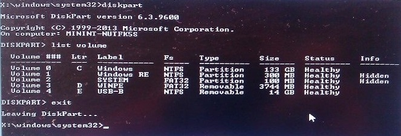
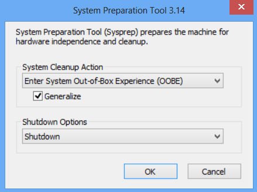
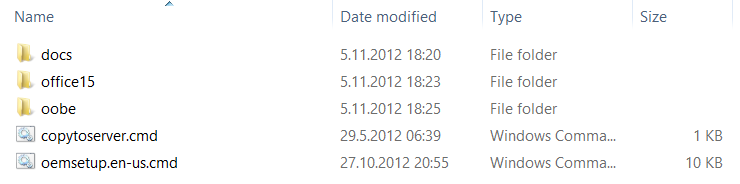
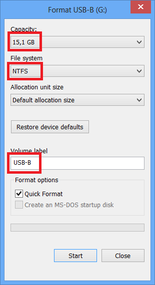

Windows 10 Deployment Whitepaper for System Builders

v1.00

Microsoft Corporation

Jan 2016

The information contained in this document represents the current view of Microsoft Corporation and its Affiliates ("Microsoft") on the issues discussed as of the date of publication. Because Microsoft must respond to changing market conditions, it should not be interpreted to be a commitment on the part of Microsoft, and Microsoft cannot guarantee the accuracy of any information presented after the date of publication.

MICROSOFT MAKES NO WARRANTIES, EXPRESS OR IMPLIED, AS TO THE INFORMATION IN THIS DOCUMENT.

Complying with all applicable copyright laws is the responsibility of the user. Without limiting the rights under copyright, no part of this document may be reproduced, stored in or introduced into a retrieval system, or transmitted in any form or by any means (electronic, mechanical, photocopying, recording, or otherwise), or for any purpose, without the express written permission of Microsoft Corporation.

Microsoft may have patents, patent applications, trademarks, copyrights, or other intellectual property rights covering subject matter in this document. Except as expressly provided in any written license agreement from Microsoft, the furnishing of this document does not give you any license to these patents, trademarks, copyrights, or other intellectual property.

Unless otherwise noted, the example companies, organizations, products, domain names, e-mail addresses, logos, people, places and events depicted herein are fictitious, and no association with any real company, organization, product, domain name, e-mail address, logo, person, place or event is intended or should be inferred.

Microsoft does not make any representation or warranty regarding specifications in this document or any product or item developed based on these specifications. Microsoft disclaims all express and implied warranties, including but not limited to the implied warranties or merchantability, fitness for a particular purpose and freedom from infringement. Without limiting the generality of the foregoing, Microsoft does not make any warranty of any kind that any item developed based on these specifications, or any portion of a specification, will not infringe any copyright, patent, trade secret or other intellectual property right of any person or entity in any country. It is your responsibility to seek licenses for such intellectual property rights where appropriate. Microsoft shall not be liable for any damages arising out of or in connection with the use of these specifications, including liability for lost profit, business interruption, or any other damages whatsoever. Some states do not allow the exclusion or limitation of liability or consequential or incidental damages; the above limitation may not apply to you.

© 2016 Microsoft Corporation. All rights reserved.

Microsoft, Windows, Windows 10, Windows 8.1, Windows 8, Windows 7 and Windows Vista are either registered trademarks or trademarks of Microsoft Corporation in the United States or other countries or regions.

The names of actual companies and products mentioned herein may be the trademarks of their respective owners.

# Contents

Use this guide to deploy Windows® 10 to a line of computers by following these steps:

# Summary

The purpose of this whitepaper is to document a prescriptive method for Windows 10 deployment which includes online and offline customizations, targeting system builders for both 64bit and 32bit configurations.

This is a step-by-step guide intended to provide information about Windows 10 deployment requirements as well as enabling the OEMs to include/exclude optional steps due to their specific deployment environment.

# Intended Audience

This procedure is specially targeted for system builders and applies to all Windows 10 client operating system versions. This document addresses level 200 technicians on Windows deployment. In order to complete level 100 please refer to “Getting Started with the Windows ADK” document (ADK\_GetStarted.chm) under Windows 10 ADK installation directory. You may prefer to refer to external resources like [TechNet](http://technet.microsoft.com/) and [MSDN](http://www.msdn.com/) as well

# Introduction

# Prepare Your Lab Environment

In this step you will set up your lab environment, which includes installing the latest Windows 10 ADK tools onto your designated technician computer. Technician computer must be installed Windows 10 x64 if you are going to do x64 image deployment or Windows 10 x86 for x86 image deployment. Incorrect configurations may result in supported architecture mismatch while using deployment tools in the Windows 10 ADK. Please see ***Differences Between 64-bit and 32-bit Deployment*** section to obtain further information about 64-bit vs 32-bit deployment

Before starting the deployment procedure OEM requires to download certain kits which will be used throughout the whitepaper from [OEM Partner Center](http://www.microsoft.com/oem/en/pages/index.aspx#fbid=7JcJYKYGEfo) -&gt; “Downloads and Installation” -&gt; “Understanding ADKs and OPKs”. In order to see the list of resources/kits that will be used and where to obtain them, please see ***What You Must Obtain & From Where*** section

You will use a USB hard drive called USB-B to move files between computers, run scripts and store&apply created images and another USB hard drive called USB-A to boot the system in WinPE.

<table>
<th>USB Hard Drive Name</th>
<th>Format</th>
<th>Minimum Size</th>
<tr>
<td>USB-A</td>
<td>FAT32</td>
<td>~4GB</td>
</tr>
<tr>
<td>USB-B</td>
<td>NTFS</td>
<td>
~16GB x86

~32GB amd64
</td>
</tr>
</table>

USB-B will be used to store deployment, recovery scripts and sample answer files. Please see *Creating My USB-B* section to create your own USB-B

**Procedures throughout the document are highly dependent on the sample files contained in** USB-B **therefore it is recommended to complete Creating My** USB-B **section before starting **

## Customizations Throughout the document

| **Pass**        | **Setting**                              | **Action**                                                            |
|-----------------|------------------------------------------|-----------------------------------------------------------------------|
| **Windows PE**  | Setup UI Language                        | EN-US                                                                 |
|                 | User Data                                | Preinstallation Product Key for ODR - Defined                         |
| **Specialize**  | IE Home Page                             | in the answer file                                                    |
|                 | OEM Name                                 | Defined in the answer file                                            |
|                 | OEM Logo                                 | Defined in the answer file                                            |
|                 | Model                                    | Defined in the answer file                                            |
|                 | Support Info                             | Defined in the answer file                                            |
| **Oobe System** | Reseal                                   | Audit/OOBE                                                            |
|                 | StartTiles                               | Square Tiles / SquareOrDesktopTiles set to pin only desktop apps      |
|                 | TaskbarLinks (up to 6 pinned .lnk files) | Paint and Control Panel shortcuts have been set                       |
|                 | Themes                                   | Custom Theme with the OEM logo as the desktop background has been set |
|                 | Visual Effects                           | SystemDefaultBackground set                                           |

## Additional Customizations

### Product Deployment

-   Office Single Image v15.4 OPK preloaded

### Image Customization

Adding language interface packs to Windows implemented

Adding Drivers and Update Packages implemented

Adding OEM Specific Logo and background files to Windows implemented

Image size optimization implemented

Pinning desktop apps to start sceen implemented

## Section 1. Create WinPE bootable USB

**Windows 10 version distinction RTM/1511**

**Windows 10 RTM:**

**OBTAIN**: [**Windows 10 ADK**](http://download.microsoft.com/download/8/1/9/8197FEB9-FABE-48FD-A537-7D8709586715/adk/adksetup.exe) **(Link will run ADKSetup.exe)**

**Windows 10 Version 1511:**

**Obtain:** [**Windows 10 ADK**](http://download.microsoft.com/download/3/8/B/38BBCA6A-ADC9-4245-BCD8-DAA136F63C8B/adk/adksetup.exe) **(Link will run ADKSetup.exe)**

**Important: OEM must use the matching version of ADK for the images being customized. If building an image using RTM image use Windows 10 RTM ADK. If using Windows 10 1511 image use Windows 10 1511 ADK.**

**REFERENCE**: Please see [Windows 10 ADK Documentation Homepage](https://technet.microsoft.com/library/mt297512.aspx) for details and more information

1.  Follow the on-screen instructions to install the Windows ADK, including the **Deployment Tools**, **Windows Preinstallation Environment**, and **Windows Assessment Toolkit** features.

    

1.  Run **Deployment and Imaging Tools Environment** with elevated permissions from Start Menu

2.  Windows 10 ADK allows you to create **Windows PreInstallation Environment**. Copy base WinPE to new folder.

    **x64/x86 distinction:** *IF you will be using x64 Windows 10 image, copy x64 WinPE folder structure:*

    Copype amd64 C:\\winpe\_amd64

    *IF you will be using x86 Windows 10 image, copy x86 WinPE folder structure:*

    Copype x86 C:\\winpe\_x86

1.  You may add packages and/or drivers to WinPE here

2.  Connect USB Drive size at least 4GB. ***USB-A, FAT32, ~4GB***

    

3.  Make the inserted USB a new WinPE bootable USB

    **x64/x86 distinction:**

    *x64 Windows 10 image, make x64 WinPE USB:*

    MakeWinPEMedia /UFD C:\\winpe\_amd64 F:

    *(Where F: is the drive letter of USB)*

    *x86 Windows 10 image, make x86 WinPE USB:*

    MakeWinPEMedia /UFD C:\\winpe\_x86 F:

    *(F: is the drive letter of USB)*

## Section 2. Install Windows with Basic Customizations

**OBTAIN**: Please obtain Windows 10 x86/x64 DVD media which you will be obtaining from Microsoft Authorized Distributor

**REFERENCE**: Please see [Windows Guidelines for System Builders](http://www.microsoft.com/oem/en/pages/download.aspx?wpid=w_w8_129) and [Windows Policy for System Builders](https://oem.microsoft.com/downloads/worldwide/windows_10/Windows_10_Policy_SB.pdf) documents to tailor your customizations defined in unattend.xml file.

1.  Copy *sources\\**Install.wim*** file from the directory in Windows 10 media which you will be deploying, to your local Desktop (~3gb)

    

1.  Run **Windows System Image Manager** to start creating an answer file from scratch. This tool allows you to create or manage your answer files in an easy and organized manner.

    

1.  Navigate to *File &gt; Select Windows Image*. Browse to your local desktop and select **Install.wim**. Catalog file will be created (.clg file) for that specified wim.

    **TROUBLESHOOT**: Catalog creation may fail due to several reasons. Please make sure install.wim has read/write permissions. If you continue getting error, make sure correct architecture (x86 or x64) Windows 10 is installed on technician computer. If you are creating catalog for x64 Windows 10 image, you are required to use x64 Windows 10 installed on x64 Windows 10 computer. Install.wim image and Windows 10 ADK versions must be the same.

1.  Open a sample answer file or create a new one.

    -   This is the sample answer file included in the USB-B:

        USB-B\\ConfigSet\\AutoUnattend.xml

1.  Associate the answer file with the Windows Image by clicking **OK** at the prompted message box to add a driver to Windows PE, click **Insert** select **Driver Path** and select pass **1 windowsPE** and then browse to the driver. Note: This step is optional and only required if a third-party driver is needed for use in the Windows Preinstallation Enviornment. This step is optional

2.  To add a package, click **Insert** select **Package** and then browse to the package you want to add. This step is optional

### 2.1. Customize Answer File

**TROUBLESHOOT**: Blank character in **specialize | Microsoft-Windows-Shell-Setup | Computer Name** will result in Windows installation failure.

1.  Please see an example of an answer file for basic customizations:

    -   USB-B\\ConfigSet\\AutoUnattend.xml

    You may use the sample answer file and modify relevant parts or start from scratch by specifying some basic customizations.

    **OBTAIN**: Please see and use Windows 10 default product key from [OEM Partner Center](https://www.microsoft.com/OEM/en/products/windows/Pages/windows-10-build.aspx#fbid=nV7H02bHHiv) listed under “Default product keys” tab

1.  Add a product key that matches the Windows edition. This key isn't used to activate Windows, so you can reuse the same key for multiple installations:

    -   In the **Answer File** pane, select **Components\\1 windowsPE\\amd64\_Microsoft-Windows-Setup\_neutral\\UserData\\ProductKey**. In the **ProductKey Properties** pane, under **Settings**, enter the value next to Key.

    **IMPORTANT:** These product keys *cannot* be used for activation. You will need to type a software product key during the installation process for activation. These keys will be removed when sysprep generalize is run. The end user will be required to type the unique product key from the Certificate of Authenticity (COA) label when first booting Windows 10

1.  Add your support information:

    In the **Answer File** pane, select **Components\\4 specialize\\amd64\_Microsoft-Windows-Shell-Setup\_neutral\\OEMInformation**.

    In the **OEMInformation Properties** pane, in the **Settings** section, update the following values: company name (Manufacturer), hours (SupportHours), phone number (SupportPhone), and website (SupportURL).

1.  Prepare your computer to boot to audit mode after the Windows installation is complete:

    In the **Windows Image** pane, expand **Components**, right-click **amd64\_ Microsoft-Windows-Deployment**, and then select **Add Setting to Pass 7 oobeSystem**.

    In the **Answer File** pane, select **Components\\7 oobeSystem\\amd64\_ Microsoft-Windows- Deployment \_neutral\\Reseal**.

    In the **Reseal Properties** pane, in the **Settings** section, add the following value: Mode =Audit.

1.  Set the Internet Explorer home page:

    In the **Windows Image** pane, right-click **amd64\_Microsoft-Windows-IE-InternetExplorer**, and then select **Add Setting to Pass 4 specialize**.

    In the **Answer File** pane, select **Components\\4 specialize\\amd64\_Microsoft-Windows- Microsoft-Windows-IE-InternetExplorer\_neutral**.

    In the **IE-InternetExplorer Properties** pane, in the **Settings** section, select Home\_page, and add the URL of your website.

1.  OEMs can specify Disk Configuration which is used to create/modify disk partitions and set image installation partition. This step is optional and configuration is included in the sample answer file USB-B\\ConfigSet\\AutoUnattend.xml

    Save the answer file to USB-B

    \\ConfigSet\\AutoUnattend.xml and close Windows SIM

### 2.2. Install Windows

1.  Please complete ***Creating My** USB-B* section before skipping this step to make sure Windows installation files have been copied to **myWindows** directory in USB-B

2.  Boot reference computer and insert USB-A

3.  After WinPE has been booted, insert USB-B

    **TROUBLESHOOT**: IF booting with USB fails, please make sure you have prioritized USB boot instead of HDD boot. To do so, enter BIOS menu and adjust boot sequence as choosing the first option as USB boot.

1.  Type *diskpart* and hit enter to start Diskpart. Then type *list volume* to identify volume label of USB-B (For example: E:\\). Finally type *exit* to quit Diskpart

    

1.  Use the following command to start installation. This command triggers *setup.exe* with an answer file to install Windows 10 with additional customizations

    Xcopy /herky e:\\configset\\$oem$ e:\\MyWindows\\Sources\\$OEM$

    E:\\myWindows\\setup.exe /unattend:E:\\ConfigSet\\AutoUnattend.xml

1.  After installation files have been copied, disconnect USB-A.

2.  Disconnect USB-B right after computer reboots

### 2.3. Verify Customizations in Audit Mode

**IMPORTANT**: Connecting the computer to internet is not recommended during manufacturing stages. It is not recommended to get the updates from Windows Update in audit mode. This will likely generate an error while generalize + syspreping the machine from audit mode.

1.  After setup has been finished computer logs into Windows in Audit mode automatically as an Administrator.

2.  Click the *Desktop tile* to show the desktop and you should see the Sysprep window

3.  Verify your changes which you’ve stated in the answer file (see manufacturer name, support phone number” and other customizations)

    

1.  The image must be generalized before being used as a manufacturing image; Select **Generalize** checkbox

2.  In the System Cleanup Action box select **Enter System Out-of-Box Experience**

3.  In the shutdown options box select **Shutdown**

## Section 3. Capture an Image

1.  Boot reference computer and connect USB-A

2.  After WinPE has been booted connect USB-B

    **TROUBLESHOOT**: IF booting with USB fails, please make sure you have prioritized USB boot instead of HDD boot. To do so step in BIOS menu and adjust boot sequence as choosing the first option as USB boot. As the system continues booting from HDD, Windows will enter specialize and then OOBE pass. In order to capture a generalized and stable image none of the Windows passes must be completed. To generalize the image again, hit CTRL+SHIFT F3 to skip OOBE and boot in Audit mode. In Audit mode Sysprep the system by OOBE Reboot and Generalize switches. After the system reboots please make sure to boot from USB-A to WinPE.

1.  Type *diskpart* and hit enter to start Diskpart. Then type *list volume* to identify volume label of Windows installation volume labelled “Windows” (For example: C:\\). Finally type *exit* to quit Diskpart

2.  Capture the image of the windows partition to USB-B. This process takes several minutes.

    MD E:\\scratchdir

    Dism /Capture-Image /CaptureDir:C:\\ /ImageFile:E:\\Images\\ThinImage.wim /Name:"myWinImage" /scratchdir:e:\\scratchdir

    (C:\\ is the volume label of currently installed Windows. E:\\ is the volume label of USB-B)

## Section 4. Update Images for Each Model: Offline Servicing

1.  Before mounting and editing the image please take a backup copy in the same directory and rename the image which will be modified as ModelSpecificImage.wim

    Copy E:\\Images\\ThinImage.wim E:\\Images\\ModelSpecificImage.wim

### 4.1. Mounting Images

1.  Mount Windows image (ModelSpecificImage.wim) This process extracts the contents of the image file to a location where you can view and modify the mounted image.

    Md C:\\mount\\windows

    Dism /Mount-Wim /WimFile:E:\\Images\\ModelSpecificImage.wim /index:1 /MountDir:C:\\mount\\windows

    *(where E:\\ is the drive letter of USB-B)*

1.  Mount Windows RE Image file.

    Md c:\\mount\\winre

    Dism /Mount-Image /ImageFile:C:\\mount\\windows\\Windows\\System32\\Recovery\\winre.wim /index:1 /MountDir:C:\\mount\\winre

    **TROUBLESHOOT**: If mounting operation fails, make sure that you are using the Windows 10 version of DISM that is installed with the Windows ADK and not an older version from your technician computer. Don’t mount images to protected folders, such as your User\\Documents folder. If DISM processes are interrupted, consider temporarily disconnecting from the network and disabling virus protection.

    

    

### 4.2. Modifying Images

#### 4.2.1. Adding Drivers

**x64/x86 distinction:** *IF you will be using x64 Windows 10 image, add x64 drivers or if you will be using x86 Windows 10 image add x86 drivers.*

1.  Adding driver packages one by one. (.inf files) SampleDriver\\driver.inf is a **sample** driver package that is specific to the computer model. (Type your own specific driver path) **If you have multiple driver packages please skip to the next step**

    Dism /Add-Driver /Image:C:\\mount\\windows /Driver:"C:\\SampleDriver\\driver.inf"

    Dism /Add-Driver /Image:C:\\mount\\winre /Driver:"C:\\SampleDriver\\driver.inf"

1.  Multiple drivers can be added on one command line if you specify a folder instead of an .inf file. To install all of the drivers in a folder and all its subfolders use the **/recurse** option.

    Dism /Image:C:\\mount\\windows /Add-Driver /Driver:c:\\drivers /Recurse

1.  Review the contents of the %WINDIR%\\Inf\\ (C:\\mount\\windows\\Windows\\Inf\\) directory in the mounted Windows image to ensure that the .inf files were installed. Drivers added to the Windows image are named Oem\*.inf. This is to ensure unique naming for new drivers added to the computer. For example, the files MyDriver1.inf and MyDriver2.inf are renamed Oem0.inf and Oem1.inf.

2.  Verify your driver has been installed for both images

    Dism /Image:C:\\mount\\windows /Get-Drivers

    Dism /Image:C:\\mount\\winre /Get-Drivers

**IMPORTANT**: IF the driver contains only the installer package and doesn’t have an .inf file, you may choose to install the driver in AUDIT mode in **Section 6** by double-clicking the corresponding installer package. Some drivers may be incompatible with Sysprep tool that they will be removed after sysprep generalize even if they have been injected offline.

In this two cases, you would require to add an extra parameter to USB-B\\AnswerFiles\\UnattendSysprep.xml in order to persist the drivers in the image when the image will be generalized.

&lt;PersistAllDeviceInstalls&gt;true&lt;/PersistAllDeviceInstalls&gt;

property must be added to USB-B\\AnswerFiles\\UnattendSysprep.xml during generalize pass in order to persist the drivers in the image. Please refer to [TechNet link](http://technet.microsoft.com/library/ff716298.aspx) about the details of this property and how to add it to an answer file

#### 4.2.2. Add Language Interface packs

**OBTAIN**: Download Windows 10 Language Interface Packs from [OEM Partner Center](https://www.microsoft.com/OEM/en/installation/downloads/Pages/Windows-10-v1511-Language-Interface-Packs.aspx#fbid=nV7H02bHHiv) under “LIPs” tab

**Reference:** [Add Language Interface Packs to Windows 10](https://msdn.microsoft.com/library/windows/hardware/dn898477.aspx)

**Important: LIP Versions must matching other Windows components versions for Image and ADK**

**x64/x86 distinction:** *If you will be using x64 Windows 10 image, install x64 LIPs or if you will be using x86 Windows 10 image install x86 LIPs*

1.  Copy LIP folder to USB-B\\LanguagePack\\x64 or USB-B\\LanguagePack\\x86 folder:

    

1.  Apply LIP to mounted image

    **x64/x86 distinction**

    ***Amd64 architecture***

    Dism /image:C:\\mount\\windows /add-package /packagepath:e:\\LanguagePacks\\amd64\\ga-ie\\lp.cab

    ***X86 architecture***

    Dism /image:C:\\mount\\windows /add-package /packagepath:e:\\LanguagePacks\\x86\\ga-ie\\lp.cab

**Important: Do not install a language pack after an update. If an update (hotfix, general distribution release \[GDR\], or service pack \[SP\]) is installed that contains language-dependent resources before a language pack is installed, the language-specific changes that are contained in the update are not applied the update will need to be reinstalled. Always install language packs before installing updates.**

#### 4.2.3. Adding Update Packages

**x64/x86 distinction:** *IF you will be using x64 Windows 10 image, add x64 update packages or if you will be using x86 Windows 10 image add x86 update packages*

**OBTAIN**: Obtain update packages by downloading from [Microsoft Update Catalog](http://catalog.update.microsoft.com/v7/site/Home.aspx)

1.  Run Internet Explorer and navigate to [Microsoft Update Catalog](http://catalog.update.microsoft.com/v7/site/Home.aspx) webpage. Please see the essential updates from *What You Must Obtain & From Where* section which you should obtain from Microsoft Update Catalog.

2.  Type every single update package one by one into the search box and click **Search**.

    

1.  After seeing search is competing, click **Add** next to the version and architecture of the package you wish to download.

    

1.  After you’ve added all of the below listed updates, click **view basket** and then **Download**.

    
    
    

    **TROUBLESHOOT:** IF you encounter an error as “The website has encountered a problem” after clicking “Download”, try turning off the pop-up blocker in IE or disabling Protected Mode in IE temporarily

    

1.  After downloading all the listed essential updates, add **update packages** (KB packages) to the image one by one by using the following command

    *x64/x86 distinction*

    ***Amd64 architecture***

    Dism /Add-Package /Image:C:\\mount\\windows /PackagePath:"C:\\SampleUpdatePackages\\Windows10-KB3118754-x64.msu”

    ***X86 architecture***

    Dism /Add-Package /Image:C:\\mount\\windows /PackagePath:"C:\\SampleUpdatePackages\\Windows10-KB3118754-x86.msu”

1.  Add updates to winre.wim where apply, not all updates apply to winre.wim

    *x64/x86 distinction*

    ***Amd64 architecture***

    Dism /Add-Package /Image:C:\\mount\\winre /PackagePath:"C:\\SampleUpdatePackages\\Windows10-KB3118754-x64.msu”

    ***X86 architecture***

    Dism /Add-Package /Image:C:\\mount\\winre /PackagePath:"C:\\SampleUpdatePackages\\Windows10-KB3118754-x86.msu”

#### 4.2.4. Adding OEM Specific Visual Customizations

1.  Create OEM folder under C:\\mount\\windows\\Windows\\system32\\ directory.

2.  Copy the OEM logo to C:\\mount\\windows\\Windows\\system32\\OEM\\**FabrikamLogo.bmp** directory which will be mapped in unattend file in **OEM Information | Logo** property.

    See the below image to add OEM logo in an answer file.

    -   %windir%\\system32\\OEM\\FabrikamLogo.bmp

    **REFERENCE:** OEM Logo file must be in .bmp format and in 120px x 120px size. Please see Windows Guidelines for System Builders for OEM Logo details.

    

1.  To display an OEM specific desktop background picture, the image file must be placed in %windir%\\system32\\OEM\\**Fabrikam.bmp** directory. Verify that the path is same in answer file corresponding to oobeSystem &gt; Microsoft-Windows-Shell-Setup &gt; Themes &gt; DesktopBackground property. See the below image to add desktop background in an answer file.

    

#### 4.2.5. Modify Start Layout

The Start tile layout in Windows 10 provides OEMs the ability to append tiles to the default Start layout to include Web links, secondary tiles, classic Windows applications, and universal Windows apps. OEMs can use this layout to make it applicable to multiple regions or markets without duplicating a lot of the work. In addition, OEMs can add up to three default apps to the frequently used apps section in the system area, which delivers sytem-driven lists o the user including important or frequently accessed system locations and recently installed apps.

1.  Create Layoutmodification.xml.

    **Note: It is recommended to start with the sample on** USB-B**\\StartLayout\\layoutModification.xml as it conforms to the samples in this document (Example Only).**

    The Sample LayoutModification.xml shows two groups called “Fabrikam Group 1” and “Fabrikam Group 2”, which contain tiles that will be applied if the device country/region matches what’s specified in Region (in this case, the regions are Germany and United States). Each group contains three tiles and the various elements you need to use depending on the tile that you want to pin to Start.

    Keep the following in mind when creating your LayoutModification.xml file:

    - If you are pinning a Classic Windows application using the **start:DesktopApplicationTile** tag and you don’t know the application’s application user model ID, you need to create a .lnk file in a legacy Start Menu directory before first boot.

    - If you use the **start:DesktopApplicationTile** tag to pin a legacy .url shortcut to Start, you must create a .url file and add this file to a legacy Start Menu directory before first boot.

    For the above scenarios, you can use the following directories to put the .url or .lnk files:

    - %APPDATA%\\Microsoft\\Windows\\Start Menu\\Programs\\

    - %ALLUSERSPROFILE%\\Microsoft\\Windows\\Start Menu\\Programs\\

1.  Save the LayoutModification.xml file.

2.  Add your LayoutModification.xml file to the Windows image. You’ll need to put the file in the following specific location before first boot. If the file exists, you should replace the LayoutModification.XML that is already included in the image.

    Copy E:\\StartLayout\\layoutmodification.xml c:\\mount\\windows\\users\\default\\AppData\\Local\\Microsoft\\Windows\\Shell\\

    Where E: is the drive letter of USB-B

1.  If you pinned tiles that require .url or .lnk files, add the files to the following legacy Start Menu directories :

    1.  %APPDATA%\\Microsoft\\Windows\\Start Menu\\Programs\\

    2.  %ALLUSERSPROFILE%\\Microsoft\\Windows\\Start Menu\\Programs\\

    Copy e:\\StartLayout\\Bing.url “C:\\mount\\windows\\ProgramData\\Microsoft\\Windows\\Start Menu\\Programs\\”

    Copy e:\\StartLayout\\Paint.lnk "c:\\mount\\windows\\ProgramData\\Microsoft\\Windows\\Start Menu\\Programs"

    Copy E:\\StartLayout\\Bing.url “c:\\mount\\windows\\users\\All Users\\Microsoft\\Windows\\Start Menu\\Programs”

    Copy E:\\StartLayout\\Paint.lnk “C:\\Mount\\Windows\\Users\\All Users\\Microsoft\\Windows\\Start Menu\\Programs”

    **Note: If you don’t create a LayoutModification.xml file and you continue to use the Start Unattend settings, the OS will use the Unattend answer file and take the first 12 SquareTiles or DesktoporSquareTiles settings specified in the Unattend file. The system then places these tiles automatically within the newly-created groups at the end of Start—the first six tiles are placed in the first OEM group and the second set of six tiles are placed in the second OEM group. If OEMName is specified in the Unattend file, the value for this element is used to name the OEM groups that will be created.**

#### Modify Answer File

The System Builder may want to make additional customizations through an unattend file. The sample unattend file on USB-B contains additional commone customizations.

    Copy /y E:\\AnswerFiles\\Unattend.xml C:\\Mount\\Windows\\Windows\\Panther

    (where E:\\ is USB-B**)**

### 4.3. Optimize WinRE

1.  Increase scratchspace size.

    Dism /image:c:\\mount\\winre /set-scratchspace:512

1.  Cleanup unused files and reduce size of winre.wim

    Dism /image:"c:\\mount\\winre" /Cleanup-Image /StartComponentCleanup /Resetbase

### 4.4. Unmounting Images

1.  Close all applications that might access files from the image

2.  Comit the changes and unmount the Windows RE image:

    Dism /Unmount-Image /MountDir:"C:\\mount\\winre" /Commit

    where C is the drive letter of the drive that contains the image.

    This process can take a few minutes.

1.  Make a backup copy of the updated Windows RE image:

    **Troubleshoot: If you cannot see winre.wim under the specified directory, use the following command to set the file visible:**

    attrib -h -a -s C:\\mount\\windows\\Windows\\System32\\Recovery\\winre.wim

    Dism /export-image /sourceimagefile:c:\\mount\\windows\\windows\\system32\\recovery\\winre.wim /sourceindex:1 /DestinationImageFile:e:\\images\\winre\_bak.wim

    Del c:\\mount\\windows\\windows\\system32\\recovery\\winre.wim

    Copy e:\\images\\winre\_bak.wim c:\\mount\\windows\\windows\\system32\\recovery\\winre.wim

    When prompted, specify **F** for file

1.  Check the new size of the Windows RE image.

    Dir "C:\\mount\\windows\\Windows\\System32\\Recovery\\winre.wim"

    Follow the below partition layout size chart to determine the size of your recovery partition in createartitions-&lt;firmware&gt;.txt files. The amount of free space left is after you copy winre.wim to the hidden partition.

    Please reference [Disk Partition rules](https://technet.microsoft.com/library/hh824839.aspx#DiskPartitionRules) for more information.

    If the partition is less than 500 MB, it must have at least 50 MB of free space.

    If the partition is 500 MB or larger, it must have at least 320 MB of free space.

    If the partition is larger than 1 GB, we recommend that it should have at least 1 GB free.

    rem == 3. Windows RE tools partition =============== create partition primary size=500

    Optional: This section assumes you’d rather keep winre.wim inside of install.wim to keep your languages and drivers in sync. If you’d like to save a bit of time on the factory floor, and if you’re OK managing these images separately, you may prefer to pull winre.wim from the image and apply it separately.

1.  Commit the changes and unmount the Windows image:

    Dism /Unmount-Image /MountDir:"C:\\mount\\windows" /Commit
 
    where C is the drive letter of the drive that contains the image.

    This process may take several minutes.

## Section 5. Deploy Image to New Computers (Windows Installation)

1.  On technician computer locate the following files in USB-B/Deployment destination. Please see “**Creating My USB-B**” section to create and place the files in correct paths. If you’ve already done this step please skip

    

2.  Boot reference computer and connect USB-A

3.  After WinPE has been booted connect USB-B

4.  Type *diskpart* and hit enter to start Diskpart. Then type *list volume* to identify volume label of USB-B (For example: E:\\). Finally type *exit* to quit Diskpart

    E:\\Deployment\\Walkthrough-Deploy.bat E:\\Images\\ModelSpecificImage.wim

    **Note: There are several pauses in the script. You will be prompted Y/N for the Apply operation if this is Compact OS deployment.**

1.  **Note: Only use compact OS on Flash drive based devices as compact OS performance is heavily dependent on the storage device capabilities. Compact OS is NOT recommend on rotational devices. Please reference** [Compact OS](https://msdn.microsoft.com/library/windows/hardware/dn940129.aspx) **for more information.**

    Please remove USB-A and USB-B then type

    Exit

## Section 6. Update images manually by using AUDIT MODE (online servicing)

**IMPORTANT**: Connecting the computer to internet is not recommended during manufacturing stages. It is not recommended to get the updates from Windows Update in audit mode. This will likely generate an error while generalize + syspreping the machine from audit mode.

1.  Windows boots in AUDIT mode and by default, user profile settings are removed during the generalization process.

2.  If installing Office refere to section 6.1 for Office Single image v15.4 or section 6.2 for Office 2016

### 6.1. Preload Microsoft Office Single Image v15.4 OPK

**OBTAIN**: Download Microsoft Office Single Image v15.4 from [OEM Partner Center](http://www.microsoft.com/OEM/en/installation/downloads/Pages/office-single-image-v15-opk.aspx).

1.  Run command prompt with administrative rights

2.  Copy the content of the OPK to a directory which will be OfficeSingleImagev15.4InstallationDirectory

3.  Navigate to the installation directory. Installation directory is the folder which contains the files shown in below figure.

    <code>Cd C:\\&lt;OfficeSingleImagev15.4InstallationDirectory&gt;</code>

    

    **IMPORTANT:** The installation process for the OPK is the same for computers that run 32-bit operating systems or 64-bit operating systems. You can preload the 32-bit version of Office 2013 on computers that run either 32-bit or 64-bit operating systems. You can preload the 64-bit version of Office 2013 only on computers that run 64-bit operating systems. To prevent possible compatibility issues with add-ins or third-party applications, preload ***only the 32-bit version*** of the OPK on both 32-bit and 64-bit computers.

1.  Run oemsetup.en-us script

    oemsetup.en-us.cmd

1.  After installation is complete, Microsoft Office Single Image v15.4 OOBE application tile will be placed on Apps view

2.  To pin the to the start screen please see *Section 4.2.4 Pinning Desktop Apps to Start Screen and Taskbar* and type in **%allusersprofile%\\Microsoft\\Windows\\Start Menu\\Programs\\Microsoft Office.lnk** to &lt;AppIdOrPath&gt; property. Please see that this customization already takes place in USB-B\\AnswerFiles\\UnattendSysprep.xml answer file

### 6.2 Preload Office 2016

Please reference the [OEM Partner Center](https://www.microsoft.com/oem/en/installation/office/Pages/index.aspx#fbid=Pm9Tzt0sXR4) for the latest information on when Office 2016 installation file will be available for download as well as the Office 2016 installation guide. This white paper will be updated shortly after Office 2016 releases.

### 6.3 Prepare system for recovery with Push Button Reset

Please reference [Push-button reset](https://msdn.microsoft.com/library/windows/hardware/dn938307.aspx) and [Windows Recovery Environment (Windows RE)](https://msdn.microsoft.com/library/windows/hardware/dn938364(v=vs.85).aspx) and [Hard Drives and Partitions](https://msdn.microsoft.com/library/windows/hardware/dn898577.aspx) for more information.

1.  Prepare Scanstate tool

    ***x64/x86 Distinction***

    *OEMs using an ***x64* Windows 10 image**, make x64 Scanstate directory*

    md E:\\ScanState\_amd64

    copy "C:\\Program Files (x86)\\Windows Kits\\10\\Assessment and Deployment Kit\\User State Migration Tool\\amd64" E:\\ScanState\_amd64

    copy /Y "C:\\Program Files (x86)\\Windows Kits\\10\\Assessment and Deployment Kit\\Windows Setup\\amd64\\Sources" E:\\ScanState\_amd64

    *OEMs using an ***x86* Windows 10 image**, make x86 Scanstate directory*

    md E:\\ScanState\_x86

    copy "C:\\Program Files (x86)\\Windows Kits\\10\\Assessment and Deployment Kit\\User State Migration Tool\\x86" E:\\ScanState\_x86

    copy /Y "C:\\Program Files (x86)\\Windows Kits\\10\\Assessment and Deployment Kit\\Windows Setup\\x86\\Sources" E:\\ScanState\_x86

    ***Where E: is USB-B drive letter***

1.  Create configuration file

    OEM can use a configuration file to restore and exclude registry keys and files during the PBR process.

    **Important: this section includes a work around for a known issue in Windows 10. OEM must apply this work around to avoid issues with the PBR process. **

    In some instances, Windows Defender settings and detection history might be captured into the customizations package by the ScanState tool. This can lead to failures during recovery due to file conflicts, and causes the PC to reboot and enter the “Installing Windows” phase repeatedly.

    **Note: OEM may use the sample configuration file on** USB-B**\\Recovery\\recoveryimage\\pbr\_config.xml which covers the steps below.**

1.  Create Recovery package

    Use ScanState tool to capture the installed customizations into a provisioning package, and save it in the folder c:\\Recovery\\customizations. This document uses the samples from USB-B\\Recovery\\RecoveryImage to create scanstate package.

    **Important: The scanstate package used by PBR must be a .ppkg file stored in C:\\Recovery\\Customizations folder or PBR will not be able to restore the package.**

2.  Create the recovery OEM folder and copy contents of USB-B\\Recovery\\RecoveryImage

    Copy E:\\Recovery\\recoveryimage c:\\recovery\\OEM

    Copy E:\\StartLayout\\\*.\* c:\\recovery\\OEM

1.  Run scanstate utility to gather app and customizations

    ***x64/x86 Distinction***

    *OEMs using an ***x64* Windows 10 image***

    Mkdir c:\\recovery\\customizations

    E:\\ScanState\_amd64\\scanstate.exe /apps /ppkg C:\\Recovery\\Customizations\\apps.ppkg /config:c:\\Recovery\\OEM\\pbr\_config.xml /o /c /v:13 /l:C:\\ScanState.log

    *Where E: is the drive letter of USB-B*

    *OEMs using an ***x86* Windows 10 image***

    E:\\ScanState\_x86\\scanstate.exe /apps /ppkg C:\\Recovery\\Customizations\\apps.ppkg /i:c:\\recovery\\oem\\regrecover.xml /config:C:\\Recovery\\OEM\\pbr\_config.xml /o /c /v:13 /l:C:\\ScanState.log

    *Where E: is the drive letter of USB-B*

1.  Create extensibility script to restore additional settings and customizations

    You can customize the Push-button reset experience by configuring extensibility points. This enables you to run custom scripts, install additional applications, or preserve additional user, application, or registry data.

    The sample script EnableCustomizations.cmd will be called during PBR and will do 2 things

    a.  Copy the unattend.xml file used for initial deployment to the \\windows\\panther folder.

    b.  Copy the layoutmodification.xml to the system.

### 6.3. Finalize and Capture Manufacturing Image

1.  Delete installation folders and files you have created of the preloaded applications which are for example *C:\\Office-SingleImagev15.4-Setup, C:\\LIPsToBeInstalled* folder. Existance of these folders may increase the size of .wim file when the image of Windows drive gets captured.

2.  If SysPrep Tool is open, close it and open Command Prompt in Administrator mode

3.  Copy winre backup to windows

    Copy e:\\images\\winre\_bak.wim c:\\windows\\system32\\recovery\\winre.wim

1.  Copy unattend.xml to recovery folder to enable recovery of unattend settings during Push Button Reset

    Copy USB-B\\answerfiles\\unattendsysprep.xml c:\\Recovery\\OEM\\unattend.xml

1.  Connect USB-B to reference computer

2.  Generalize the image by using the answer file which reflects the changes made in Section 6.

    Please notice; these changes include Microsoft Office tile component pinned to start screen

    Cmd /c C:\\Windows\\System32\\Sysprep\\sysprep /unattend:c:\\Recovery\\OEM\\Unattend.xml /generalize /oobe /shutdown

1.  Boot reference computer and connect USB-A

2.  After WinPE has been booted connect USB-B

3.  Type *diskpart* and hit enter to start Diskpart. Then type *list volume* to identify volume label of Windows Installation volume labelled “Windows” (For example: E:\\). Finally type *exit* to quit Diskpart

4.  Start cleanup of the image

    **Important: By default, non-major updates (e.g. ZDPs, LCUs) are not restored. To ensure that updates preinstalled during manufacturing are not discarded after recovery, they should be marked as permanent by using the /Cleanup-Image command in DISM with the /StartComponentCleanup and /ResetBase options. Updates marked as permanent are always restored during recovery. **

    MD e:\\scratchdir

    Dism /Cleanup-Image /Image:e:\\ /StartComponentCleanup /resetbase /scratchdir:e:\\scratchdir

1.  Capture the image of the windows partition. This process takes several minutes.

    dism /Capture-Image /CaptureDir:E:\\ /ImageFile:F:\\Images\\ModelSpecificImage.wim /Name:"myWinImageWithMSIUpdated" /scratchdir:e:\\scratchdir

    (E is the volume label of Windows)
    
    (F is the volume label of USB-B)

1.  Copy the image to USB-B. This process takes several minutes.

    copy E:\\ModelSpecificImage.wim H:\\Images\\

    (H is the volume label of USB-B )

    (This will overwrite our image created in Sect 5)

## Section 7 Deploy Image 

Using deployment script to layout the partitions on the device and apply the image. Using walkthrough-deploy.bat in USB-B\\deployment folder will partition the device based device mode.

**Important: The Recovery partition must be the partition after the Windows partition to ensure winre.wim can be kept up-to-date during life of the device.**

In Windows 10 Version 1511, we are changing our recommendation to have the WinRE partition placed after the OS partition. This allows future growth of the WinRE partition during updates. Today with the WinRE partition at the front of the disk, the size of it can never be changed, making it difficult to update WinRE when needed. We will continue to support having the WinRE partition located in different parts of the disk, but we encouraging you to follow the new recommendation.

E:\\Deployment\\walkthrough-deploy.bat E:\\Images\\BasicImage.wim

**Note: There are several pauses in the script. You will be prompted Y/N for the Apply operation if this is Compact OS deployment.**

**Note: Only use compact OS on high end storage devices as compact OS performance is heavily dependent on the storage device capabilities. Compact OS is NOT recommend on rotational devices or storage greater than 32GB. Please reference** [Compact OS](https://msdn.microsoft.com/library/windows/hardware/dn940129.aspx) **for more information.**

Remove USB-A and USB-B and type “exit” to reboot your pc with Windows 10

Section 8 Finalize Deployment
------------------------------

1.  Upon deploying your model specific image to destination computers, boot the computer with master image for the first time in AUDIT mode

    **IMPORTANT**: In order to minimize the first boot time, (Boot -&gt; Specialize -&gt; OOBE -&gt; Start Screen) specialize pass must be completed in the factory. Specialize pass will configure hardware specific information which Windows will run on.

    **REFERENCE**: Please refer to [Windows Policy for System Builders](http://www.microsoft.com/oem/en/pages/download.aspx?wpid=w_w8_008) to learn more about the first boot time requirements.

1.  Please note that at the end of the Section 6, the system was sealed with OOBE mode. Please proceed with AUDIT. IF system boots in OOBE, CTRL+SHIFT+F3 in order to pass OOBE and boot in audit mode.

2.  If you are to apply additional steps for example executing OEM diagnostics tests etc, please apply them here.

3.  Finally run Sysprep tool (C:\\Windows\\System32\\Sysprep\\sysprep.exe) and seal the system back to **OOBE** and **shutdown** but ***without* generalize**.

4.  OEM ships the system.

    IMPORTANT: If you are manufacturing small amount of devices without using image managing tool like disk duplicators or Windows Deployment Service you can choose to use the following practice:

    You can manufacture those devices by first booting in WinPE - inserting USB-A. Than insert USB-B where final manufacturing image is contained. Run Walktrough-Deploy script to apply the image. After you’ve applied the image follow Section 8. Now the device is ready to be shipped with your final manufacturing image and PBR feature implemented. Finally replicate the same procedure with the other devices.

# Appendix

## Creating My USB-B
---------------------------------------------------------------------------------------------------------------

-   The deployment steps in this whitepaper are highly dependant on the sample configuration files included in USB-B. Therefore, it is recommended to create your own USB-B before starting the deployment procedure. To do so please complete Creating My USB-B section.

-   Contents of the configuration files included in USB-B are sample which you may change it according to your branding and manufacturing choices. However, file names and hierarchy of the folders and files must be the same as demonstrated below in order to align your deployment procedure with this whitepaper.

-   To obtain this sample USB-B content please proceed to next steps

### Extract USB-B.zip Content 

Format your desired USB Drive and name it as follows:

1.  Here you will find USB-B content embedded in the whitepaper which is: **USB-B.zip**. Extract USB-B.zip content to your technician computer. To extract USB-B.zip follow the steps below:

    a. Right-click USB-B.zip and select **Packager Shell Object**.

    b. Select **Activate Contents**.

    c. Click **Open** when the pop-up windows appear.

    d. Unzip and copy all the content to your USB which you formatted in step 1.
    
1.  USB-B has been extracted and your own USB-B is ready to use now.

## Differences Between 64-bit and 32-bit Deployment

It is recommended to consider 64bit deployment vs 32bit deployment disk footprint according to the storage of the device you are manufacturing.

The overall deployment flow mentioned in this whitepaper doesn’t differ between 64-bit and 32-bit deployment. Only some of the resource versions and the way those resources are created differs. Please see the table below showcasing the x64/x86 distinctions

| **Distinction**                         | **Description**                                                                                                                                                                                                                                                                              | **Related Section**                  |
|-----------------------------------------|----------------------------------------------------------------------------------------------------------------------------------------------------------------------------------------------------------------------------------------------------------------------------------------------|--------------------------------------|
| Windows installed on Technican Computer | When Windows ADK gets installed on a technican computer the the deployment tools in the ADK would be installed according to the architecture of the Windows on technician computer. In short if ADK is installed on Windows x64, the tools would be installed 64-bit version, or vice-versa. | Prepare Your Lab Environment         |
| Creating WinPE folder structure         | WinPE differs between x64 and x86 architecture. So that you have to use different commands to create different architecture WinPE folder.                                                                                                                                                    | Section 1. Create WinPE bootable USB |
| Drivers                                 | Driver versions differ between different architectures. If you are manufacturing 64bit Windows image please use x64 drivers, or vice-versa                                                                                                                                                   | Section 4.2.1 Adding Drivers         |
| Update Packages for Windows Image       | Update package versions differ between different architectures. If you are manufacturing 64bit Windows image please use x64 update packages, or vice-versa                                                                                                                                   | Section 4.2.2 Adding Update Packages |
| Language Interface Packs                | IF you will be using x64 Windows 10 image, install x64 LIPs or if you will be using x86 Windows 10 image install x86 LIPs                                                                                                                                                                    | Section 6.2                          |

## What You Must Obtain & From Where

Before starting the deployment procedure OEM requires to download certain kits which will be used throughout the whitepaper such as Microsoft Office Single Image v15.4, update packages, language interface packs etc… Below is the complete list of resources/kits an OEM requires to download and where they download them.

| **RESOURCE/KIT**                                    | **AVAILABLE AT**                                                                                                                                                                                                      | **RELEATED SECTION** |
|-----------------------------------------------------|-----------------------------------------------------------------------------------------------------------------------------------------------------------------------------------------------------------------------|----------------------|
| **Windows 10 ADK download URL**                     | <http://www.microsoft.com/download/details.aspx?id=39982>                                                                                                                                                       | Section 1            |
| **Windows 10 x64/x86 DVD Media (desired language)** | Obtain Windows 10 media which you will be customizing from Microsoft Authorized Distributor                                                                                                                           | Section 2            |
| **Windows 10 Default Product Keys**                 | Default Product Keys are located at: [OEM Partner Center](https://www.microsoft.com/OEM/en/products/windows/Pages/windows-10-build.aspx#fbid=nV7H02bHHiv) listed under “Default product keys” tab                     | Section 2.1          |
| **Language Interface Packs**                        | LIPs are located at: [OEM Partner Center](https://www.microsoft.com/OEM/en/installation/downloads/Pages/Windows-10-v1511-Language-Interface-Packs.aspx#fbid=nV7H02bHHiv) listed under “LIPs” tab                      | Section 6.2          |
| **Update Packages **                                
                                                      
 ***List of Essential Updates by November 2015***     
                                                      
 KB3118754                                            | Obtain update packages by downloading from [Microsoft Update Catalog](http://catalog.update.microsoft.com/v7/site/Home.aspx). The detailed procedure downloading update packages is mentioned in the releated section | Section 4.2.2        |
| **Microsoft Office v15.4**                          | Obtain Microsoft Office v15.4 by downloading from [OEM Partner Center](http://www.microsoft.com/OEM/en/installation/downloads/Pages/office-single-image-v15-opk.aspx)                                                 | Section 6.1          |

# References

[Windows Guidelines for System Builders](http://www.microsoft.com/oem/en/pages/download.aspx?wpid=w_w8_129)

[Windows Policy for System Builders](http://www.microsoft.com/oem/en/pages/download.aspx?wpid=w_w8_008)

Revisions
=======================================================================================================

| **Date**  | **Description**                                                         | **Changed By** |
|-----------|-------------------------------------------------------------------------|----------------|
| 1/13/2016 | Moved LIP installation to offline servicing                             | Shawn Saffer   |
| 1/13/2016 | Added start layout section replacing start tile section for Windows 8.1 | Shawn Saffer   |
| 1/13/2016 | Added Optimize WinRE section                                            | Shawn Saffer   |
| 1/13/2016 | Updated answer files in USB-B                                           | Shawn Saffer   |
| 1/13/2016 | Updated USB-B with layoutmodification.xml sample                        | Shawn Saffer   |
| 1/13/2016 | Updated USB-B with windows 10 deployment scripts                        | Shawn Saffer   |
| 1/13/2016 | Added section for preparing scanstate tool                              | Shawn Saffer   |
| 1/13/2016 | Added section for creating configuration file to use with scanstate     | Shawn Saffer   |
| 1/13/2016 | Added section for running scanstate tool                                | Shawn Saffer   |
| 1/13/2016 | Added section for creating extensibility scripts                        | Shawn Saffer   |
| 1/13/2016 | Added /scratchdir to command line for capturing thinimage               | Shawn Saffer   |
|           |                                                                         |                |

