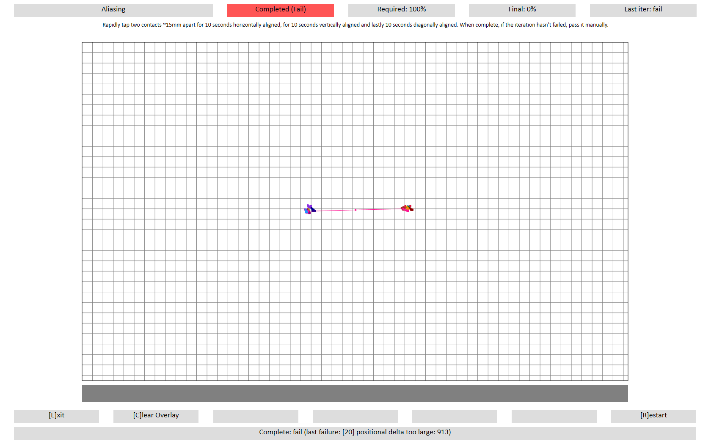

# Aliasing

## Test name

**Test.Aliasing.json**

## Core requirements tested

Device.Input.PrecisionTouchpad.Performance.MinSeparation

## Test purpose

Verifies that the device can track and report unique continually arriving and departing contacts without aliasing at fixed separation distances.

## Tools required

**PTLogo.exe**

## Validation steps

1.  Start **Test.Aliasing.json**.

2.  Place two fingers ~15mm apart horizontally.

3.  Alternating between the two fingers, tap the touchpad at 240 taps per minute.

    When tapping, hold down a contact until it is time to make another tap with that contact, rather than making light taps (in order to interleave the down times of the two contacts)

4.  Verify that after tapping for ten seconds, there is no line drawn between these contacts.

5.  Repeat steps 2 through 5 with fingers aligned on the vertical axis.

6.  Repeat steps 2 through 5 with fingers aligned on the diagonal axis.

7.  Manually pass the iteration if validation in every axis was successful.

8.  Repeat steps 2 through 7 with fingers ~40mm apart.

    **Note**  
    If the device has a height &lt; 40mm, verify vertical aliasing at the maximum possible distance.

     

## Common errors

\[20\] Positional delta too large

-   Aliasing caused device contact swap, thereby causing device to report a quick swipe.

-   The value represents the displacement distance.

-   Any displacement &gt; 270 (2.7mm) will result in this error.

**Figure 1 Aliasing Failure - Positional Delta Too Large**

## Passing

2/2 (100%) iterations must pass in order to complete with passing status.

## Related topics

[Precision Touchpad Tests](precision-touchpad-tests.md)

 

 

