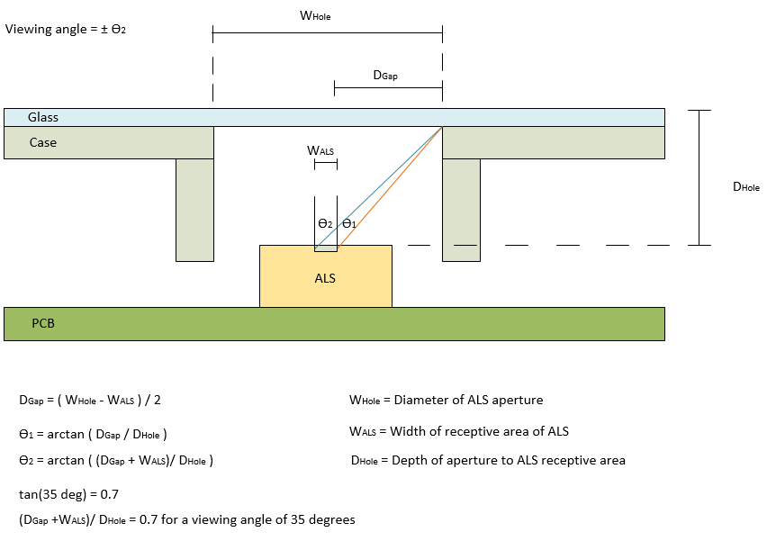
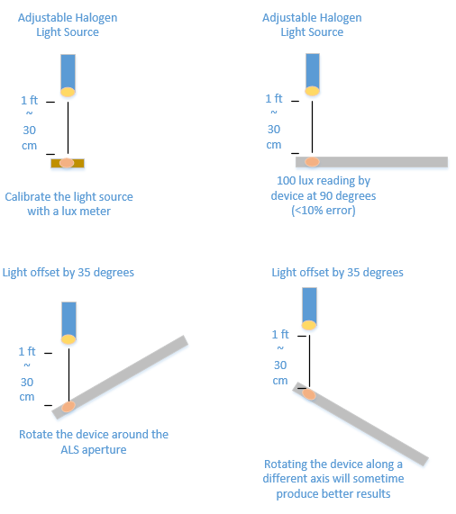

# Ambient Light Sensor Calibration Test

This test verifies the ALS has a wide enough viewing angle to not impact sensor test scenarios.

## Test details

<table>
<colgroup>
<col width="50%" />
<col width="50%" />
</colgroup>
<tbody>
<tr class="odd">
<td>
<strong>Associated requirements</strong>
</td>
<td>
Device.Input.Sensor.ALS.Discretional

[See the device hardware requirements.](http://go.microsoft.com/fwlink/p/?linkid=254483)
</td>
</tr>
<tr class="even">
<td>
<strong>Platforms</strong>
</td>
<td>
Windows 8.1 x64 Windows 8.1 x86
</td>
</tr>
<tr class="odd">
<td>
<strong>Expected run time</strong>
</td>
<td>
~2 minutes
</td>
</tr>
<tr class="even">
<td>
<strong>Categories</strong>
</td>
<td>
Functional
</td>
</tr>
<tr class="odd">
<td>
<strong>Type</strong>
</td>
<td>
Manual
</td>
</tr>
</tbody>
</table>

 

## Running the test

Before you run the test, complete the test setup as described in the test requirements: [Sensor Device Testing Prerequisites](sensor-device-testing-prerequisites.md)

The goal of this test is to guarantee that the ALS has a wide enough viewing angle. As seen in the following image, the viewing angle is affected by the depth of the embedded ALS as well as the width of the aperture (using a light pipe can also make a difference).

**Figure 1 Viewing Angle**

Generally, the observed lux attenuates based on the cosine of the incident angle of the light – this is unavoidable. However, a viewing angle that is too small will prematurely cause an exponential drop in lux readings, detracting from the user experience by falsely triggering our Autobrightness feature and other features that are dependent on ALS.

Therefore, the test measures the impact of incident angle on the fully integrated system’s ALS.  There are two main stages to this test after setup.

**Pre-Test**: Use an adjustable halogen light source and verify with a lux meter at the testing distance (~1 ft) that there is 100 lux incident light.  There should be no other light source in the room (top-left image below).

1.  Place the System Under Test so that the ALS aperture is directly under the light with NO offset (top-right image below).  The device must read within +/- 10% accuracy: 90-110 lux.

2.  Rotate the System Under Test about the ALS aperture so that the incident light is at a 35 degree angle (bottom images below).  The aperture should be at the same testing distance as before.  The device must read NO MORE than 50% attenuation from before: 50-110 lux.

    

    **Figure 2 Light Sources**

## Troubleshooting

For troubleshooting information, see [Troubleshooting Device.Input Testing](troubleshooting-deviceinput-testing.md).

If you cannot meet the accuracy requirements when the device is exposed to light at a 45 degree angle and the ambient light sensor reading is below 30% attenuation, you should decrease the Change Sensitivity of the senor by using the [Sensor Diagnostic Tool](http://msdn.microsoft.com/library/windows/hardware/Hh780319.aspx) included with the Windows Driver Kit.

 

 

[Send comments about this topic to Microsoft](mailto:wsddocfb@microsoft.com?subject=Documentation%20feedback%20%5Bp_hck\p_hck%5D:%20Ambient%20Light%20Sensor%20Calibration%20Test%20%20RELEASE:%20%284/27/2016%29&body=%0A%0APRIVACY%20STATEMENT%0A%0AWe%20use%20your%20feedback%20to%20improve%20the%20documentation.%20We%20don't%20use%20your%20email%20address%20for%20any%20other%20purpose,%20and%20we'll%20remove%20your%20email%20address%20from%20our%20system%20after%20the%20issue%20that%20you're%20reporting%20is%20fixed.%20While%20we're%20working%20to%20fix%20this%20issue,%20we%20might%20send%20you%20an%20email%20message%20to%20ask%20for%20more%20info.%20Later,%20we%20might%20also%20send%20you%20an%20email%20message%20to%20let%20you%20know%20that%20we've%20addressed%20your%20feedback.%0A%0AFor%20more%20info%20about%20Microsoft's%20privacy%20policy,%20see%20http://privacy.microsoft.com/default.aspx. "Send comments about this topic to Microsoft")

