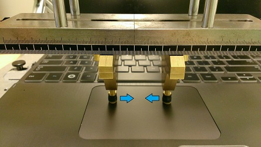
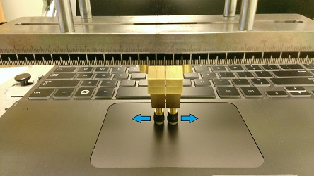
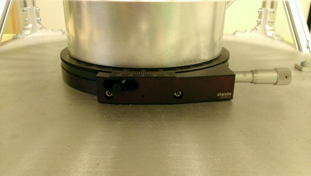
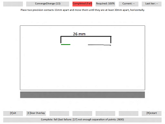
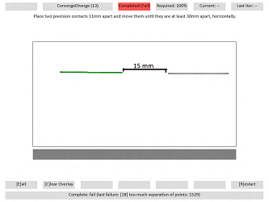

# Converge/Diverge

## Test name

-   **Test.ConvergeDivergeDiagonal.json**

-   **Test.ConvergeDivergeHorizontal.json**

-   **Test.ConvergeDivergeVertical.json**

## Core requirements tested

Device.Input.PrecisionTouchpad.Precision.ContactDivergence

## Test purpose

Verifies that the device can track and report unique contacts without aliasing at continually varying separation distances.

## Tools required

-   **PTLogo.exe**

-   PT3 with precision touchpad modifications (or similar assembly for converge/diverge)

## Validation steps

1.  Start **Test.ConvergeDivergeHorizontal.json**.

2.  Follow the instructions in [Windows Precision Touchpad Device Validation Guide](windows-precision-touchpad-device-validation-guide.md#gen) to make sure the touchpad is perfectly aligned, with the bottom edge facing the tester.

3.  Use the converge/diverge assembly with two 7mm precision contacts.

4.  Place these precision contacts on the digitizer surface separated by distance as instructed on the screen.

5.  As instructed, move contacts either towards each other (converge) or apart (diverge).

    1.  Every second iteration, move the contacts to a new location on the touchpad.

    2.  Five iterations per direction for both converge and diverge. (10 total).

6.  If the two contacts remain distinct and no errors are detected, PTLogo will automatically pass the iteration and advance to the next.

    

    **Figure 1 Converge**

    With reference to *Figure 1 Converge*, start with contacts &gt; 30mm apart, and move them together until they are 11mm apart.

    

    **Figure 2 Diverge**

    With reference to *Figure 2 Diverge*, start with contacts 11mm apart, and move them until they are &gt; 30mm apart.

7.  Start **Test.ConvergeDivergeVertical.json**.

8.  Rotate the plate 90° and repeat steps 2-4 on the vertical axis.

9.  Rotate the plate 45° then repeat steps 2-4 at a diagonal angle.

    Contacts only need to come within 14mm of each other for the diagonal orientation.

    

    **Figure 3 PT3 Rotation**

## Common errors

Be sure that the widest distance between contacts is always &gt; 30mm, and the smallest distance is always &lt; 11mm.

-   \[17\] not enough separation of points: \#\#\#\#

    Either a converge test didn’t start with the contacts far enough apart, or a diverge test didn’t pull the contacts apart enough. The value indicates the reported distance between the contacts.

    

    **Figure 4 Converge/Diverge Failure - Not Enough Separation of Points**

-   \[18\] too much separation of points: \#\#\#\#

    Either a converge test didn’t bring the contacts close enough together, or a diverge test didn’t start with the contacts close enough. The value indicates the reported distance between the contacts.

    

    **Figure 5 Converge/Diverge Failure - Too Much Separation of Points**

## Passing

A total of 30/30 (100%) iterations must pass in order to complete with passing status.

## Related topics

[Precision Touchpad Tests](precision-touchpad-tests.md)

 

 

