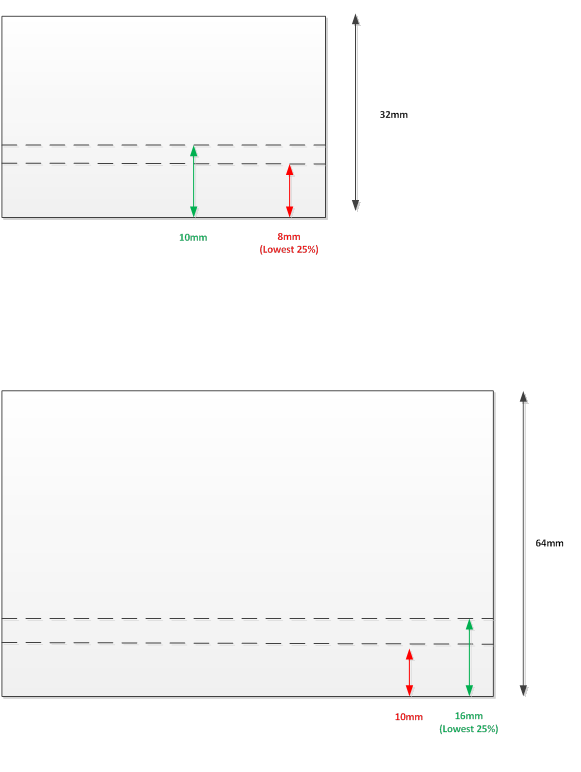

# Device Button Reporting

## Test name

**Test.DeviceButton.json**

## Core requirements tested

Device.Input.PrecisionTouchpad.Hardware.Clickpad

## Test purpose

Verifies that the device reports button presses correctly.

## Tools required

**PTLogo.exe**

## Validation steps

1.  Start **Test.DeviceButton.json**.

2.  Iteration 1 - Button presses with capacitive contacts:

    1.  Place a finger in the button activation area of the digitizer surface (see *Figure 1 Button Activation Area*), and exert sufficient activation force to register a button press. Verify that the button state is down (the grey bar at the bottom of PTLogo tool should turn green), and that the button state returns to off when contact is lifted.

        

        **Figure 1 Button Activation Area**

    2.  Repeat last step with 2, 3… *N* contacts, where *N* is the maximum number of contacts that are supported by the device. Contacts should always maintain a minimum separation distance of 15mm.

    3.  Place two fingers in the button activation area of the digitizer surface (see *Figure 1 Button Activation Area*), and exert sufficient activation force to register a button press. Maintain activation force with one finger and lift the second finger. PTLogo with automatically check that the button state is reported consistently.

    4.  Place three fingers in the button activation area of the digitizer surface (see *Figure 1 Button Activation Area*), and exert sufficient activation force to register a button press. Maintaining activation force, swipe the fingers downward so that they move off the touchpad. Verify that the physical button state does no stay on, that the bar beneath the PTP visualization returns from green to grey once the fingers are off the touchpad.

    5.  Upon successful validation, manually pass the iteration. Otherwise, manually fail the iteration.

3.  Iteration 2 - Button presses with non-capacitive contacts.

    *For Clickpads only*: Place a non-capacitive contact in the button activation area of the digitizer surface (see *Figure 1 Button Activation Area*) and exert sufficient activation force to register a button press. Verify that the button state is down (the grey bar in PTLogo should turn green), and that the button state returns to off when force exerted is less than the activation force.

    -   If touchpad is a pressure-pad implementation, manually pass the iteration to skip it.

    -   Upon successful validation, manually pass the iteration otherwise, manually fail the iteration.

## Common errors

None

## Passing

2/2 (100%) iterations must pass in order to complete with passing status.

## Related topics

[Precision Touchpad Tests](precision-touchpad-tests.md)

 

 

[Send comments about this topic to Microsoft](mailto:wsddocfb@microsoft.com?subject=Documentation%20feedback%20%5Bp_hck\p_hck%5D:%20Device%20Button%20Reporting%20%20RELEASE:%20%284/27/2016%29&body=%0A%0APRIVACY%20STATEMENT%0A%0AWe%20use%20your%20feedback%20to%20improve%20the%20documentation.%20We%20don't%20use%20your%20email%20address%20for%20any%20other%20purpose,%20and%20we'll%20remove%20your%20email%20address%20from%20our%20system%20after%20the%20issue%20that%20you're%20reporting%20is%20fixed.%20While%20we're%20working%20to%20fix%20this%20issue,%20we%20might%20send%20you%20an%20email%20message%20to%20ask%20for%20more%20info.%20Later,%20we%20might%20also%20send%20you%20an%20email%20message%20to%20let%20you%20know%20that%20we've%20addressed%20your%20feedback.%0A%0AFor%20more%20info%20about%20Microsoft's%20privacy%20policy,%20see%20http://privacy.microsoft.com/default.aspx. "Send comments about this topic to Microsoft")

