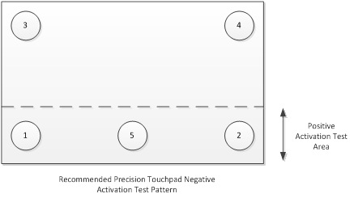
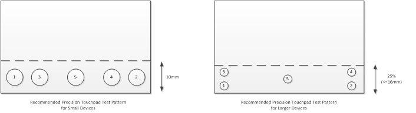

# Device Click Pressure

## Test name

**Test.DeviceClickPressure.json**

## Core requirements tested

-   Device.Digitizer.PrecisionTouchPad.Hardware.ClickpadPress

-   Device.Digitizer.PrecisionTouchPad.Hardware.PressurePadPress

## Test purpose

Verifies that the device reports button presses only once the required activation force has been exerted.

## Tools required

-   **PTLogo.exe**

-   140g slug with 7mm contact area

-   190g slug with 7mm contact area

Both slugs must maintain capacitance during testing. They should be grounded by either attaching copper wire to the top and placing the other end between two fingers, or by keeping one or two fingers connected to the contact *without applying or alleviating any weight to/from the slug*.

## Validation steps

**Note**  
For this test, you will be verifying the activation force that is needed to register a button press on the touchpad in five locations for positive activation and five locations for negative activation. The five locations for both positive and negative testing should be selected to provide maximum coverage. Positive test locations can be anywhere within the lowest 10mm vertically or lowest 25% of the total area, whichever is largest. Negative test locations can be anywhere across the entire digitizer surface.

For certification testing, a 140g weight and 190g weight shall be used for negative and positive activation force testing. However, due to manufacturing tolerances, in-field devices can be audited by using a larger delta between the weights that are used for negative and positive activation force testing, so that a strict +/- 50g is maintained around the required activation force range on all devices that are manufactured (versus the strict +/- 25g that is required for certification).

 

**Figure 1 Recommended Negative Activation Test Area**

**Figure 2 Recommended Positive Activation Test Pattern**

**Figure 3 Positive Activation Force Testing Area**

1.  Start **Test.DeviceClickPressure.json**.

2.  Iteration 1 - (Negative Test Position 1):

    1.  Carefully place 140g slug within 3mm of the bottom left corner of the digitizer surface at negative test position 1 (see *Figure 1 Recommended Negative Activation Test Area*).

    2.  Verify that no button press is reported (the bar at the bottom of the screen should stay grey and not turn green). If no button press is reported, manually pass the iteration; otherwise, manually fail the iteration.

3.  Iteration 2 - (Negative Test Position 2): Repeat the steps in Iteration 1 in the bottom right corner of the device at negative test position 2 (see *Figure 1 Recommended Negative Activation Test Area*).

4.  Iteration 3 - (Negative Test Position 3):

    1.  Carefully place the 140g slug on the bottom left corner of the touchpad surface.

    2.  Slide the slug to negative test position 3 (see *Figure 1 Recommended Negative Activation Test Area*).

    3.  Verify that no button press is reported (the bar at the bottom of the screen should stay grey and not turn green). If no button press is reported, manually pass the iteration; otherwise, manually fail the iteration.

5.  Iteration 4 - (Negative Test Position 4): Repeat the steps in Iteration 3, but slide the slug from the bottom right corner to negative test position 4 (see *Figure 1 Recommended Negative Activation Test Area*).

6.  Iteration 5 - (Negative Test Position 5): Repeat the steps in Iteration 3, but slide the slug from the bottom left corner to negative test position 5 (see *Figure 1 Recommended Negative Activation Test Area*).

7.  Iteration 6 - (Positive Test Position 1):

    1.  For a click-pad, carefully place 190g slug within 3mm of the bottom left corner of the digitizer surface at positive test position 1 (see *Figure 1 Recommended Negative Activation Test Area*).

    2.  For a pressure-pad, drop the 190g slug from a height of 1-2mm onto positive test position 1 (see *Figure 1 Recommended Negative Activation Test Area*). Make sure the slug lands flat on the surface and not at an angle.

    3.  If a button press is continually reported while the slug is down and not reported when the slug is removed, then manually pass the iteration; otherwise, manually fail the iteration.

8.  Iteration 7 - (Positive Test Position 2):

    1.  For a click-pad, carefully place 190g slug within 3mm of the bottom right corner of the digitizer surface at positive test position 2 (see *Figure 1 Recommended Negative Activation Test Area*).

    2.  For a pressure-pad, drop the 190g slug from a height of 1-2mm onto positive test position 2 (see *Figure 1 Recommended Negative Activation Test Area*). Make sure the slug lands flat on the surface and not at an angle.

    3.  If a button press is continually reported while the slug is down and not reported when the slug is removed, then manually pass the iteration; otherwise, manually fail the iteration.

9.  Iteration 8 - (Positive Test Position 3):

    1.  For a click-pad, carefully place 190g slug within 3mm of the bottom corner of the digitizer surface and slide the slug to positive test position 3 (see *Figure 1 Recommended Negative Activation Test Area*).

    2.  For a pressure-pad, drop the 190g slug from a height of 1-2mm onto positive test position 3 (see *Figure 1 Recommended Negative Activation Test Area*). Make sure the slug lands flat on the surface and not at an angle.

    3.  If a button press is continually reported while the slug is down and not reported when the slug is removed, then manually pass the iteration; otherwise, manually fail the iteration.

10. Iteration 9 - (Positive Test Position 4):

    1.  For a click-pad, carefully place 190g slug within 3mm of the bottom corner of the digitizer surface and slide the slug to positive test position 4 (see *Figure 1 Recommended Negative Activation Test Area*).

    2.  For a pressure-pad, drop the 190g slug from a height of 1-2mm onto positive test position 4 (see *Figure 1 Recommended Negative Activation Test Area*). Make sure the slug lands flat on the surface and not at an angle.

    3.  If a button press is continually reported while the slug is down and not reported when the slug is removed, then manually pass the iteration; otherwise, manually fail the iteration.

11. Iteration 10 - (Positive Test Position 5):

    1.  For a click-pad, carefully place 190g slug within 3mm of the bottom corner of the digitizer surface and slide the slug to positive test position 5 (see *Figure 1 Recommended Negative Activation Test Area*).

    2.  For a pressure-pad, drop the 190g slug from a height of 1-2mm onto positive test position 5 (see *Figure 1 Recommended Negative Activation Test Area*). Make sure the slug lands flat on the surface and not at an angle.

    3.  If a button press is continually reported while the slug is down and not reported when the slug is removed, then manually pass the iteration; otherwise, manually fail the iteration.

## Common errors

-   Both slugs must maintain capacitance during testing. They should be grounded either by attaching copper wire to the top and placing the other end between two fingers, or by keeping one or two fingers connected to the contact *without applying or alleviating any weight to/from the slug*.

-   The entire 7mm slug tip should be on the digitizer surface for any test, and not partially off the edge. This also means that if contact is dropped onto the touchpad, it needs to land flat and not at an angle.

## Passing

10/10 (100%) iterations must pass in order to complete with passing status.

## Related topics

[Precision Touchpad Tests](precision-touchpad-tests.md)

 

 

[Send comments about this topic to Microsoft](mailto:wsddocfb@microsoft.com?subject=Documentation%20feedback%20%5Bp_hck\p_hck%5D:%20Device%20Click%20Pressure%20%20RELEASE:%20%284/27/2016%29&body=%0A%0APRIVACY%20STATEMENT%0A%0AWe%20use%20your%20feedback%20to%20improve%20the%20documentation.%20We%20don't%20use%20your%20email%20address%20for%20any%20other%20purpose,%20and%20we'll%20remove%20your%20email%20address%20from%20our%20system%20after%20the%20issue%20that%20you're%20reporting%20is%20fixed.%20While%20we're%20working%20to%20fix%20this%20issue,%20we%20might%20send%20you%20an%20email%20message%20to%20ask%20for%20more%20info.%20Later,%20we%20might%20also%20send%20you%20an%20email%20message%20to%20let%20you%20know%20that%20we've%20addressed%20your%20feedback.%0A%0AFor%20more%20info%20about%20Microsoft's%20privacy%20policy,%20see%20http://privacy.microsoft.com/default.aspx. "Send comments about this topic to Microsoft")

