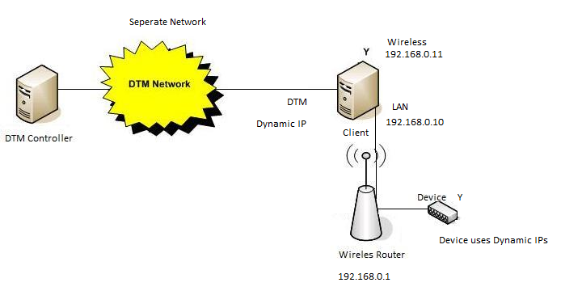

# Digital Media Renderer Testing Prerequisites

This section describes the tasks that you must complete before you test a media device by using the Windows Hardware Certification Kit (Windows HCK):

-   [Review the hardware requirements](#bkmk-hck-dmr-hr).

-   [Review the software requirements](#bkmk-hck-dmr-sr).

-   [Configure the test computer](#bkmk-hck-dmr-tc).

## Hardware requirements

The following hardware is required for testing a media device. You might need additional hardware if the test device offers other features. To determine whether additional hardware requirements apply, see the test description for each test displayed for the device in Windows HCK Studio.

-   One test computer. The test computer must meet the Windows HCK requirements. For more information, see [Windows HCK Prerequisites](windows-hck-prerequisites.md).

-   The media device that you want to test.

-   One wireless access point if the test device includes wireless capabilities.

-   One Ethernet hub or switch if the test device includes an Ethernet connector.

-   

**Note**  
To certify your product for use on servers, the test computer must support four processors and a minimum of 1 GB of RAM. These system capabilities are required to test the Rebalance, D3 State, and Multiple Processor Group functionality of the device and driver. You do not need a computer that actually has more than 64 processors to test your device. Additionally, the server system(s) being used for device or driver testing must have Server Core installed prior to testing. For more information see [Windows Server Installation Options](http://go.microsoft.com/fwlink/p/?LinkID=251454).

If you use a pool of test computers to test devices, at least one computer in the pool must contain four processors and a minimum of 1 GB of RAM. Additionally, that computer must contain the device and the driver that you want to test. As long as the driver is the same on all the computers in the pool, the system creates a schedule to run against all test computers.

For tests that do not include a driver to test, such as hard disk drive tests, the Windows HCK scheduler constrains the tests that validate the device’s and driver’s Rebalance, D3 State and Multiple Processor Groups functionality to run on the default test computer. You must manually configure this computer to have multiple processor groups. The default computer is the first test computer in the list. Test personnel must make sure that the first test computer in the list meets the minimum hardware requirements.

 

**Note**  
Except for para-virtualization drivers (as defined by Logo Program Requirement Policy-0020), you may not use any form of virtualization when you test physical devices and their associated drivers for server certification or signature. All virtualization products do not support the underlying functionality that is required to pass the tests that relate to multiple processor groups, device power management, device PCI functionality, and other tests.

 

## Software requirements

The following software is required for testing an audio device:

-   The latest Windows HCK filters or updates.

-   The Network Media Test Content iso file, which must be downloaded separately from the Windows HCK.

    **Important**  
    Before running the Digital Media Renderer tests, you must download the [Windows Hardware Certification Kit (HCK) Supplemental Test Content for Network Media Devices](http://msdn.microsoft.com/windows/hardware/hh852358) from the Windows Dev Center. Once the files are downloaded, do the following:

    -   On the HCK controller server, go to the following location:

        **C:\\Program Files (x86)\\Windows Kits\\8.1\\Hardware Certification Kit\\Tests\\amd64\\NTTEST\\multimediatest\\sharing\\netmedialogotests**

     

-   Create a new folder called Media.

-   Copy the contents from the Media ISO CD or DVD to this new folder.

## Test computer configuration

In order to run the certification tests for your device, you will need the following configuration:

To configure the test computer for the testing of a media device follow these steps:

1.  Install the appropriate Windows operating system on the test computer and then configure the computer for your test network (the network that contains the Windows HCK Studio and Windows HCK Controller.

2.  Configure a private network on your test computer:

    1.  Set your Windows 7 or Windows 8 client (the test computer) network to Private.

    2.  Set your router’s IP LAN address to 192.168.0.1

    3.  Set your Windows 7 or Windows 8 test computer’s PC LAN IP address to 192.168.0.10.

    4.  Set your Windows 7 or Windows 8 test computer’s PC Wireless IP address to 192.168.0.11

3.  For an external media device, install or attach the hardware to be tested on the test computer. This includes completing one of the following actions:

    -   If the test device connects through USB, you must attach a USB hub to the test computer and then attach the test device to the USB hub.

    -   If the test device connects through an Ethernet port, you must attach a Ethernet hub or switch to the test computer and then attach the test device to the hub or switch.

    -   Wireless devices should be connected to the router via the wireless network

4.  Before testing your device. validate that your device is correctly discovered, and note the device identifiers. To do this, follow these steps:

    1.  Type **Network** in the search bar of the **Start** menu.

    2.  Click **Network** under **Programs** to open the network folder.

    3.  Find your device in the network folder. If your device is not listed, then check that your network is configured correctly.

    4.  Right-click your network media device to view its properties.

    5.  From the **Properties** dialog box, note the following information:

        1.  MAC Address, including the colons in the address (for example: 00:a0:b0:94:5b:fb)

        2.  Unique Identifier (UDN), including the dashes in the address (for example: 4a96edf6-0aa0-11de-904a-00a0b0945bfb)

    6.  Write down these numbers, including the dashes and colons. You will be asked to provide this data during device testing.

5.  Install the Windows HCK client application on the test computer.

6.  By using Windows HCK Studio, create a computer pool and move the test computer to that pool.

Make sure that the test computer is in the ready state before you begin your testing. If a test requires parameters to be set before it is run, a dialog box will be displayed for that test. Review the specific test topic for more information.

Some Windows HCK tests require user intervention. When running tests for a submission, it is a best practice to run the automated tests in a block separately from manual tests. This prevents a manual test from interrupting completion of an automated test.

 

 

