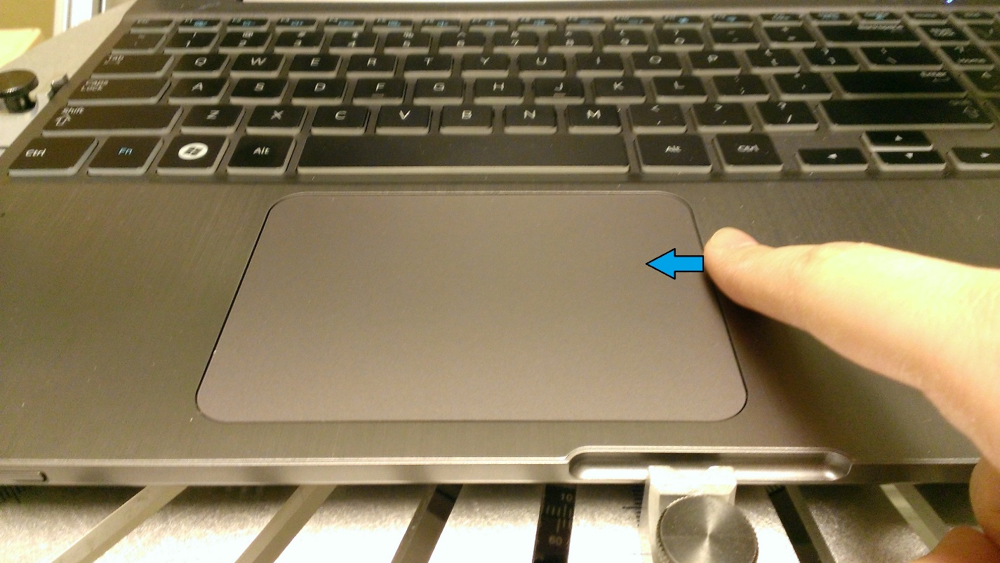
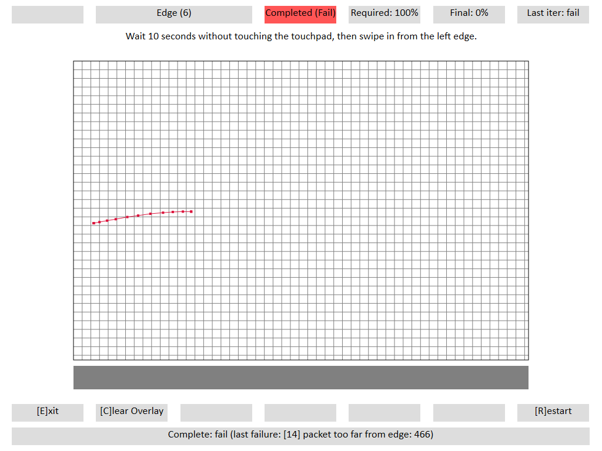

# Edge Reporting

## Test name

**Test.Edge.json**

## Core requirements tested

-   Device.Input.PrecisionTouchpad.Buffering

-   Device.Input.PrecisionTouchpad.Precision.EdgeDetection

## Tools required

**PTLogo.exe**

## Validation steps

1.  If this is a USB connected Precision Touchpad, make sure that Selective Suspend is ENABLED. See [Windows Precision Touchpad Device Validation Guide](windows-precision-touchpad-device-validation-guide.md#selectsuspend).

2.  Start **Test.Edge.json**.

3.  Following the onscreen instructions, wait at least ten seconds (there is a timer in the top right corner for reference), and then swipe in horizontally from the specified edge. Start your finger off the edge of the touchpad, and swipe in ~10-20mm to the middle of the touchpad, perpendicular to the edge at ~200 mm/second and lift. The tool will automatically pass each iteration if the requirement is met.

    

    **Figure 1 Edge Swipe**

    **Note**  
    For the contact to start within 2mm of the edge, start with your finger outside of the touchpad surface, and keep fingertip flush with the device as you swipe in.

     

4.  Perform ten iterations on the left edge, followed by ten iterations on the right edge (20 total iterations).

    **Note**  
    A ten-second delay is only required for the first swipe to ensure that USB devices are performing the required 100ms buffering when resuming from selective suspend.

     

## Common errors

\[14\] packet too far from edge: \#\#\#

-   Be sure to swipe from the edge that is specified. If **PTLogo.exe** asks to swipe from the left edge, swiping from the right will result in this error.

-   If the swipe was performed correctly, the device did not detect the contact within 2mm of the respective edge, which is indicative of a device failure.

-   The value indicates the first contact report’s distance from the respective edge.

    

    **Figure 2 Edge Reporting Failure - Packet Too Far From Edge**

## Passing

10/10 (100%) iterations must pass in order to complete with passing status.

## Related topics

[Precision Touchpad Tests](precision-touchpad-tests.md)

 

 

[Send comments about this topic to Microsoft](mailto:wsddocfb@microsoft.com?subject=Documentation%20feedback%20%5Bp_hck\p_hck%5D:%20Edge%20Reporting%20%20RELEASE:%20%284/27/2016%29&body=%0A%0APRIVACY%20STATEMENT%0A%0AWe%20use%20your%20feedback%20to%20improve%20the%20documentation.%20We%20don't%20use%20your%20email%20address%20for%20any%20other%20purpose,%20and%20we'll%20remove%20your%20email%20address%20from%20our%20system%20after%20the%20issue%20that%20you're%20reporting%20is%20fixed.%20While%20we're%20working%20to%20fix%20this%20issue,%20we%20might%20send%20you%20an%20email%20message%20to%20ask%20for%20more%20info.%20Later,%20we%20might%20also%20send%20you%20an%20email%20message%20to%20let%20you%20know%20that%20we've%20addressed%20your%20feedback.%0A%0AFor%20more%20info%20about%20Microsoft's%20privacy%20policy,%20see%20http://privacy.microsoft.com/default.aspx. "Send comments about this topic to Microsoft")

