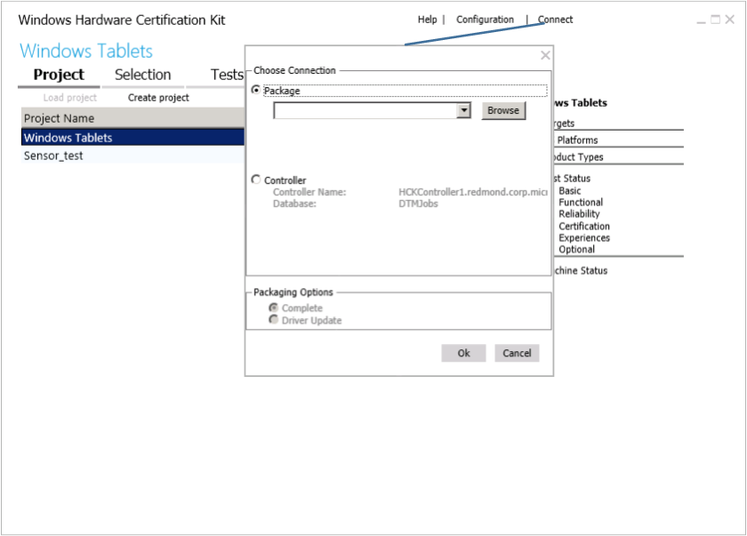

# HCK Studio - Connect Page

The **Connect** option lets you view hckx files. This feature is useful if you need to share an .hckx file with another person.

An .hckx file is a compressed file format created by HCK Studio. An .hckx file, also known as a submission package, is what you submit for certification. An .hckx file must be digitally signed to be a valid submission package.

## View an .hckx package

HCK Studio supports viewing .hckx packages. For example, if you want to troubleshoot a test offline, you can open an existing .hckx package using the **Connect** option. In this mode, you can view all details of the project, including pass/fail results and log files.

**Important**  
You cannot open an .hckx package created from a previous release of the HCK. The version of HCK Studio and the package you want to view must be the same.

 

1.  From HCK Studio, click **Connect**.

2.  Select **Package** option, and then click **Browse** to open an existing .hckx package.

## Related topics

[Install standalone HCK Studio](install-standalone-hck-studio.md)

[Merge packages](merge-packages.md)

 

 

[Send comments about this topic to Microsoft](mailto:wsddocfb@microsoft.com?subject=Documentation%20feedback%20%5Bp_hck\p_hck%5D:%20HCK%20Studio%20-%20Connect%20Page%20%20RELEASE:%20%284/27/2016%29&body=%0A%0APRIVACY%20STATEMENT%0A%0AWe%20use%20your%20feedback%20to%20improve%20the%20documentation.%20We%20don't%20use%20your%20email%20address%20for%20any%20other%20purpose,%20and%20we'll%20remove%20your%20email%20address%20from%20our%20system%20after%20the%20issue%20that%20you're%20reporting%20is%20fixed.%20While%20we're%20working%20to%20fix%20this%20issue,%20we%20might%20send%20you%20an%20email%20message%20to%20ask%20for%20more%20info.%20Later,%20we%20might%20also%20send%20you%20an%20email%20message%20to%20let%20you%20know%20that%20we've%20addressed%20your%20feedback.%0A%0AFor%20more%20info%20about%20Microsoft's%20privacy%20policy,%20see%20http://privacy.microsoft.com/default.aspx. "Send comments about this topic to Microsoft")

