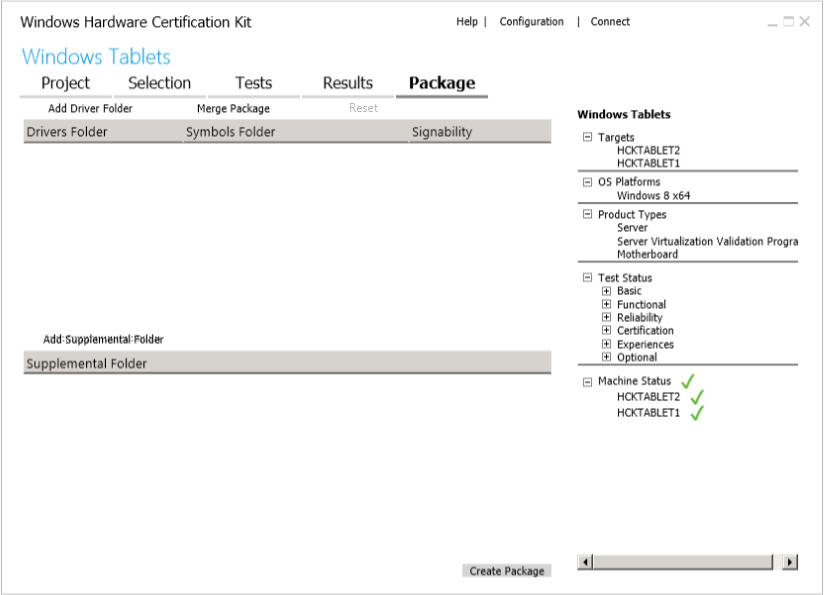

# HCK Studio - Package Tab

The **Package** tab lets you package test results into a single HCK package (.hckx file). Depending on your scenario, you can:

-   Create a submission package to get your device certified.

-   Create a package that you can merge with other packages later.

-   Create a package that can be shared with others (for example, troubleshooting with customer support).

-   Create driver only packages.

-   Merge packages.

**Important**  
To submit a package for certification, your package must be digitally signed.

 

On this tab, you can do the following tasks:

-   [Digitally sign an .hckx package](digitally-sign-an-hckx-package.md)

-   [Digitally sign an .hckx package](digitally-sign-an-hckx-package.md)

-   [Create a driver only update package](create-a-driver-only-update-package.md)

-   [Add driver and supplemental content to your package](add-driver-and-supplemental-content-to-your-package.md)

-   [Merge packages](merge-packages.md)

## Related topics

[Step 8: Create a submission package](step-8-create-a-submission-package.md)

 

 

[Send comments about this topic to Microsoft](mailto:wsddocfb@microsoft.com?subject=Documentation%20feedback%20%5Bp_hck\p_hck%5D:%20HCK%20Studio%20-%20Package%20Tab%20%20RELEASE:%20%284/27/2016%29&body=%0A%0APRIVACY%20STATEMENT%0A%0AWe%20use%20your%20feedback%20to%20improve%20the%20documentation.%20We%20don't%20use%20your%20email%20address%20for%20any%20other%20purpose,%20and%20we'll%20remove%20your%20email%20address%20from%20our%20system%20after%20the%20issue%20that%20you're%20reporting%20is%20fixed.%20While%20we're%20working%20to%20fix%20this%20issue,%20we%20might%20send%20you%20an%20email%20message%20to%20ask%20for%20more%20info.%20Later,%20we%20might%20also%20send%20you%20an%20email%20message%20to%20let%20you%20know%20that%20we've%20addressed%20your%20feedback.%0A%0AFor%20more%20info%20about%20Microsoft's%20privacy%20policy,%20see%20http://privacy.microsoft.com/default.aspx. "Send comments about this topic to Microsoft")

