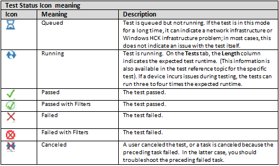

# HCK Studio - Results Tab

**Figure 1 Results Tab**

The **Results** tab displays detailed information about each test. When each test completes, the **Status** column updates with the result: **Pass** or **Fail**. You can expand any test in the **Test Name** column to see more information about that test.

The following list describes the **Results** Tab:

-   If you run a test more than one time,Windows Hardware Certification Kit (Windows HCK) displays the results for each test run.

-   If you delete a test result, you must restart Windows HCK Studio to refresh the test results.

**Note**  
Any test that could be schedules as a multi-device test displays by using the multi-device icon. Multi-device-specific menu options let you reschedule a multi-device test to run as multiple non-multi-device test run equivalents, and let you see the system and targets against which the tests were scheduled. If a test run fails when it is run in multi-device mode and you suspect that one device that was consolidated into the single result is causing the failure, you can use this option to schedule each test device in its own test run (that is, without consolidating multiple devices into a single test run), to scope the failure down to a single device under test.

 

## Test status

In the **Detailed Test** pane, the **Status** column shows you the status of each test that has run or is running. *Figure 2 Status Icons* describes these icons:

**Figure 2 Status Icons**

**Note**  
If a filter is applied to a child library job, when all the tasks of the library job are filtered, the child library job itself can still show as unfiltered. This does not impact the submission package.

 

## Diagnostic log files

In the case of a test failure, you can view the available diagnostic log files by right-clicking the target machine name in the **Test Name** column and then clicking **Diagnostic logs**, as shown in *Figure 3 Diagnostic Log Files*:

**Figure 3 Diagnostic Log Files**

The displayed logs can be the following types, depending on the test:

-   **Kernel crash dumps**. Kernel crash dumps are disabled by default. To collect kernel crash dumps, see [Manually Configure HCK Client Kernel Debugger Settings](manually-configure-hck-client-kernel-debugger-settings.md).

-   **Event logs**. Windows HCK collects all of the warning, error, and critical events that occurred during the test run:

    -   System

    -   Application

-   **Setup logs**:

    -   Setup API. Windows HCK collects Setup API logs if they are available on a client machine during a test run. Windows HCK does not check to see if the file stamps for Setup API log files are in the same range as the test run.

    -   Setup DEV

-   **UMDF Diagnostic logs**

    For machines that are running a client operating system version Windows 8 or later, the Windows HCK Infrastructure enables [Microsoft Application Verifier](http://go.microsoft.com/fwlink/p/?linkid=313882) on the UMDF host process (**Wudfhost.exe**) by using all basic tests and checks. The basic Application Verifier checks for the following:

    -   Exceptions

    -   Handles

    -   Heaps

    -   Leak Locks

    -   Memory

    -   SRWLock

    -   Threadpool TLS

    If the UMDF driver fails any of these checks during device testing, an Application Verifier log is created that records the type of failure and the stack trace at the point where the failure occurs. Multiple Application Verifier logs are generated if the driver causes exceptions that crash **WudfHost.exe**. We recommend that you fix all reported failures for your UMDF driver.

    If the client machine is running under a kernel debugger, enabling Application Verifier on **Wudfhost.exe** causes a debug break when an error or exception occurs. You can use the [!avrf](http://go.microsoft.com/fwlink/p/?linkid=313881) extension to help analyze Application Verifier breaks. In addition, UMDF debugger extensions can be used to debug UMDF drivers; see [Using UMDF Debugger Extensions](http://go.microsoft.com/fwlink/p/?linkid=313884) for more information. The following diagnostic logs are copied to the controller for diagnosing UMDF driver failures.

    -   **Application Verifier logs**

        Application Verifier logs in the form **appverif\_WUDFHost.exe.\*.dat** can be viewed by using an Application Verifier UI client. You can use the Application Verifier tool that is installed on the client machines. Copy logs to the directory **%VERIFIER\_LOG\_PATH%\\AppVerifierLogs** before you run **Appverif.exe - VERIFIER\_LOG\_PATH**. The path variable is already set to **%sytemdrive%** on the Windows HCK client. You can also add symbol paths to resolve the symbols in the stack frames where the errors or exceptions have occurred.

        **Note**  
        The logs are generated in binary format and are architecture-specific. To view the logs, you must use an Application Verifier tool on a client that has the same architecture as the computers on which the logs were generated. See the Application Verifier tool Online Help for more information.

         

    -   **UMDF crash dumps**

        UMDF dump files are of the form **UM\_&lt;guid&gt;.dmp** and are created whenever a UMDF driver causes the Host Process to terminate.

## Related topics

[Step 7: View test results and log files](step-7-view-test-results-and-log-files.md)

[Analyze test results in Excel](analyze-test-results-in-excel.md)

 

 

