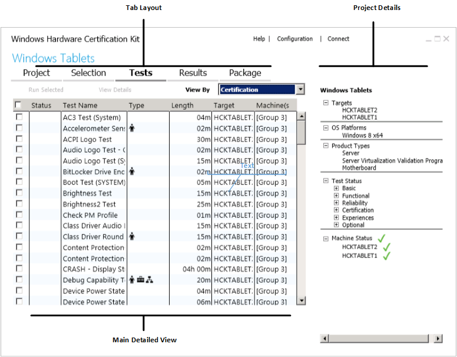

# HCK Studio

Windows Hardware Certification Kit (Windows HCK) Studio is a test management console that allows you to organize tests into projects, view features and tests associated with a device, run selected tests, and create a submission package. Figure 1. Windows HCK Studio shows an example Windows HCK Studio screen:

-   **Tab Layout** - The individual tabs along the top of the screen represent the flow of certification testing. You must create a project, make a selection, select a test, review results, and then create a package to complete the process.

-   **Project Details** - The right-pane displays project status and hardware details. As you test your device, you can monitor the test results. The **Product Types** field is an important field to review before testing. This value shows the devices that the kit detects and what tests the device can run. If the product type you want to qualify for does not appear, you must investigate whether the device is properly developed, or you might have to manually configure your product type. For more information, see [Manually add features](manually-add-features.md).

-   **Main Detailed View** – Displays detailed information for the respective tabs. In this area, you can right-click on an entry to see more options. You can click the **F1** key to view context-sensitive help.

## Features and Limitations

-   Windows HCK does not support the modification of the same project across multiple instances of Windows HCK studio.

## In this Section

-   [HCK Studio - Project Tab](hck-studio---project-tab.md)

-   [HCK Studio - Selection Tab](hck-studio---selection-tab.md)

-   [HCK Studio - Tests Tab](hck-studio---tests-tab.md)

-   [HCK Studio - Results Tab](hck-studio---results-tab.md)

-   [HCK Studio - Package Tab](hck-studio---package-tab.md)

-   [HCK Studio - Configuration Page](hck-studio---configuration-page.md)

-   [HCK Studio - Connect Page](hck-studio---connect-page.md)

 

 

