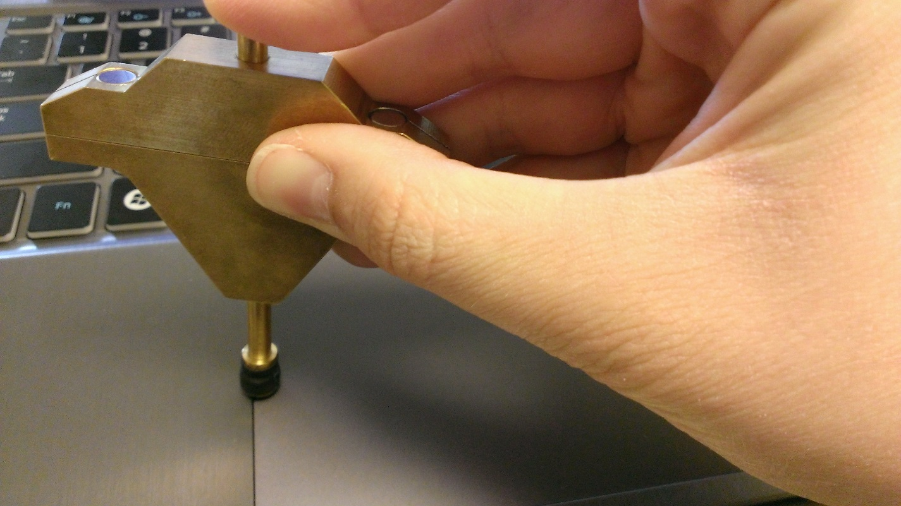

# Input Resolution

## Test name

**Test.InputResolution.json**

## Core requirements tested

Device.Input.PrecisionTouchpad.Precision.InputResolution

## Test purpose

Verifies that the device is able to genuinely report at the resolution it specifies and that resolution is &gt;= 300DPI.

## Tools required

**PTLogo.exe**

A 7mm diameter capacitive contact is optional.

## Validation steps

Between two slow horizontal swipes, every logical unit of X should be hit and reported, and between two slow vertical swipes, every logical unit of Y should be hit and reported.

1.  Start **Test.InputResolution.json**.

2.  Starting off the left edge of the digitizer surface, drag a single contact across the touchpad at a velocity that is inversely proportional to the device’s reported input resolution (see Drag Velocity below) for the X axis from left to right, and again from right to left.

    1.  Drag Velocity: All devices must report at &gt;= 125Hz for a single contact, therefore the following formula may be used to calculate a safe drag velocity:

        Drag Velocity must be &lt;= 60Hz / (Logical Range for Axis / Physical Range for Axis). For example, for a device that has a logical range of 4000 for X and a physical range of 100mm for X, a safe drag velocity would be 1.5mm/s.

        

        **Figure 1 Dragging a Contact for Input Resolution**

    2.  All off-axis movement or jitter is ignored in this test. As shown in *Figure 1 Dragging a Contact for Input Resolution*, a precision contact can optionally be used to overcome potential friction with a human finger, but it must be kept perfectly perpendicular to the touchpad surface so the contact size does not drop far below 7mm (which could cause the device to lose the contact).

3.  Repeat vertically, Starting above the top edge of the digitizer surface, drag a single contact down the touchpad at a velocity inversely proportional to the device’s reported input resolution (see Drag Velocity above) for the Y axis dragging first from top edge to bottom edge, then from bottom edge to top edge.

**Note**  
If enough logical X/Y coordinates are hit after one swipe on that axis, the iteration will pass automatically without a need to swipe in the other direction.

 

## Common errors

-   20\] positional delta too large: \#

    -   There was a jump in coordinates between two subsequent reports that exceeds the permitted tolerance of 0.5mm.

    -   The given value is the length of the jump.

    -   This error will stop an iteration, even if only one swipe has been performed.

-   \[35\] logical coordinate not found: \#

    -   Either the minimum or maximum logical value was never reported in either of the two passes for a given axis.

    -   The value given is the X or Y logical value which was not reported (respective to the axis being validated).

-   \[31\] Too low percent of logical coordinates found: \#

    -   The minimum percentage (95%) of all logical units required to be reported was not met for a given axis.

    -   The value indicates the percentage of all logical units that were reported for a given axis.

## Passing

2/2 (100%) iterations must pass in order to complete with passing status.

## Related topics

[Precision Touchpad Tests](precision-touchpad-tests.md)

 

 

