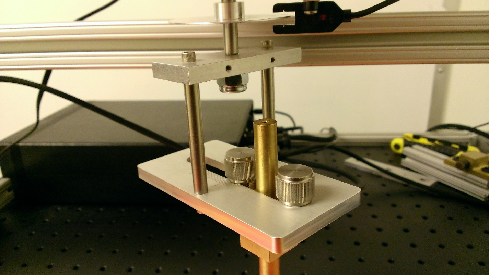

# Latency - Panning

## Test name

**Test.StepMotor.json**

## Core requirements tested

Device.Input.PrecisionTouchpad.Performance.PanLatency

## Test purpose

Verifies that the device is able to report changes in contact position within the required latency window.

## Tools required

-   **Ptstepmotor.exe**

-   RA Tool with Precision Touchpad modifications

## Validation steps

1.  Make sure the RA tool is fitted with the smaller, adjustable PTP bracket, as shown in *Figure 1 RA Tool with Small Radius Bracket*.

    

    **Figure 1 RA Tool with Small Radius Bracket**

2.  Plug the RA tool controller into the test machine, then turn on the controller (it may be in an unknown state if this is done in a different order).

    The switches on the controller should initially be set to:

    -   Motor: off

    -   Calibrate: Off

    -   Mode: Tachometer

3.  Adjust the radius of the circle to 12mm and position the PTP device so that the contact will stay on the digitizer surface during its full rotation.

4.  Rotate the arm until the notch on the disk is 2-3mm past the sensor.

    1.  If it is too close to the sensor, you will get an extra data point at the beginning of the test. This is because when started, the motor will jerk backwards. If the notch falls under the sensor during this, it will cause erroneous data.

    2.  If it is too far from the sensor, Count will seem to increment by two, instead of giving two increments of one. The motor is calibrated to rotate around and pass slowly for a certain segment of the circle relative to where it started, and that slow section is expected to pass under the sensor. But if it starts too far away from the sensor, the arm will still be moving too quickly when the notch passes under the sensor.

5.  Run **Ptstepmotor.exe**.

6.  Lower the contact onto the touchpad surface.

7.  Press the space bar on the test machine and turn the Motor switch to on to begin the Calibration phase.

8.  After nine rotations (when Count on the screen equals 17), the motor will come to a complete stop for five seconds. Press the space bar during those five seconds to advance to Acquisition.

9.  Wait for ten rotations of the arm, and then press the space bar to move into the Collection phase.

10. After the arm has made ten rotations in the Collection phase, press the space bar one last time to close the test.

    **Note**  
    Unless there’s an error, do not exit by pressing **Esc**, or the test might not finish.

     

For more detailed setup and test instructions, see [How to measure Touch Panning Latency](how-to-measure-touch-panning-latency-win81.md).

## Common errors

-   At the beginning of the Calibration stage, if the slot on the disk is too close to the photo interrupt signal, the calibration text will appear with a count of zero before the arm has rotated one time.

    Be sure to position the slot 2-3mm past the photo interrupt signal.

-   When calibration executes correctly, the count should increment by two every rotation: one time before and one time after hitting the photo interrupt signal.

    -   Because of this, the pause before beginning the Acquisition stage always occurs when the count = 17.

    -   If the count isn’t incrementing properly, abort the test. Turn off the controller, unplug and replug the controller into the test machine by using USB, then turn the controller on again. Start test from the beginning, and verify that count is incrementing correctly.

-   At the end of the Calibration stage, the motor will pause completely for five seconds. During that pause, the space bar must be hit to advance to the Acquisition stage, or an error message will be given.

## Passing

This test has a 20% allowed tolerance, therefore a recorded average panning latency &lt;= 18.0ms will result in a pass.

## Related topics

[Precision Touchpad Tests](precision-touchpad-tests.md)

 

 

[Send comments about this topic to Microsoft](mailto:wsddocfb@microsoft.com?subject=Documentation%20feedback%20%5Bp_hck\p_hck%5D:%20Latency%20-%20Panning%20%20RELEASE:%20%284/27/2016%29&body=%0A%0APRIVACY%20STATEMENT%0A%0AWe%20use%20your%20feedback%20to%20improve%20the%20documentation.%20We%20don't%20use%20your%20email%20address%20for%20any%20other%20purpose,%20and%20we'll%20remove%20your%20email%20address%20from%20our%20system%20after%20the%20issue%20that%20you're%20reporting%20is%20fixed.%20While%20we're%20working%20to%20fix%20this%20issue,%20we%20might%20send%20you%20an%20email%20message%20to%20ask%20for%20more%20info.%20Later,%20we%20might%20also%20send%20you%20an%20email%20message%20to%20let%20you%20know%20that%20we've%20addressed%20your%20feedback.%0A%0AFor%20more%20info%20about%20Microsoft's%20privacy%20policy,%20see%20http://privacy.microsoft.com/default.aspx. "Send comments about this topic to Microsoft")

