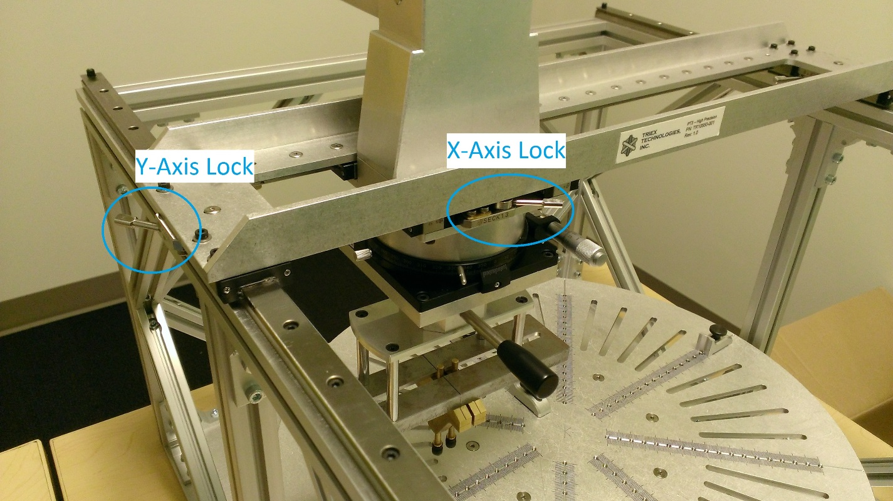
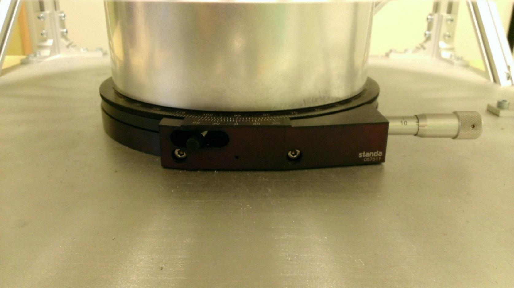
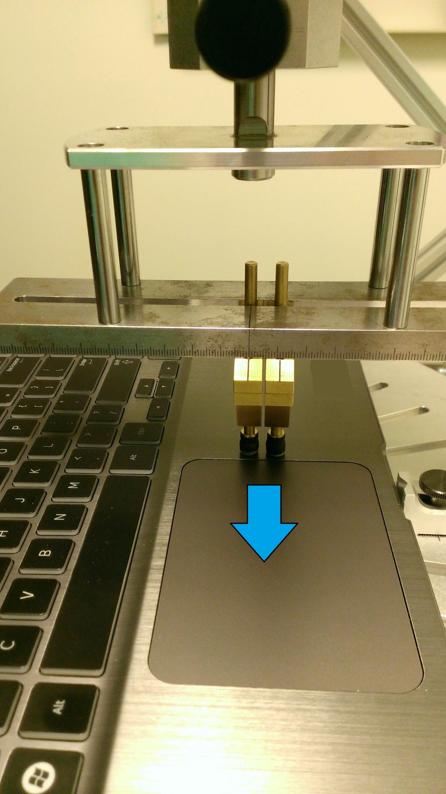
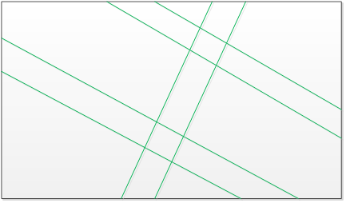
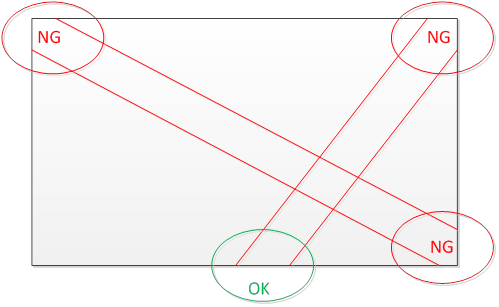
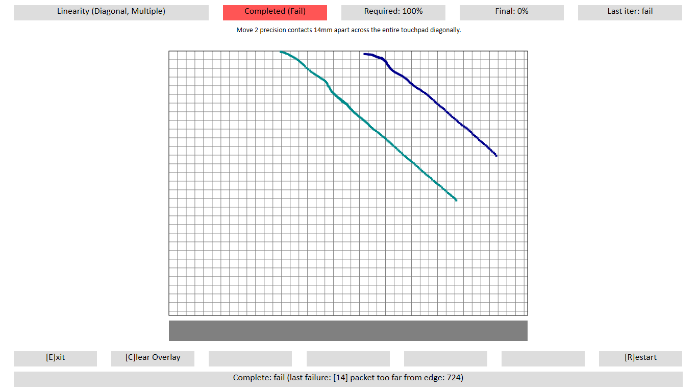
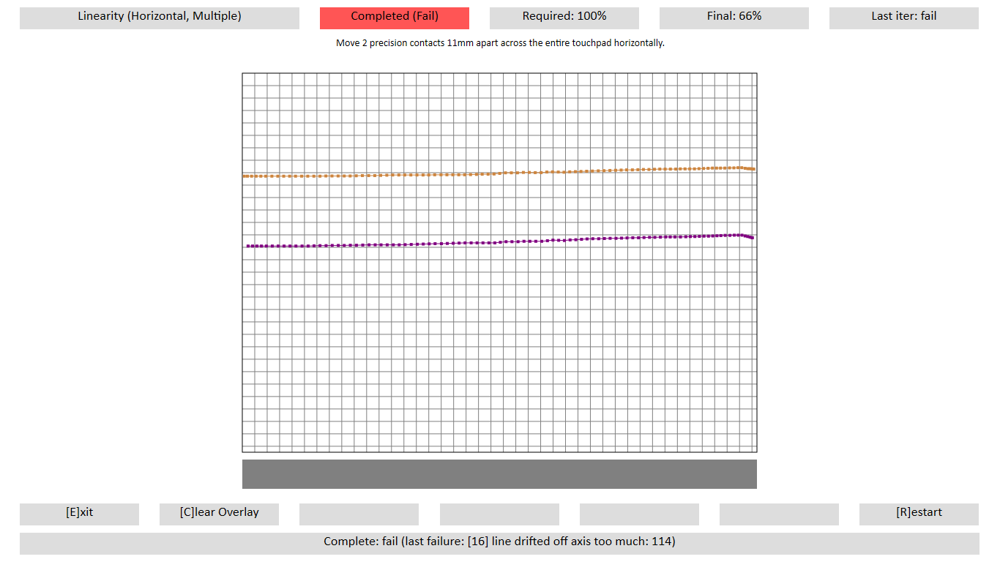

# Linearity

## Test name

-   **Test.LinearityDiagonal**

-   **Test.LinearityDiagonalMultiple**

-   **Test.LinearityHorizontal**

-   **Test.LinearityHorizontalMultiple**

-   **Test.LinearityVertical**

-   Test.LinearityVerticalMultiple

## Core requirements tested

-   Device.Input.PrecisionTouchPad.Precision.Linearity

-   Device.Input.PrecisionTouchPad.Precision.HVInputSeparation

-   Device.Input.PrecisionTouchpad.Precision.DiagonalInputSeparation

-   Device.Input.PrecisionTouchpad.Precision.MotionJitter

## Test purpose

Verifies that the device is able to meet the linearity requirements in all directions at the minimum contact separation distances.

## Tools required

-   **PTLogo.exe**

-   PT3 with Precision Touchpad modifications

## Validation steps

**Note**  
Linearity is divided into 6 tests. They are shown in a given progression here, but can be done in any order.

 

1.  Start **Test.LinearityHorizonal.json**.

    1.  Follow the instructions in [Windows Precision Touchpad Device Validation Guide](windows-precision-touchpad-device-validation-guide.md#gen) to make sure that the touchpad is perfectly aligned, with the bottom edge facing the tester.

    2.  Lock the Y axis on the PT3, and unlock the X axis.

        

        **Figure 1 Axis Locking the PT3**

    3.  Starting outside the touchpad’s left side, drag one precision contact across to the right side.

    4.  Move contact to a different Y position on the touchpad, and relock the Y axis.

    5.  Starting outside the touchpad’s right side, drag one precision contact across to the left side.

    6.  Move contact to a different Y position on the touchpad, and relock the Y axis.

    7.  Repeat steps b. through e., changing Y position and alternating directions each time, until all five iterations are complete.

    8.  If no errors occur, **PTLogo.exe** will automatically pass the iteration and advance to the next.

2.  Start **Test.LinearityVertical.json**.

    Unlock the Y axis, relock the X axis, and perform five more iterations vertically across the touchpad, changing X position and alternating directions for each iteration.

    

    **Figure 2 Linearity - Vertical**

3.  Start **Test.LinearityVerticalMultiple.json**.

    1.  Add a second 7mm precision contact to the PT3, with a center-to-center distance of 11mm between the two contacts.

        

        **Figure 3 PT3 Rotational Guide**

    2.  

        

        **Figure 4 Linearity - Multiple - Horizontal**

    3.  Perform five iterations, moving vertically across the touchpad.

    4.  Each iteration should alternate directions and be performed at a different X position.

4.  Start **Test.LinearityDiagonal.json**.

    1.  Remove second precision contact.

    2.  Partially rotate the plate to allow a corner-to-corner diagonal drag (or as close to 45 degrees as possible). Perform 5 diagonal iterations.

        Be sure to alternate directions, and at some point rotate ~180 degrees to perform the opposite diagonal.

5.  Start **Test.LinearityDiagonalMultiple.json**.

    1.  Partially rotate the plate to allow diagonal drag.

    2.  Add a second 7mm precision contact to the PT3, with a center-to-center distance of 14mm between the two contacts.

    3.  Perform three diagonal iterations, alternating directions.

    4.  Rotate the device ~180 degrees and repeat for the last two iterations.

        

        **Figure 5 Acceptable Segments for Diagonal Linearity Testing**

        As shown in *Figure 5 Acceptable Segments for Diagonal Linearity Testing*, all segments involve entry of both contacts on the same edge of the digitizer and exit of both contacts on the same edge of the digitizer.

        

        **Figure 6 Unacceptable Segments for Diagonal Linearity Testing**

        As shown in *Figure 6 Unacceptable Segments for Diagonal Linearity Testing*, three of the four entry/segments are invalid as one contact is entering or exiting from a different edge than the other.

6.  Start **Test.LinearityHorizonalMultiple.json**.

    -   Change the distance between the two precision contacts to 11mm.

    -   Rotate the device to 90° (assuming that it started at 0°). Follow the instructions in [Windows Precision Touchpad Device Validation Guide](windows-precision-touchpad-device-validation-guide.md#gen) to make sure that the touchpad is perfectly aligned.

    -   The X axis should still be locked, with the Y axis unlocked.

        

        **Figure 7 PT3 Rotational Guide**

    -   Drag the two contacts across the touchpad horizontally (relative to the digitizer surface). Repeat for a total of 5 iterations, alternating directions and moving around to different touchpad locations.

        

        **Figure 8 Linearity – Multiple - Horizontal**

## Common errors

-   \[14\] packet too far from edge: \#

    Swipe must start at the edge (or before it).

    

    **Figure 9 Linearity Failure - Packet Too Far From Edge**

-   \[15\] contact didn’t move in straight line

    Reported path strayed from a straight line by more than the allowed tolerance (0.5mm in either direction).

-   16\] line drifted off axis too much: \#

    The line moved in a (mostly) straight line, but was not completely horizontal, or completely vertical (the expected orientation is shown at the top of the screen). Unless caused by slight curves at the ends of the contact, this is usually a test error. Adjust the PT3 and try again.

    Use the visualization grid to help determine proper alignment. For example, in *Figure 9 Linearity Failure - Packet Too Far From Edge*, the device must be rotated counter-clockwise slightly.

    Note that even if this error does not occur, the device can still be off-axis. Always follow the instructions in [Windows Precision Touchpad Device Validation Guide](windows-precision-touchpad-device-validation-guide.md#gen) to make sure that the touchpad is actually axis-aligned.

    

    **Figure 10 Linearity Failure - Line Drifted Off Axis Too Much**

-   \[26\] no packets outside border region

    -   This means a contact never appeared more than a few mm away from the edges of the touchpad.

    -   May be caused by performing a horizontal swipe too close to the top of the touchpad, for example.

-   \[27\] saw packet travel backwards at (\#, \#)

    -   Linearity tests are always performed by moving a contact in a consistent direction across the touchpad. Therefore, if a packet reports coordinates behind the previous packet, this is considered backwards jitter.

    -   The numbers given are the (X, Y) coordinates, in himetric.

-   \[34\] Duplicate packet: \#

    -   When contact is moving above a certain speed, each packet is expected to be at a different coordinate from the one before or the one after. Therefore, if two packets in such a situation report the exact same coordinates, they must be erroneous.

    -   The number given is the timestamp of one of the duplicate packets.

## Passing

A total of 30/30 (100%) iterations must pass in order to complete with passing status.

## Related topics

[Precision Touchpad Tests](precision-touchpad-tests.md)

 

 

[Send comments about this topic to Microsoft](mailto:wsddocfb@microsoft.com?subject=Documentation%20feedback%20%5Bp_hck\p_hck%5D:%20Linearity%20%20RELEASE:%20%284/27/2016%29&body=%0A%0APRIVACY%20STATEMENT%0A%0AWe%20use%20your%20feedback%20to%20improve%20the%20documentation.%20We%20don't%20use%20your%20email%20address%20for%20any%20other%20purpose,%20and%20we'll%20remove%20your%20email%20address%20from%20our%20system%20after%20the%20issue%20that%20you're%20reporting%20is%20fixed.%20While%20we're%20working%20to%20fix%20this%20issue,%20we%20might%20send%20you%20an%20email%20message%20to%20ask%20for%20more%20info.%20Later,%20we%20might%20also%20send%20you%20an%20email%20message%20to%20let%20you%20know%20that%20we've%20addressed%20your%20feedback.%0A%0AFor%20more%20info%20about%20Microsoft's%20privacy%20policy,%20see%20http://privacy.microsoft.com/default.aspx. "Send comments about this topic to Microsoft")

