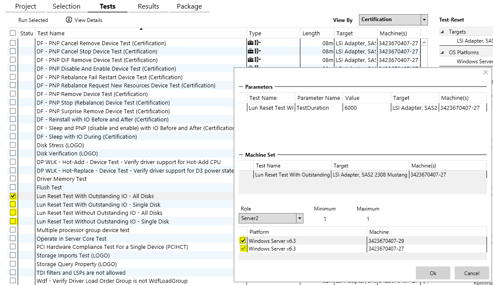

# Lun Reset Test With Outstanding IO - All Disks

\[Some information relates to pre-released product which may be substantially modified before it's commercially released. Microsoft makes no warranties, express or implied, with respect to the information provided here.\]

This is an optional test that will execute repeated cycles on every disk. Each cycle will attempt to time out an IO request on every disk once by withholding the request from the miniport. This will trigger Storport to send a RESET\_LUN, at which point the test will either forward the held IO request to the miniport together with the RESET\_LUN or complete the held IO request and forward only the RESET\_LUN. The test comes in several flavors:

-   **Lun Reset Test With Outstanding IO - All Disks** - Forwards the held request and tests resets on all disks on the controller in parallel.
-   **Lun Reset Test With Outstanding IO - Single Disk** - Forwards the held request and tests resets on the first disk on the controller by PhysicalDrive number.
-   **Lun Reset Test Without Outstanding IO - All Disks** - Completes the held request and tests resets on all disks on the controller in parallel.
-   **Lun Reset Test Without Outstanding IO - Single Disk** - Completes the held request and tests resets on the first disk on the controller by PhysicalDrive number.
-   **Bus Reset Test** - Same as Lun Reset Test With Outstanding IO - All Disks, but it will also fail the RESET\_LUN command on purpose so that Storport will send a Bus Reset.

## Test details

<table>
<colgroup>
<col width="50%" />
<col width="50%" />
</colgroup>
<tbody>
<tr class="odd">
<td>Specifications</td>
<td>Device.Storage.Controller</td>
</tr>
<tr class="even">
<td>Platforms</td>
<td><ul>
<li>Windows Server 2012 R2</li>
</ul></td>
</tr>
<tr class="odd">
<td>Expected run time (in minutes)</td>
<td>60</td>
</tr>
<tr class="even">
<td>Category</td>
<td>Certification Reliability</td>
</tr>
<tr class="odd">
<td>Timeout (in minutes)</td>
<td>3600</td>
</tr>
<tr class="even">
<td>Requires reboot</td>
<td>true</td>
</tr>
<tr class="odd">
<td>Requires special configuration</td>
<td>false (A required test driver will be installed as a part of the test run. The user does not need to perform any special configurations.)</td>
</tr>
<tr class="even">
<td>Type</td>
<td>automatic</td>
</tr>
</tbody>
</table>

 

## Running the test

This test should be run on a non-boot storage controller. Running on a boot controller is possible, but requires at least one non-boot disk attached. This test will not run on the boot disk. The expected result is for that no IOs will be stuck in the miniport after the RESET\_LUN and RESET\_BUS operations. Verification is done by restarting the machine after the test. This test is run in a dual-initiator setup. At the scheduled time, you must select two machines connected to the shared storage to test.

On the primary machine (Server1), the test queries the disks that are connected to the selected HBA.

-   During a Single-Disk test, one disk is selected, and the test performs resets on that disk from both servers (Server1 and Server2).
-   During an All Disks test, the test queries all disks connected to the HBA that is being tested and performs resets on all of the disks from both servers (Server1 and Server2).

Resets on one initiator should not adversely affect the other initiator. For a Single Disk test, ensure that the two initiators are running the test against the same physical disk in the shared storage.

## Troubleshooting

For troubleshooting, use a debugger to verify that the test driver is loaded at boot during this part of the test: **StorPortShimLib: ShimInitialize called StorPortShimLib: Entering DriverAdd. CoreTestShim installed. Done with registry checks StorPortShimLib: Hooking driver:** *&lt;StorPortMiniportName&gt;***.sys.**

## More information

**Parameters**

| Parameter name     | Parameter description               |
|--------------------|-------------------------------------|
| WDKDeviceID        | Device instance path of test device |
| LLU\_LclAdminUsr   | Administrator account to run test   |
| LLU\_NetAccessOnly | User to access test network share   |
| WDKHardwareID      | Hardware ID of test device          |
| TestDuration       | Test Duration in seconds            |
| TestName           | Test to run                         |

 

 

 

[Send comments about this topic to Microsoft](mailto:wsddocfb@microsoft.com?subject=Documentation%20feedback%20%5Bp_hck\p_hck%5D:%20Lun%20Reset%20Test%20With%20Outstanding%20IO%20-%20All%20Disks%20%20RELEASE:%20%284/27/2016%29&body=%0A%0APRIVACY%20STATEMENT%0A%0AWe%20use%20your%20feedback%20to%20improve%20the%20documentation.%20We%20don't%20use%20your%20email%20address%20for%20any%20other%20purpose,%20and%20we'll%20remove%20your%20email%20address%20from%20our%20system%20after%20the%20issue%20that%20you're%20reporting%20is%20fixed.%20While%20we're%20working%20to%20fix%20this%20issue,%20we%20might%20send%20you%20an%20email%20message%20to%20ask%20for%20more%20info.%20Later,%20we%20might%20also%20send%20you%20an%20email%20message%20to%20let%20you%20know%20that%20we've%20addressed%20your%20feedback.%0A%0AFor%20more%20info%20about%20Microsoft's%20privacy%20policy,%20see%20http://privacy.microsoft.com/default.aspx. "Send comments about this topic to Microsoft")

