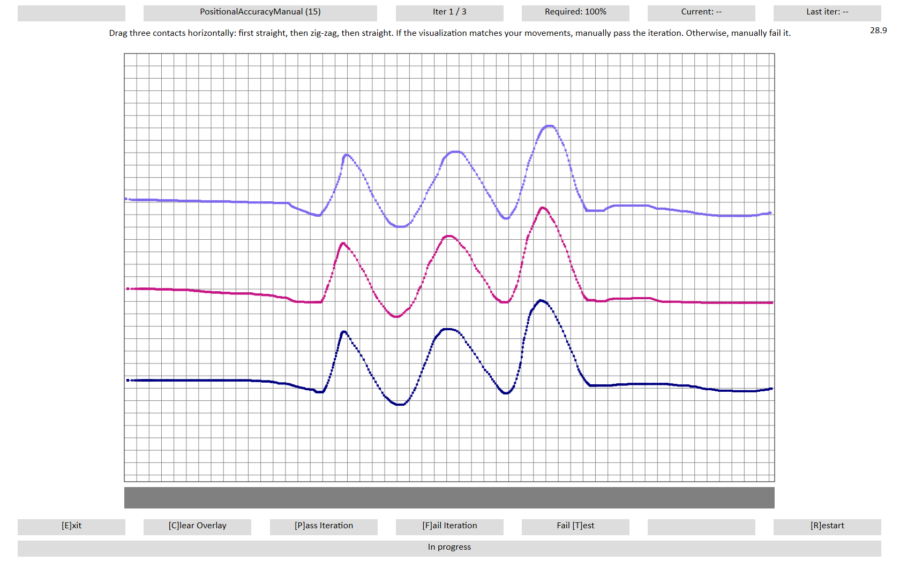
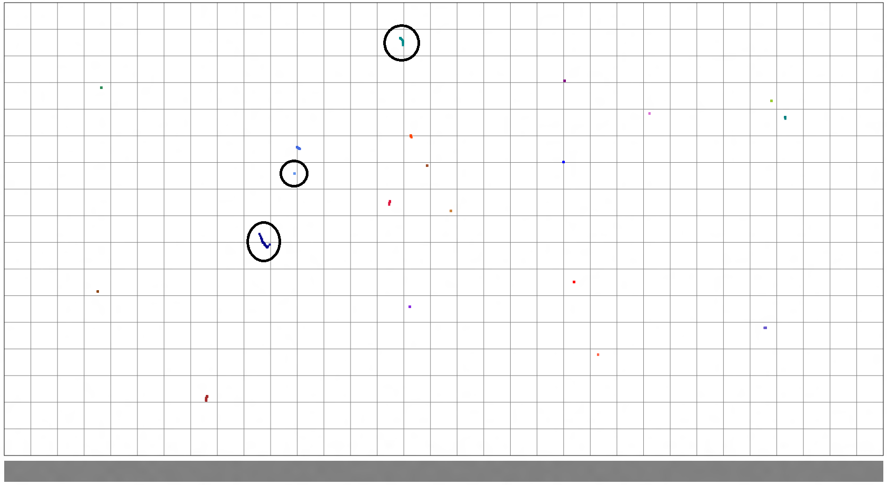
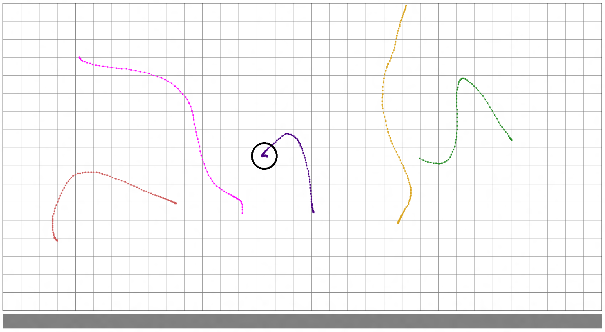
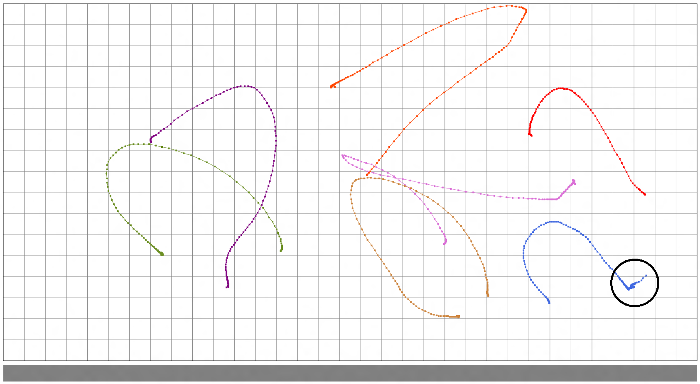

# Positional Accuracy - Manual

## Test name

**Test.PositionalAccuracyManual.json**

## Core requirements tested

-   Device.Digitizer.PrecisionTouchPad.Precision.Position

-   Device.Input.PrecisionTouchpad.HIDCompliance.HIDCompliance

-   Device.Input.PrecisionTouchpad.HIDCompliance.Timestamp

-   Device.Input.PrecisionTouchpad.HIDCompliance.ValidRange

## Test purpose

Verifies that the device is able to report absolute position accurately.

## Tools required

**PTLogo.exe**

## Validation steps

1.  Start **Test.PositionalAccuracyManual.json**.

2.  Iteration 1:

    1.  Horizontally drag three fingers straight across one-third of the touchpad.

    2.  Without lifting, continue moving across the touchpad in a zig-zag pattern.

    3.  Without lifting, continue in a straight line across the last one-third of the touchpad.

    4.  Verify that the visualization matches physical finger movements and manually pass or fail the test accordingly.

        

        **Figure 1 Positional Accuracy Manual, Iteration 1**

3.  Repeat vertically for the second iteration, and diagonally for the third iteration.

4.  Iteration 4:

    1.  Tap 20 times randomly on the touchpad.

    2.  Verify that the visualization matches your taps and there is no jitter (see *Figure 2 Positional Accuracy Manual, Iteration 4*). Manually pass or fail the test accordingly.

        

        **Figure 2 Positional Accuracy Manual, Iteration 4**

        In *Figure 2 Positional Accuracy Manual, Iteration 4*, the majority of taps are fine. The top circled contact is borderline – there was travel over the contact lifetime, but not a lot. Generally, up to 1mm (half a gridline) should be considered passing, as long as most are like the middle circled contact. The bottom circled contact shows travel greater than half a grid, which should be considered a failure for this test.

5.  Iteration 5:

    1.  Draw a curved line with your finger.

    2.  Without slowing or changing direction, lift your finger.

    3.  Verify the visualization matches your curves and does not jitter on lift (see *Figure 3 Positional Accuracy Manual, Iteration 5*). Manually pass or fail the test accordingly.

        

        **Figure 3 Positional Accuracy Manual, Iteration 5**

        The key criteria to look for in this iteration are hooks when you lift your finger. In the circled example, the contact jittered to the left a significant amount on contact lift. Consider any hook larger than a quarter of a grid as a failure.

6.  Iteration 6:

    1.  Draw a curved line with your finger that ends in the button activation area.

    2.  Without lifting, pause for one second.

    3.  Exert sufficient activation force, and lift.

    4.  Verify the visualization matches your curves and does not jitter on lift (see *Figure 4 Positional Accuracy Manual, Iteration 6*). Manually pass or fail the test accordingly.

        

        **Figure 4 Positional Accuracy Manual, Iteration 6**

        In this test, there will be extra data as the physical button is clicked, so it’s harder to judge by looking at the data itself. Instead, watch the mouse cursor as you click and lift. If it moves more than half a grid box as you click, consider it a failure. In the circled example, the cursor moved significantly on click and should be considered a failure.

## Common errors

None

## Passing

6/6 (100%) iterations must pass in order to complete with passing status.

## Related topics

[Precision Touchpad Tests](precision-touchpad-tests.md)

 

 

