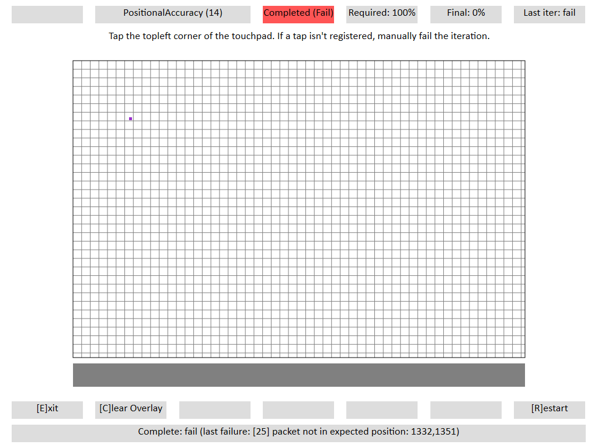

# Positional Accuracy

## Test name

**Test.PositionalAccuracy.json**

## Core requirements tested

Device.Input.PrecisionTouchpad.Precision.Position

## Test purpose

Verifies that the device is able to report absolute position accurately.

## Tools required

**PTLogo.exe**

## Validation steps

1.  Start **Test.PositionalAccuracy.json**.

2.  Following the directions on the screen, you will perform three taps in an indicated area on the touchpad. After each set of three taps, the instructions will indicate you move to a different area, for a total of 15 taps. If instructions say to tap in a corner, tap as close to that corner as possible.

    For each iteration:

    1.  Tap the location specified on the screen.

        **Note**  
        The location is calculated as a 13mm square area. For example, if the instructions say **Top Left corner**, you should tap somewhere within the top-left most 13mm of the touchpad.

         

    2.  If no tap is registered by the device, manually fail the iteration.

## Common errors

\[25\] packet not in expected position: XXX, YYY

-   Tap must occur at the location specified.

-   The given values specify the logical coordinates of where the contact was reported.

    

    **Figure 1 Positional Accuracy Failure - Packet Not In Expected Position**

## Passing

15/15 (100%) iterations must pass in order to complete with passing status.

## Related topics

[Precision Touchpad Tests](precision-touchpad-tests.md)

 

 

[Send comments about this topic to Microsoft](mailto:wsddocfb@microsoft.com?subject=Documentation%20feedback%20%5Bp_hck\p_hck%5D:%20Positional%20Accuracy%20%20RELEASE:%20%284/27/2016%29&body=%0A%0APRIVACY%20STATEMENT%0A%0AWe%20use%20your%20feedback%20to%20improve%20the%20documentation.%20We%20don't%20use%20your%20email%20address%20for%20any%20other%20purpose,%20and%20we'll%20remove%20your%20email%20address%20from%20our%20system%20after%20the%20issue%20that%20you're%20reporting%20is%20fixed.%20While%20we're%20working%20to%20fix%20this%20issue,%20we%20might%20send%20you%20an%20email%20message%20to%20ask%20for%20more%20info.%20Later,%20we%20might%20also%20send%20you%20an%20email%20message%20to%20let%20you%20know%20that%20we've%20addressed%20your%20feedback.%0A%0AFor%20more%20info%20about%20Microsoft's%20privacy%20policy,%20see%20http://privacy.microsoft.com/default.aspx. "Send comments about this topic to Microsoft")

