# Private Cloud Simulator (Windows HCK)


\[Some information relates to pre-released product which may be substantially modified before it's commercially released. Microsoft makes no warranties, express or implied, with respect to the information provided here.\]

## Overview


Private Cloud Simulator (PCS) simulates a live datacenter/private cloud by creating VM workloads, simulating data center operations (load balancing, software/hardware maintenance), and injecting compute/storage faults (unplanned hardware/software failure). PCS is designed to handle cloud scale with a multitude of compute nodes running thousands of virtual machines (VMs). Operations in a data center involve multiple VMs and compute/storage nodes, which encounter failures while operations are in progress. PCS seamlessly handles the scale and complexity of operations in a cloud scenario and uses a Microsoft SQL Server back end to record data during the run. It then presents a report that includes operation pass rates and failures/logs, providing the capability to correlate data among operations that ran.

### Why should you run the PCS in HCK?

The current industry trend is for private cloud solutions to comprise tightly integrated software and hardware components in order to deliver a resilient and performant private cloud. Issues in any of the components (software, hardware, drivers, firmware, and so forth) can compromise the solution and undermine any promises made regarding a Service Level Agreement (SLA) for the private cloud. Some of these issues are surfaced only under a high-stress, cloud-scale deployment, and are potentially hard to find using traditional stand-alone tests, which typically focus on a single device or a component. The Private Cloud Simulator is a cloud validation test suite that enables you to validate your component in a cloud scenario and identify these types of issues.

To test the fabric resiliency of cloud solutions, PCS is designed to scale up to 64 nodes performing both planned and unplanned operations. It supports real-time reporting and a failure triage infrastructure built on SQL Server Reporting Services.

Customers use HCK in their environment to perform other validation tests like Device Validation and Network and Storage Validation. PCS tests also are integrated with HCK in order to provide consistent way to perform validation across various areas of the private cloud.

### PCS profiles

In PCS, a *profile* is a pre-defined set of actions that PCS Controller runs at a specified frequency. The actions are packaged to create a specific count of VMs with a custom configuration. For these exercises, you will use the profiles in Table 1, which ship with PCS.

**TABLE 1: PCS profiles**

| PCS profile               | Solution type                                                 | Description                                                                                                                                                 |
|---------------------------|---------------------------------------------------------------|-------------------------------------------------------------------------------------------------------------------------------------------------------------|
| **Compute-Basic**         | All                                                           | A basic set of VM actions that Windows Cloud Solutions should support.                                                                                      |
| **Fabric-Disaggregated**  | Solutions with a separate compute cluster and storage cluster | An extended set of actions, run against VMs, compute nodes, and storage that a solution with a separate compute cluster and storage cluster should support. |
| **Fabric-HyperConverged** | Solutions with a Hyper-Converged cluster                      | An extended set of actions, run against VMs and compute nodes, that a solution with a hyper-converged cluster should support.                               |

 

### Actions in PCS profiles

A PCS profile can run the following actions on a VM, a compute node, or a storage node. The PCS actions simulate planned and unplanned activity. Table 2 describes planned and unplanned action that can be run against each object type in a PCS profile. Table 3 lists the actions that can be run with each of the three PCS profiles.

**TABLE 2: PCS action descriptions**

Target object
Action type
Action
Description
**Virtual machine**
Planned
VmCloneAction
Creates a new VM.
VmLiveMigrationAction
Live-migrates the VM to another cluster node.
VmSnapshotAction
Takes a snapshot of the VM.
VmStateChangeAction
Changes the VM state (to Paused, for example).
VmStorageMigrationAction
Migrates VM storage (the VHD(s)) between cluster nodes.
VmGuestRestartAction
Restarts the VM.
VmStartWorkLoadAction
Starts a user-simulated workload.
Unplanned
VmGuestFullPowerCycleAction
Power-cycles the VM.
**Compute node**
Planned
ComputeNodeRestart
Restarts one node in the compute cluster.
ComputeNodeEvacuation
Drains all resources from one cluster node.
ComputeNodeEvict
Evicts a node from the compute cluster.
ComputeNodeJoin
Joins the node back into the compute cluster.
Unplanned
ComputeNodeBugCheck
Bug checks (conducts a blue-screen test on) one node in the compute cluster.
**Storage node**
Planned
StorageNodeFileServerMove
Moves the SOFS role to a different node on the storage server.
StorageNodePoolMove
Moves a storage pool (created in Storage Spaces) to a different owner node in the storage cluster.
StorageNodeRestart
Restarts a node in the storage cluster.
Unplanned
StorageNodeBugCheck
Bug checks one node of the storage cluster.
 

**TABLE 3: Actions available for each PCS profile**

ACTION
PCS PROFILE
Compute-Basic
Fabric-Disaggregated
Fabric-HyperConverged
VmCloneAction
o
o
o
VmSnapshotAction
o
o
o
VmLiveMigrationAction
o
o
o
VmStateChangeAction
o
o
o
VmStartWorkloadAction
o
o
o
ComputeNodeRestart
o
o
o
VmStorageMigrationAction
o
o
VmGuestFullPowerCycleAction
o
o
VmGuestRestartAction
o
o
ComputeNodeEvict
o
o
ComputeNodeJoin
o
o
ComputeNodeBugCheck
o
o
ClusterCSVMoveAction
o
StorageNodeBugCheck
o
StorageNodeFileServerMove
o
StorageNodePoolMove
o
StorageNodeRestart
o
 

## Set up your lab environment


### The PCS topology

Private Cloud Simulator is designed to run against a cloud of compute servers with Windows Failover Clustering installed. Figure 1 shows the topology for a PCS lab environment, which has the following elements:

-   An Active Directory domain controller/DNS server for the test domain. All test machines are joined to the domain. Test admins must be a member of the Domain Admin group.
-   A dedicated HCK Controller VM
-   A PCS Controller VM. The PCS Controller VM also serves as SQL Server reporting server. Each PCS run creates a local SQL Server database, which enables you to check results from multiple PCS test runs.
-   A minimum 3-node compute cluster, which is a Hyper-V failover cluster that provides the "private cloud" on which test machines are deployed and migrated during the PCS tests.
-   A storage cluster that provides shared storage, which can be hyperconverged or disaggregated. You can use any type of cluster shared storage that is supported for Failover Clustering in Windows Server 2012 R2. That includes physical disks (HDDs and SSDs), HBAs (with different interconnects: FC, SAS, ISCSI, SATA, and so forth), RAID adapters, and storage enclosures.

**FIGURE 1: Topology for a PCS lab environment**

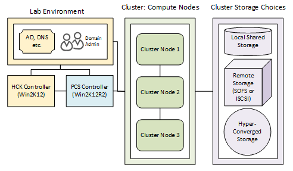

Figure 2 shows the high-level architecture of PCS. PCS Controller, where the actual framework is launched, communicates with all the nodes in a cluster, and performs operations against the nodes. Both hyperconverged and disaggregated configurations can be tested. During a test run, the PCS Controller starts multiple PCS instances, one for each node in the cluster(s). Each PCS instance then orchestrates the operations on that node. The PCS instances also communicate with one another over WCF TCP binding to ensure resources such as virtual machines and nodes are shared among the PCS instances.

**FIGURE 2: High-level PCS architecture**

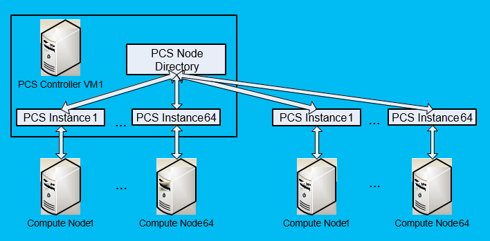

### Basic requirements

### Windows Server roles and features

Table 4 lists requirements for Windows Server roles and features in the lab environment. The lab environment for PCS should support the roles and features on the Windows Server 2012 or later operating system.

**TABLE 4: Windows Server role and feature requirements**

<table>
<colgroup>
<col width="50%" />
<col width="50%" />
</colgroup>
<thead>
<tr class="header">
<th>Windows Server role or feature</th>
<th>Requirements</th>
</tr>
</thead>
<tbody>
<tr class="odd">
<td>Active Directory Domain Services and DNS</td>
<td>Domain and forest functional levels should be Windows Server 2012 or later.</td>
</tr>
<tr class="even">
<td>Failover Clustering</td>
<td>See [Hardware and software requirements for Failover Clustering in Windows Server](https://technet.microsoft.com/library/hh831579.aspx).</td>
</tr>
<tr class="odd">
<td>Hyper-V (or another hypervisor)</td>
<td><p>A server with either Hyper-V or another hypervisor will host two VMs: one for the HCK Controller and the other for the PCS Controller.</p>
<p>Suggested minimum configuration for the virtual machine host:</p>
<ul>
<li><strong>CPU:</strong> 8 cores</li>
<li><strong>Memory:</strong> 32 GB RAM</li>
<li>Free disk space: 200 GB</li>
<li>Network: 10 GbE</li>
</ul></td>
</tr>
</tbody>
</table>

 

### Required admin credentials

To run PCS, the test administrator must be a member of the **Domain Admins** security group for the domain that contains the computers in the lab environment.

### Deploy the HCK Controller

### VM/Computer requirements for the HCK Controller

You can deploy HCK Controller on a physical computer or a virtual machine that meets these minimum requirements:

| Resource                | Minimum requirement                                                                                                                                                                            |
|-------------------------|------------------------------------------------------------------------------------------------------------------------------------------------------------------------------------------------|
| CPU (or vCPU)           | 4 cores                                                                                                                                                                                        |
| Memory                  | 12 GB RAM                                                                                                                                                                                      |
| Available disk space    | 100 GB                                                                                                                                                                                         |
| Operating system        | Windows Server 2012 or Windows Server 2008 R2                                                                                                                                                  |
| Installed software      | HCK Controller, HCK Manager, and HCK Studio ([Installation instructions for the HCK Controller, Manager, and Studio](step-1-install-controller-and-studio-on-the-test-server.md)) |
| Active Directory domain | Join it to the same domain as the cluster ("cloud solution") that you will test.                                                                                                               |

 

### Copy supplemental test content to the HCK Controller VM

Copy the supplemental test content, stored in the **PCSfiles.vhd** file, to the HCK Controller. For PCS to run successfully in HCK, the supplemental test content must be stored locally on the HCK Controller.

**Note**  Perform this procedure after you complete the HCK installation on your HCK Controller. You will need to copy the files to the AMD64 test folder that you chose during installation.

 

1.  Download the [Windows Hardware Certification Kit (HCK) Supplemental Test Content](windows-hardware-certification-kit--hck--supplemental-test-content.md). The content is stored in the PCSfiles.vhd file.
2.  Copy the VHD file to the \\AMD64 test folder on the HCK Controller. The following path is the default path for an HCK installation, where C: is the boot drive:

    -   C:\\Program Files (x86)\\Windows Kits\\8.1\\Hardware Certification Kit\\Tests\\amd64

3.  Download the [i386 Windows version of IOMeter.exe(2006.07.27)](http://go.microsoft.com/fwlink/p/?LinkId=526821) and copy IOMeter.exe and Dynamo.exe to C:\\Program Files (x86)\\Windows Kits\\8.1\\ Hardware Certification Kit \\Tests\\amd64\\pcs\\GuestScenarioManager\\IOMeter on HCK Controller VM, where C: is the program drive.

### Deploy the PCS Controller

### VM/Computer requirements for the PCS Controller

You can deploy PCS Controller on a physical computer or a virtual machine that meets these minimum requirements:

| Resource                     | Minimum requirement                                              |
|------------------------------|------------------------------------------------------------------|
| CPU (or vCPU)                | 4 cores                                                          |
| Memory                       | 12 GB RAM                                                        |
| Network                      | 10 GbE                                                           |
| Boot drive                   | C:                                                               |
| Free space on the boot drive | 100 GB                                                           |
| Operating system             | Windows Server 2012 R2 Datacenter                                |
| Active Directory domain      | Same domain as the cluster ("cloud solution") that you will test |

 

### Server features

Install the following Windows Server features on the PCS Controller:

-   .NET Framework 3.5
-   Web Server
-   Failover Clustering (Include all features.)
-   Remote Server Administration (Hyper-V Management Tools)

**Method 1: Use Server Manager to install Windows features**

1.  Log on to the PCS Controller with the domain admin account, and open Server Manager.
2.  On the **Dashboard** tab, click **Add roles and features**.
3.  On the **Features** wizard page, select the required features:
    -   .NET Framework 3.5
    -   Web Server
    -   Failover Clustering (Include all features.)
    -   Remote Server Administration (Hyper-V Management Tools)

4.  Complete the wizard instructions to install the features.

**Method 2: Use Windows PowerShell to install Windows features**

Open an elevated Windows PowerShell session on the PCS Controller, and run the following commands:

``` syntax
Add-WindowsFeature Net-Framework-Features –IncludeAllSubFeature
Add–WindowsFeature -Name Web-WebServer –IncludeAllSubFeature 
Add-WindowsFeature -Name Failover-Clustering -IncludeAllSubFeature 
Add-WindowsFeature -Name RSAT-Hyper-V-Tools –IncludeAllSubFeature 
```

### Enable WinRM on the PCS Controller

To enable management through WinRM, Run the following commands to enable Credential Security Support Provider (CredSSP) authentication on the server. Verify that the commands complete successfully.

``` syntax
Enable-WSManCredSSP -DelegateComputer * -Role Client -Force 
Enable-WSManCredSSP -Role Server -Force 
Set-ExecutionPolicy Bypass -Force   
```

For more information, see the [Enable-WSManCredSSP](https://technet.microsoft.com/library/hh849872.aspx) cmdlet reference.

### Prepare a compute cluster

### Ensure the compute cluster meets PCS requirements

1.  Ensure that your compute cluster meets the following requirements:

    -   The compute cluster must be a Hyper-V-enabled failover cluster.
    -   Each cluster node must meet these minimum specifications:

    | Resource             | Minimum requirement               |
    |----------------------|-----------------------------------|
    | CPU (or vCPU)        | 8 cores                           |
    | Memory               | 64 GB RAM                         |
    | Network              | 10 GbE                            |
    | Operating system     | Windows Server 2012 R2 Datacenter |
    | Windows Server roles | Hyper-V                           |

     

2.  Validate the cluster configuration to ensure it has the hardware and settings required for a failover cluster. To do this in Windows PowerShell, open an elevated Windows PowerShell session on any cluster node, and run the following command. For more information, see [Test-Cluster cmdlet reference](https://technet.microsoft.com/library/ee461026.aspx).

    ``` syntax
    Test-Cluster
    ```

    Alternatively, you can run the **Validate Configuration** wizard in Failover Cluster Manager. For more information, see [Create a Failover Cluster](https://technet.microsoft.com/library/dn505754.aspx) in the TechNet Library.

### Enable WinRM on the compute cluster nodes

Run the following Windows PowerShell commands on each cluster node, and verify that each command completes successfully:

``` syntax
Enable-WSManCredSSP -DelegateComputer * -Role Client -Force 
Enable-WSManCredSSP -Role Server -Force 
Set-ExecutionPolicy Bypass -Force   
```

### Install an HCK client on each compute cluster node

Install an HCK client on each node of the compute cluster. Follow the instructions in **Install Client on the test computer(s)** in the Windows Hardware Certification Kit User's Guide.

### Update Hyper-V settings for faster live migrations

To speed up live migrations of VMs, configure each node of the compute cluster to use compression during live migrations. You can update settings in **Hyper-V Manager** in Server Manager or use Windows PowerShell. For more information, see the blog entry [Configuring Faster Live Migration in Windows Server 2012 R2](http://blogs.msdn.com/b/virtual_pc_guy/archive/2013/10/25/configuring-faster-live-migration-in-windows-server-2012-r2.aspx).

### Ensure that your storage meets PCS requirements

### Basic storage requirements for PCS

For PCS testing, shared storage for the compute cluster must meet the following requirements:

-   Any of the options for cluster shared storage that are supported for Failover Clustering in Windows Server 2012 R2 can be used with PCS. This includes physical disks (HDDs and SSDs), HBAs (with different interconnects: FC, SAS, ISCSI, SATA, and so forth), RAID adapters, and storage enclosures. For example, the cluster shared storage can be hosted on SANs, shared SAS, hyper-converged local storage, or one or more SMB 3.02-based Scale-Out File Servers (SOFSs).

    **Note**  If you're using SOFS, complete **Required configuration for a Scale Out File Server (SOFS)** in the following section.

     

-   To run the PCS tests against a three-node compute cluster, provide at least 1 TB available disk space.

### Required configuration for a Scale Out File Server (SOFS)

Complete the following configuration if you're using a Scale-Out File Server (SOFS) for your storage.

### Enable WinRM on each node of the SOFS

Run the following commands on each storage cluster node, and verify that the commands complete successfully:

``` syntax
Enable-WSManCredSSP -DelegateComputer * -Role Client -Force 
Enable-WSManCredSSP -Role Server -Force 
Set-ExecutionPolicy Bypass -Force
```

### Install an HCK clients on each node of the SOFS

Install an HCK client on each node of the scale-out file server. Follow the instructions in Install Client on the test computer(s) in the Windows Hardware Certification Kit User's Guide.

## Run a PCS test in Windows HCK


This procedure walks you through a test run of the Private Cloud Simulator using one of the three PCS profiles that were added to Windows HCK in Windows Server 2012 R2. HCK takes care of prerequisites like creating a machine pool to run the test against, performs required setup for the PCS profile (for example, setting up the PCS Controller VM as a SQL Server reporting server), and then cleans up the test environment after a test completes.

**Note**  We recommend that you stick with defaults on your first test pass, and run a single PCS test, to get a feel for the procedure. Once you're comfortable running PCS tests in HCK, you can customize your tests by doing things like changing the number of VMs, the VM sizes, testing VMs that use differencing disks, and customizing actions. For more information, see the **Advanced configuration options for PCS** section below.

 

To run a PCS test in Windows HCK, perform the following steps:

1.  Log on to the HCK Controller VM with a **domain admin** account, and open HCK Studio.
2.  Create a dedicated machine pool to use for the test:

    1.  In the top right corner, click **Configuration** to open the **Configuration** page.
    2.  Under **Machine Pools**, expand **$ (Root)**
    3.  Right-click any existing machine pool, and click **Create Machine Pool**. After the new pool is added to **Machine Pools**, rename it. For example, you might name the machine pool **Cluster**.

        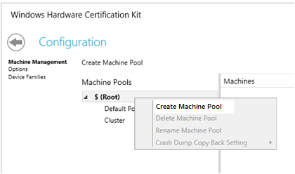

    4.  Add the following machines to the pool:

        -   PCS Controller
        -   All compute cluster nodes
        -   All storage cluster nodes (Required for a Windows-based SOFS storage cluster only.)

        To add a machine to a machine pool:

        1.  Click **Default Pool**. The default pool contains machines that have an HCK client installed and are not already assigned to another machine pool.
        2.  Click the machine, drag it to the new machine pool (in **Machine Pools**), and drop it.

    5.  Verify that the status of each of the machines is **Ready**.
    6.  Click the left arrow by **Configuration** to return to the main screen.

3.  Create a new project. On the **Project** tab, click **Create project**. Then, under **Project Name**, give the new project a name (for example, **PCS-HCK**).

    

4.  Click the **Selection** tab, and enter the following settings:

    1.  In the drop-down list, select the target machine pool (for example, **$\\Cluster**).
    2.  In the left column, click **Systems**, and then select your PCS Controller VM as the target.

        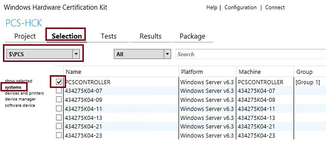

5.  On the **Tests** tab (shown in the following illustration): Set **View By** to **Optional**, select the PCS test that you want to run (**Launch Private Cloud Simulator –Compute-Basic, Launch Private Cloud Simulator – Fabric-Disaggregated**, or **Launch Private Cloud Simulator – Fabric-HyperConverged**), and then click **Run Selected**.

    Choose the PCS profile that matches the fabric you are testing. For profile information, see the **PCS profiles** section above.

    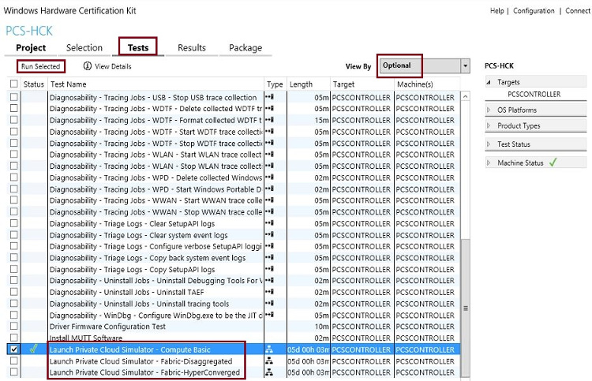

    A dialog box opens for setting parameters and the machine set for the PCS run.

    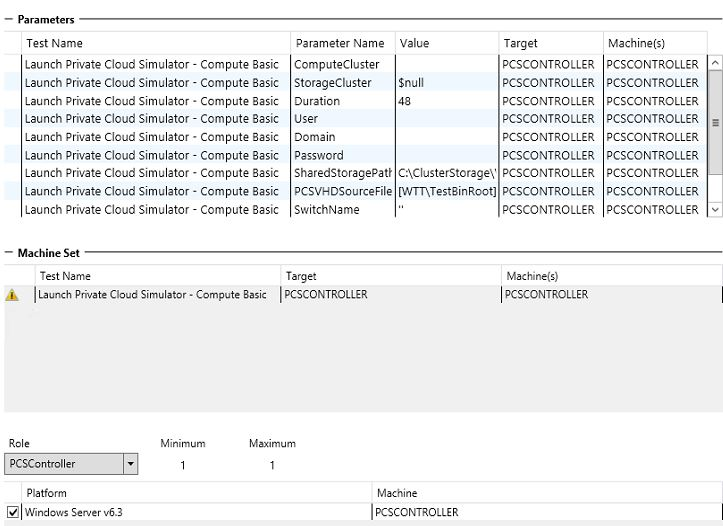

6.  In the Parameters area (shown below), set the parameters that are appropriate for the PCS profile. Use **TABLE 5** to identify the required parameters for the profile you will use. Then use **TABLE 6** to find out which values to enter for the parameters.

    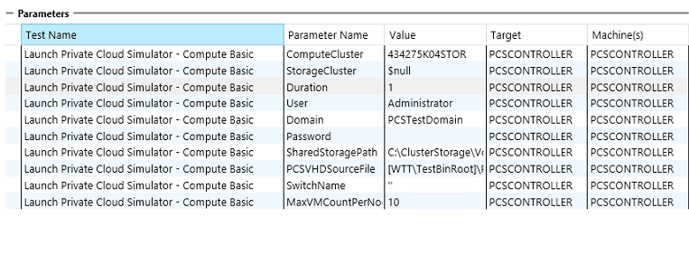

    **TABLE 5: Required parameters for the PCS profiles**

    Parameter

    PCS profile

    Compute-Basic

    Fabric-Disaggregated

    Fabric-HyperConverged

    ComputeCluster

    o

    o

    o

    User

    o

    o

    o

    Domain

    o

    o

    o

    Password

    o

    o

    o

    SharedCluster

    o

    o

    Not applicable

    SharedStoragePath

    o

    Not applicable

    o

    PCSVHDSourceFile

    o

    o

    o

    SwitchName

    o

    o

    o

    MaxVMCountPerNode

    o

    o

    o

    ProfileName

    o

    o

    o

    Duration

    o

    o

    o

     

    **TABLE 6: Parameter values to enter for PCS profiles**

    <table>
    <colgroup>
    <col width="50%" />
    <col width="50%" />
    </colgroup>
    <thead>
    <tr class="header">
    <th>Parameter</th>
    <th>Description</th>
    </tr>
    </thead>
    <tbody>
    <tr class="odd">
    <td>ComputeCluster</td>
    <td>Cluster name for the compute cluster</td>
    </tr>
    <tr class="even">
    <td>User</td>
    <td>Test admin account, which must be a member of the Domain Admins group</td>
    </tr>
    <tr class="odd">
    <td>Domain</td>
    <td>Test domain name</td>
    </tr>
    <tr class="even">
    <td>Password</td>
    <td>Password for the test admin account</td>
    </tr>
    <tr class="odd">
    <td>SharedCluster</td>
    <td>If you're testing a disaggregated solution, enter the name of the shared cluster.</td>
    </tr>
    <tr class="even">
    <td>SharedStoragePath</td>
    <td><p>For hyper-converged solutions only, enter the path to the cluster shared volume (CSV) or SMB share that provides shared storage to the cluster.</p>
    <p>Default value: C:\ClusterStorage\Volume1</p></td>
    </tr>
    <tr class="odd">
    <td>PCSVHDSourceFile</td>
    <td><p>The path to the share that stores the PCSfiles.vhd file. Recommended path: [TK]</p>
    <p>Default value = [WTTFiles]\Bin\PCSfiles.VHD</p>
    <p>For example: C:\Program Files (x86)\Windows Kits\8.1\Hardware Certification Kit\Tests\amd64</p></td>
    </tr>
    <tr class="even">
    <td>SwitchName</td>
    <td>The name of the virtual switch that is used in VM live migration</td>
    </tr>
    <tr class="odd">
    <td>MaxVMCountPerNode</td>
    <td>Maximum number of VMs to create per compute cluster node.
    <div class="alert">
    <strong>Note</strong>  The default value, 0 (zero), creates 25 VMs per node. Any other value specifies the actual number of test VMs to create per node.
    </div>
    <div>
     
    </div></td>
    </tr>
    <tr class="even">
    <td>ProfileName</td>
    <td>Specify which profile to test. Each profile specifies a set of actions to run based on the type of test suite. For the PCS test, select <strong>BasicProfile</strong>, <strong>Fabric-Disaggregated</strong>, or <strong>Fabric-HyperConverged</strong>. For profile and action information, see TABLE 1 (PCS profile descriptions), TABLE 2 (action descriptions), and TABLE 3 (actions included in each profile) above.</td>
    </tr>
    <tr class="odd">
    <td>Duration</td>
    <td>Specify how long the test should run, in hours. Default value = 96 hours</td>
    </tr>
    </tbody>
    </table>

     

7.  In the **Machine Set** area, enter the following settings:

    1.  Select the **PCSController** role, and verify that **Machine** shows your PCS Controller VM, as shown in the following illustration.

        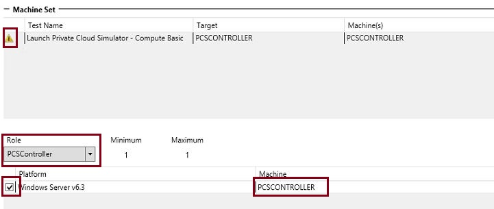

    2.  Change **Role** to **Node**, and select the remaining test VM machines.

        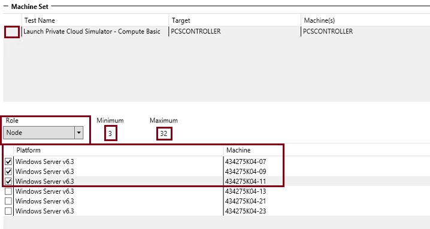

    3.  When you finish entering settings, click **OK** to start the test. As the test starts, the **Tests** tab looks similar to the following screen.

        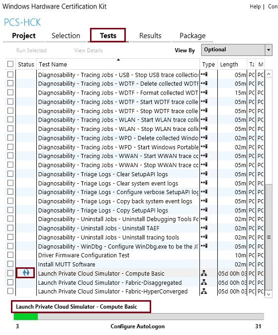

8.  To monitor the status of the test, click the **Results** tab. As the test progresses, you will see a display similar to the following one.

    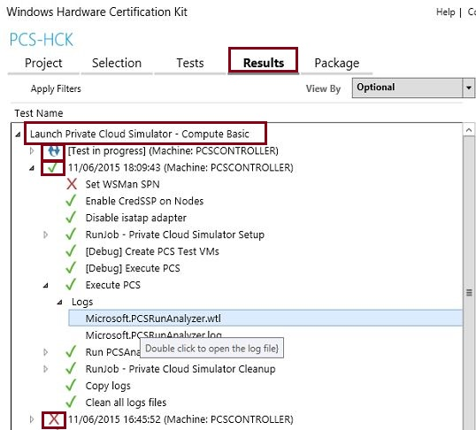

    -   Status is displayed for each action and each test suite that ran (**Setup**, **Execute**, and **Cleanup**).

         indicates a test is still in progress.

         indicates a test completed successfully.

         indicates a test failed.

    -   **Logs** shows the log files that are created. Double-click a log file name to open Test Log Report (shown in the following illustration).

        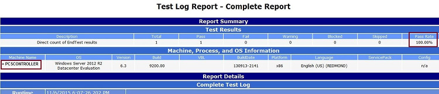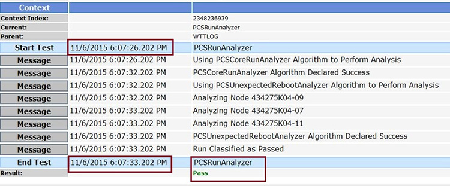

        **Note**  If any steps fail, you can rerun one or more phases of the PCS test on the PCS Controller. On the PCS Controller, you can run a limited set of tasks. For example, you might need to re-run the cleanup tasks only if cleanup failed but all other tasks completed successfully. For a list of tasks run during the Setup, Execution, and Cleanup phases of a PCS run, see the **Run Private Cloud Simulator from the PCS Controller** section below. For instructions, see the **Troubleshoot a PCS run from the PCS Controller** section below.

         

## Analyze test results


While a PCS test pass is running, you can view and analyze data in real-time through SQL Server Reporting Services. After the test pass completes, you can get additional information in the logs generated by the PCS.

### View PCS data in real-time through SQL Server Reporting Services

While PCS operations are running, SQL Server Reporting Services captures and stores results and logging data in a SQL Server database that is stored locally on the PCS Controller VM. Each report lists all operations that were performed, their pass percentages, and all resources that were acquired and released during the test. A new database is created for each test run to enable you to review data from previous test runs at any time.

To view the test data, you can navigate to local reporting server (for example: http://*&lt;PCSControllerName&gt;*/Reports). For each test run, a new database is created. This enables you to review data from previous test runs at any time. The report lists all operations that are performed, their pass percentages, and all resources that are acquired and released.

To view data in real-time using SQL Server Reporting Services:

1.  In a Web browser, open the following URL, substituting the name of your PCS Controller VM, to open a portal that links to reports from all previous PCS runs on the server:

    -   http://*&lt;Name of PCS Controller&gt;*/Reports/Pages/Report.aspx?ItemPath=%2fPCS+Reports%2fPCS+Runs

    The SQL Server Reporting Services web page will look like the one below.

    

2.  Double-click the **PCS Reports** folder. When the following screen opens, double-click **PCSRuns** to view reports for previous PCS runs.

    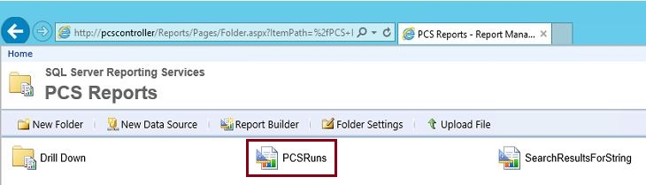

    The list looks something like the following one. Each PCS run is identified by a unique pass run ID.

    

3.  Click a pass run ID (for example, click **ae4c0421-a63e-44d1-8f4e-580aba6df418**) to open a report from the PCS run. The summary page of a PCS run, shown in the following illustration, provides an overview of the entire run. The data in these reports is live. While a test runs, you can monitor the progress of a test run in real-time.

    -   An overview of all resources (VMs and hosts) that participated in the test run.
    -   All actions that were performed on each resource. The **Pass** and **Fail** columns report the number of actions that passed and failed.

    

4.  Click a number in the **Pass/Fail** column for an action to open the **VMLiveMigrationAction** page, shown in the following illustration. which gives you more information detailed information about the failure or successful action. For example, if you clicked the failure number 9 by the **VMLiveMigrationAction** entry, you would see the summary shown in the following illustration.

    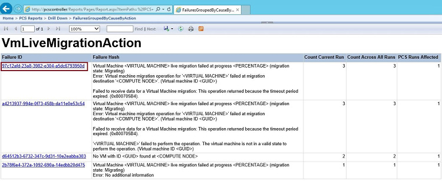

    The first entry above provides this information:

    -   **Failure ID:** When we encounter a failure in PCS, we generalize the Failure Message and generate a unique Hash for it. In above example the Failure ID is **97c12afd-23a8-3982-e304-a5dc6793950d**
    -   **Failure Hash:** Generalized failure message.

        In above example, the failure hash is as follows:

        ``` syntax
        Virtual Machine <VIRTUAL MACHINE> live migration failed at progress <PERCENTAGE> (migration state: Migrating)
                                    Error: Virtual machine migration operation for '<VIRTUAL MACHINE>' failed at migration destination '<COMPUTE NODE>'. (Virtual machine ID <GUID>)

                                    Failed to receive data for a Virtual Machine migration: This operation returned because the timeout period expired. (0x800705B4).
        ```

    -   **Count Current Run:** The count of actions of a particular type that failed with this particular error message during this run. In the above example, **VMLiveMigrationAction** was run 3 times.
    -   **Count All Runs:** A count of actions that failed because of this particular failure across all PCS runs. For the **VMLiveMigrationAction**, this count was 3.
    -   **PCS Runs Affected:** Tells how many runs have been affected by this failure. For **VMLiveMigrationAction**, only 1 PCS run was affected.

5.  To look further into the error – you can click a failure ID on that screen to drill down to a global history of the failure type across all PCS runs. For example, click **9808d496-b76b-44c3-ad91-9e88540837e1** to display the following screen. The page lists all failed operations, grouped by failure type, which has the effect of highlighting key features that you might need to investigate.

    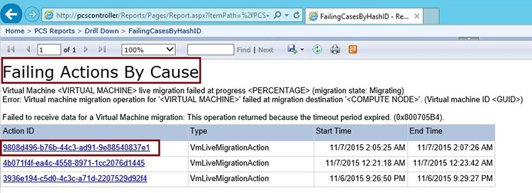

6.  If you click the Action ID, you can drill down farther to see an Action Log Report, as shown in the following illustration. Errors are shown in red; warnings are shown in yellow.

    

### View logs

After a PCS test pass completes, you can get additional information from the logs that are saved.

### Logs from the PCSLogAnalyzer

After a PCS run completes, the PCS Run Analyzer analyzes all logs and reports whether the run succeeded or failed based on the following criteria (for a run to succeed, both criteria must be met):

-   All PCS actions must succeed at least 90 percent of the time.
-   No unexpected crash of any cluster node can occur (except for crashes initiated by PCS for test purposes).

The information is stored in the PCSRunAnalyer.log, stored locally on the PCS Controller VM in the C:\\PCS folder. The log looks similar to this one.

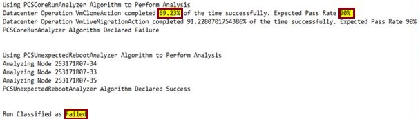

PCSRunAnalyzer also creates a .zip file that contains all logs, workload logs, and event logs from the run. The .zip file name has the date and time of the test run appended.

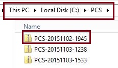

### Event logs

While the PCS actions are running, the event logs from the cluster nodes are collected on the PCS Controller, on the following path: C:\\PCSEventData. You can use these logs to diagnose any errors found in even log details.

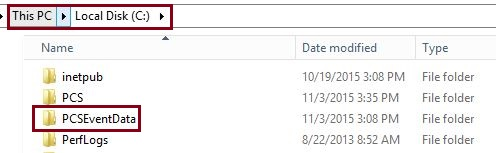

## Troubleshoot a PCS run from the PCS controller


If any actions fail during a PCS run, you can re-run some or all phases of the PCS pass directly from the PCS Controller. This method is useful when you only need to run a limited set of actions, and you don’t want to wait for an end-to-end run from the HCK. For example, if Cleanup failed during a PCS run, but all other actions completed successfully, you can move to the PCS Controller and run only the Cleanup section of the E2E-Launch.ps1 script.

On the PCS Controller, you can run the E2E-Launch.ps1 script, with any or all of the \\Setup, \\Execute, and \\Cleanup sections designated, and you'll need to enter parameters to specify the PCS profile, credentials, share path, and so forth to use.

**Important**  We recommend that you always perform your first run of PCS through Windows HCK so that all the prerequisites are ready when you run PCS on the PCK Controller VM. On the PCS Controller.

 

### Before you run PCS on the PCS Controller

You will need the following information from your initial PCS run. For a detailed discussion of parameters, see the tables in the **Run a PCS test in Windows HCK** section above.

-   compute cluster name
-   test domain name
-   credentials for the test user account (domain admin credentials required)
-   storage cluster name and the path to shared storage
-   PCS profile name
-   duration

### Run PCS on the PCS Controller

1.  Log on to the PCS Controller VM using a domain admin account.
2.  Open an elevated session of Windows PowerShell.
3.  Change directories to C:\\PCS, which stores the PCS .exe file and the PCS-E2E-Launch.ps1 script.
4.  Run the PCS-E2ELaunch.ps1 script, using this information:

    -   Three switches - /Setup, /Execute, and /Cleanupdetermine which steps the script performs. You can run 2 or 3 switches together or run the switches one at a time. **TABLE 7** lists the steps each switch performs.
    -   You'll need to provide the properties noted earlier in this section. For property details, see the **Run a PCS test in Windows HCK** section above.
    -   Use the sample commands that follow **TABLE 7** to construct your commands.

**TABLE 7: Steps performed by /Setup, /Execution, and /Cleanup parameters for the PCS-E2E-Launch script**

<table>
<colgroup>
<col width="50%" />
<col width="50%" />
</colgroup>
<thead>
<tr class="header">
<th>Parameter</th>
<th>Steps performed</th>
</tr>
</thead>
<tbody>
<tr class="odd">
<td>/Setup</td>
<td><ul>
<li>Performs SQL Server setup.</li>
<li>Sets up a SQL Server reporting server on the PCS Controller.</li>
<li>Creates a database for reporting.</li>
<li>Enables CredSSP on the PCS Controller VM.</li>
<li>Calculates required storage capacity for VM creation.</li>
<li>Sets access permissions on storage cluster shares.</li>
<li>Validates topology. (Is remote access to storage cluster nodes and compute cluster nodes working correctly?)</li>
<li>Sets up a new PCS run. (Enables remote execution of Windows PowerShell commands on all nodes; installs VMRT on the PCS Controller VM and compute cluster nodes; copies the Base VHD/VHDx to shared storage; and creates a new PCS run database.)</li>
</ul></td>
</tr>
<tr class="even">
<td>/Execute</td>
<td><ul>
<li>Deploys VMs.</li>
<li>Performs actions based on the PCS profile that you select.</li>
<li>Analyzes results.</li>
<li>Compresses logs.</li>
</ul></td>
</tr>
<tr class="odd">
<td>/Cleanup</td>
<td><ul>
<li>Evicts all VMs created by the PCS run from the compute cluster. (Prefix = PCS*)</li>
<li>Deletes all the VM snapshots.</li>
<li>Stops all the VMs.</li>
<li>Deletes all VMs and their virtual hard drives from the tenant share.</li>
</ul></td>
</tr>
</tbody>
</table>

 

### Sample commands for the PCS-E2E-Launch.ps1 script

**Compute-Basic profile**

Setup

``` syntax
.\PCS-E2ELaunch.ps1 -ComputeCluster Cluster5 -SharedStoragePath C:\ClusterStorage\Volume1 -DomainName pcstestdomain -UserName pcstestadmin -Password testpassword -ProfileName Compute-Basic -DurationInHrs 1 –Setup
```

Execute

``` syntax
.\PCS-E2ELaunch.ps1 -ComputeCluster Cluster5 -SharedStoragePath C:\ClusterStorage\Volume1 -DomainName pcstestdomain -UserName pcstestadmin -Password testpassword -ProfileName Compute-Basic -DurationInHrs 1 -Execute
```

**Fabric-Hyperconverged profile**

Setup

``` syntax
.\PCS-E2ELaunch.ps1 -ComputeCluster Cluster5 -SharedStoragePath C:\ClusterStorage\Volume1 -DomainName pcstestdomain -UserName pcstestadmin -Password testpassword -Setup -ProfileName Fabric-HyperConverged -Setup
```

Execute

``` syntax
.\PCS-E2ELaunch.ps1 -ComputeCluster Cluster5 -SharedStoragePath C:\ClusterStorage\Volume1 -DomainName pcstestdomain -UserName pcstestadmin -Password testpassword -Setup -ProfileName Fabric-HyperConverged -Execute
```

**Fabric-Disaggregated profile**

Setup

``` syntax
.\PCS-E2ELaunch.ps1 -ComputeCluster Cluster5 -StorageCluster C:\ClusterStorage\Volume1 -DomainName pcstestdomain -UserName pcstestadmin -Password testpassword -Setup -ProfileName Fabric-Disaggregated -DurationInHrs 1 -Setup
```

Execute

``` syntax
.\PCS-E2ELaunch.ps1 -ComputeCluster Cluster5 -StorageCluster C:\ClusterStorage\Volume1 -DomainName pcstestdomain -UserName pcstestadmin -Password testpassword -Setup -ProfileName Fabric-Disaggregated -DurationInHrs 1 –Execute
```

**Note**  After the PCS run has completed, you can review the logs and the reports in the PCS Report Analyzer. For more information, see the **View logs** section above.

 

### Remove artifacts created by the PCS test run from your test environment

After a PCS test run from the PCS Controller completes, you need to make sure the environment returns to the state it was in before PCS ran. (This is not needed when you run PCS through HCK: the test environment is cleaned up automatically.)

On the PCS Controller VM, use the **\\Cleanup** parameter for the in PCS-E2ELaunch.ps1 script to clean up the environment.

``` syntax
.\PCS-E2ELaunch.ps1 -ComputeCluster Cluster5 -SharedStoragePath C:\ClusterStorage\Volume1 -DomainName pcstestdomain -UserName pcstestadmin -Password testpassword –Cleanup
```

The command performs the following steps:

1.  Removes all the VMs from the cluster that PCS created (all VMs whose names start with the prefix **PCS\***).
2.  Removes all the virtual machine snapshots.
3.  Stops all of the VMs.
4.  Deletes all the VMs and attached VHDs from the Tenant Share.

## Advanced configuration options for PCS


Once you are familiar with PCS and have completed a successful run, you can use some of these advanced configurations to modify the test to best suit the scale of your solution. These customizations are made by editing the PrivateCloudSimulator.xml file, which is stored on the PCS Controller.

### Change the number and sizes of VMs that are created

Use the following fields to change the number of VMs that are created and change VM sizes.

-   **MaxVMCount** sets the number of VMs to create on each compute cluster node. Be aware that 0 (zero), the default value, creates 25 VMs per node. Any other value specifies the actual number of VMs to create per node.
-   Use the **Weight\*** parameters to set the sizes of the VMs. A single PCS run can test VMs of varying sizes. The **Weight\*** field (for example, **WeightSmall**) sets the size of the VM. The **Value** field specifies the percentage of VMs to create with that configuration. For example, the highlighted code below configures 10 percent of total VMs (**Value** = 10) as medium-size VMs (**WeightMedium** field), which have 3584 MB of memory.

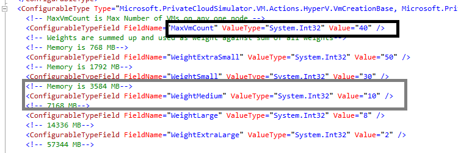

### Create VMs that use differencing disks

PCS by default uses the provided guest OS VHD to create VMs that have fixed disks by default. To create VMs that have differencing disks instead, set the **UseDiffDisks** value to **true**, as highlighted below.

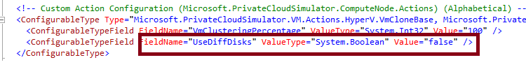

### Define actions for PCS to run

You can define and schedule your own actions for PCS to perform. The screenshot below shows a typical action definition in the **PrivateCloudSimulator.xml** file.

-   The value highlighted in yellow is the test name. This is the same test name that shows up on the report.
-   The **Interval** field sets the frequency with which the action runs. Use the format *hh:mm:ss*. For example, the value 02:00:00 repeats the action every 2 hours.
-   The **StartUpNumber** field defines the number of instances of that action to initiate\\ on each node of the compute cluster.

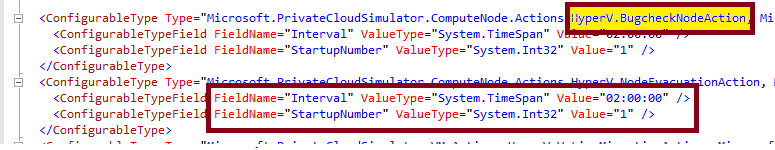

 

 

[Send comments about this topic to Microsoft](mailto:wsddocfb@microsoft.com?subject=Documentation%20feedback%20%5Bp_hck\p_hck%5D:%20Private%20Cloud%20Simulator%20%28Windows%20HCK%29%20%20RELEASE:%20%284/27/2016%29&body=%0A%0APRIVACY%20STATEMENT%0A%0AWe%20use%20your%20feedback%20to%20improve%20the%20documentation.%20We%20don't%20use%20your%20email%20address%20for%20any%20other%20purpose,%20and%20we'll%20remove%20your%20email%20address%20from%20our%20system%20after%20the%20issue%20that%20you're%20reporting%20is%20fixed.%20While%20we're%20working%20to%20fix%20this%20issue,%20we%20might%20send%20you%20an%20email%20message%20to%20ask%20for%20more%20info.%20Later,%20we%20might%20also%20send%20you%20an%20email%20message%20to%20let%20you%20know%20that%20we've%20addressed%20your%20feedback.%0A%0AFor%20more%20info%20about%20Microsoft's%20privacy%20policy,%20see%20http://privacy.microsoft.com/default.aspx. "Send comments about this topic to Microsoft")


