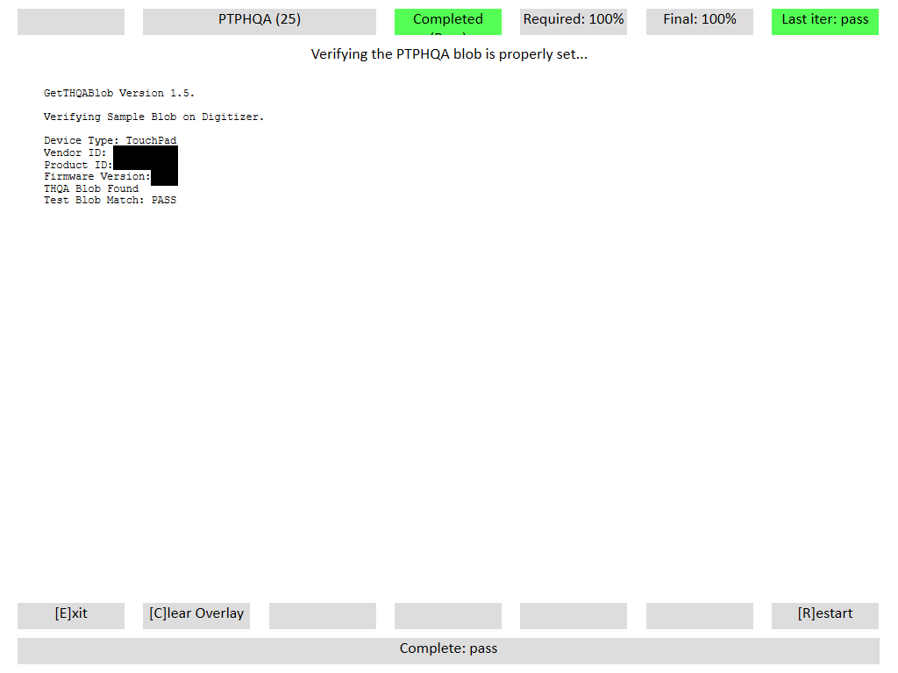

# PTPHQA

## Test name

**Test.PTPHQA**

## Core requirements tested

Device.Input.PrecisionTouchpad.HIDCompliance.PTPHQA

## Test purpose

Verifies that the device is able to report a PTPHQA certification binary large object (BLOB).

## Tools required

**PTLogo.exe**

## Validation steps

1.  Start **Test.PTPHQA.json**.

2.  PTLogo will automatically pass or fail if the device correctly or incorrectly reports the PTPHQA sample BLOB.

    

    **Figure 1 PTPHQA Passing Result**

**Note**  
If this is a recertification, this test will fail and should be manually verified by running **GetThqaBlob.exe –usage=TouchPad -verifyCertified**. See also [Field Firmware Updateable](field-firmware-updateable-precision-touchpad-tests.md).

 

## Common errors

None

## Passing

1/1 (100%) iterations must pass in order to complete with passing status.

## Related topics

[Precision Touchpad Tests](precision-touchpad-tests.md)

 

 

[Send comments about this topic to Microsoft](mailto:wsddocfb@microsoft.com?subject=Documentation%20feedback%20%5Bp_hck\p_hck%5D:%20PTPHQA%20%20RELEASE:%20%284/27/2016%29&body=%0A%0APRIVACY%20STATEMENT%0A%0AWe%20use%20your%20feedback%20to%20improve%20the%20documentation.%20We%20don't%20use%20your%20email%20address%20for%20any%20other%20purpose,%20and%20we'll%20remove%20your%20email%20address%20from%20our%20system%20after%20the%20issue%20that%20you're%20reporting%20is%20fixed.%20While%20we're%20working%20to%20fix%20this%20issue,%20we%20might%20send%20you%20an%20email%20message%20to%20ask%20for%20more%20info.%20Later,%20we%20might%20also%20send%20you%20an%20email%20message%20to%20let%20you%20know%20that%20we've%20addressed%20your%20feedback.%0A%0AFor%20more%20info%20about%20Microsoft's%20privacy%20policy,%20see%20http://privacy.microsoft.com/default.aspx. "Send comments about this topic to Microsoft")

