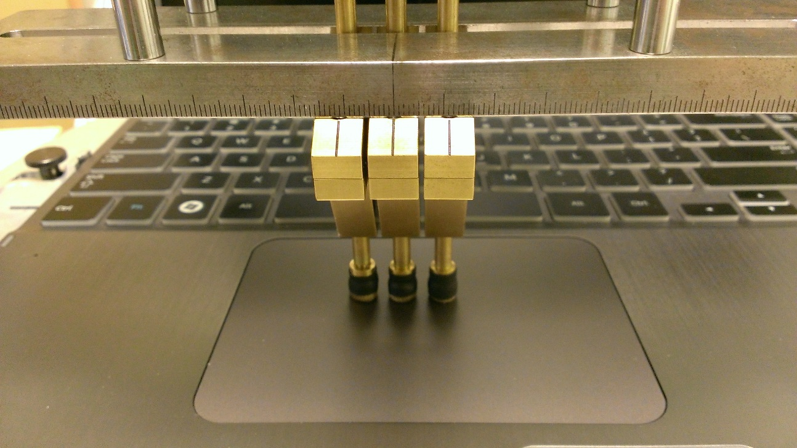
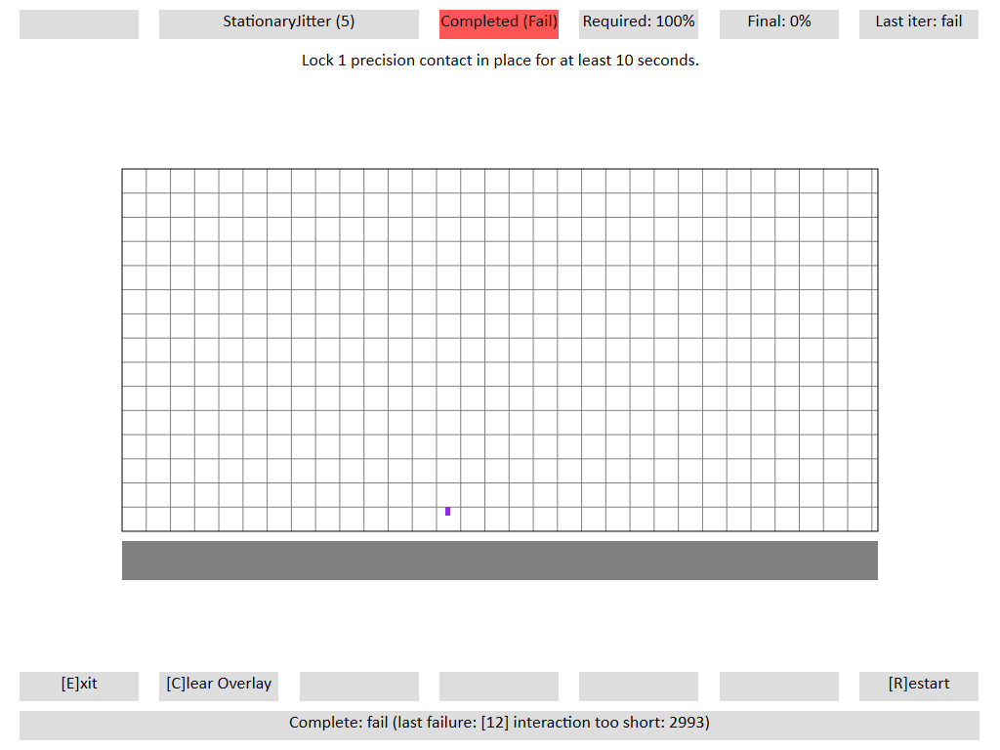
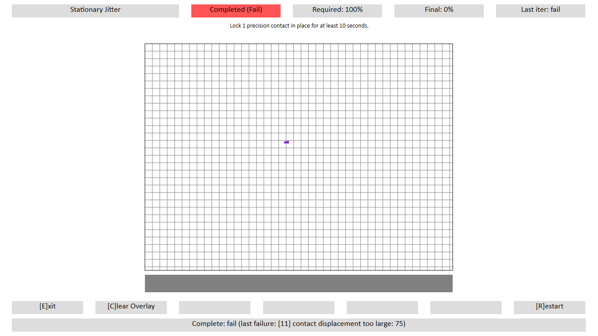

# Stationary Jitter

## Test name

-   **Test.StationaryJitter.json**

-   **Test.StationaryJitterMultiple.json**

## Core requirements tested

Device.Input.PrecisionTouchpad.Precision.StationaryJitter

## Tools required

-   **PTLogo.exe**

-   PT3 with Precision Touchpad modifications

## Validation steps

1.  Start **Test.StationaryJitter.json**.

2.  Follow the instructions in [Windows Precision Touchpad Device Validation Guide](windows-precision-touchpad-device-validation-guide.md#gen) to make sure that the touchpad is perfectly aligned, with the bottom edge facing the tester.

3.  Make sure both axes are locked on the PT3, so that the contact(s) can only move up and down.

    

    **Figure 1 PT3 Axis Locking**

4.  Carefully lower one contact straight down anywhere on the digitizer surface.

    **Note**  
    Some PT3 tips might bounce slightly if brought down quickly. To avoid this, lower the tip slowly onto the digitizer surface.

     

5.  Wait ten seconds, using the timer in the upper-right corner of PTLogo.

6.  Carefully raise the contact.

7.  If no jitter is detected, PTLogo will pass the iteration and move on to the next. Otherwise, it will fail the test and give an error.

8.  Repeat for five iterations, each at a different location on the touchpad.

9.  Start **Test.StationaryJitterMultiple.json**.

10. Add contacts to the PT3, so that there are three to five contacts (as supported by the device) at a separation distance of 11mm.

    

    **Figure 2 Stationary Jitter Test with Three Contacts**

11. Carefully lower the contacts down anywhere on the touchpad, until all contacts are visualized in PTLogo.

    For pressure pads, lower the contacts until they are just above the maximum *z* height (1mm), and bring down quickly but smoothly until all contacts are visualized in PTLogo.

12. Wait ten seconds, using the timer in the upper-right corner of PTLogo.

13. Carefully raise the contacts.

14. If no jitter is detected, PTLogo will pass the iteration and move on to the next. Otherwise, it will fail the test and give and error.

15. Repeat for five iterations, each at a different location on the touchpad, but always with the contacts aligned horizontally on the digitizer surface as shown in *Figure 2 Stationary Jitter Test with Three Contacts*.

## Common errors

-   \[12\] interaction too short: \#\#\#\#\#

    -   Contact was down for less than the required duration.

    -   The value provided is the duration of the contact in milliseconds.

    

    **Figure 3 Stationary Jitter Failure - Interaction Too Short**

-   11\] contact displacement too large: \#\#\#

    -   Contact moved or jittered greater than the allowed tolerance of 0.5mm.

    -   The value provided is the himetric displacement.

    

    **Figure 4 Stationary Jitter Failure - Contact Displacement Too Large**

## Passing

A total of 10/10 (100%) iterations must pass in order to complete with passing status.

## Related topics

[Precision Touchpad Tests](precision-touchpad-tests.md)

 

 

[Send comments about this topic to Microsoft](mailto:wsddocfb@microsoft.com?subject=Documentation%20feedback%20%5Bp_hck\p_hck%5D:%20Stationary%20Jitter%20%20RELEASE:%20%284/27/2016%29&body=%0A%0APRIVACY%20STATEMENT%0A%0AWe%20use%20your%20feedback%20to%20improve%20the%20documentation.%20We%20don't%20use%20your%20email%20address%20for%20any%20other%20purpose,%20and%20we'll%20remove%20your%20email%20address%20from%20our%20system%20after%20the%20issue%20that%20you're%20reporting%20is%20fixed.%20While%20we're%20working%20to%20fix%20this%20issue,%20we%20might%20send%20you%20an%20email%20message%20to%20ask%20for%20more%20info.%20Later,%20we%20might%20also%20send%20you%20an%20email%20message%20to%20let%20you%20know%20that%20we've%20addressed%20your%20feedback.%0A%0AFor%20more%20info%20about%20Microsoft's%20privacy%20policy,%20see%20http://privacy.microsoft.com/default.aspx. "Send comments about this topic to Microsoft")

