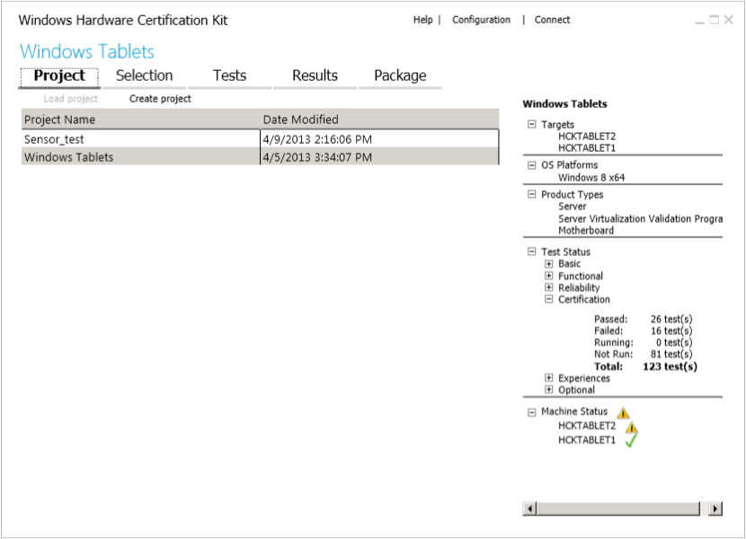

# Step 4: Create a project

After you setup your test server and clients, you're ready to begin testing. The first step is to create a project. A project defines what you want to test. The most common project is the device you want to submit for certification. In this example, you create a project, run all certification tests associated with that device, and finally create a single package that contains all the passing test results.

With the new [HCK Testing Concepts](hck-testing-concepts.md) feature, you can create projects that represent a wide range of scenarios. In addition, you can create several smaller projects and merge the results into one package.

The following image shows the Studio Project tab.

## To create a project

1.  On the server computer, open **HCK Studio**.

2.  On the **Project** tab, click **Create project**.

3.  Replace the default project name with the name of your project, and then press Enter.

    **Note**  
    A project should have a meaningful name that indicates its contents, for example, "Fabrikam Multi-function Device Model Z".

     

    When the project name appears on the page, the project is created.

The right-pane displays project details. Initially the information is empty until you start testing your device. As you create multiple projects, you can load different projects to check the status.

To learn more about this page, see [HCK Studio - Project Tab](hck-studio---project-tab.md).

 

 

