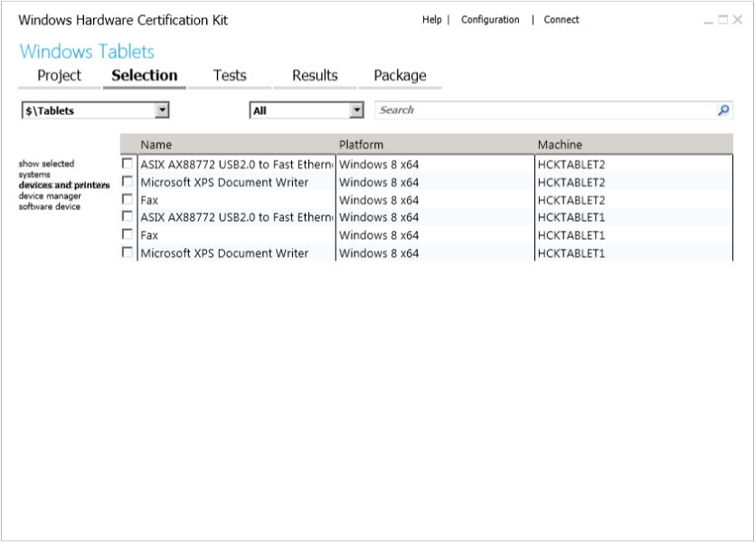

# Step 5: Select target to certify

Windows HCK Studio detects all features that a device implements. The specific testable device is called the *target*. A device may contain multiple targets, represented by one or more hardware IDs. Using the **Selection** tab, you can filter what you want to test using the following views:

-   **Systems.** To test a complete client or server computer.

-   **Devices and printers.** To test an external device that's connected to a test computer. This device typically appears in **Start** &gt; **Devices and Printers** on the test computer.

-   **Device manager.** To test a component of a test computer or external device, for example, a network card. This is the most detailed view.

-   **Software devices.** To test filter drivers, firewalls, and antivirus software that's installed on the test computer.

    **Note**  
    Some software drivers are associated with a physical device. If you cannot find your driver under **Software Device**, use the search bar on **Device Manager** to find the device under which your software driver is associated.

     

The following image shows the Studio Selection tab.

## To select a target to certify

1.  Click the **Selection** tab. From the machine pool list (upper-left drop-down list), select the pool that contains the devices that you want to certify.

2.  From the left-pane, select the view based on the device you want to certify: **systems, device and printers, device manager,** or **software device**.

    A list of available targets is displayed in the center detailed view. If you select **device manager**, you can choose to show inbox and hidden features.

3.  From center detailed view, select the check box next to each target that you want to test.

    **Note**  
    -   You must select all of the features of a specific product type for a device to receive certification.

    -   If you're testing a Web Services on Devices (WSD) device, there may be a delay before required WSD targets are listed.

     

The **show selected** option displays the targets that you select in the other views. This view allows you to see just the areas you're testing. You also can filter a machine pool by category by using the **category** list. You can search for specific targets/features by using the search box.

To learn more about the different options on this page see [HCK Studio - Selection Tab](hck-studio---selection-tab.md).

 

 

[Send comments about this topic to Microsoft](mailto:wsddocfb@microsoft.com?subject=Documentation%20feedback%20%5Bp_hck\p_hck%5D:%20Step%205:%20Select%20target%20to%20certify%20%20RELEASE:%20%284/27/2016%29&body=%0A%0APRIVACY%20STATEMENT%0A%0AWe%20use%20your%20feedback%20to%20improve%20the%20documentation.%20We%20don't%20use%20your%20email%20address%20for%20any%20other%20purpose,%20and%20we'll%20remove%20your%20email%20address%20from%20our%20system%20after%20the%20issue%20that%20you're%20reporting%20is%20fixed.%20While%20we're%20working%20to%20fix%20this%20issue,%20we%20might%20send%20you%20an%20email%20message%20to%20ask%20for%20more%20info.%20Later,%20we%20might%20also%20send%20you%20an%20email%20message%20to%20let%20you%20know%20that%20we've%20addressed%20your%20feedback.%0A%0AFor%20more%20info%20about%20Microsoft's%20privacy%20policy,%20see%20http://privacy.microsoft.com/default.aspx. "Send comments about this topic to Microsoft")

