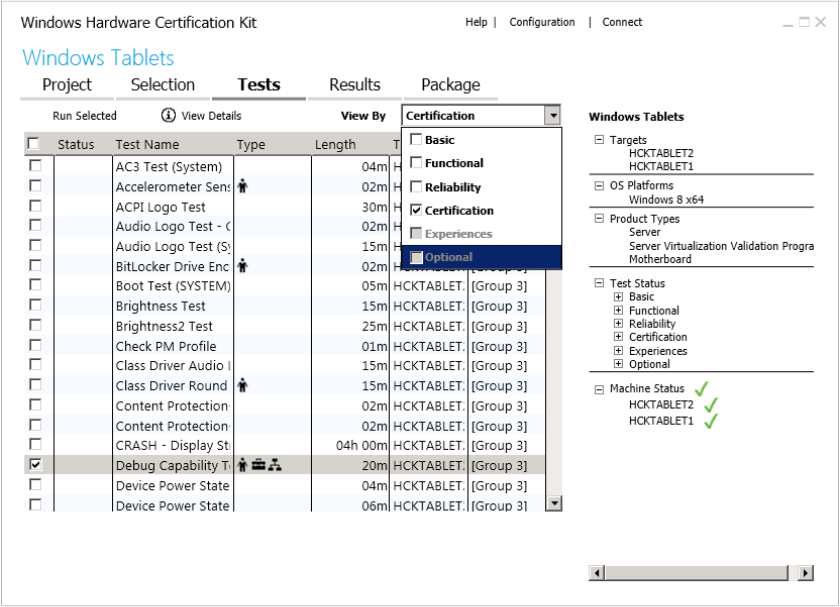

# Step 6: Select and run tests

The **Tests** tab displays all of the tests associated with the features found on your device. You filter and sort the test results by:

-   Level (Basic, Functional, Reliability, Certification, Experiences, Optional)

-   Status

-   Test Name

-   Type (manual, non-distributed, special configuration, multiple machine)

-   Length

-   Target

-   Machine(s)

Because manual tests interrupt the test process to await user input, we recommend that you run them separately from automated tests. Some automated tests require additional parameters before you can run them.

The following image shows the Studio Tests tab.

## To run a test

1.  Filter the test results using the **View By** drop-down list.

2.  Select the check box next to each test that you want to run.

3.  To run the selected tests, click **Run Selected**.

    A progress bar appears. A slight delay occurs when you run a test.

    Some tests require additional input before they run. Windows HCK Studio prompts you accordingly for more information. To learn more about any test, select the test from the list and press **F1** key or right-click and select **Help**. To cancel any running test, right-click it and select **Cancel**.

As tests complete, the results of each one is displayed in the **Status** column. A green checkmark means that it passed; a red X means that it failed. The right pane displays project summary information, including target(s) selected, operating systems being tested, product types you qualify for, and status of all tests.

To learn more about the different options on this page, see [HCK Studio - Tests Tab](hck-studio---tests-tab.md).

 

 

[Send comments about this topic to Microsoft](mailto:wsddocfb@microsoft.com?subject=Documentation%20feedback%20%5Bp_hck\p_hck%5D:%20Step%206:%20Select%20and%20run%20tests%20%20RELEASE:%20%284/27/2016%29&body=%0A%0APRIVACY%20STATEMENT%0A%0AWe%20use%20your%20feedback%20to%20improve%20the%20documentation.%20We%20don't%20use%20your%20email%20address%20for%20any%20other%20purpose,%20and%20we'll%20remove%20your%20email%20address%20from%20our%20system%20after%20the%20issue%20that%20you're%20reporting%20is%20fixed.%20While%20we're%20working%20to%20fix%20this%20issue,%20we%20might%20send%20you%20an%20email%20message%20to%20ask%20for%20more%20info.%20Later,%20we%20might%20also%20send%20you%20an%20email%20message%20to%20let%20you%20know%20that%20we've%20addressed%20your%20feedback.%0A%0AFor%20more%20info%20about%20Microsoft's%20privacy%20policy,%20see%20http://privacy.microsoft.com/default.aspx. "Send comments about this topic to Microsoft")

