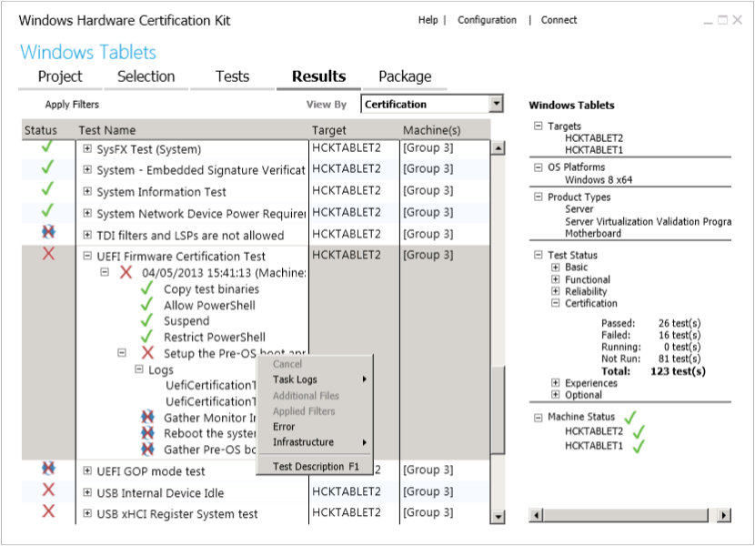

# Step 7: View test results and log files

The **Results** tab displays detailed information about each test. As each test completes, the status column updates with the result—pass or fail.

The following image shows the Studio Results tab.

## To troubleshoot a failed test

If a test fails, you can expand the test details to review the associated log file.

1.  From the list, select a failed test, indicated by a red X.

2.  Expand the **Test Name** node, expand the **Logs** node, and then double-click the log file.

    You can review these log files:

    -   **.log file.** Text dump.

    -   **.wtl file.** Open to view error reports.

    -   **.xml file.** Change file name extension to .wtl to view error reports.

Right-click any test to see additional test details, including:

-   Task logs.

-   Additional files.

-   Applied filters.

-   Errors.

-   Infrastructure (gather and execution logs).

To learn more about the different options on this page including distributed and multi-device support, see [HCK Studio - Results Tab](hck-studio---results-tab.md).

## Related topics

[Troubleshooting Windows HCK Test Failures](http://go.microsoft.com/fwlink/?LinkId=317856)

 

 

