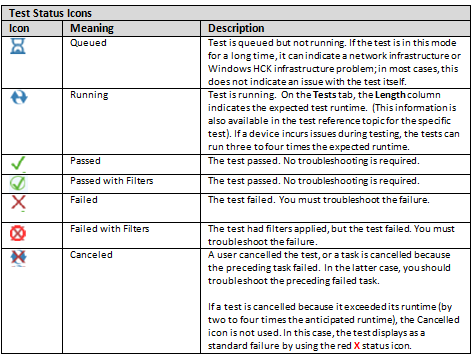

# Troubleshooting Windows HCK Test Failures


We recommend that you use this guide as your starting point to troubleshoot Windows Hardware Certification Kit (Windows HCK) test failures. This article describes possible test failures and provides step-by-step instructions on how to troubleshoot them. You must perform the troubleshooting steps in the prescribed order.

**Troubleshooting steps:**

[1. Install latest updates and filters](#step1)

[2. Review the Status icons](#reviewstat)

[3. Make sure that the test was run correctly](#confirmcorrect)

[4. Check for configuration changes](#configchanges)

[5. Identify the failure category](#cat)

[6. Contact Windows HCK Support](#support)

**Also in this article:**

[Windows HCK task error message reference](#errorref)

## <a href="" id="step1"></a>1. Install latest updates and filters


Verify that you have the latest updates and filters for Windows HCK. The test failure might already be resolved by a published filter or update. You can get the latest Windows HCK content at [Windows Hardware Certification Kit Filters](windows-hardware-certification-kit-filters.md).

Watch a video demonstration.

<iframe src="https://hubs-video.ssl.catalog.video.msn.com/embed/6d820a97-9954-4005-83ed-534d6648dab5/IA?csid=ux-en-us&MsnPlayerLeadsWith=html&PlaybackMode=Inline&MsnPlayerDisplayShareBar=false&MsnPlayerDisplayInfoButton=false&iframe=true&QualityOverride=HD" width="720" height="405" allowFullScreen="true" frameBorder="0" scrolling="no"></iframe>

[Download the video (MP4)](http://content3.catalog.video.msn.com/e2/ds/fd494d2e-c29b-48a5-89d8-ef8af803ef0b.mp4)

[Send feedback about this video](mailto:lhdocfb@microsoft.com?subject=HCKQFEFiltersVIDEO&body=%0D%0A%0D%0AMicrosoft%20uses%20your%20feedback%20to%20improve%20its%20products,%20services%20and%20documentation.%20While%20we%20are%20investigating%20the%20issue%20you%20report,%20we%20may%20send%20e-mail%20to%20you%20to%20ask%20for%20further%20details%20or%20clarification%20on%20the%20feedback%20you%20send%20to%20us,%20and%20we%20may%20send%20e-mail%20to%20you%20to%20let%20you%20know%20that%20your%20feedback%20has%20been%20addressed.%C2%A0%20We%20do%20not%20use%20your%20e-mail%20address%20for%20any%20other%20purpose.%0D%0AFor%20technical%20support,%20contact%20http://go.microsoft.com/fwlink/?LinkId=143702.%0D%0A%0D%0A%20For%20further%20information%20about%20the%20Microsoft%20Online%20Privacy%20Statement,%20please%20see%20http://go.microsoft.com/fwlink/?LinkId=143701.)

## <a href="" id="reviewstat"></a>2. Review the Status icons


In Windows HCK Studio, check the test status by viewing the **Status** icons on the **Result** tab. *Figure 1 Status Icons* shows the status icons, and describes what each icon represents. To follow the test failure categories that are listed in [Windows HCK Studio failure categories](#cat), you must know what each icon represents



**Figure 1 Status Icons**

**Note**  
If the status icon suggests that you have a Windows HCK infrastructure problem, see [Troubleshooting the Windows HCK Environment](troubleshooting-the-windows-hck-environment.md).

 

## <a href="" id="confirmcorrect"></a>3. Make sure that the test was run correctly


Make sure that the test was run correctly, as described in the following sections:

-   [Verify tests that require special configuration](#specconfig)

-   [Verify manual tests that require user interaction](#userinter)

-   [Run multi-device test as a single test](#multi)

Watch a video demonstration.

<iframe src="https://hubs-video.ssl.catalog.video.msn.com/embed/d3e3bdd1-2a1d-458d-8950-a17292a0dea1/IA?csid=ux-en-us&MsnPlayerLeadsWith=html&PlaybackMode=Inline&MsnPlayerDisplayShareBar=false&MsnPlayerDisplayInfoButton=false&iframe=true&QualityOverride=HD" width="720" height="405" allowFullScreen="true" frameBorder="0" scrolling="no"></iframe>

[Download the video (MP4)](http://content3.catalog.video.msn.com/e2/ds/39ed490b-5bff-44f2-9556-24d039245648.mp4)

[Send feedback about this video](mailto:lhdocfb@microsoft.com?subject=HCKSpecialTestRequirementsVIDEO&body=%0D%0A%0D%0AMicrosoft%20uses%20your%20feedback%20to%20improve%20its%20products,%20services%20and%20documentation.%20While%20we%20are%20investigating%20the%20issue%20you%20report,%20we%20may%20send%20e-mail%20to%20you%20to%20ask%20for%20further%20details%20or%20clarification%20on%20the%20feedback%20you%20send%20to%20us,%20and%20we%20may%20send%20e-mail%20to%20you%20to%20let%20you%20know%20that%20your%20feedback%20has%20been%20addressed.%C2%A0%20We%20do%20not%20use%20your%20e-mail%20address%20for%20any%20other%20purpose.%0D%0AFor%20technical%20support,%20contact%20http://go.microsoft.com/fwlink/?LinkId=143702.%0D%0A%0D%0A%20For%20further%20information%20about%20the%20Microsoft%20Online%20Privacy%20Statement,%20please%20see%20http://go.microsoft.com/fwlink/?LinkId=143701.)

### <a href="" id="specconfig"></a>Verify tests that require special configuration

You should check whether the test requires a special configuration and if it does, verify that all special configuration requirements are met.

Some Windows HCK tests require additional files that are not included in the Windows HCK because of size or security reasons. Windows HCK Studio denotes these tests as requiring special configuration. These tests fail if the supplemental data is not installed.

Tests that require special configuration are denoted by a toolbox icon


in the **Type** column in the **Test** pane and the **Results** pane in Windows HCK Studio. Special configuration details are described in the test reference topic for each test. For specific test reference documentation, see [Certification Test Reference](certification-test-reference.md), or from in Windows HCK Studio, select the specific test on the **Test** tab or the **Result** tab, and then press **F1**.

**Note**  
The online version of the help content is generally the most current.

 

### <a href="" id="userinter"></a>Verify manual tests that require user interaction

You should determine whether the test requires user interaction.

Tests that require user interaction are denoted by a person icon


in the **Type** column in the **Test** pane and the **Results** pane in Windows HCK Studio. For instructions on how to run a manual test, see the **Running the test** section in the test reference topic for the particular test. For specific test reference documentation, see [Certification Test Reference](certification-test-reference.md), or from in Windows HCK Studio, select the specific test on the **Test** tab or the **Result** tab, and then press **F1**.

### <a href="" id="multi"></a>Run multi-device test as a single test

If the test was run as a multi-device test, rerun the test as a single test.

Multi-device testing is a Windows HCK feature that is supported by some tests. This feature reduces the time that a test runs by testing multiple devices at the same time (instead of scheduling a separate test run for each device.) Although this is a good way to reduce overall test time, it makes troubleshooting difficult because the results for all devices are logged in the same log files.

If a test fails during a multi-device test run, we recommend that you rerun the test separately against each device and troubleshoot each test run accordingly. To run a test individually in Windows HCK Studio, select the context-menu item **Run Tests Individually**. This menu item is available in the **Results** pane for tests that run as multi-device tests.

## <a href="" id="configchanges"></a>4. Check for configuration changes


Confirm that the Windows HCK infrastructure or the device configuration did not change after you selected the test target. Windows HCK gets the Windows HCK Client system configuration information when you select the test target. If you change the system or device configuration after you select the test target, you must then re-select the test target.

**Warning**  
Be aware that re-selecting the test target invalidates and removes all previous test results. We highly recommend that you do not make any device or infrastructure changes after you have started testing.

 

Watch a video demonstration.

<iframe src="https://hubs-video.ssl.catalog.video.msn.com/embed/2bca5897-7ae7-4b0b-9416-9ea7fdc5ab9d/IA?csid=ux-en-us&MsnPlayerLeadsWith=html&PlaybackMode=Inline&MsnPlayerDisplayShareBar=false&MsnPlayerDisplayInfoButton=false&iframe=true&QualityOverride=HD" width="720" height="405" allowFullScreen="true" frameBorder="0" scrolling="no"></iframe>

[Download the video (MP4)](http://content4.catalog.video.msn.com/e2/ds/b7b95642-a144-4558-9342-d24835b6dc6e.mp4)

[Send feedback about this video](mailto:lhdocfb@microsoft.com?subject=HCKConfigurationChangesVIDEO&body=%0D%0A%0D%0AMicrosoft%20uses%20your%20feedback%20to%20improve%20its%20products,%20services%20and%20documentation.%20While%20we%20are%20investigating%20the%20issue%20you%20report,%20we%20may%20send%20e-mail%20to%20you%20to%20ask%20for%20further%20details%20or%20clarification%20on%20the%20feedback%20you%20send%20to%20us,%20and%20we%20may%20send%20e-mail%20to%20you%20to%20let%20you%20know%20that%20your%20feedback%20has%20been%20addressed.%C2%A0%20We%20do%20not%20use%20your%20e-mail%20address%20for%20any%20other%20purpose.%0D%0AFor%20technical%20support,%20contact%20http://go.microsoft.com/fwlink/?LinkId=143702.%0D%0A%0D%0A%20For%20further%20information%20about%20the%20Microsoft%20Online%20Privacy%20Statement,%20please%20see%20http://go.microsoft.com/fwlink/?LinkId=143701.)

## <a href="" id="cat"></a>5. Identify the failure category


The **Results** tab in Windows HCK Studio lists test tasks in the order in which they were run. Failed tests include error options that you can use to help troubleshoot test failures.

The following table describes test categories and their indicators; the failure category column links to troubleshooting assistance in this article. To access test errors, execution logs, tasks logs, and additional associated files, right-click the failed test on the Windows HCK Studio **Results** tab.

<table>
<colgroup>
<col width="25%" />
<col width="25%" />
<col width="25%" />
<col width="25%" />
</colgroup>
<thead>
<tr class="header">
<th>Failure category</th>
<th>Status icon</th>
<th>Identifiers</th>
<th>Description</th>
</tr>
</thead>
<tbody>
<tr class="odd">
<td><p>[Test failed because of test results](#results)</p></td>
<td><p>Failed</p></td>
<td><p>Task Error, Task Log</p>
<p>Task Log</p>
<p>Task Error</p></td>
<td><p>[Task &lt;&gt; is Marked as Failed from the Log File](#markedasfailed)</p>
<p>[Failed to determine Pass/Fail of the task &lt;&gt; Task will be marked as failed anyway.](#fail2determine)</p>
<p>[Cause : The Execute Task with &lt;&gt; Failed with ExitCode &lt;Error Code&gt;](#exitcode)</p></td>
</tr>
<tr class="even">
<td><p>[System crashed](#sysx)</p></td>
<td><p>Failed</p></td>
<td><p>Windows Event Log, Windows crash dump files</p></td>
<td><p>A system event log entry and (if enabled), a crash dump file are created during a system crash. The Task Error probably states: <strong>Task Cancelled Because of an Unexpected Reboot</strong>.</p></td>
</tr>
<tr class="odd">
<td><p>[Test crashed](#testx)</p></td>
<td><p>Failed</p></td>
<td><p>Windows Event Log, user-mode crash dump files</p></td>
<td><p>When a user mode component crashes, an Application event log entry is created on the Windows HCK Client; if it is enabled, a user mode dump file is also created.</p></td>
</tr>
<tr class="even">
<td><p>[Test was cancelled because it ran too long](#toolong)</p></td>
<td><p>Failed</p></td>
<td><p>Task Execution Log</p></td>
<td><p>This problem is indicated in the Task Execution Log.</p></td>
</tr>
<tr class="odd">
<td><p>[Client system is unresponsive.](#clientunre)</p></td>
<td><p>Running</p></td>
<td><p>No indicators</p></td>
<td><p>If the Windows HCK Client is not responding, tests can run indefinitely.</p></td>
</tr>
<tr class="even">
<td><p>Test was ended by the user on the Windows HCK Client.</p></td>
<td><p>Failed</p></td>
<td><p>Task Error</p></td>
<td><p>This kind of error does not usually produce a log file.</p></td>
</tr>
</tbody>
</table>

 

For additional information about specific error messages, see [Windows HCK task error message reference](#errorref).

The following sections fully describe the failure categories that are listed in the preceding table:

-   [Test failed because of test results](#results)

-   [Test fails with no failing task and Execution Logs are disabled](#exelogs)

-   [System crashed](#sysx)

-   [Test crashed](#testx)

-   [Test was cancelled because it ran too long](#toolong)

-   [Client system is unresponsive](#clientunre)

### <a href="" id="results"></a>Test failed because of test results

Test result failures are the most common kind of failure. If you receive a test result failure, review the following information:

-   The **Task Log** file and **Additional Files** from the **Results** tab in Windows HCK Studio.

-   The **Troubleshooting** section in the test reference topic. Select the test in Windows HCK Studio and then press **F1**.

-   The associated technology-specific troubleshooting guide that contains general troubleshooting guidance for all tests in a particular feature or technology area. For a list of technology-specific troubleshooting guides, see [Troubleshooting Windows HCK](troubleshooting-windows-hck.md#specific).

### <a href="" id="exelogs"></a>Test fails with no failing task and Execution Logs are disabled

A known HCK client issue can cause a test to fail when there are no failing tasks, but one or more of the tasks is marked as cancelled. The test result should be checked for Execution Logs.

**To check for execution logs**

1.  In Windows HCK Studio, right click a task result from the failing test result.

2.  Use the **Infrastructure** menu item to view the types of logs.

3.  Check whether the **Execution Logs** option is disabled (greyed out).

If the Execution Logs are missing this failure is likely caused by the known issue. The work-around is to re-run the test, so that logs are copied back to the controller.

### <a href="" id="sysx"></a>System crashed

When Windows® encounters a condition that compromises safe system operation, the system halts. This condition is commonly called a *bug check*, a *system crash*, a *kernel error*, a *Stop error*, or *BSOD*. A hardware device, its driver, or related software can cause this error.

On the Windows HCK Studio **Results** tab, the **Diagnostic Files** option on the **Job Context** menu lets you browse all diagnostic files for any test. The system dump files are in this folder. If a system dump file exists for a test, then the system crashed during the test run.

If the feature Crash Dump Copy Back settings is enabled in Windows HCK Studio (on the **Configurations**) tab, collect the kernel dump file.

When Windows crashes, it writes an event to the Windows System Event Log. To start the Event Viewer and view the event, perform the following steps:

1.  On the **Start** screen, type **Event Logs**.

2.  Under **Settings**, click **View Event Log**.

3.  In the Event Log Viewer, select **Windows Logs**.

4.  Select the specific log of interest. To troubleshoot most user-mode failures, including problems with Windows HCK tests, select **Application Log**. For kernel-mode issues, select **System Log**.

5.  In the Windows System Event Log file, look for an event that is similar to the following:

    ``` syntax
    Level = Critical
    Source = Kernel-Power 
    Event ID 41 
    Description:
    The system has rebooted without cleanly shutting down first. This error could be caused if the system stopped responding, crashed, or lost power unexpectedly.
    ```

After you have determined that the system crashed during a test run, you must debug the crash by using the crash dump file and the Windows debugger. For information on how to analyze crash dump files see [Crash Dump Files](http://go.microsoft.com/fwlink/p/?linkid=294097) and [Analyzing a Kernel-Mode Dump File](http://go.microsoft.com/fwlink/p/?linkid=293842). For Windows debugging tools, see [Troubleshooting Windows HCK](troubleshooting-windows-hck.md#addlres).

You must determine whether the crash is caused by the driver that you are trying to certify or whether it is a Windows problem. You can identify this by using the Windows debugger **!analyze** extension. In the kernel debugger, use the **!analyze –v** command to review data on the failing component.

For more information about how to use the **!analyze** extension, see [Using the !analyze Extension](http://go.microsoft.com/fwlink/p/?linkid=293845). For advanced troubleshooting assistance, see [Debugging Techniques](http://go.microsoft.com/fwlink/p/?linkid=293846).For more information about bug checks, see [Interpreting a Bug Check Code](http://go.microsoft.com/fwlink/p/?linkid=290756). For a list of bug check error codes, see [Bug Check Code Reference](http://go.microsoft.com/fwlink/p/?linkid=290758).

If the problem is caused by Windows, collect the dump file and debugging data and follow the instructions in [Windows HCK Support](windows-hck-support.md).

### <a href="" id="testx"></a>Test crashed

Tests in this category show up as test failures that have no **Task Logs** files. Start the Windows Event Viewer on the client computer. (To start Windows Event Viewer, on the **Start** screen, type **Event Logs** and then select **View Event Log** under **Settings**.) In the Windows Event Viewer, in the **Windows Application** event log, look for an event that is similar to the following:

``` syntax
Level      = ErrorSource     = Application ErrorEvent ID   = 1000Description: Faulting application name: Testname.exe, … 
```

Collect the-user mode crash dumps as described in [Collecting User-Mode Dumps](http://go.microsoft.com/fwlink/p/?linkid=257798), and submit them as instructed in [Windows HCK Support](windows-hck-support.md).

### <a href="" id="toolong"></a>Test was cancelled because it ran too long

Windows HCK automatically cancels a test run if the test is still running after three times the expected runtime. Windows HCK Studio displays the estimated test run time for each test.

You can identify tests that were cancelled because they ran too long by using the following criteria:

-   Test does not have associated Task Logs.

-   Test does not have a **Task Error** in Windows HCK Studio.

-   In the **WttEa.log** file, under **Infrastructure\\Execution Log**, look for the error: **Run Test Failed Because the Task With TaskTimeout**, as shown in the following example:

    ``` syntax
    1872 3868 2012:3:3 3:43:7:898 Error: 0x8201adb1, Error 0x8201adb1   CExecutionTask::Cleanup()::(null)::CAUSE:INFORMATION: Task "Run Test" Failed Because the Task With TaskTimeout Flag Was running after the Timeout period 10800000 MilliSeconds    File=d:\branches\fbl\tools\wtt\rel25\dtm\sdktools\wtt\jobs\runtime\wttexecutionagent\coreea\executiontask\src\executiontask.cpp Line=1686
    ```

**To view the Wttea.log file by using Windows HCK Studio**

1.  In Windows HCK Studio, click the **Results** tab.

2.  Right-click the failed test.

3.  Click **Infrastructure**, click **Execution Logs**, and then click **WttEa.log**.

Verify that the basic functionality of the device still works.

### <a href="" id="clientunre"></a>Client system is unresponsive

Use the **Job Monitor** in Windows HCK Manager to view the **Last Heartbeat** column in the **Machine** window. If the last heartbeat has not registered for a long time, a communication problem probably exists between the Windows HCK Controller and the Windows HCK Client. If there is no heartbeat from the Windows HCK Client, it can take a long time for a test to be cancelled. To troubleshoot this problem, consider the following issues:

-   Network problems. See [Troubleshooting the Windows HCK Environment](troubleshooting-the-windows-hck-environment.md).

-   Client system is unresponsive. This state is indicated in the following ways:

    -   The mouse pointer moves, but it cannot perform any actions.

    -   All video is frozen; the mouse pointer does not move; paging continues.

    -   The mouse, keyboard, and disk are all unresponsive.

    If the test appears to be making progress but the progress is slow, review console logging to determine the cause.

    Enable the system for debugging and follow the instructions in [Forcing a System Crash](http://go.microsoft.com/fwlink/p/?linkid=293838) and [Debugging a Stalled System](http://go.microsoft.com/fwlink/p/?linkid=294096).

    Driver developers should investigate these issues by using a kernel debugger. If the test is nonresponsive, start the kernel debugger before Windows HCK cancels the test run. In the kernel debugger, look for any unresponsive threads in the test process.

## <a href="" id="support"></a>6. Contact Windows HCK Support


See [Windows HCK Support](windows-hck-support.md) for instructions on how to report the following problems to Windows HCK Support:

-   An inaccurate status icon is reported.

-   You cannot determine the cause of the failure.

-   The failure is caused by a system crash that you cannot resolve.

-   The failure is caused by a Windows® problem.

### <a href="" id="collect"></a>How to get the test name

To get the test name in Windows HCK Studio, perform the following steps:

1.  On the **Results** tab in Windows HCK Studio, right-click the test name.

2.  Type **Ctrl-C** to copy the test data into the clipboard.

3.  Paste the test data into Notepad or other text editor. The data will be similar to *Figure 2. Sample Test Data*, where **DF - PNP (disable and enable) with IO Before and After (Basic)** is the test name, **03m** is the anticipated test runtime, **USB Input Device** is the device under test, and **MYSYSTEM** is the name of the Windows HCK Client.

    

## <a href="" id="errorref"></a>Windows HCK Studio task error message reference


This section describes task error messages that Windows HCK Studio returns for some test failures.

### <a href="" id="markedasfailed"></a>Task &lt;&gt; is Marked as Failed from the Log File

This is the most common error message. Review the Task Log file.

### <a href="" id="fail2determine"></a>Failed to determine Pass/Fail of the task &lt;&gt; Task will be marked as failed anyway.

This error usually means that the test generated a log, but did not log anything other than comments. Some log failures do not result in a Task Error. The Log indicates a failure or the Log is incomplete.

### <a href="" id="exitcode"></a>Cause : The Execute Task with &lt;&gt; Failed with ExitCode &lt;Error Code&gt;

Not all Tasks return logs; failure is indicated by exe exit code. This code can be any error typ. Determine whether the error code makes sense for a win32 error or a HRESULT error.

### <a href="" id="unexreboot"></a>Task cancelled because of an unexpected reboot

This is a general error that can have various causes, including but not limited to the system under test rebooting or crashing.

## Related topics


[Troubleshooting Windows HCK](troubleshooting-windows-hck.md)

[Diagnostics (Windows)](http://go.microsoft.com/fwlink/p/?linkid=294098)

[Collecting User-Mode Dumps](http://go.microsoft.com/fwlink/p/?linkid=257798)

 

 


