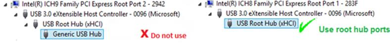
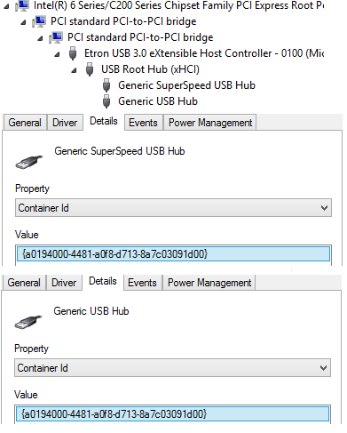
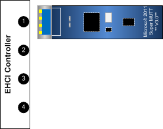
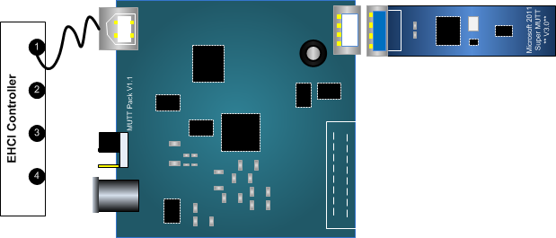
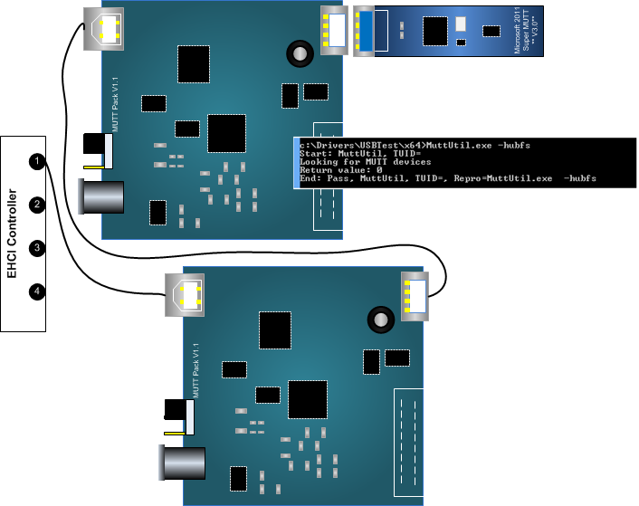
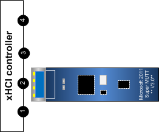
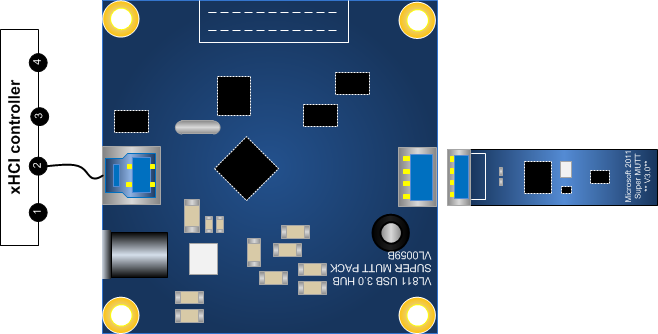
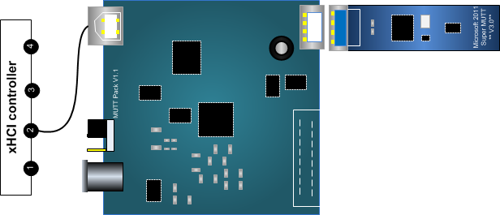

# USB Topology Compatibility Test

This manual test validates that the USB device can enumerate in key topologies and respond to basic USB commands, such as getting descriptors, setting address, selecting configuration, cycling ports. USB devices must be functional when connected to Enhanced Host Controller Interface (EHCI) and eXtensible Host Controller Interface (xHCI) controllers, and connected through full speed, high speed and SuperSpeed hubs.

**Note**  
In Windows 8.1, this test runs in two modes: *Legacy* and *Modern*. You can select the mode by using the **Parameters** option.

 

In previous versions of Windows, the test ran only in the Legacy mode, which detects whether the Device-Under-Test (DUT) enumerates when connected to SuperSpeed, high-speed, and full-speed ports. In this case, you must configure the required topologies after starting the test.

In Windows 8.1, the Modern mode allows the test to detect the DUT in SuperSpeed and high-speed ports. In this case, you must configure the required topologies before you start the test.

## Test details

<table>
<colgroup>
<col width="50%" />
<col width="50%" />
</colgroup>
<tbody>
<tr class="odd">
<td>
<strong>Associated requirements</strong>
</td>
<td>
Device.Connectivity.UsbDevices.Addressing Device.Connectivity.UsbDevices.AlternateDriver Device.Connectivity.UsbDevices.MustEnumerateOnEhciAndXhci Device.Connectivity.UsbDevices.TestedUsingMicrosoftUsbStack Device.Connectivity.UsbDevices.Usb3CompatibleWithDownLevel

[See the device hardware requirements.](http://go.microsoft.com/fwlink/p/?linkid=254483)
</td>
</tr>
<tr class="even">
<td>
<strong>Platforms</strong>
</td>
<td>
Windows 8 (x64) Windows 8 (x86) Windows Server 2012 (x64) Windows 8.1 x64 Windows 8.1 x86 Windows Server 2012 R2
</td>
</tr>
<tr class="odd">
<td>
<strong>Expected run time</strong>
</td>
<td>
~10 minutes
</td>
</tr>
<tr class="even">
<td>
<strong>Categories</strong>
</td>
<td>
Certification
</td>
</tr>
<tr class="odd">
<td>
<strong>Type</strong>
</td>
<td>
Manual
</td>
</tr>
</tbody>
</table>

 

## Running the test

Before you run the test, complete the test setup as described in the test requirements: [USB Device.Connectivity Testing Prerequisites](usb-deviceconnectivity-testing-prerequisites.md).

### Hardware list

-   One or more USB DUT to be certified. In Modern mode, you need at least two DUTs. If you have only one DUT, select Legacy.

-   One USB-IF compliant external SuperSpeed hub.

    We recommend that you use USB-IF certified hubs and low, full speed devices. For example, the [Texas Instruments SuperSpeed USB 3.0 Hub reference design](http://www.ti.com/tool/tusb8040aevm) board (TUSB8040EVM) which can be used to evaluate system compatibility. Alternatively, you can use the SuperMUTT Pack. To information about obtaining a SuperMUTT Pack, see [MUTT devices](http://msdn.microsoft.com/en-US/library/windows/hardware/dn376873).

-   One USB-IF compliant external high-speed hub.

-   One USB-IF compliant external full-speed hub (in Legacy mode).

-   USB-IF compliant USB 3.0 and 2.0 cables.

-   One Enhanced Host Controller Interface (EHCI) controller on the test computer.

-   One Extensible Host Controller Interface (xHCI) controller on the test computer.

### Before you run the test

-   Make sure the host controllers must have root hubs exposed. You must be able to plug the DUT or the external hub directly into the xHCI and EHCI root ports. Do not use host controllers that have integrated hubs because the controller design might block direct access to root ports.

    

-   The SuperSpeed hub must be updated with the latest firmware.

-   In the SuperSpeed hub, container IDs of the high-speed and SuperSpeed units must match. You can verify the compatible IDs in Device Manager:

    

-   Make sure that USB 3.0 cables do not have signal integrity issues. When you connect the SuperSpeed hub to the xHCI controller, the hub must enumerate as a SuperSpeed hub and not as a high-speed hub. For recommendations, see <http://www.usb.org/kcompliance/view>.

-   If you run the test in Legacy mode, you need a full-speed hub. If you are using MUTT devices, remember that you can always convert a MUTT Pack to a full speed hub by using Muttutil included in the MUTT Software Package (-HubFs option).

-   The device must have the device driver loaded on the test client machine.

-   In Legacy mode, the DUT must be detected in all six EHCI and xHCI topologies regardless of the speed of the DUT. For example, if the DUT is a low speed device, you must still connect your device in USB 3.0 topologies shown in this topic.

-   In Modern mode, the DUT must be detected in two topologies.

### Demo

<iframe src="https://hubs-video.ssl.catalog.video.msn.com/embed/c6c42202-5bb8-4745-adaa-bfe23c3d8c2f/IA?csid=ux-en-us&MsnPlayerLeadsWith=html&PlaybackMode=Inline&MsnPlayerDisplayShareBar=false&MsnPlayerDisplayInfoButton=false&iframe=true&QualityOverride=HD" width="720" height="405" allowFullScreen="true" frameBorder="0" scrolling="no"></iframe>

Watch the following video demonstration

[Download the video (MP4)](http://content4.catalog.video.msn.com/e2/ds/13d85f17-5619-4d8a-b903-0ea0900f9451.mp4)

**Required topologies**

<table>
<colgroup>
<col width="50%" />
<col width="50%" />
</colgroup>
<thead>
<tr class="header">
<th>Legacy Topologies</th>
<th>Modern Topologies</th>
</tr>
</thead>
<tbody>
<tr class="odd">
<td>
EHCI -&gt; DUT
</td>
<td>
xHCI -&gt; DUT
</td>
</tr>
<tr class="even">
<td>
EHCI -&gt; high-speed hub -&gt; DUT
</td>
<td>
EHCI -&gt; DUT or xHCI -&gt; high-speed hub -&gt; DUT
</td>
</tr>
<tr class="odd">
<td>
EHCI -&gt; high-speed hub -&gt; full speed hub -&gt; DUT
</td>
<td>

</td>
</tr>
<tr class="even">
<td>
xHCI -&gt; DUT
</td>
<td>

</td>
</tr>
<tr class="odd">
<td>
xHCI -&gt; SuperSpeed hub -&gt; DUT
</td>
<td>

</td>
</tr>
<tr class="even">
<td>
xHCI -&gt; high-speed hub -&gt; DUT
</td>
<td>

</td>
</tr>
</tbody>
</table>

 

The examples and images in this topic use the following USB hardware:

-   DUT is a Super MUTT

-   SuperSpeed hub is a SuperMUTT Pack

-   High-speed hub is a MUTT Pack

-   Full speed hub is a MUTT Pack that has been converted to operate in full speed mode. The hub operates in full speed mode until it’s unplugged.

**EHCI -&gt; DUT**

Connect the DUT directly to an EHCI root port. A low or full speed DUT enumerates under an OHCI or UHCI controller (which is expected in this test case).

**EHCI -&gt; high-speed hub -&gt; DUT**

Connect a high-speed hub to an EHCI root port. Connect the DUT to a downstream port of the high-speed hub.

**EHCI -&gt; high-speed hub -&gt; full speed hub -&gt; DUT**

Connect a high-speed hub to an EHCI root port. Connect a full speed hub to a downstream port of the high-speed hub. Connect the DUT to a downstream port of the full speed hub.

**xHCI -&gt; DUT**

Connect the DUT directly to an xHCI root port.

**xHCI -&gt; SuperSpeed hub -&gt; DUT**

Connect a SuperSpeed hub to an xHCI root port. Connect the DUT to a downstream port of the USB 3.0 hub.

**xHCI -&gt; high-speed hub -&gt; DUT**

Connect a high-speed hub to an xHCI root port. Connect the DUT to a downstream port of the USB 3.0 hub.

### How to run the test – Legacy mode

On the Windows Hardware Certification Kit (Windows HCK) Controller, open Windows HCK Studio and perform these tasks:

1.  On the **Selection** tab, click **Device manager**.

2.  Select the DUT as the target from the list.

3.  Click the **Tests** tab, select **USB Topology Compatibility Test**, and select **Run Selected**.

4.  In the **Parameters** window, enter **Legacy** as the **TestMode** value.

5.  Start the test.

    The test computer displays **Administrator: Windows PowerShell** and **USB device viewer** windows.

6.  Connect the DUT to a SuperSpeed port on the system and verify in USB device viewer that DUT appears under a root port. The device should appear under the correct port on the left panel.

7.  On the same port, connect a SuperSpeed hub and then connect the DUT to a port on the SuperSpeed hub. Wait for the USB device viewer to detect the topology.

8.  Replace the SuperSpeed hub with the high-speed hub on the same port. Connect the DUT to a port on the high-speed hub. Wait for the USB device viewer to detect the topology.

9.  Connect the DUT to a high-speed port on the system and verify in **USB device viewer** that DUT appears under a root port.

10. On the same port, connect a high-speed hub and then connect the DUT to a port on the high-speed hub. Wait for the **USB device viewer** to detect the topology.

11. On the same port on the high-speed hub, replace the DUT with a full-speed hub, and then connect the DUT to a port on the full-speed hub. Wait for the **USB device viewer** to detect the topology.

    **Important**  
    All six topologies must be completed in the same test run. In Legacy mode, the test is a manual test so you can move the DUT around to all six topologies during the test. The **PowerShell** window and **USB device viewer** will automatically close only after all topologies have been detected. Do not close the window before that. It causes the test to fail.

    It’s important to make a note of the original port that the device is plugged in before starting this test. After going through the six topologies above, you’ll need to reconnect the device to the original port, so that the rest of the tests can proceed successfully. Some tests assume that the device is connected to the same port and will fail to find the device if it's connected to a different location.

     

12. After **PowerShell** and **USB device viewer** windows close, read the test results on the controller.

### How to run the test – Modern mode

On the test computer, open **Device Manager** and perform the following steps:

1.  Connect one of the DUTs to a SuperSpeed port on the system and verify in Device Manager that the DUT appears under the **USB Root Hub** port.

2.  Connect the other DUT to a high-speed port on the system by connecting it directly to a root port on an EHCI controller. If the system does not have an EHCI controller, connect a high-speed hub to a SuperSpeed port and then connect the DUT to a port on the high-speed hub.

On the Windows HCK Controller, open Windows HCK Studio and perform the following steps:

1.  On the **Selection** tab, select **Device manager**.

2.  Select the DUT as the target from the list.

3.  Click the **Tests** tab, select **USB Topology Compatibility Test**, and click **Run Selected**.

4.  In the **Parameters** window, click **OK** to run in **Modern** mode. This is the default mode in Windows 8.1.

5.  Start the test.

6.  Read the test results after it completes.

## Troubleshooting

For troubleshooting information, see [Troubleshooting Device.Connectivity Testing](troubleshooting-deviceconnectivity-testing.md). Specific errors are shown in the following table.

<table>
<colgroup>
<col width="50%" />
<col width="50%" />
</colgroup>
<thead>
<tr class="header">
<th>Error</th>
<th>Resolution</th>
</tr>
</thead>
<tbody>
<tr class="odd">
<td>
DUT is not detected behind a SuperSpeed hub that is connected to an xHCI controller.
</td>
<td>
Obtain a USB-IF compliant SuperSpeed hub.
</td>
</tr>
<tr class="even">
<td>
Skipping xHCI topologies for low, full, or high speed DUTs causes the test to fail.
</td>
<td>
The DUT must be detected in all six EHCI and xHCI topologies regardless of the speed of the DUT.
</td>
</tr>
<tr class="odd">
<td>
When a high or full speed DUT is connected to a SuperSpeed hub, the DUT connects to the USB 2.0 hub unit of the hub. That condition causes the xHCI -&gt; USB 3.0 Hub -&gt; DUT topology test to fail.
</td>
<td>
Contact Microsoft Customer Support.
</td>
</tr>
<tr class="even">
<td>
When two USB DUTs are connected to behind EHCI root port of an x86-based system, DUTs might not get detected behind full or high speed hub.
</td>
<td>
You can work around this failure by adding an additional EHCI controller to the test system.
</td>
</tr>
<tr class="odd">
<td>
The DUT is an embedded device.
</td>
<td>
Contact Microsoft Customer Support.
</td>
</tr>
</tbody>
</table>

 

## More information

### Command syntax

<table>
<colgroup>
<col width="50%" />
<col width="50%" />
</colgroup>
<thead>
<tr class="header">
<th>Parameter</th>
<th>Description</th>
</tr>
</thead>
<tbody>
<tr class="odd">
<td>
<strong>TestMode</strong>
</td>
<td>
Modern: Uses WDTF to check USB port connections. The test runs automatically. Default value.

Legacy: Uses USB Device Viewer to check USB port connections. The test runs in manual mode.
</td>
</tr>
</tbody>
</table>

 

## Related topics

[Device.Connectivity Tests](deviceconnectivity-tests.md)

 

 

[Send comments about this topic to Microsoft](mailto:wsddocfb@microsoft.com?subject=Documentation%20feedback%20%5Bp_hck\p_hck%5D:%20USB%20Topology%20Compatibility%20Test%20%20RELEASE:%20%284/27/2016%29&body=%0A%0APRIVACY%20STATEMENT%0A%0AWe%20use%20your%20feedback%20to%20improve%20the%20documentation.%20We%20don't%20use%20your%20email%20address%20for%20any%20other%20purpose,%20and%20we'll%20remove%20your%20email%20address%20from%20our%20system%20after%20the%20issue%20that%20you're%20reporting%20is%20fixed.%20While%20we're%20working%20to%20fix%20this%20issue,%20we%20might%20send%20you%20an%20email%20message%20to%20ask%20for%20more%20info.%20Later,%20we%20might%20also%20send%20you%20an%20email%20message%20to%20let%20you%20know%20that%20we've%20addressed%20your%20feedback.%0A%0AFor%20more%20info%20about%20Microsoft's%20privacy%20policy,%20see%20http://privacy.microsoft.com/default.aspx. "Send comments about this topic to Microsoft")

