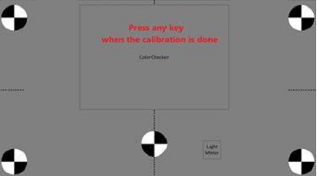
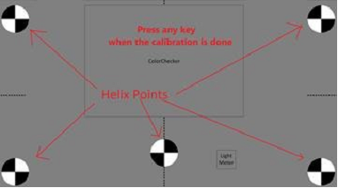
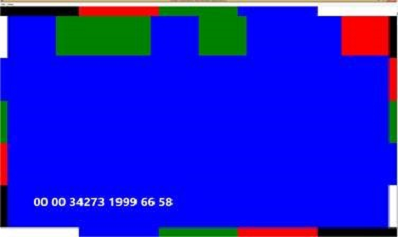

# Webcam Glitch free record System Test - WNCameraRequirements (Manual)

This set of tests validates all device cameras’ ability to record 720p 30frames per second to disk.

## Test details

<table>
<colgroup>
<col width="50%" />
<col width="50%" />
</colgroup>
<tbody>
<tr class="odd">
<td>
<strong>Associated requirements</strong>
</td>
<td>
System.Client.Webcam.Specification.WNCameraRequirements

[See the system hardware requirements.](http://go.microsoft.com/fwlink/p/?linkid=254482)
</td>
</tr>
<tr class="even">
<td>
<strong>Platforms</strong>
</td>
<td>
Windows RT 8.1 Windows 8.1 x64 Windows 8.1 x86
</td>
</tr>
<tr class="odd">
<td>
<strong>Expected run time</strong>
</td>
<td>
~30 minutes
</td>
</tr>
<tr class="even">
<td>
<strong>Categories</strong>
</td>
<td>
Optional
</td>
</tr>
<tr class="odd">
<td>
<strong>Type</strong>
</td>
<td>
Manual
</td>
</tr>
</tbody>
</table>

 

## Running the test

Before you run the test, complete the test setup as described in the test requirements: [System Client Testing Prerequisites](system-client-testing-prerequisites.md) and [Webcam Testing Prerequisites](webcam-testing-prerequisites.md). These tests require the following machines:

-   Render Machine –machine that is used to render the test pattern (not part of the system that is being validated).

-   Capture Machine – machine that is being validated, that has at least one camera.

To run the tests:

1.  Copy the render app to the render machine:

    -   **\\\\**&lt;*HCKSERVER***&gt;\\Tests\\**&lt;*PLATFORM*&gt;\\**NTTEST\\multimediatest\\wmmftest\\Rbkwrgb.exe**

    -   **\\\\**&lt;*HCKSERVER***&gt;\\Tests\\**&lt;*PLATFORM***&gt;\\NTTEST\\multimediatest\\avcore\\audio\\bin\\audiostreaming.dll**

    -   **\\\\**&lt;*HCKSERVER***&gt;\\TaefBinaries \\**&lt;*PLATFORM*&gt;**\\wttlog.dll**

    -   **\\\\**&lt;*HCKSERVER*&gt;**\\Tests\\x86\\NTTEST\\multimediatest\\wmmftest\\testdata\\tools\\CalibrationImage.bmp**

2.  Start the test on the capture machine.

3.  Start the render app **Rbkwrgb.ex**e on the render machine. You should see a screen that is similar to *Figure 1 Render Machine Image*.

    

4.  On the capture machine:

    1.  Have the camera ready.

    2.  Start the capture app **Recana.exe**.

    3.  Look to the preview, and position all Helix points on the preview window by using the maximum of the preview window, as shown in Figure 2 Helix Points.

        

    4.  Make sure that the camera is stable.

    5.  Press **OK** to start the calibration.

5.  On the render machine:

    1.  Press any key to transition to Bar code mode. The barcode change should look like Figure 3 Barcode Change:

        

    2.  Verify that an audible beep is played every second.

6.  On the capture machine:

    1.  Don’t touch the camera.

    2.  Wait for the focus to stabilize.

    3.  Press **OK** to start the capture and the analysis.

    4.  Wait approximately one minute.

7.  On the render machine:

    -   Press any key to stop the beep.

8.  Repeat steps 2 through 7 for each camera.

## Troubleshooting

For troubleshooting information, see [Troubleshooting System Client Testing](troubleshooting-system-client-testing.md) and [Troubleshooting Device.Streaming Testing](troubleshooting-devicestreaming-testing.md).

 

 

