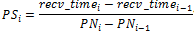
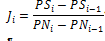
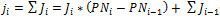
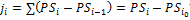
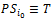

# WiFi Direct Data Performance Tests


**In this section**

-   [WiFi Direct Data Performance Tests NoAP SingleChannel](wifi-direct-data-performance-tests-noap-singlechannel-fa69fc73-23a3-4528-b197-548930eebacb.md)

-   [WiFi Direct Data Performance Tests PreAP24 SingleBand SingleChannel](wifi-direct-data-performance-tests-preap24-singleband-singlechannel-c164d885-53f8-4d98-a711-299f9518992f.md)

-   [WiFi Direct Data Performance Tests PreAP5 MultiBand MultiChannel](wifi-direct-data-performance-tests-preap5-multiband-multichannel-517114ec-3500-4225-93a6-3b225a280766.md)

-   [WiFi Direct Data Performance Tests PreAP5 SingleBand MultiChannel](wifi-direct-data-performance-tests-preap5-singleband-multichannel-0b941510-243d-4a7a-a900-b38cdbacaabe.md)

-   [Troubleshooting WiFi Direct Data Performance Tests](troubleshooting-wifi-direct-data-performance-tests.md)

**In this article:**

-   [Test suite overview](#ov)

-   [Performance requirements](#perfreq)

-   [Performance metrics](#metrics)

## <a href="" id="ov"></a>Test suite overview


This test suite validates that a Wi-Fi device meets the performance requirements for throughput, jitter and packet loss as defined by the Windows Certification Program for WLAN Devices over a Wi-Fi Direct Link, when the device under test (DUT) becomes either a Wi-Fi Direct Group Owner (GO) or a group client (GC) by joining an existing GO.

After successful Wi-Fi Direct pairing is achieved, network performance measurements are collected over the Wi-Fi Direct link. When an infrastructure connection exists to an access point (AP), throughput is simultaneously measured on the station (STA) connection. These metrics are then validated against Windows Hardware Certification Kit (Windows HCK) performance requirements to determine whether to pass or fail the tests.

Windows HCK Wi-Fi Direct Data Performance tests use the **NTtTcp** tool to collect network performance measurements over both infrastructure wireless and Wi-Fi Direct links for the following scenarios:

-   single-band/single-channel

-   single-band/multiple-channel

-   multiple-band/multiple-channel

-   Wi-Fi Direct GO

-   Wi-Fi Direct GC

-   Wi-Fi Direct Multi-Port (GO + GC)

-   No AP connection

-   .4Ghz N, 2, and 5Ghz (N and AC)

-   Streaming mode

-   AC\_VO Quality of Service (QoS) tagging set on the WFD port(s)

-   Connection to an infrastructure network AP

**Note**  
Whether 5 Ghz 802.11n or 5 Ghz 802.11ac are used when you connect from the DUT to the 802.11ac AP depends upon the capabilities of the driver and the wireless network interface adapter. Connection to 2.4 Ghz is always 802.11n. The DUT always connects to the 802.11ac AP. The support device connects to the second AP. Performance requirements are validated on a particular link only if QoS tagging is set on that link.

 

## <a href="" id="perfreq"></a>Performance requirements


### Throughput requirements

The 802.11 devices must have no more than 15% aggregate throughput degradation when data flow is divided between two ports (with and without Multi-Channel/Band operation). These are ExtSTA, Wi-Fi, and either Direct Role Port (GO) or Wi-Fi Direct Role Port (Client), compared with aggregate throughput when only one Wi-Fi port is connected. This throughput requirement individually applies to all types of ports (ExtSTA, Wi-Fi Direct Role Port \[GO\] and Wi-Fi Direct Role Port \[Client\]).

Windows HCK requirements state that an 802.11 device must be able to maintain between 50% and 65% of the maximum theoretical throughput over a TCP connection, depending on the Phy type, spatial stream and channel width configuration. Details are provided in the following tables.

**Note**  
All speeds are in Mbps. Combinations are not required for Secure Digital (SD) IO (SDIO) bus type devices. Channel width is the number of spatial streams.

 

The following tables describe the throughput expectations for WLAN devices if a WLAN device supports 802.11ac Phy Type (802.11ac Phy Type support is optional for WLAN devices).

**Table 1. WLAN 802.11ac Phy Type Throughput Expectation at 20 MHz**

<table>
<colgroup>
<col width="25%" />
<col width="25%" />
<col width="25%" />
<col width="25%" />
</colgroup>
<thead>
<tr class="header">
<th>Channel width</th>
<th>Max. Phy rate (100%)</th>
<th>Max. expected %</th>
<th>Expected throughput</th>
</tr>
</thead>
<tbody>
<tr class="odd">
<td><p>1 stream</p></td>
<td><p>86</p></td>
<td><p>65%</p></td>
<td><p>55.9</p></td>
</tr>
<tr class="even">
<td><p>2 streams</p></td>
<td><p>173</p></td>
<td><p>65%</p></td>
<td><p>112.45</p></td>
</tr>
<tr class="odd">
<td><p>3 streams</p></td>
<td><p>288</p></td>
<td><p>65%</p></td>
<td><p>187.2</p></td>
</tr>
<tr class="even">
<td><p>4 streams</p></td>
<td><p>346</p></td>
<td><p>65%</p></td>
<td><p>224.9</p></td>
</tr>
</tbody>
</table>

 

**Table 2. WLAN 802.11ac Phy Type Throughput Expectation at 40 MHz**

<table>
<colgroup>
<col width="25%" />
<col width="25%" />
<col width="25%" />
<col width="25%" />
</colgroup>
<thead>
<tr class="header">
<th>Channel width</th>
<th>Max. Phy rate (100%)</th>
<th>Max. expected %</th>
<th>Expected throughput</th>
</tr>
</thead>
<tbody>
<tr class="odd">
<td><p>1 stream</p></td>
<td><p>200</p></td>
<td><p>55%</p></td>
<td><p>110</p></td>
</tr>
<tr class="even">
<td><p>2 streams</p></td>
<td><p>400</p></td>
<td><p>55%</p></td>
<td><p>220</p></td>
</tr>
<tr class="odd">
<td><p>3 streams</p></td>
<td><p>600</p></td>
<td><p>55%</p></td>
<td><p>440</p></td>
</tr>
<tr class="even">
<td><p>4 streams</p></td>
<td><p>800</p></td>
<td><p>55%</p></td>
<td><p>660</p></td>
</tr>
</tbody>
</table>

 

**Table 3. WLAN 802.11ac Phy Type Throughput Expectation at 80 MHz**

<table>
<colgroup>
<col width="25%" />
<col width="25%" />
<col width="25%" />
<col width="25%" />
</colgroup>
<thead>
<tr class="header">
<th>Channel width</th>
<th>Max. Phy rate (100%)</th>
<th>Max. expected %</th>
<th>Expected throughput</th>
</tr>
</thead>
<tbody>
<tr class="odd">
<td><p>1 stream</p></td>
<td><p>433</p></td>
<td><p>50%</p></td>
<td><p>216.5</p></td>
</tr>
<tr class="even">
<td><p>2 streams</p></td>
<td><p>866</p></td>
<td><p>50%</p></td>
<td><p>433</p></td>
</tr>
<tr class="odd">
<td><p>3 streams</p></td>
<td><p>1300</p></td>
<td><p>50%</p></td>
<td><p>650</p></td>
</tr>
<tr class="even">
<td><p>4 streams</p></td>
<td><p>1733</p></td>
<td><p>50%</p></td>
<td><p>866.5</p></td>
</tr>
</tbody>
</table>

 

The following tables describe the throughput expectations for WLAN 802.11n Phy Type transmissions (802.11n Phy Type support is mandatory for WLAN devices).

**Table 4. WLAN 802.11n Throughput Expectation at 20 MHz**

<table>
<colgroup>
<col width="25%" />
<col width="25%" />
<col width="25%" />
<col width="25%" />
</colgroup>
<thead>
<tr class="header">
<th>Channel width</th>
<th>Max. Phy rate (100%)</th>
<th>Max. expected %</th>
<th>Expected throughput</th>
</tr>
</thead>
<tbody>
<tr class="odd">
<td><p>1 stream</p></td>
<td><p>72</p></td>
<td><p>60%</p></td>
<td><p>43.2</p></td>
</tr>
<tr class="even">
<td><p>2 streams</p></td>
<td><p>144</p></td>
<td><p>60%</p></td>
<td><p>86.4</p></td>
</tr>
<tr class="odd">
<td><p>3 streams</p></td>
<td><p>216</p></td>
<td><p>60%</p></td>
<td><p>129.6</p></td>
</tr>
<tr class="even">
<td><p>4 streams</p></td>
<td><p>288</p></td>
<td><p>60%</p></td>
<td><p>172.8</p></td>
</tr>
</tbody>
</table>

 

**Table 5. WLAN 802.11n Throughput Expectation at 40 MHz**

<table>
<colgroup>
<col width="25%" />
<col width="25%" />
<col width="25%" />
<col width="25%" />
</colgroup>
<thead>
<tr class="header">
<th>Channel width</th>
<th>Max. Phy rate (100%)</th>
<th>Max. expected %</th>
<th>Expected throughput</th>
</tr>
</thead>
<tbody>
<tr class="odd">
<td><p>1 stream</p></td>
<td><p>150</p></td>
<td><p>50%</p></td>
<td><p>75</p></td>
</tr>
<tr class="even">
<td><p>2 streams</p></td>
<td><p>300</p></td>
<td><p>50%</p></td>
<td><p>150</p></td>
</tr>
<tr class="odd">
<td><p>3 streams</p></td>
<td><p>450</p></td>
<td><p>50%</p></td>
<td><p>225</p></td>
</tr>
<tr class="even">
<td><p>4 streams</p></td>
<td><p>600</p></td>
<td><p>50%</p></td>
<td><p>300</p></td>
</tr>
</tbody>
</table>

 

The following table defines the requirements for jitter (one-way latency) and maximum consecutive packet loss. The maximum one-way latency and packet loss requirements are at UDP for AC\_VI/AC\_VO traffic. The maximum allowable consecutive packet loss in all cases is 0.5%, or &lt;= 3 consecutive packets.

**Table 6. Jitter requirements**

<table>
<colgroup>
<col width="25%" />
<col width="25%" />
<col width="25%" />
<col width="25%" />
</colgroup>
<thead>
<tr class="header">
<th></th>
<th>ExSTA</th>
<th>Wi-Fi Direct Role Port</th>
<th>Max. one-way latency</th>
</tr>
</thead>
<tbody>
<tr class="odd">
<td><p>ExSTA only</p></td>
<td><p>AC_VI/AC_VO</p></td>
<td><p>N/A</p></td>
<td><p>30ms</p></td>
</tr>
<tr class="even">
<td><p>ExSTA + Wi-Fi Direct in Single-Channel Concurrency</p></td>
<td><p>AC_VI/AC_VO</p>
<p></p>
<p>AC_VI/AC_VO</p></td>
<td><p></p>
<p>AC_VI/AC_VO</p>
<p>AC_VI/AC_VO</p></td>
<td><p>30ms</p>
<p>30ms</p>
<p>30ms</p></td>
</tr>
<tr class="odd">
<td><p>ExSTA + Wi-Fi Direct in Multi-Channel Concurrency</p></td>
<td><p>AC_VI/AC_VO</p>
<p></p>
<p>AC_VI/AC_VO</p></td>
<td><p></p>
<p>AC_VI/AC_VO</p>
<p>AC_VI/AC_VO</p></td>
<td><p>40ms</p>
<p>40ms</p>
<p>50ms</p></td>
</tr>
</tbody>
</table>

 

## <a href="" id="metrics"></a>Performance metrics


Throughput is the average rate of successful message delivery over a communication channel. The throughput that the Windows HCK validates comes directly from the **NTtTcp** tool.

**NTtTcp** output contains a measurement of latency. This measurement is used in validation results and should not be confused with the jitter measurement. Jitter is calculated as an approximation of one-way latency, and it is a measurement of how the real packet spacing differs from ideal fixed packet spacing.

To measure jitter, Windows HCK sends a stream of UDP packets of a specific size at a specific rate. The real packet spacing is calculated at the receiving end of the network performance measurement and is compared against the ideal packet spacing that is expected from a zero-delay network. The jitter is calculated by finding the absolute packet-to-packet spacing of every packet after the traffic has stabilized, and then analyzing its deviation from an ideal period of time *T*.

After all packet-to-packet spacing is calculated, Windows HCK finds the 99 percentile largest packet to packet Jitter (*ji*). The test case fails if this value is larger than 30, 40 or 50 milliseconds (depending on QoS tagging), and whether the measurement is for a single-channel or multiple-channel environment. Using 99 percentile means that if only 10 out of a 1000 packets are larger than the expected value, the IHV 802.11 driver passes the test. However if more than 1% of the packet to packet jitters are larger than the requirements, the test fails.

The formulas come from the Microsoft Voice over Wi-Fi Personal Certification Test Plan. The formulas that the algorithms implement to calculate Jitter are as follows:

Let the period of the sent packets be *T*(ms). The packet to packet spacing (with adjustment for dropped packets) is:



**Note**  
The denominator adjusts the packet spacing in the case where there is a packet gap; this prevents gaps from causing spikes in jitter.

 

The Packet to packet jitter, *J<sub>i</sub>*, (the difference in packet spacing) is:



Packet jitter (the difference between the packet spacing and the ideal spacing, *T*) is the sum of *J<sub>i</sub>*:



This reduces to:



Where:



defines that the first packet that is used in this computation arrived on time.

Jitter is defined as the absolute value of *j₁*(|*j₁*|). Because of instrumentation variations, we recommend that a percentile of jitter is used to characterize the system capabilities (for example, 99|95|90% of all jitter values falls below *n* ms), instead of just using max *j₁*.

The Windows HCK performance requirements and test tolerate fluctuations on conditions to reduce the possibility of false negative issue investigations. This test suite uses **NttTcp** to get network performance metrics. In some cases, performance measurements are calculated based on the tool’s output and then validated to make sure that they match performance requirements for throughput, jitter and packet loss.

For jitter calculations, **NttTcp** outputs a comma-separated value (CSV) file. The CSV contains the following headers:

**&lt;packet\_num, send\_count, send\_freq, recv\_count, recv\_freq&gt;**

**Send\_count** is the value that QueryPerformanceCounter() returns immediately before it calls **send()**.**Send\_freq** is from QueryPerformanceFrequency(), in units of counts/seconds. Therefore,

``` syntax
send_time[i] (ms) = send_count[i]/send_freq[i] * 1000.0; //this is only a relative time.  Absolute value is effectively meaningless.
```

Similarly, **recv\_count** is the result of QueryPerformanceCounter() immediately after a packet is received:

``` syntax
recv_time[i] (ms) = recv_count[i]/recv_freq[i] * 1000.0
```

This send\_time and recv\_time is what is used to calculate the packet to packet spacing:


Packet loss is a much simpler calculation. When data is being transferred, each packet is tracked with a serial number **(packet\_num)** in the CSV file header. If, during the transfer, the packet serial number of the current packet differs by more than 4 units to that of the previous packet, it means more than 3 consecutive packets were lost. In this case, the test fails.

## Related topics


[Wireless LAN (802.11) Tests](wireless-lan--80211--tests.md)

 

 


