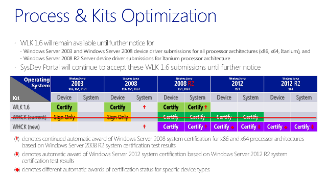
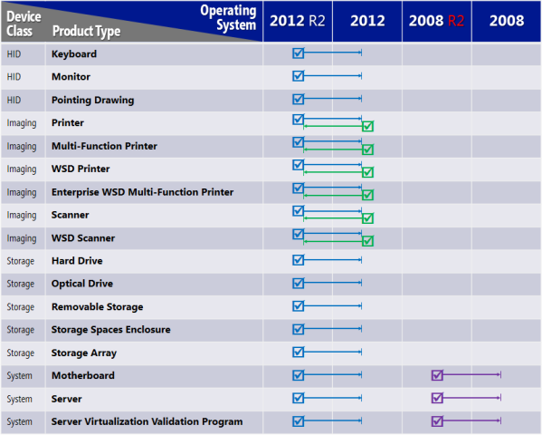

# Windows Certification Newsletter - June 26, 2013

**New Windows Hardware Certification blog!**

The Windows Certification Newsletter has been replaced by the [Windows Hardware Certification blog](http://blogs.msdn.com/b/windows_hardware_certification/). Go to the blog for the updates and info you’re used to seeing in the newsletter. Subscribe today!

## In this issue

[Windows 8.1 Preview ready for hardware developers](#bluepre)

[Submissions for Windows 8.1 and Windows Server 2012 R2 begin now!](#sub)

[Digital signatures available for legacy operating systems in the new Windows HCK for Windows 8.1](#digsig)

[Fast-track Windows 8.1 certification](#fast)

[New or changed drivers require testing for Windows 8.1](#newdrivers)

[Testing and submitting Windows Server 2003 and Windows Server 2008 devices and drivers](#win2003)

[Up-Level and Down-Level certification status grant](#statusgrant)

[Server Core device and driver testing](#core)

[Class filter driver testing](#classfilter)

[Catalog visibility for HCK for Windows 8.1 “Other” products](#other)

[Server resources](#resources)

[Contact](#contact)

## Windows 8.1 Preview ready for hardware developers

Windows 8.1 takes another critical step with the public availability of Windows 8.1 Preview. You can use Windows 8.1 Preview to test your devices for Windows 8.1 certification by using the new Windows Hardware Certification Kit (Windows HCK) for Windows 8.1.

[Download the kits, bits, and tools](http://go.microsoft.com/fwlink/p/?LinkId=310164) that you need to develop, assess, and certify hardware and drivers with Windows 8.1 Preview. [Enjoy new capabilities and technologies](http://go.microsoft.com/fwlink/p/?LinkId=310163) that help you design and develop devices with the latest advances in displays, battery life, and performance.

With Windows 8.1 Preview, you can enrich the feel and functionality of your devices through elements like clearer display resolution; faster boot, resume, and app launch times; easier or automated security and identity; improved wireless connections; even cooler photo features; and fluid, intuitive touch experiences.

Get details on [what’s new for hardware developers in Windows 8.1 Preview](http://go.microsoft.com/fwlink/p/?LinkId=310163), and access [related downloads and guides](http://go.microsoft.com/fwlink/p/?LinkId=310164) that will help you develop drivers and devices – from sleek phones, tablets, and notebooks to high-performance workstations or all-in-ones – that will give your customers a seamless experience whether at home, work, school, or play. Find everything you need in [the Windows Dev Center - Hardware site](http://go.microsoft.com/fwlink/p/?LinkId=310165).

## Submissions for Windows 8.1 and Windows Server 2012 R2 begin now!

As soon as you download the new Windows HCK for Windows 8.1, you can start testing and preparing for certification submissions. The Dashboard is ready for your Windows 8.1 and Windows Server 2012 R2 certification submissions.

The new Windows HCK for Windows 8.1supports certifications for these operating systems:

-   Windows 7

-   Windows 8

-   Windows 8.1

-   Windows Server 2008 R2 (x64)

-   Windows Server® 2012

-   Windows Server 2012 R2

## Digital signatures available for legacy operating systems in the new Windows HCK for Windows 8.1

When you successfully complete testing for a client certification of Windows 7, Windows 8, or Windows 8.1, use the [Dashboard](http://sysdev.microsoft.com/) to create a submission package for uploading - the same process that you’ve used in the past. And, if you’re using a uniform driver that’s properly decorated to include Windows Vista and Windows® XP, the dashboard has check boxes for free digital signatures.

If your Windows® XP or Windows Vista driver isn’t the same binary as used with the newer operating systems, test it by using Windows HCK 2.0. If you test for a certification on Windows Server 2008 R2 (x64), Windows Server 2012, or Windows Server 2012 R2, the Dashboard won’t have any check boxes for free digital signatures for Windows Server 2008 and Windows Server 2003. You can get digital signatures for Windows Server 2008 and Windows Server 2003 by full testing with the WLK 1.6 test kit.

## Fast-track Windows 8.1 certification

You can fast-track the Windows 8 certified devices listed in the table below for Windows 8.1 certification if:

-   The device was previously certified for Windows 8.

-   The device's binaries haven't changed since the submission for Windows 8. Only the INF is updated to reflect the new Windows version.

If the device meets these criteria, here's how you can create a submission:

1.  Use the new Windows HCK for Windows 8.1, create a Windows 8.1 project, and run the Device.DevFund INF test.

2.  Use the Dashboard to package the results for submission upload.

3.  Include the previous Windows 8 submission ID in the README folder.

4.  Reference errata ID 2657, "Windows 8 to Windows 8.1 driver certification update special," in the README folder.

Submissions are reviewed for these items:

1.  The earlier Windows certification referenced in the README file. 

2.  The DevFund INF test passes.

3.  No driver binary changes occurred (by using WinDiff).  

If the review is successful, there's no cost for the submission. 

<table>
<colgroup>
<col width="100%" />
</colgroup>
<thead>
<tr class="header">
<th>Certified Windows 8 devices and drivers that can be resubmitted for Windows 8.1 using the plan above</th>
</tr>
</thead>
<tbody>
<tr class="odd">
<td>
Digital Video Camera
</td>
</tr>
<tr class="even">
<td>
Digital Media Renderer
</td>
</tr>
<tr class="odd">
<td>
Digital Still Camera
</td>
</tr>
<tr class="even">
<td>
Distribution Scan Management Enabled Device
</td>
</tr>
<tr class="odd">
<td>
Enterprise WSD Multifunction Printer
</td>
</tr>
<tr class="even">
<td>
Game Controller
</td>
</tr>
<tr class="odd">
<td>
Generic Controller
</td>
</tr>
<tr class="even">
<td>
Graphics Tablet
</td>
</tr>
<tr class="odd">
<td>
Hard Drive – HDD, SSD
</td>
</tr>
<tr class="even">
<td>
LAN
</td>
</tr>
<tr class="odd">
<td>
LCD
</td>
</tr>
<tr class="even">
<td>
Monitor
</td>
</tr>
<tr class="odd">
<td>
Multifunction Printer
</td>
</tr>
<tr class="even">
<td>
Optical Drive
</td>
</tr>
<tr class="odd">
<td>
Pen Digitizer
</td>
</tr>
<tr class="even">
<td>
Printer
</td>
</tr>
<tr class="odd">
<td>
Removable Storage
</td>
</tr>
<tr class="even">
<td>
Router
</td>
</tr>
<tr class="odd">
<td>
Scanner
</td>
</tr>
<tr class="even">
<td>
SDIO Controller
</td>
</tr>
<tr class="odd">
<td>
Signature Tablet
</td>
</tr>
<tr class="even">
<td>
Smart Card
</td>
</tr>
<tr class="odd">
<td>
Smart Card Reader
</td>
</tr>
<tr class="even">
<td>
Storage Array
</td>
</tr>
<tr class="odd">
<td>
Storage Controller (Client)
</td>
</tr>
<tr class="even">
<td>
Storage Spaces Adapter (Client)
</td>
</tr>
<tr class="odd">
<td>
Storage Spaces Drive
</td>
</tr>
<tr class="even">
<td>
Storage Spaces Enclosure
</td>
</tr>
<tr class="odd">
<td>
Touch
</td>
</tr>
<tr class="even">
<td>
Touch Monitor
</td>
</tr>
<tr class="odd">
<td>
USB Hub
</td>
</tr>
<tr class="even">
<td>
WSD Multifunction
</td>
</tr>
<tr class="odd">
<td>
WSD Printer
</td>
</tr>
<tr class="even">
<td>
WSD Scanner
</td>
</tr>
</tbody>
</table>

 

## New or changed drivers require testing for Windows 8.1

If you’re submitting a new device or driver not listed in the table above (or if you’re submitting an updated driver that was previously certified), you need to test for Windows 8. However, you can request a Windows 8 signature without completely retesting with Windows 8. You’ll need to prove that the INF is well formed for Windows 8 by following these steps:

1.  Using the new Windows HCK for Windows 8.1, create a Windows 8.1 project, and run the full certification suite of tests.

2.  Using the new Windows HCK for Windows 8.1, create a Windows 8 project and run only the Device.DevFund INF test.

3.  Package the results of the projects for submission uploading by using the Dashboard packaging tools.

4.  Reference errata ID 2656 “Windows 8.1 to Windows 8 driver certification downgrade special” in the README folder.

A submission is reviewed for these items:  

1.  The Windows 8.1 test results.

2.  The Devfund INF test passes for Windows 8.

3.  Windows 8

## Transitional plan for submitting with the WLK 1.6 and HCK 2.0 kits

You can use the Windows HCK for Windows 8.1 Preview until it’s replaced by an updated version of Windows HCK for Windows 8.1 released at RTM of Windows 8.1. The Windows 8.1 Preview will get QFEs as needed, all of which will be rolled into the RTM kit. There will be a 90-day transition period after RTM before the Windows HCK for Windows 8.1 Preview retires.

After the same 90-day transition period, Windows HCK 2.0 will be retired. WLK 1.6 will continue to be available for Windows Server 2003 devices and drivers, Windows Server 2008 devices and drivers, and Windows Server 2008 R2 (x64) until those programs retire at a later date, to be announced.

The portal is no longer directly supporting WLK 1.6-based submissions for Windows® XP, Windows Vista and Windows 7. If this change impacts you, contact sysdev@microsoft.com for details about an alternative method for submitting your client WLK 1.6 logs. WLK 1.6 tested Windows® XP, Windows Vista and Windows 7 submissions will be accepted using the alternative plan until 90 days past Windows 8.1 RTM.

## Testing and submitting Windows Server 2003 and Windows Server 2008 devices and drivers

To test and submit devices and drivers for Windows Server 2003 and Windows Server 2008, you must use the Windows Logo Kit (WLK) 1.6. There’s no signature for tests that use the Windows HCK for Windows 8.1.

Vendors must use the WLK 1.6 for testing the device categories of their products and submit to the portal. Unclassified submissions are permitted, but only when the device driver doesn’t have a matching device category. There is no change from previous policy in this regard.

There is no cost for these submissions.

Before the release of Windows HCK for Windows 8.1, the Windows HCK 2.0 and WLK 1.6 were available for testing Windows Server.

Windows HCK 2.0 is used for:

-   Windows Server 2012 x64 device, driver, and system certification

-   Windows Server 2008 R2 (x64) device, driver, and system certification

-   Windows Server 2008 x86 and x64 driver signature only, no logo

-   Windows Server 2003 x86 and x64 driver signature only, no logo

WLK 1.6 is used for:

-   Windows Server 2008 R2 (x64) device, driver, and system certification

-   Windows Server 2008 R2 IA-64 device and driver certification

-   Windows Server 2008 x86, x64 and IA-64 device and driver certification

-   Windows Server 2003 x86, x64 and IA-64 device and driver certification

Approximately 90 days after the release of Windows 8.1 and Windows Server 2012 R2, the Windows HCK 2.0 will be retired and no further submissions will be accepted using that kit. So, if you need to test for Windows Server operating system releases spanning from Windows Server 2003 to Windows Server 2012 R2, you’ll need to use both the WLK 1.6 and the Windows HCK for Windows 8.1.

Here’s a summary of these changes:

Using the WLK 1.6 and Windows HCK is necessary because:

-   Before Windows Server 2012 R2, you could use the Windows HCK 2.0 to get driver signatures for Windows Server 2008 and Windows Server 2003. But device and driver vendors also used the WLK 1.6 to test drivers before submission for signatures. It was never our intent to offer signatures for drivers that weren’t tested adequately because it’s not in the customer’s best interest.

-   The Windows HCK for Windows 8.1/Windows Server 2012 R2 won’t provide driver signatures for Windows Server 2008 and Windows Server 2003. Driver testing is required because some Windows Server drivers were only signed and not adequately tested.

-   The infrastructure to support testing and submission for Windows Server 2008 (including x86 and IA-64) remains in WLK 1.6 and the submission portal, as is the case today.

WLK 1.6 will no longer be available on Connect. Instead, you can download it from MSDN. QFEs and information for WLK 1.6 are available on the [Microsoft Download Center](http://go.microsoft.com/fwlink/p/?LinkId=311925).

## Up-Level and Down-Level certification status grant

To get certification for all versions of Windows Server 2012 R2, Windows Server 2012, Windows Server 2008 R2, Windows Server 2008, and Windows Server 2003, all devices and drivers must be certified.

-   Systems and selected device types (shown in the table below) that are successfully certified for Windows Server 2012 R2 will earn down-level certification status for Windows Server 2012.

-   Imaging device types (shown in the table below) that are successfully certified for Windows Server 2012 can be granted up-level certification status for Windows Server 2012 R2 through the [Fast-track Windows 8.1 certification](#fast) process that was described earlier.

## Server Core device and driver testing

All drivers submitted for Windows Server 2012 R2 certification must support the Server Core operating environment because a customer could install or later configure a Windows Server system for the Server Core environment. This means that all systems used for testing the various features of a device and driver must be configured for Server Core, which precludes the Server Core test from being distributed. Support is defined as the device and driver being able to install, be configured and managed, be serviced (hotfixed), and operate in the Server Core environment without the need to configure the system for GUI-mode operations. This is tested and enforced for Windows Server 2012 R2 device and driver testing.

## Class filter driver testing

You must use the Windows HCK 2.1 to test filter drivers that attach to device drivers for network, storage, or other device classes. This includes driver verifier switches being applied for testing. Testing includes all tests normally scheduled for the device that the class filter driver is attached to.

For relevant tests to be scheduled, vendors need to manually select the correct physical target device that their filter driver is associated with.

## Catalog visibility for HCK for Windows 8.1 “Other” products

Because of improvements to testing class filter drivers in Windows HCK for Windows 8.1 and to other types of drivers that don’t have a PnP ID associated, customers to be able can see these products submitted for Windows Server. These products will be listed in the “Other” section of the catalog, even though no certification was awarded.

## Server resources

[Windows Server TechCenter](http://technet.microsoft.com/en-US/windowsserver/bb250589)

[Windows Server 2012 R2 Preview updates](http://technet.microsoft.com/windowsserver/hh534429)

[Windows Server Developer Center](http://msdn.microsoft.com/en-US/windowsserver)

[Windows Server Technical Library](http://technet.microsoft.com/library/hh801901.aspx)

[Remote Server Administration Tool (RSAT)](http://www.microsoft.com/en-US/download/details.aspx?id=39296)

[MSDN/ Technet](http://technet.microsoft.com/subscriptions/downloads/)

[Windows Server 2012 R2 Preview – General Forum](http://social.technet.microsoft.com/Forums/en-US/windowsserverpreview)

[Windows Server 2012 R2 Preview – Setup Forum](http://social.technet.microsoft.com/Forums/en-US/winserver2012r2previewsetup)

[Hyper-V Server Download](http://technet.microsoft.com/evalcenter/dn205299)

Windows Server 2012 R2 Preview (separate IT Pro and Dev experiences)

-   [IT Pro](http://technet.microsoft.com/evalcenter/dn205286)

-   [Dev](http://msdn.microsoft.com/evalcenter/dn205302)

[Windows Server 2012 R2 Preview on Azure IaaS](http://technet.microsoft.com/evalcenter/dn205286)

## Contact

For further info, please contact AskWSHC@microsoft.com.

## Related topics

[Hardware Dev Center](http://msdn.microsoft.com/en-US/windows/hardware/)

[Windows hardware development kits and tools](http://msdn.microsoft.com/windows/hardware/bg127147)

[Windows hardware development samples](http://code.msdn.microsoft.com/windowshardware/)

[Windows Hardware Certification](http://msdn.microsoft.com/en-US/windows/hardware/gg463010)

[Newsletter archive](windows-certification-newsletter-archive.md)

[Your dashboard](https://sysdev.microsoft.com/hardware/member/)

[Getting started](http://msdn.microsoft.com/library/windows/hardware/gg507680/)

 

 

[Send comments about this topic to Microsoft](mailto:wsddocfb@microsoft.com?subject=Documentation%20feedback%20%5Bp_hck\p_hck%5D:%20Windows%20Certification%20Newsletter%20-%20June%2026,%202013%20%20RELEASE:%20%284/27/2016%29&body=%0A%0APRIVACY%20STATEMENT%0A%0AWe%20use%20your%20feedback%20to%20improve%20the%20documentation.%20We%20don't%20use%20your%20email%20address%20for%20any%20other%20purpose,%20and%20we'll%20remove%20your%20email%20address%20from%20our%20system%20after%20the%20issue%20that%20you're%20reporting%20is%20fixed.%20While%20we're%20working%20to%20fix%20this%20issue,%20we%20might%20send%20you%20an%20email%20message%20to%20ask%20for%20more%20info.%20Later,%20we%20might%20also%20send%20you%20an%20email%20message%20to%20let%20you%20know%20that%20we've%20addressed%20your%20feedback.%0A%0AFor%20more%20info%20about%20Microsoft's%20privacy%20policy,%20see%20http://privacy.microsoft.com/default.aspx. "Send comments about this topic to Microsoft")

